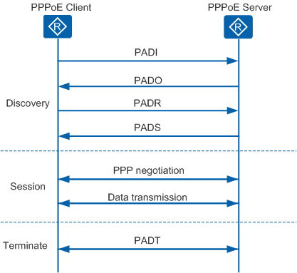

# 对PPPoE协议的理解——从电信动态公网环境出发

> 本文首发于个人博客 \
> 发表日期：2023.06.03\
> 最后编辑于：{docsify-updated}

## 问题原因

自从家里有公网环境后，经常会发现家里网络有频率地短时间掉线。该频率从数天一次到数周一次不等。在之前配置VPN时，由于知道目前家宽给的公网都是动态公网，换言之每过一段时间家宽的公网IP地址会发生更改，因而配置与访问时都是使用DDNS利用域名来完成的。注意到每次断网前后家宽的公网IP都会发生更改，结合网络检索可以发现，该问题的起因是由于ISP为了不让用户长时间独占IP而主动以一定频率重新分配IP所导致的。

## 问题解决

解决方式其实很简单，找个不用网络的时间重启光猫，或是路由器重新拨号即可。事实上，如果不在意经济条件的话可以购买静态公网IP的线路，不过价格太过昂贵，因而这里也不是很推荐。

## 问题分析

事实上，在锻炼断连期间阅览路由器的log，可以注意到有这么一条关键报错：

```text
pppd[10432]: Timeout waiting for PADO packets
```

其中PADO报文就是在PPPoE会话建立过程中由服务器（ISP端）向客户端（家庭光猫 / 路由器）发送的报文。完整的PPPoE会话建立过程如下：



换言之，实质上可能是由于在ISP重新分配IP后，由于某些原因路由器拨号时没有发现ISP方用于PPPoE拨号上网的服务器，导致一直无法收到对应的PADO报文。这种情况下手动重启光猫或路由器重新拨号一般就能解决这一问题。

当然，多数情况下不会出现路由器无法发现ISP方服务器的问题，因而通常在数分钟的断网后路由器就能重新拨号成功，保证网络继续可用。

## 参考资料

1. PPPoE Dial-up Implementation - AR500, AR510 AR531, AR550, and AR2500 V200R008 CLI-based Configuration Guide - WAN - Huawei. (2022, December 14). PPPoE Dial-up Implementation - AR500, AR510 AR531, AR550, and AR2500 V200R008 CLI-based Configuration Guide - WAN - Huawei. https://support.huawei.com/enterprise/en/doc/EDOC1000154779/37d3dce5/pppoe-dial-up-implementation
