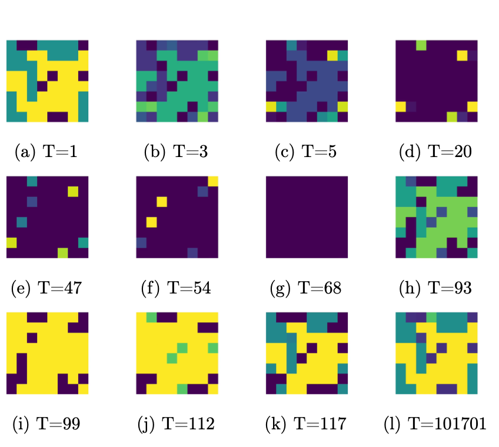

# 论文阅读 2023.07

> 本文首发于个人博客 \
> 发表日期：2023.07.31\
> 最后编辑于：{docsify-last-updated}

## The Multiplayer Colonel Blotto Game

文章对经典的上校博弈游戏的自然多人泛化进行了研究。文章定义了多人的上校博弈，同时针对不同的玩家数量$k$与战线数量$n$导出了纳什均衡。

### 上校博弈

上校博弈是一个两人参与的零和博弈。

形式化的，考虑玩家A和B，他们需要在$n$个战线中竞争，每个战线俱有价值$v_1,\dots,v_n$。A和B都有有限的预算$\mathcal{B}_A$、$\mathcal{B}_B$，其可以用于分配在不同战场。他们需要同时决定在每个战场上投入多少预算。对特定战场，在该战场上投入预算较多的一方获胜。玩家的目标是使赢得的战场的价值总和最大化。通常情况下，为了保证对称性（symmetric），会要求$\mathcal{B}_A=\mathcal{B}_B, v_1= \dots =v_n$。

这一博弈并不存在纯策略纳什均衡。目前对其均衡的多数研究都是根据一般乐透博弈（General Lotto）来计算的。在此博弈中每个玩家在战场上分配的预算是一个分布而非一个数值，而最终目标则是使战场收益期望最大化（或是是单样本收益最大化）。

### 多人上校博弈

文章首先定义了多人上校博弈。

多人上校博弈由$(k\in\mathbb{N},n\in\mathbb{N},\vec{\mathcal{B}}\in\mathbb{R}^n_{\geq0},\vec{v}\in\mathbb{R}^n_{\geq0})$指定。其中$k$代表玩家数量，$n$代表战场数量，$\vec{\mathcal{B}}$是全部玩家预算的向量，$\vec{v}$是战场价值的向量。战场价值总和可以表示为$V=\Vert\vec{v}\Vert_1=\sum^n_{j=1} v_j$。

每个玩家对战场的投标表示为向量$A_{i,*}=(A_{i,1},\dots,A_{i,n})\in\mathbb{R}^n_{\geq0}$，其满足约束$\Vert A_{i,*}\Vert_1=\sum_{j\in [n]} A_{i,j}\leq\mathcal{B}_i$。

令投标矩阵为$A=(A_{i,j})_{(i,j)\in[k]\times[n]}$（显然第$i$行$j$列代表$i$玩家在$j$战场的投标）。对任意$i\in[k]$有玩家的收益为：

$$
U_i(A):=\sum_{j\in[n]}U_{i,j}(A):=\sum_{j\in[n]} v_j \cdot (\frac{f(i)}{\vert \argmax_{i'} A_{i',j}\vert})
$$

其中：
$$
f(i)=\begin{dcases}
   1 &\text{if } i \in \argmax_{i' \in [k]} A_{i',j} \\
   0 &\text{if } i \notin \argmax_{i' \in [k]} A_{i',j}
\end{dcases}
$$

换言之每个战场的价值有出价最高的玩家平分。

论文中将每个玩家预算相同的情况定义为对称（symmetric），将战场价值都相等的情况定位为同质（homogeneous）。

### 多人一般乐透博弈

更一般的，文章定义了多人一般乐透博弈$(k\geq2,n,\vec{\mathcal{B}},\vec{v})$，其中玩家$i$在战场$j$上指定一个分布$\mathcal{D}_{i,j}$，其满足约束条件$\sum^n_{j=1}\mathbb{E}_{A_{i,j}\sim\mathcal{D}_{i,j}}[A_{i,j}]\leq\mathcal{B}_i$。显然此时玩家$i$的收益为$\mathbb{E}_AU_i(A)$。

考虑连续的对称多人一般乐透博弈，其由$(k\geq2,n,\vec{\mathcal{B}}=1,\vec{v})$指定。文章指出，当玩家$i$在战场$j$上的分布为$\mathcal{D}_{i,j}=\frac{kv_j}{V}\cdot Beta(\frac{1}{k-1},1)$时，是一个纳什均衡。

### 多人上校博弈均衡算法

基于多人一般乐透博弈的该均衡，文章考虑对称的上校博弈。假如对战场有一个k-分区使得各个分区中战场价值总和相同，那么玩家可以根据特定算法达到纳什均衡。更具体的，计算一个分布$(X_1,\dots,X_k)\sim Dir(\frac{1}{k-1},\dots,\frac{1}{k-1})$，那么达到均衡时玩家指定的分布应是$(A_1,\dots,A_n),A_j \leftarrow (\frac{kv_j}{V}\cdot X_{\pi(j)})$。

更具体的，文章还对上述博弈在玩家数$k=3$时计算了更细致的均衡情况。

文章最后考虑玩家预算都为整数，且玩家在战场上的投标只为布尔值的情况，并根据前述的结论计算出了这一博弈下的均衡。

## Evolutionary Game Theory Squared: Evolving Agents in Endogenously Evolving Zero-Sum Games

*没太看懂，看了一下大致内容，可能需要学习下微分几何和动力学以后再看。*

进化博弈论的主要范式基于在给定的固定、静态博弈中动态的智能体群体之间的明显差异——也即重复博弈在演化过程中不同类型群体在静态的阶段博弈中所会采取的策略集的差异。文章关注于这样一种情况，即在演化过程中无论是参与博弈的参与者还是博弈本身都会随着时间的推移而演化（类似于神经网络，博弈规则本身可以接收智能体的历史选择与收益来对规则与支付等方面进行改变）。

文章利用在进化博弈论中最被广泛研究应用的复制器动力学（replicator dynamics，可以粗略地理解为高于平均价值的策略会被模仿）来研究重复的零和博弈。在这一系统之中，智能体群体在零和博弈中竞争的过程中，竞争本身也会对抗性地进化。文章指出，在这一系统中存在多种规律性：

1. 该系统遵守信息论守恒定律，其与智能体群体及博弈本身都相关。
2. 该系统是庞加莱回归的（Poincaré recurrent），包含智能体与博弈本身的系统的所有可能的初始状态都位于循环轨道上。这一系统经过足够长的时间后，会到达一个接近初始态的状态。
3. 尽管该系统永远无法达到均衡，但智能体的时间平均行为与时间平均效用收敛于演化博弈的时间平均纳什均衡。

文章最后提供了一种多项式时间算法，来预测任何此类协同演化网络博弈的上述时间平均量。

### 多矩阵博弈与复制器动力学定义

多玩家的多矩阵博弈以无向图$G=(V,E),\vert V\vert=N$定义，节点集代表玩家的集合，玩家间若进行$2\times2$矩阵博弈那么代表这两个玩家的节点之间就存在一条边。智能体$i\in V$利用混合策略以分布$x_i$从决策集$\mathcal{A}_i=\{1,\dots,n_i\}$种选择决策。其中混合策略集$\mathcal{X}_i$是$\mathbb{R}^{n_i}$的标准单形，$\mathcal{X}_i=\Delta^{n_i-1}=\{x_i\in\mathbb{R}^{n_i}_{\geq 0}:\sum_{\alpha\in\mathcal{A}_i}x_{i\alpha}=1\}$，$x_{i\alpha}$表示玩家$i$采取行动$\alpha\in\mathcal{A}_i$的概率质量。理所当然的，博弈的状态以全部玩家策略的连接（concatenation）定义，全部可能的策略配置集合为策略空间$\mathcal{X}=\prod_{i\in V}\mathcal{X}_i$。

边$(i,j)$表示的$2\times2$矩阵博弈以一对矩阵$A^{ij}\in\mathbb{R}^{n_i\times n_j}$与$A^{ji}\in\mathbb{R}^{n_j\times n_i}$描述。从定义很显然地可以知道矩阵中的任意一项$A^{ij}_{\alpha\beta},\forall(\alpha,\beta)\in\mathcal{A}_i\times\mathcal{A}_j$表示玩家$i$采取策略$\alpha$且玩家$j$采取策略$\beta$时前者的收益。文中的建模提到在这种系统中允许自环，即允许玩家向自己发起博弈。玩家$i\in V$在策略配置$x\in\mathcal{X}$下的效用/收益$u_i(x)$显然与该玩家参与的全部博弈中的收益和相关。更具体的，

$$
u_i(x)=\sum_{j:(i,j)\in E}x^{\top}_iA^{ij}x_j
$$

文章进一步作了如下定义：$u_{i\alpha}(x)=\sum_{j:(i,j)\in E}(A^{ij}x_j)_{\alpha}$代表玩家$i\in V$在策略配置$x=(\alpha,x_{-i})\in\mathcal{X},\alpha\in\mathcal{A}_i$下的效用。如果对全部$x\in\mathcal{X}$有$\sum_{i\in V}u_i(x)$那么博弈是零和的。如果有正系数$\{\eta_i\}_{i\in V}$使得$\sum_{i\in V}\eta_iu_i(x)=0$对全部$x\in\mathcal{X}$都成立，且所有的自环都是反对称的（antisymmetric，$A^{ii}=-(A^{ii})^{\top}$），那么博弈是调节过的零和的（rescaled zero-sum）。

对$x^*_i\in\mathcal{X}_i$的支撑$supp(x^*_i)=\{\alpha\in\mathcal{A}_i:x_{i\alpha}>0\}$，如果$supp(x^*_i)=\mathcal{A}_i,\forall i\in V$，那么$x^*$达到的纳什均衡是完全纳什均衡。

传统的复制器动力学系统被定义为$\dot{x}_{i\alpha}=x_{i\alpha}(u_{i\alpha}(x)-u_i(x)),\alpha\in\mathcal{A}_i$（单位时间内采取策略$\alpha$的博弈者频率的期望变化量）。为了便于后续计算这一方程可以被简化为如下的矩阵形式：

$$
\dot{x}_i=x_i\cdot(\sum_{j:(i,j)\in E}A^{ij}x_j-(\sum_{j:(i,j)\in E}x^{\top}_iA^{ij}x_j)\cdot 1)
$$

其中$1$表示全由$1$组成的$n_i$维向量。

### 双重进化过程

文章指出，事实上无论是目前热门的机器学习领域还是生物学领域都存在这种智能体与博弈的双重进化过程。在这样的动力系统中，存在随时间演化的被抽样种群，以及取决于这一种群的环境参数。一方面，在AI & ML中，尽管生成器参数一开始就已确定，然而判别器的参数却是随着学习而被更新。生成器与判别器可以被视为遵循进化动力学的群体。另一方面，在生物学领域，无论是研究种群数量的协调水平还是研究资源可用性调节种群间竞争，环境参数都会随时间推移而演变。

着重考虑物种间竞争资源的动力系统，对于$n$个种群中的种群$i\in\{1,\dots,n\}$，环境变量$w$和种群数量$y$的单形的内部初始条件有：

$$
\begin{align*}
   \dot{w}_i &= w_i\sum^n_{j=1}w_j(y_j-y_i) \\
   \dot{y}_i &= y_i((P(w)y)_i-y^{\top}P(w)y)
\end{align*}
$$

其中$P(w)=P+\mu W,\mu>0$，$P$被定义为一般化的RPS（猜拳）支付矩阵：

$$
P=\begin{pmatrix}
0 & -1 & 0 & \dots & 0 & 0 & 1 \\
1 & 0 & -1 & \dots & 0 & 0 & 0 \\
\dots & \dots & \dots & \dots & \dots & \dots & \dots \\
0 & 0 & 0 & \dots & 1 & 0 & -1 \\
-1 & 0 & 0 & \dots & 0 & 1 & 0 
\end{pmatrix}
$$

环境变量矩阵为：

$$
W=\begin{pmatrix}
0 & w_1-w_2 &  \dots & w_1-w_n \\
w_2-w_1 & 0 & \dots & w_2-w_n \\
\dots & \dots  & \dots & \dots \\
w_n-w_1 & w_n-w_2 & \dots & 0 
\end{pmatrix}
$$

文章指出，这一随时间演化的RPS博弈实质上相当于两人调节过的零和博弈中的复制器动力系统。在此基础上，文章进一步作出了规约，并证明能由如下的动力学方程定义的随时间演化的系统都与多矩阵博弈中的复制器动力学系统相同：

$$
\begin{align*}
   \dot{w}_{k,i} &= w_{k,i}\sum_{l\in\mathcal{N}^w_k}\sum_j w_{k,j}((A^{k,l}y_l)_i-(A^{k,l}y_l)_j) \\
   \dot{y}_{l,i} &= y_{l,i}((P_l(w)y_l)_i-y^{\top}_lP_l(w)y_l)
\end{align*}
$$

其中$y=(y_1,\dots,y_{n_y})$，$w=(w_1,\dots,w_{n_w})$。$y_l\in\Delta^{n-1},\forall l\in\{1,\dots,n_y\}$，$w_k\in\Delta^{n-1},\forall k\in\{1,\dots,n_w\}$。环境仅随种群演化，种群紧随环境与种群本身演化。$\mathcal{N}^w_k$为与$w_k$一起进化的种群集合，$\mathcal{N}^y_l$为与$y_l$一起进化的环境集合。$P_l(w)=P_l+\sum_{k\in\mathcal{N}^y_l}W^{l,k},P_l\in\mathbb{R}^{n\times n},W^{l,k}\in\mathbb{R}^{n\times n}$。第$(i,j)$项为$(A^{l,k}w_k)_i-(A^{l,k}w_k)_j$。

由于这种简化使得环境变量也可以视为参与博弈的种群，因而这种动态的系统也可以像分析静态博弈中的动态智能体的系统那样进行分析。

### 庞加莱回归

文章接着证明了对有多智能体参与的，具有内部纳什均衡/完全纳什均衡的，调节过的零和多矩阵博弈，这一系统是庞加莱回归的。特别是对于几乎所有初始条件$x(0)\in \mathcal{X}$，这一系统将无限次地趋近于接近于$x(0)$的值。事实上，由于在证明过程中需要首先证明保体积（volume preservation）的性质，以及轨道的有界性，而这两者也提示了系统本身的守恒定律。这两者表明系统虽然永远不会达到均衡，但从时间平均的角度上来看，这一系统的动力学特征与效用都与纳什均衡有一定相关性。

事实上先前已经有研究证明了这一类系统在特定条件（要求全部边都是反对称的）下是庞加莱回归的，而本文则进一步减少了对这些博弈的限制（只有自环必须是反对称的），同时多矩阵博弈本身不要求是严格意义上的零和。

### 时间平均行为、均衡的计算与有限缺憾

文章的理论部分最后证明了这一系统的行为满足了许多理想的博弈论的一致性与最优性标准，并设计了一种用于预测系统行为的多项式时间算法。

一方面，假如存在唯一的内部纳什均衡/完全纳什均衡，那么复制器动力系统的时间平均轨迹会收敛于纳什均衡，且时间平均效用也会收敛于纳什均衡时的效用。

另一方面，用于计算与表征零和多矩阵博弈纳什均衡集合的线性规划公式是已知的，文章则将这一结论扩展到了本文先前定义的系统中。考虑一个$N$个智能体参与的调节过的零和多矩阵博弈。对于正系数$\{\eta_i\}_{i\in V}$满足$\sum_{i\in V}\eta_iu_i(x)=0$对全部$x\in\mathcal{X}$都成立，那么下面的线性规划方程的最优解就是博弈的纳什均衡：

$$
\min_{x\in\mathcal{X}}\{\sum^n_{i=1}\eta_iv_i\vert v_i\geq u_{i\alpha}(x),\forall i \in V,\forall\alpha\in\mathcal{A}_i\}
$$

此外，由于不能整体性地期望存在完全纳什均衡存在，或期望参与者完全理性并遵守相同的学习规则，同时参与者可能也不总能根据已有信息先验地确定均衡策略，故而文章也对忽视其他参与者的玩家的行为作出了评估，即使用“缺憾”的概念。“缺憾”被定义为在$t\geq0$的学习路径上选择的混合策略，以及最大化事后效用的静态策略，这两者的时间平均效用的差异。复制器动力系统的这一“缺憾”是有界的。

通过实验，文章在验证理论证明的同时也发现了一些其他性质。例如，事实上这一系统在自然中是循环的，而不仅仅是庞加莱回归的。通过使用《Cycles in Zero-Sum Differential Games and Biological Diversity》一文中的实验并对其加以复杂化，实验证明这一循环周期是一个相当长的时间。

如上图，博弈是一个$8\times8$的多矩阵零和博弈，每个像素点代表一个参与者，像素点的RGB值表示参与者的策略。实验中虽然在前几百次迭代中就已经接近了初始的图像，然而再次能够观察到清晰的图案经过了10万次迭代。

## The Derby Game: An Ordering-based Colonel Blotto Game

传统的上校博弈研究的可互换的资源分配的问题（不同战场可以分配相同资源），而本文则由此延伸，研究不可互换资源的竞争性分配，并将这一类博弈称为德比博弈（Derby Game，说起德比就想到马赛赌马，而文中提到这一命名实质是向田忌赛马致敬）。直觉上来说这一博弈并不存在纯策略纳什均衡，而本文则发现此博弈的纳什均衡存在于一名参与者采取纯策略的情况。

### 德比博弈

德比博弈由田忌赛马所启发，文中将其形式化地定义为了多元组$(m,F,G,>,\vec{w})$，其中$m\in \mathbb{N}$代表博弈的回合数（轮数），$F$和$G$分别代表参与者$A$和$B$的资源组，且有$\vert F\vert=\vert G\vert=m$，$>\sube(F\bigcup G)^2$定义了胜利条件，$\vec{w}\in\mathbb{R}^m_{>0}$是每回合权重的向量，并且要求$w_1\geq w_2\geq\cdots\geq w_m$。博弈中两个玩家都以时间顺序进行资源投入。考虑双射$p:\ [m]\rightarrow F,\ q:\ [m]\rightarrow G$分别将每一轮映射到该轮玩家投入的资源，在第$i$轮若$p(i)>q(i)$则$A$胜利，反之$B$胜利，并获取收益$w_i$，显然有最终的期望收益：

$$
\begin{align*}
U_A(p,q) &= \sum^m_{l=1}f[p(i)>q(i)]w_i\\
U_B(p,q) &= \sum^m_{l=1} w_i - U_A(p,q)
\end{align*}
$$

其中函数$f$代表导出值$0,1$的取值函数。注意到这种博弈中最明显的特征是每回合分配一个资源。

可以很直观地考虑如何将田忌赛马中孙膑的策略应用到每回合权重全相同的德比博弈中，当另一个参与者的资源投入顺序已经确定的情况下，假设存在常数$K\in[m]$用于，那么应当用最佳的资源去对抗玩家$B$的第$m-K+1$佳资源，并以此类推知道用第$K$佳资源对抗$B$的最差资源，在这种情况下可以赢得$K$轮，并输掉剩余的$m-K$轮，在这一策略中目标应是使得常数$K$尽可能大。稳重证明这种资源投入策略也能提供比任何其他投入策略下获得收益都更多的最终收益（换言之此时最终获得的收益最多，可以取等号）。

### 每回合权重都相同的德比博弈

首先需要说明，德比博弈中的纯策略对应于参与者所选择的资源投入顺序（schedule），而混合策略则对应于在这一投入顺序上的分布。

考虑每回合权重都相同的德比博弈，文中证明在此中博弈中并不存在强/弱优势策略（strictly/weakly dominant strategies）。并由此进一步推演发现，这一类博弈都含有纳什均衡，其中每位参与者在资源投入顺序上的分布都是均匀的。

为了分析均衡的特征，文中重新引入可互换性的定义。考虑$A$和$B$的资源$A_1>B_1>B_2>B_3>A_3$，那么在博弈中$B_1,B_2,B_3$三类资源实质上是可以视为相等的。由此可以将$F,G$划分为等价类的集合：$A_1\bigcup\cdots\bigcup A_{n_1}=F,B_1\bigcup\cdots\bigcup B_{n_2}=G$，同时也可以讲博弈中定义的获胜条件关系进一步扩展到集合上，对集合$C_x,C_y\in\{A_1,\cdots,A_{n_1},B_1,\cdots,B_{n_2}\}$，$C_x>C_y$表示$C_x$中的任意资源都优于$C_y$中的全部资源。

通过这种引入可互换性的方法，德比博弈可以重新以多元组$(m,n,\vec{A},\vec{V},\vec{w})$来表示，其中$m,\vec{w}$的定义不变，$n\in\mathbb{N}$表示集合$F,G$被划分为的子集合数量，$\vec{A}=(A_1,\cdots,A_n),\vec{B}=(B_1,\cdots,B_n)$分别为子集合的向量，$A_1,B_n$可以为空集，$A_1>B_1>A_2>B_2>\cdots>A_n>B_n$。

由于这一类可互换性的特性，德比博弈可以被视为上校博弈的变体。文中进一步定义了有效策略：$A$和$B$的有效策略被定义为$m\times n$的矩阵$P,Q\in[0,1]^{m\times n}$，其中：

- 每个单元格$P_{ix},Q_{ix}$代表第$i$轮中使用（$A$或$B$）的第$x$个等价类的边际概率
- $\forall x.\ \sum^m_{i=1} P_{ix} = a_x = \vert A_x\vert,\sum^m_{i=1} Q_{ix} = b_x = \vert B_x\vert$
- $\forall i.\ \sum^n_{x=1} P_{ix}=1, \sum^n_{x=1} Q_{ix}=1$

显然有$U_A(P,Q)=\sum^m_{i=1}\sum^n_{x=1}\sum^n_{y=x}w_iP_{ix}Q_{iy}$。

实质上这一定义抽象了游戏中的混合策略。每个混合策略都被映射到有效策略，且每个有效策略至少对应一个混合策略。值得注意的是，当矩阵中每格都取值$0,1$时代表纯（有效）策略，取值$[0,1]$则代表混合（有效）策略。

进一步的，有效均匀策略（effectively uniform strategy）要求有效策略中概率的分布与等价类大小成正比。换言之，对$Uniform(\vec{A}),Uniform(\vec{B})\in[0,1]^{m\times n}$，$Uniform(\vec{A})=\frac{a_x}{m},Uniform(\vec{B})=\frac{b_x}{m}$。由此文中证明，每回合权重都相同的德比博弈中，唯一的纳什均衡存在当且仅当两个参与者都采取有效均匀策略。

对于每回合权重都相同的德比博弈，若至少一位参与者仅有一个有效策略时，称其为平凡的（trivial），这发生于有一个参与者仅有一个资源的等价类的情况。对于全部非平凡的每回合权重都相同的德比博弈，当一个参与者采取纯（有效）策略时存在纳什均衡。

### 更一般的德比博弈

如同很多其他研究一样，文中又研究了二元德比博弈（这一类二元情况下的博弈通常被认为是最简单的，可以简化研究），随后再推广到更一般的，有权重的德比博弈。对于二元德比博弈，其意味着每个参与者都有两个等价类。文中研究了二元德比博弈中的一些纳什均衡的特征，并将其推广到了更一般的形式。

## The Competition Complexity of Dynamic Pricing

本文研究了单物品拍卖下动态定价对最优拍卖的竞争复杂性。更具体的，本文考虑了先知不等式（prophet inequality）语境下，将从分布$F$中导出的$m$个独立同分布（$i.i.d$）随机变量的最优在线策略（optimal online policy）可实现的预期收益$A_m(F)$，与从相同分布导出的$n$个独立同分布随机变量的预期最大值$M_n(F)$进行了比较（由于是与最优拍卖进行比较，因而只需要考虑最大值），并对于给定的$\epsilon\geq 0,n$，试图计算最小的$m\geq n$，使得$\forall F.\ (1+\epsilon)A_m(F)\geq M_n(F)$。注意最优在线策略由逆向归纳法发现，同时$m$对$n,\epsilon$的函数依赖（functional dependence）被定义为动态定价的竞争复杂性。其中$\epsilon=0$被称为精确竞争复杂性，而$\epsilon>0$被称为其的近似版本。

本文的结论：

1. $\epsilon=0$时，对任何$m,n$，都存在分布$F$使得$A_m(F)< M_n(F)$，也即竞争复杂性是无界的的。
2. 对任何$\epsilon>0$，有$m=\phi(\epsilon)n$是$\phi(\epsilon)=\Theta(\log\log\frac{1}{\epsilon})$的充要条件。换言之只要$m\geq\phi(\epsilon)n$，就有$\forall F.\ (1+\epsilon)A_m(F)\geq M_n(F)$。

更形象的理解，考虑一个拍卖，如果按照传统的最优拍卖，那么当有$n$竞拍者时最优拍卖应当能使得卖家能够获得最大的预期收入，此时成交价也是竞拍者中的最大价格（相当于一价拍卖）。而如果采取动态定价，换言之多个竞拍者可以多次有顺序地出价，那么这将使得博弈变为经典的先知不等式问题。本文则考虑动态定价下使得最终期望收入满足特定条件的最小的出价轮数$m$值。

## EFX Exists for Three Agents

本文着眼于三个参与者间的EFX分配问题，并证明在三个参与人间始终存在EFX分配。同时，本文也证伪了另一篇论文的猜想，表明不存在有效的完整EFX配置。

*EFX分配：EF分配（Envy-free item allocation）指对两个参与者A与B，其拥有的物品束分别为X和Y。EF分配指对任何参与者，其认为其持有的物品束的价值总和不小于另一个参与人的物品束价值总和。EFX分配则指当从某一个参与人的物品束中移除任意一个物品后可以使得另一个参与人无嫉妒。*

*部分EFX分配：部分指明不是全部物品都需要被分配给参与者。*

*纳什社会福利（Nash social welfare）：当满足帕累托最优，社会福利函数不依赖于个体，匿名性与连续性的情况下，可以导出的特殊的社会福利函数即为纳什社会福利函数。注意这里社会福利函数可以被视为个人福利的总和，个人福利以效用水平表示。*

对于前者，本文中给出了一系列的进行分配的步骤，并表明了这一分配是逐渐在向EFX分配趋近，并最终能达到EFX分配。注意到本文实质上关注于参与人的估值函数是简单的可加性函数的情况，还未推及到更一般的估值函数。

*可加性估值函数：表明对商品束而言，商品束的估价可以被视为商品束内全部商品估价的总和。*

而后者实质上可以说是从前者衍生而得到的推论之一。

## One Dollar Each Eliminates Envy

本文着眼于研究$m$个不可分割的商品在$n$个代理人间进行无嫉妒分配的问题。当然通常这是不可能的，但是可以通过引入一定数量的可分割商品来达到EF分配。本文证明给予每个代理人最多一美元（一个单位价值）的补贴就足以保证EF分配存在，且补贴总和最多为$n-1$单位价值。此时，这种分配同时也是EF1的，且这种分配是平衡的，换言之分配的束的数量最多差一。同时本文还证明，对于一般的单调估价函数，始终存在EF分配使得每个代理人最多获得$2(n-1)$单位价值的补贴，此时补贴总和为$O(n^2)$。注意这里的估价函数都为可加性函数。

*个人感觉结论直觉上还挺显然的，最大的价值可能在于证明了补贴可以足够小。*

分配算法首先从代理人集合$I$和商品束$J$中导出$I,J$上的完全二分图，其中边的权重为代理人对商品的估值。算法递归地从完全二分图的子图中寻找最大的权重的边（匹配），并将对应的商品分配给代理人。

注意算法中有$j=\mu^t_i$的记法，$\mathcal{A}$为指明分配的集合。本文接着即证明了这种分配算法最终能达到EF与EF1，并接着证明了这种分配方式可以使得商品的边界价值不大于$1$（注意为了简化计算，全部的估价在最初被转化为了不大于$1$的等价值）。而由于至多只有$n-1$个代理人需要附加的补贴，因而可以保证补贴综合最多为$n-1$。

本文在最后的部分考虑更一般的情况，即估价函数为更一般的单调函数，而并不要求严格的可加性，并试图证明此时补贴总和至多为$2(n-1)^2$（与$m$无关）。由于分配算法试图先找到满足要求的EF1分配，再将其进一步转化为EF分配，在此过程中本文发现补贴总和至多只需要$2(n-1)$。

## 参考资料

### 参考文献（阅读的论文，按文中序）

1. Enric Boix-Adserà, Benjamin L. Edelman, and Siddhartha Jayanti. 2020. The Multiplayer Colonel Blotto Game. In Proceedings of the 21st ACM Conference on Economics and Computation (EC '20). Association for Computing Machinery, New York, NY, USA, 47–48. https://doi.org/10.1145/3391403.3399555
2. Skoulakis, S., Fiez, T., Sim, R., Piliouras, G., & Ratliff, L. (2021, May 18). Evolutionary Game Theory Squared: Evolving Agents in Endogenously Evolving Zero-Sum Games. Proceedings of the AAAI Conference on Artificial Intelligence, 35(13), 11343–11351. https://doi.org/10.1609/aaai.v35i13.17352
3. Gaonkar, A., Raghunathan, D., & Weinberg, S. M. (2022, July 12). The Derby Game: An Ordering-based Colonel Blotto Game. Proceedings of the 23rd ACM Conference on Economics and Computation. https://doi.org/10.1145/3490486.3538367
4. Brustle, J., Correa, J., Dütting, P., & Verdugo, V. (2022, July 12). The Competition Complexity of Dynamic Pricing. Proceedings of the 23rd ACM Conference on Economics and Computation. https://doi.org/10.1145/3490486.3538366
5. Chaudhury, B. R., Garg, J., & Mehlhorn, K. (2020, July 13). EFX Exists for Three Agents. Proceedings of the 21st ACM Conference on Economics and Computation. https://doi.org/10.1145/3391403.3399511
6. Brustle, J., Dippel, J., Narayan, V. V., Suzuki, M., & Vetta, A. (2020, July 13). One Dollar Each Eliminates Envy. Proceedings of the 21st ACM Conference on Economics and Computation. https://doi.org/10.1145/3391403.3399447

### 其他资料

1. Kovenock, D., & Roberson, B. (2020, June 20). Generalizations of the General Lotto and Colonel Blotto games. Economic Theory, 71(3), 997–1032. https://doi.org/10.1007/s00199-020-01272-2
2. Recurrence and Topology. (2007, July 30). https://doi.org/10.1604/9780821842348
3. Mai, T., Mihail, M., Panageas, I., Ratcliff, W., Vazirani, V., & Yunker, P. (2018, June 11). Cycles in Zero-Sum Differential Games and Biological Diversity. Proceedings of the 2018 ACM Conference on Economics and Computation. https://doi.org/10.1145/3219166.3219227
4. Kaneko, M., & Nakamura, K. (1979, March). The Nash Social Welfare Function. Econometrica, 47(2), 423. https://doi.org/10.2307/1914191
