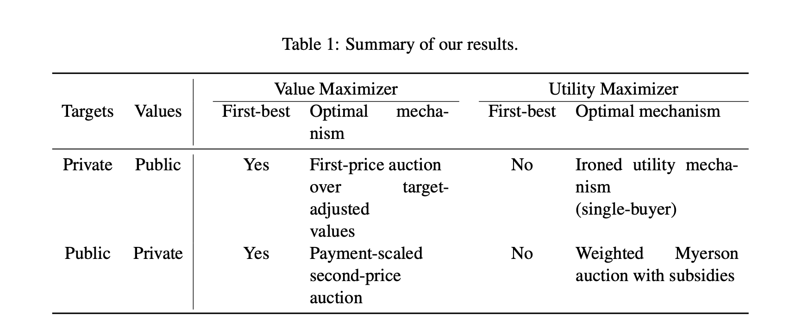

# 论文阅读 2023.09

> 本文首发于个人博客 \
> 发表日期：2023.09.03\
> 最后编辑于：{docsify-last-updated}

## The Landscape of Auto-bidding Auctions: Value versus Utility Maximization

> Balseiro, S., Deng, Y., Mao, J., Mirrokni, V., & Zuo, S. (2021). The Landscape of Auto-Bidding Auctions: Value Versus Utility Maximization. SSRN Electronic Journal. https://doi.org/10.2139/ssrn.3785579

本文关注在支出回报率（RoS）约束下将一个不可分割物品向多个代理人出售的情形下，当买家的目标为私有不被公开时，且买家可能追求最大化价值或最大化期望收入，此时是否能达到第一最佳回报（first best revenue）。

*RoS（Return on Spend）：多记为ROAS（Return on Ad Spend），即广告支出回报率，是一种营销指标，用于衡量花在广告上的每一美元所赚取的收入。具体的，其可被计算为广告收入与广告支出的比值。*

### 广告商 & 卖家博弈模型

考虑将一个不可分割物品卖给$n$个买家。买家$i$对于物品有估价$v_i\in\mathcal{V},\mathcal{V}\subseteq[0,\infin)$，卖家卖出该物品总有固定的支出$c\geq 0$。该支出可以被视为运输费，或是未从其他渠道进行销售的潜在机会成本。买家$i$的估价可由先验分布$F_i$导出，当然每个买家的分布都是独立的。每个买家都有一个需要满足的约束条件，在文章中这一约束被具象化为RoS，其标明了买家收到的价值与实际支出的最小目标比率$t_i\in\mathcal{T},\mathcal{T}\subseteq[0,\infin)$。买家$i$的目标比率被认为可以由公开的先验分布$G_i$导出，同样这些分布也是独立的。假设$F_i(v_i),G_i(t_i)$都连续并具有密度$f_i(v_i),g_i(t_i)$。同样可以用向量标记全部的估值与目标比率：$v,t$。

文章考虑估值与目标RoS比率分别为私有或公开等多种情况下卖家应如何选择拍卖机制。卖家目标是最大化买家付款与固定成本的差值，而买家则可能想要最大化价值，或是最大化回报率。以$I$表示只复习书，那么如果买家期望最大化效用那么$I=1$，如果其希望最大化价值那么$I=0$，换言之有：$\text{回报}=\text{价值}-I\cdot\text{支出}$。

*这里是说买家对物品有一个私有的估价，这个估价和买家最终的支出并不要求一定相等（而在传统模型中两者被视为完全相同）。*

## 参考资料

1. Balseiro, S., Deng, Y., Mao, J., Mirrokni, V., & Zuo, S. (2021). The Landscape of Auto-Bidding Auctions: Value Versus Utility Maximization. SSRN Electronic Journal. https://doi.org/10.2139/ssrn.3785579
