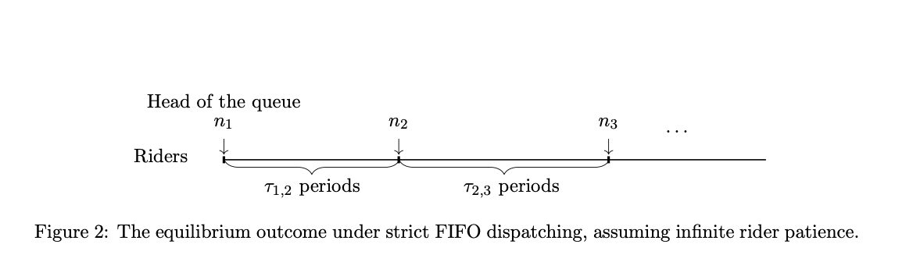
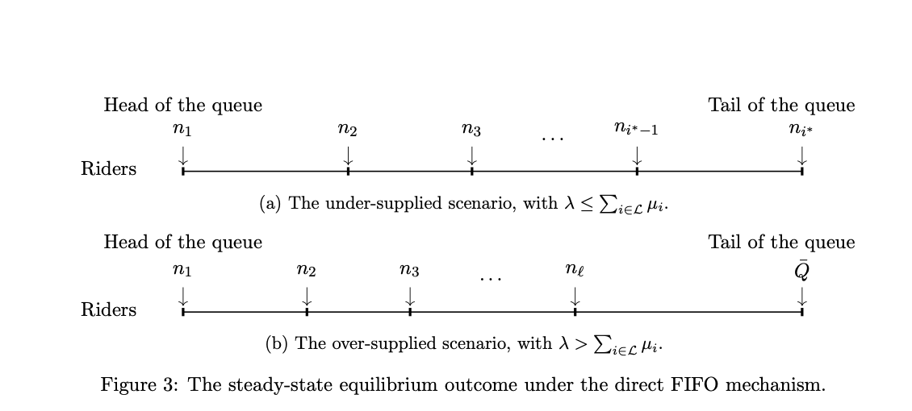
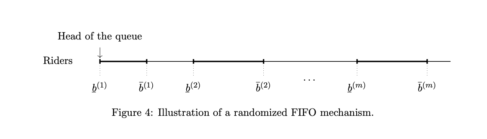
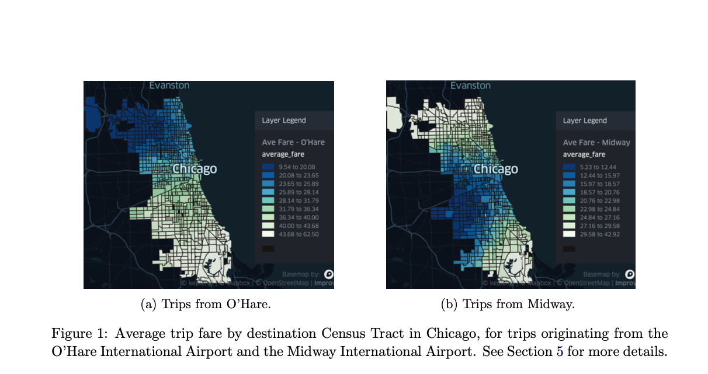
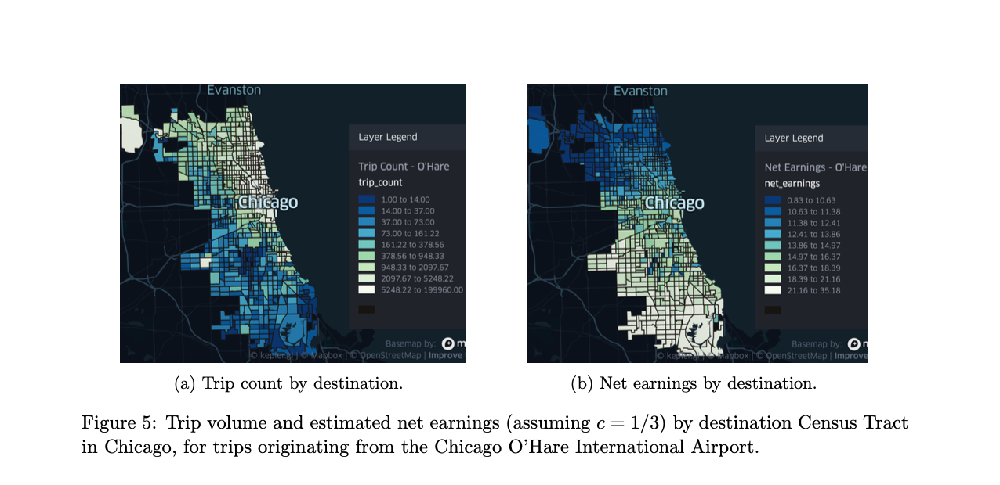
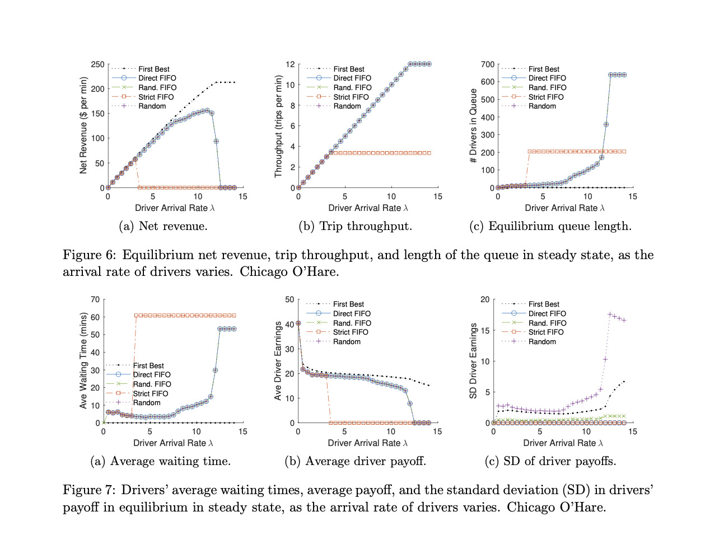
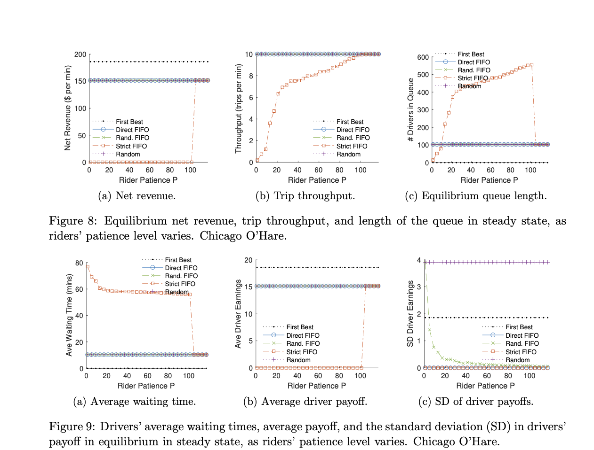

# 论文阅读 2023.09

> 本文首发于个人博客 \
> 发表日期：\
> 最后编辑于：{docsify-last-updated}

## Randomized FIFO Mechanisms

> Castro, F., Ma, H., Nazerzadeh, H., & Yan, C. (2022, July 12). Randomized FIFO Mechanisms. Proceedings of the 23rd ACM Conference on Economics and Computation. https://doi.org/10.1145/3490486.3538353

考虑一个打车平台，平台需要为每个乘客匹配一个司机，文章则着重研究如果实现较好的匹配。在传统的先进先出（FIFO）匹配中，平台维护一个司机列表（等待订单时间最久的司机排在头部），并优先匹配列表头部的司机。然而，在这种调度下司机很容易获得订单，这导致在列表头部的司机会倾向于拒绝低价值的订单而等待高价值的。从而，中等或低价值的订单很难被接受，这降低了平台的收入与出行的吞吐量较低。

为了解决这一问题，近年平台开始对司机进行限制：例如，平台正在向预先估算距离与收入的方向发展，并可能会在司机未接订单时隐藏目的地。然而，经验丰富的司机很容易绕过这些限制。另一方面，强制司机接受每个订单可能会使得每个司机获得的利益相差过大，从而降低司机的参与度，甚至可能导致司机离开平台。也有研究后进先出（LIFO）的可应用性，然而这会导致不公平：司机可以随时离线以参加到队列末尾，且在队列头部的将很难获得订单。

目前已有研究提出了时空价格机制（spatio-temporal pricing mechanism），其能保证社会福利最优与激励一致，然而这在实践中难以实现。一方面，对较短的行程提高定价并不合理，同时平台也无法让司机的支出定于某个预先设置好的单价，这也导致较长行程的收入难以降低。

由于某些行程总是能获得更多利益，文章研究在不调整行程价格的前提下，如何进行行程订单的分配。文章考虑行程具有一个起点，同时乘客和司机具有固定到达率。乘客要求前往多个目的地，而司机的收入也各不相同。当每个乘客到达时，或者乘客的行程请求被拒绝后，平台会将乘客的行程提供给队列中的司机。乘客愿意为一次匹配等待一段时间，但他们会在被司机拒绝一定次数后会取消订单。司机排队等候订单这一行为对于司机和平台来说成本都很高。司机旨在优化他们的总回报，即行程收入减去他们产生的等待成本。

文章考虑，在任何时间点，司机都知道供应、需求、队列长度以及他们在队列中的位置。 当提出行程请求时，司机会预先获得行程目的地和收入，以决定是否接受。此外，司机不会因为他们采取的任何行动而受到惩罚，并且可以拒绝任意数量的行程调度而不会失去他们在队列中的位置，在任何时间点重新加入队列的尾部，以及决定在抵达出发点时不加入队列，或在任何时间离开队列，从而可以在没有乘客的情况下重新返回出发点。

文章首先提出直接先进先出机制，该机制将低收入的行程直接提供给队列中较靠后的司机。文章证明接受所有调度在司机之间形成了子博弈完美均衡，并且均衡结果实现了第一最佳行程吞吐量和第二最佳净收入（即通过任何灵活和透明的机制可实现的最高稳态净收入）。然而，直接FIFO机制在实践中被认为是不公平的。以芝加哥中途机场为例。距离队列头部足够近的司机将不再接收任何返回芝加哥市中心的行程。

为了在不使用不公平调度规则的情况下实现最佳吞吐量和收入，文章引入了一系列随机FIFO机制。 随机 FIFO 机制由队列中的一组桶指定（例如，前10个位置、第10到20个位置等）。每个行程请求首先统一随机地提供给第一个容器中的司机。每次拒绝后，该机制都会将行程提供给下一个桶中的随机司机。通过以这种随机方式逐渐将订单发送到队列中，随机FIFO机制利用等待时间适当地调整激励措施，实现第一最佳吞吐量和第二最佳净收入；跳过队列其余部分的选项会激励队列中更靠后的司机接受收入较低的旅行；将每次调度随机分配给一小群司机，会增加每个司机等待下一次调度的时间，从而允许该机制优先考虑靠近队列头部的司机前往每个目的地，而不会刺激过度挑选。

### 机制模型

考虑一个连续时间的模型，模型中有一个统一的起点，乘客的行程被分派给在队列中等待的司机。$\mathcal{L}=\{1,2,\cdots,l\}$表明了离散行程类型（比如目的地不同）的集合$l\in\mathbb{Z}_{>0}$。乘客的需求与司机的供应都是非原子的，并且不随时间推移改变。对每个位置$i\in\mathcal{L}$，$\mu_i>0$表示请求到达位置$i$的乘客的到达率（换言之，单位时间到达的乘客数量）。在乘客到达后，其需求需要被分派给司机。所有的乘客都有一个耐心等级$P\in\mathbb{Z}_{>0}$，其表明乘客的需求在被司机接受前乘客愿意等待的时间，但乘客也可能会在第$P^{\text{th}}$次被司机拒绝后取消行程并离开。司机可以承载任何乘客到目的地，乘客本身没有对司机的偏好。

接着用$\lambda>0$表示司机的到达率。在司机到达后，司机需要决定是否要加入队列。到达每个位置$i\in\mathcal{L}$的净收入是$w_i$，其表明司机在完成到位置$i$的行程时可以获得收益$w_i$，而不加入队列或不携带行程订单就离开队列的司机的收入为0。司机在队列中等待的每个单位时间，都会产生机会成本$c>0$，平台产生的机会成本则为$c_p\in[0,c]$。司机具有战略性，他们想要最优化行程的收入与等待的机会成本的差值，且对于乘客或目的地没有偏好。

调度机制本身的时间表如下：在每个乘客到达时，机制会将乘客的行程需求分发给队列中的司机，如果司机接受了这次分派的行程，那么会离开队列以接乘客。否则，行程会被重新分派，直到有司机接受行程订单、乘客取消订单或机制决定不分派订单。

文章考虑如下的设置：机制有对需求、供应、机会成本以及到不同行程的净收入的完整信息，假设全部司机也都共享相同的信息。文章希望设计一种透明灵活的机制，即在任何时刻司机都知道队列的总长度与自己在队列中的位置。当司机被分派行程订单时，能够预知行程的目的地与净收入，以决定是否要接受这个订单。此外，司机不会因为自己的行动而被惩罚，并乐意选择是否：在拒绝订单的同时保留自己在队列中的位置；在任何时刻重新加入队列的末尾；不加入队列或在没有乘客的情况下离开队列。

平台的吞吐量事单位时间内队列中司机完成的订单数量。平台的净收入是司机单位时间内完成的订单的净收入和，减去平台在司机等待过程中产生的机会成本。当司机不理性并接受全部被分派的订单时，此时可实现的最高吞吐量所产生的净收入被视为第一最佳收入。

简单起见，假设行程按顺序排列$w_1>w_2>\cdots>w_l\geq 0$。在需求和供应稳定且无穷小时，平台也不需要非零的司机队列。稳定状态下，一个想要获得更多净收入的平台不应让司机留在队列中，而应在司机到达时按净收入降序分派订单，直到司机队列为空或乘客行程订单被分派完。将被（部分）完成的行程中收入最低的记为$i^*=\max\{i]in\mathcal{L}|\lambda>\sum^{i-1}_{j=1}u_j\}$（相当于在尽可能满足更多的订单的情况下将前面的订单尽可能分派给司机）。

稳定状态下的第一最佳收入发生在队列中没有司机的情况。司机到达时就被以净收入倒序分派订单。剩下的司机则被建议离开队列（可以去别的起点接乘客）。第一最佳的吞吐量为$T_{FB}=\min\{\lambda,\sum_{i\in\mathcal{L}}\mu_i\}$，第一最佳收入则为$R_{FB}=\sum^{i^*-1}_{i=1}w_i\mu_i + w_i\cdot\min\{\lambda-\sum^{i^*-1}_{i=1}\mu_i,\mu_{i^*}\}$。

### 严格FIFO分派

研究表明如果司机能够灵活的选择订单，这会刺激过度的挑选。在严格FIFO分派下，考虑到目的地1的乘客订单，这一订单会被队列头部的司机接受（注意目的地已经按净收入降序排序）。另一方面，在头部（无穷小）的司机只愿意接受到位置1的订单，因为他在队列头部，能够接受所有订单，也不需要等待到目的地1的订单。

类似的，一个司机愿意接受到目的地2的订单仅当到位置1的订单的额外等待时间超过$w_1-w_2$。令$\mathcal{T}_{1,2}$表明司机相比于立刻接受到位置2的订单，愿意等待到位置1的最大额外时间，即¥¥$\mathcal{T}_{1,2}=(w_1-w_2)/c$。根据利特尔法则有第一个愿意接受到位置2订单的司机排在位置$n_2\overset{\Delta}{=}\mu_1\mathcal{T}_{1,2}$而对于这个位置的司机，他的持续受益（净收益减去时间成本）是$w_2$。类似的，相比于前往位置$i+1$，愿意等待去位置$i$的司机需要额外的$\mathcal{T}_{i,i+1}$单位的等待时间。

因而如果乘客有无限耐心且不会订单，非形式化地，在$n_i$位置的司机总能得到$w_i$的持续预期受益。在均衡时，只有当司机的位置$q\geq n_i$时才应该接受分派的订单：

$$
\begin{align*}
    n_1 &= 0\\
    n_i &\overset{\Delta}{=} \sum^{i-1}_{j=1}(\frac{w_j-w_{j+1}}{c}\sum^j_{k=1}\mu_k),\forall i\geq2
\end{align*}
$$

文章计算出这种情况下的均衡，等价于如下的子博弈完美均衡：

- 当且仅当司机位置在$q\geq n_i$时接受到每个位置$i\in\mathcal{L}$的订单
- 当且仅当队列长度弱低于$\overline{Q}$时加入队列，并在加入后永远不离开队列或重新加入队列末尾。这里$\overline{Q}\overset{\Delta}{=}n_l+\frac{w_l}{c}\sum^l_{i=1}\mu_i=\sum_{i\in\mathcal{L}}w_i\mu_i/c$。

然而，若乘客耐心有限，那么乘客的订单将不会到达愿意接受这一订单的司机。

### 直接FIFO机制

文章接着介绍了一种不公平的机制，在这一机制中，在队列末尾的司机会被优先分派订单。

更形式化的，对长度为$Q>0$的队列，令$q\in[0,Q]$为队列中的一个特定位置，其中$q=0$代表在队列头部，也就是等待了最久时间的司机。令$h$表示特定乘客行程订单的分发历史，也就是提供过这一行程的司机当时在队列中的位置。用$\phi$表示不分发该行程的决定。

调度机制如下：给定长度$Q$的队列，行程的历史$h$以及行程的目的地，该机制在$[0,Q]\cup\{\phi\}$上确定一个概率分布。当乘客到达，或乘客的订单被某个司机拒绝后，机制要么将行程订单重新分派给队列中处于某个位置$q$的司机，要么拒绝该行程。

这一机制根据队列长度这一状态与行程的分派历史来决定分派，而不依赖于其他因素。文章同样关注司机基于队列长度与司机位置所做出的决策，并将这一策略记为三元组$\sigma=(\alpha,\beta,\gamma)$：

1. $\alpha(q,Q,i)\in[0,1]$是位于位置$q$的司机在被分派到位置$i$的行程订单时接受的概率
2. $\beta(q,Q)\in[0,1]$是位于位置$q$的司机重新加入队列末尾的概率
3. $\gamma(q,Q)\in[0,1]$是位于位置$q$的司机离开队列并不携带乘客的概率

令$U(q,Q,\sigma,\sigma')$表示当队列长度$Q$，该司机接受策略$\sigma$而其他司机接受策略$\sigma'$时（包括未来加入队列的司机），位于位置$q$的司机持续受益的随机变量。这包括了司机未来可能获得的净收益，减去从此时开始在队列中等待产生的机会成本的差。将$\pi(q,Q,\sigma,\sigma')\overset{\Delta}{=}\mathbb{E}[U(q,Q,\sigma,\sigma')]$表示司机从位置$q$开始的期望收益。文章接着进行了以下定义：

- **子博弈完美均衡（SPE, subgame perfect equilibrium）**：策略$\sigma^*$在司机间形成子博弈完美均衡，如果对任何经济体与任何可行的策略$\sigma$，有$\pi(q,Q,\sigma^*,\sigma^*)\geq\pi(q,Q,\sigma,\sigma^*),\forall Q\geq 0,\forall q\in[0,Q]$
- **个体理性（IR）**：机制在SPE下是IR的，如果策略$\sigma^*$在司机间形成子博弈完美均衡时，对任何经济体，$\pi(q,Q,\sigma^*,\sigma^*)\geq 0,\forall Q\geq 0,\forall q\in[0,Q]$
- 无嫉妒（Envy-freeness）：一个机制在SPE下是无嫉妒的，如果策略$\sigma^*$在司机间形成子博弈完美均衡时，对任何经济体，$\pi(q_1,Q,\sigma^*,\sigma^*)\geq\pi(q_2,Q,\sigma^*,\sigma^*),\forall Q\geq 0,\forall q_1,q_2\in[0,Q] \text{ s.t. }q_1\leq q_2$

给定机制$\mathcal{M}$与在其达到SPE的策略$\sigma^*$，令$Q^*$表示在该策略下稳定状态时队列的长度，换言之此时单位时间加入队列的司机数量与离开队列的司机数量相等。用$z_i(\sigma^*)$表示当所有司机都采用策略$\sigma^*$时，在稳定状态下完成的目的地为$i$的行程订单占比，因而有吞吐量：$T_{\mathcal{M}}(\sigma^*)\overset{\Delta}{=}\sum_{i\in\mathcal{L}}z_i(\sigma^*)\mu_i$。平台净收益为$R_{\mathcal{M}}(\sigma^*)\overset{\Delta}{=}\sum_{i\in\mathcal{L}}z_i(\sigma^*)\mu_i w_i-Q^* c_p$。当$c_p=c$时，平台的净收益就等于全部司机的净收益。

机制预期能达到第一最佳吞吐量，以及第二最佳收入，即当机制透明灵活，能给司机提供全部信息，并不会惩罚司机时，在稳定均衡状态下的最大净收益。

**直接FIFO机制**：到每个目的地$i\in\mathcal{L}$的行程被以FIFO形式分发给队列中从$n_i$位置开始的司机，并要求此时$Q\geq n_i$，否则不分派该行程。若乘客有无限的耐心，则按照严格FIFO机制调度。

文章证明在这种机制下全部司机接受直接FIFO机制分发的行程订单，并当且仅当队列最大为$\overline{Q}\overset{\Delta}{=}n_l+\frac{w_l}{c}\sum_{i\in\mathcal{L}}\mu_i$时才加入队列，采用这样的策略能够达到SPE。同时，该均衡也是IR和无嫉妒的。另一方面，当司机数量大于所需数量时，尽管机制无法实现第一最佳收入，但能够实现第二最佳收入与第一最佳吞吐量。

然而，在直接FIFO机制下靠近头部的司机可能会比后面的司机以更慢的速度接收到某些目的地的行程订单，因此不太公平。

### 随机FIFO机制

文章最后提出了随机FIFO机制，该机制相对公平，并能实现最佳的均衡情况下的吞吐量与净收益。文章首先定义了在所有订单都被均匀随机地分派给全部司机情况下的均衡状态：

**稳定状态下的纳什均衡**：在某个机制下，策略$\sigma^*$在司机间形成了稳定状态下的纳什均衡，当存在队列长度$Q^*\geq0$使得：

1. 对任何可行的策略$\sigma$和队列中任意位置$q\in[0,Q^*]$，有$\pi(q,Q^*,\sigma^*,\sigma^*)\geq\pi(q,Q^*,\sigma,\sigma^*)$
2. 当所有司机都采用策略$\sigma^*$，且稳定的状态表明队列长度为$Q^*$

文章表明，在达到稳定状态下的纳什均衡时，最佳的机制实现了第一最佳吞吐量与第二最佳收入。当$c_p=0$时，也实现了第一最佳收入。

**随机FIFO机制**：随机FIFO机制被队列$([\underline{b}^{(1)},\overline{b}^{(1)}],[\underline{b}^{(2)},\overline{b}^{(2)}],\cdots,[\underline{b}^{(m)},\overline{b}^{(m)}])$中$m\geq1$个桶（bin）指定。当行程被第$k$次分派时，机制将其均匀随机地分发给第$k$个桶$[\underline{b}^{(k)},\overline{b}^{(k)}]$中的司机。

给定任意经济体，令$(\mathcal{L}^{(1)},\mathcal{L}^{(2)},\cdots,\mathcal{L}^{(m)})$为前$i^*$个目的地$\{1,2,\cdots,i^*\}\in\mathcal{L}$的有序划分，其中$m\leq\min\{i^*,P\}$：

1. 总体详尽：$\cup^m_{k=1}\mathcal{L}^{(k)}=\{1,2,\cdots,i^*\},\forall k\in[1,m],\mathcal{L}^{(k)}\neq\emptyset$
2. 互斥：$\forall k_1,k_2\leq m\text{ s.t. }k_1\neq k_2,\mathcal{L}^{(k_1)}\cap\mathcal{L}^{(k_2)}=\emptyset$
3. 单调：$\forall k_1,k_2\leq m\text{ s.t. }k_1\neq k_2,i<j \forall i\in\mathcal{L}^{(k_2)},j\in\mathcal{L}^{(k_2)}$

给定一个经济体和前$i^*$个目的地$\{1,2,\cdots,i^*\}\in\mathcal{L}$的有序划分$(\mathcal{L}^{(1)},\mathcal{L}^{(2)},\cdots,\mathcal{L}^{(m)})$，按如下方式构造队列$([\underline{b}^{(1)},\overline{b}^{(1)}],[\underline{b}^{(2)},\overline{b}^{(2)}],\cdots,[\underline{b}^{(m)},\overline{b}^{(m)}])$中的$m$个桶：

$$
\begin{align*}
    \underline{b}^{(k)} &\overset{\Delta}{=}\sum_{i\in\cup_{k'<k}\mathcal{L}^{(k')}}(w_i-\min_{i'\in\mathcal{L}^{(k)}}\{w_i'\})\mu_i/c \\
    \overline{b}^{(k)} &\overset{\Delta}{=}\sum_{i\in\cup_{k'\leq k}\mathcal{L}^{(k')}}(w_i-\min_{i'\in\mathcal{L}^{(k)}}\{w_i'\})\mu_i/c
\end{align*}
$$

文章最后具体表明了这一类能实现最佳稳定状态下纳什均衡的随机FIFO机制：

**随机FIFO机制**：对任何经济体和前$i^*$个目的地$\{1,2,\cdots,i^*\}\in\mathcal{L}$的有序划分$(\mathcal{L}^{(1)},\mathcal{L}^{(2)},\cdots,\mathcal{L}^{(m)})$，其中$m\leq\min\{i^*,P\}$，能够满足上述随机分给桶内司机的机制能达到第一最佳吞吐量与第二最佳收入。当$c_p=0$时，也实现了第一最佳收入。通过这一种机制，司机的收入的波动性也被大大减小了。

### 实验结果

数据集如上，文章根据实际情况假定了机会成本，乘客到达率等因素。为了估计出行的分布以及按目的地划分的出行净收入，文章利用了芝加哥市公开的乘车共享平台（Uber、Lyft）的出行级别数据。该数据集提供了每次出行的票价（四舍五入到最接近的2.50美元）、每次行程的出发地和目的地，以及每次行程开始和结束的时间戳（四舍五入到最近的15分钟）。芝加哥市内共有801个区，文章将其视为目的地集。

2018年11月1日至2020年3月11日，从奥黑尔出发的出行总数为453万次。 按目的地区划分的出行次数如图5a，按目的地划分的平均出行费用如图1a。文章假设驾驶员的机会成本为$c = 1/3$，代表在城市中驾驶的平均驾驶员每小时赚取20美元的情况。结合平均票价、平均行程持续时间和机会成本，文章按旅行目的地估算净利润，如图5b。

文章将乘客的总到达率固定为$\sum_{i\in\mathcal{L}}\mu_i=12$每分钟。这大致等于工作日傍晚时段完成行程的比率。文章假设平台司机时间的机会成本为每分钟$c_p=c=1/3$，这对应于第一最佳和第二最佳净收入之间差距是最大的场景。最后，文章评估的随机FIFO机制对应于将已完成行程集按顺序划分为最多$P$个子集，每个子集包含（大约）相同数量的目的地。

## 参考文献

1. Castro, F., Ma, H., Nazerzadeh, H., & Yan, C. (2022, July 12). Randomized FIFO Mechanisms. Proceedings of the 23rd ACM Conference on Economics and Computation. https://doi.org/10.1145/3490486.3538353
