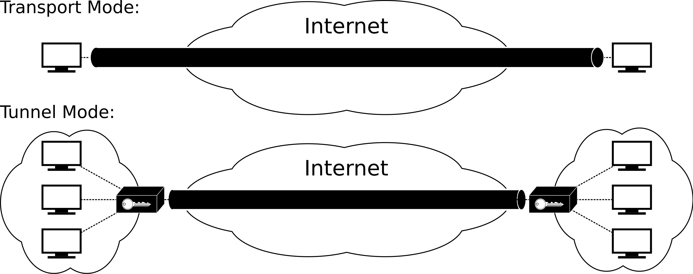
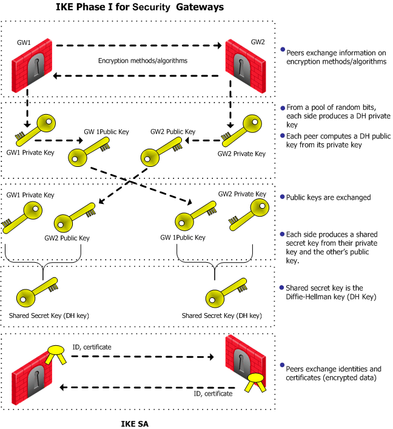
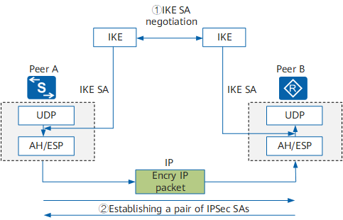

# IPSec 技术的理解

> 本文首发于个人博客 \
> 发表日期：2023.05.27\
> 最后编辑于：{docsify-last-updated}

目前家里两个地方都有公网环境，为了保证安全性与防止备案问题（也就是不想给外部用户提供任何服务），所以利用华硕路由器都配置了 IPSec VPN 。这两天想看看他的安全性问题，所以看了看 IPSec 技术的原理。

## 主流 IPSec VPN 配置

看了看目前比较主流的配置大致就两种：

- L2TP / IPSec
- Cisco IPSec (IPSec / IKE)

华硕路由器原生支持的是后者，在 MacOS 上则是两种都支持。

## IPSec 技术

先看 IPSec 技术本身，其工作在第三层即网络层上，需要开放 UDP 500 和 4500 端口。报文大致含有以下内容：

- 认证头 AH，维基上给出的结构如下（懒了直接把维基 html 抄下来了）：

<table class="wikitable" style="margin:1em auto; text-align: center">
<caption style="background:#781549; color:white;"><i>Authentication Header</i> format
</caption>
<tbody><tr>
<th style="border-bottom:none; border-right:none;"><i>Offsets</i>
</th>
<th style="border-left:none;">Octet16
</th>
<th colspan="8">0
</th>
<th colspan="8">1
</th>
<th colspan="8">2
</th>
<th colspan="8">3
</th></tr>
<tr>
<th style="border-top: none">Octet16
</th>
<th>Bit10
</th>
<th style="width:2.6%;">0
</th>
<th style="width:2.6%;">1
</th>
<th style="width:2.6%;">2
</th>
<th style="width:2.6%;">3
</th>
<th style="width:2.6%;">4
</th>
<th style="width:2.6%;">5
</th>
<th style="width:2.6%;">6
</th>
<th style="width:2.6%;">7
</th>
<th style="width:2.6%;">8
</th>
<th style="width:2.6%;">9
</th>
<th style="width:2.6%;">10
</th>
<th style="width:2.6%;">11
</th>
<th style="width:2.6%;">12
</th>
<th style="width:2.6%;">13
</th>
<th style="width:2.6%;">14
</th>
<th style="width:2.6%;">15
</th>
<th style="width:2.6%;">16
</th>
<th style="width:2.6%;">17
</th>
<th style="width:2.6%;">18
</th>
<th style="width:2.6%;">19
</th>
<th style="width:2.6%;">20
</th>
<th style="width:2.6%;">21
</th>
<th style="width:2.6%;">22
</th>
<th style="width:2.6%;">23
</th>
<th style="width:2.6%;">24
</th>
<th style="width:2.6%;">25
</th>
<th style="width:2.6%;">26
</th>
<th style="width:2.6%;">27
</th>
<th style="width:2.6%;">28
</th>
<th style="width:2.6%;">29
</th>
<th style="width:2.6%;">30
</th>
<th style="width:2.6%;">31
</th></tr>
<tr>
<th>0
</th>
<th>0
</th>
<td colspan="8"><i>Next Header</i>
</td>
<td colspan="8"><i>Payload Len</i>
</td>
<td colspan="16"><i>Reserved</i>
</td></tr>
<tr>
<th>4
</th>
<th>32
</th>
<td colspan="32"><i>Security Parameters Index (SPI)</i>
</td></tr>
<tr>
<th>8
</th>
<th>64
</th>
<td colspan="32"><i>Sequence Number</i>
</td></tr>
<tr>
<th>C
</th>
<th>96
</th>
<td colspan="32" rowspan="2"><i>Integrity Check Value (ICV)</i> ...
</td></tr>
<tr>
<th>...
</th>
<th>...
</th></tr></tbody></table>

- 加密过的报文 ESP，同样可以看一下结构：

<table class="wikitable" style="margin:1em auto; text-align: center">
<caption style="background:#781549; color:white;"><i>Encapsulating Security Payload</i> format
</caption>
<tbody><tr>
<th style="border-bottom:none; border-right:none;"><i>Offsets</i>
</th>
<th style="border-left:none;">Octet16
</th>
<th colspan="8">0
</th>
<th colspan="8">1
</th>
<th colspan="8">2
</th>
<th colspan="8">3
</th></tr>
<tr>
<th style="border-top: none">Octet16
</th>
<th>Bit10
</th>
<th style="width:2.6%;">0
</th>
<th style="width:2.6%;">1
</th>
<th style="width:2.6%;">2
</th>
<th style="width:2.6%;">3
</th>
<th style="width:2.6%;">4
</th>
<th style="width:2.6%;">5
</th>
<th style="width:2.6%;">6
</th>
<th style="width:2.6%;">7
</th>
<th style="width:2.6%;">8
</th>
<th style="width:2.6%;">9
</th>
<th style="width:2.6%;">10
</th>
<th style="width:2.6%;">11
</th>
<th style="width:2.6%;">12
</th>
<th style="width:2.6%;">13
</th>
<th style="width:2.6%;">14
</th>
<th style="width:2.6%;">15
</th>
<th style="width:2.6%;">16
</th>
<th style="width:2.6%;">17
</th>
<th style="width:2.6%;">18
</th>
<th style="width:2.6%;">19
</th>
<th style="width:2.6%;">20
</th>
<th style="width:2.6%;">21
</th>
<th style="width:2.6%;">22
</th>
<th style="width:2.6%;">23
</th>
<th style="width:2.6%;">24
</th>
<th style="width:2.6%;">25
</th>
<th style="width:2.6%;">26
</th>
<th style="width:2.6%;">27
</th>
<th style="width:2.6%;">28
</th>
<th style="width:2.6%;">29
</th>
<th style="width:2.6%;">30
</th>
<th style="width:2.6%;">31
</th></tr>
<tr>
<th>0
</th>
<th>0
</th>
<td colspan="32"><i>Security Parameters Index (SPI)</i>
</td></tr>
<tr>
<th>4
</th>
<th>32
</th>
<td colspan="32"><i>Sequence Number</i>
</td></tr>
<tr>
<th>8
</th>
<th>64
</th>
<td colspan="32" rowspan="2"><i>Payload data</i>
</td></tr>
<tr>
<th>...
</th>
<th>...
</th></tr>
<tr>
<th>...
</th>
<th>...
</th>
<td colspan="8" style="border-top-style: hidden;">&nbsp;
</td>
<td colspan="24" style="border-bottom-style: hidden;">&nbsp;
</td></tr>
<tr>
<th>...
</th>
<th>...
</th>
<td colspan="8" style="border-right-style: hidden;">&nbsp;
</td>
<td colspan="16"><i>Padding (0-255 octets)</i>
</td>
<td colspan="8" style="border-left-style: hidden;">&nbsp;
</td></tr>
<tr>
<th>...
</th>
<th>...
</th>
<td colspan="16" style="border-top-style: hidden;">&nbsp;
</td>
<td colspan="8"><i>Pad Length</i>
</td>
<td colspan="8"><i>Next Header</i>
</td></tr>
<tr>
<th>...
</th>
<th>...
</th>
<td colspan="32" rowspan="2"><i>Integrity Check Value (ICV)</i> ...
</td></tr>
<tr>
<th>...
</th>
<th>...
</th></tr></tbody></table>

当然根据具体协议封装方式不同其结构也有所不同，但基本上都会含有上面的部分。从上面也可以看出，IPSec 包含了这些协议：AH、ESP 和 ISAKMP。

IPSec 通常有两种传输模式，即隧道模式和传输模式。工作方式见名知意。

### L2TP / IPSec

L2TP 工作在第二层数据链路层，使用端口 UDP 1701。某种意义上可以理解成是把 PPP 载荷包了一层 UDP。由于 IPSec 更多侧重于对数据报文的加密也就是安全性，在用户认证上比较薄弱。因而常会考虑将 L2TP 和 IPSec 结合。

仔细想一下，当家里路由器桥接光猫，路由器拨号的时候，光猫只作 Modem，路由器通过 PPPoE 方式拨号，这里 PPPoE 实质上就是封装了 PPP 协议。大概是由于 PPP 擅于进行身份认证和 IP 分配，所以大量采用 PPPoE 方式来接入宽带。

总之由于 L2TP 可以很方便地做多用户的认证，可以很好地解决 IPSec 在这方面的缺陷，所以两者经常被组合使用。

### Cisco IPSec (IPSec / IKE)

Cisco 的 IPSec 大体上是结合使用了 IKE 协议，当然也有在此之上再利用 L2TP 协议的，不过华硕和 MacOS 似乎都没有支持？因而这里不作探讨。

先说 IKE 协议，全程即网络密钥交换协议，基本上是用下列方式进行身份认证和密钥分发的：

- 身份认证，支持 PSK、RSA、数字信封
- 身份保护，利用 DH 密钥交换算法和 PFS

IKEv1 和 v2 最大不同在于 v2 简化了协商过程并修复了些安全漏洞。

基本的认证过程如上图。

现在考虑 IPSec 和 IKE 组合使用的情景，也就是大部分的实际情景：

注意这里 IPSec 进行加密和认证的时候支持 MD5 和 SHA-1，在 IKE 认证部分则是利用了 FPS 和 PSK 或 RSA（这里是提供给配置者自选的）。

可以再结合 Cisco 官网的图片和解释看一下：

## 结论

个人来看对个人用户而言这种安全性是足够了的。嫌证书认证麻烦不用 RSA 而选择 PSK 都已经足够。其实华硕本身也提供了证书可以使用，不过由于家宽一般都是动态公网 IP 每次 IP 变了都要重新弄成本也确实相对高一点。

## 参考资料

1. IPsec and IKE. (2023, April 5). IPsec and IKE. https://sc1.checkpoint.com/documents/R81/WebAdminGuides/EN/CP_R81_SitetoSiteVPN_AdminGuide/Topics-VPNSG/IPsec-and-IKE.htm
2. Introduction to Cisco IPsec Technology. (2007, August 3). Cisco. https://www.cisco.com/c/en/us/td/docs/net_mgmt/vpn_solutions_center/2-0/ip_security/provisioning/guide/IPsecPG1.html
3. IPsec - Wikipedia. (2014, February 18). IPsec - Wikipedia. https://en.wikipedia.org/wiki/IPsec#
4. IPSec IKEv1 & IKEv2_ike sa 是双向的吗 _text1.txt 的博客-CSDN 博客. (2001, November 14). IPSec IKEv1 & IKEv2_Ike sa 是双向的吗 _text1.txt 的博客-CSDN 博客. https://blog.csdn.net/weixin_51045259/article/details/113639007?utm_medium=distribute.pc_relevant.none-task-blog-2~default~baidujs_baidulandingword~default-5-113639007-blog-123870000.235^v36^pc_relevant_default_base3&spm=1001.2101.3001.4242.4&utm_relevant_index=8
5. HCIE-Security Day33：IPSec：深入学习 ipsec ikev2、IKEV1 和 IKEV2 比较 _ike v1 与 ike v2 的区别_小梁 L 同学的博客-CSDN 博客. (2001, May 12). HCIE-Security Day33：IPSec：深入学习 ipsec ikev2、IKEV1 和 IKEV2 比较 _ike v1 与 ike v2 的区别_小梁 L 同学的博客-CSDN 博客.https://blog.csdn.net/qq_36813857/article/details/123870000
6. Basic Concepts of IPSec - S600-E V200R011C10 Configuration Guide - VPN - Huawei. (2021, October 20). Basic Concepts of IPSec - S600-E V200R011C10 Configuration Guide - VPN - Huawei. https://support.huawei.com/enterprise/en/doc/EDOC1000178025/ae03ecd3/basic-concepts-of-ipsec
7. 既然 IPsec 有隧道模式，为什么还有 L2TP+IPsec 这样的组合？ - 知乎. (2018, June 15). 既然 IPsec 有隧道模式，为什么还有 L2TP+IPsec 这样的组合？ - 知乎. https://www.zhihu.com/question/279686051
