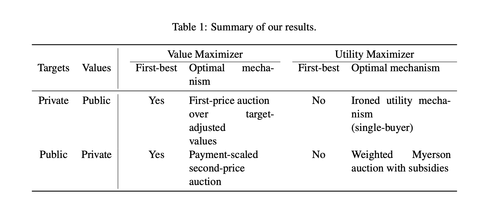
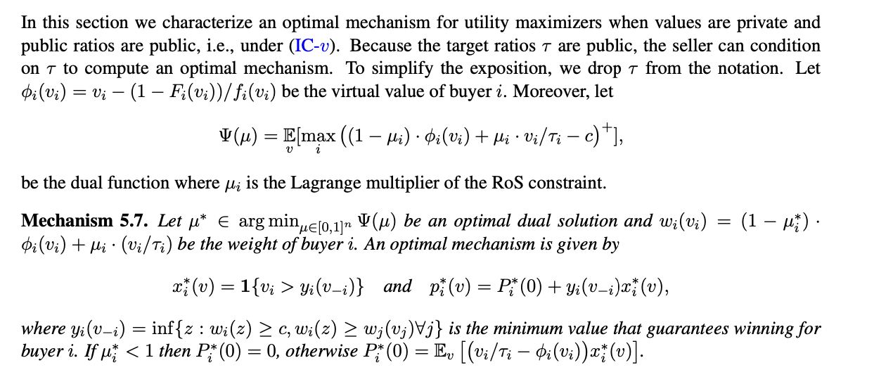

# 论文阅读 2023.09

> 本文首发于个人博客 \
> 发表日期：2023.10.10\
> 最后编辑于：{docsify-last-updated}

## The Landscape of Auto-bidding Auctions: Value versus Utility Maximization

> Balseiro, S., Deng, Y., Mao, J., Mirrokni, V., & Zuo, S. (2021). The Landscape of Auto-Bidding Auctions: Value Versus Utility Maximization. SSRN Electronic Journal. https://doi.org/10.2139/ssrn.3785579

本文关注在支出回报率（RoS）约束下将一个不可分割物品向多个代理人出售的情形下，当买家的目标为私有不被公开时，且买家可能追求最大化价值或最大化期望收入，此时是否能达到第一最佳回报（first best revenue）。

*RoS（Return on Spend）：多记为 ROAS（Return on Ad Spend），即广告支出回报率，是一种营销指标，用于衡量花在广告上的每一美元所赚取的收入。具体的，其可被计算为广告收入与广告支出的比值。*

### 广告商&卖家博弈模型

考虑将一个不可分割物品卖给 $n$ 个买家。买家 $i$ 对于物品有估价 $v_i\in\mathcal{V},\mathcal{V}\subseteq[0,\infin)$，卖家卖出该物品总有固定的支出 $c\geq 0$。该支出可以被视为运输费，或是未从其他渠道进行销售的潜在机会成本。买家 $i$ 的估价可由先验分布 $F_i$ 导出，当然每个买家的分布都是独立的。每个买家都有一个需要满足的约束条件，在文章中这一约束被具象化为 RoS，其标明了买家收到的价值与实际支出的最小目标比率 $t_i\in\mathcal{T},\mathcal{T}\subseteq[0,\infin)$。买家 $i$ 的目标比率被认为可以由公开的先验分布 $G_i$ 导出，同样这些分布也是独立的。假设 $F_i(v_i),G_i(t_i)$ 都连续并具有密度 $f_i(v_i),g_i(t_i)$。同样可以用向量标记全部的估值与目标比率：$v,t$。

文章考虑估值与目标 RoS 比率分别为私有或公开等多种情况下卖家应如何选择拍卖机制。卖家目标是最大化买家付款与固定成本的差值，而买家则可能想要最大化价值，或是最大化回报率。以 $I$ 表示支付系数，那么如果买家期望最大化效用那么 $I=1$，如果其希望最大化价值那么 $I=0$，换言之有：$\text{回报}=\text{价值}-I\cdot\text{支出}$。

*这里是说买家对物品有一个私有的估价，这个估价和买家最终的支出并不要求一定相等（而在传统模型中两者被视为完全相同）。*

形式化地，考虑一般情况下买家的估价与目标回报率都私有的情况，机制可由分配规则 $x:(\mathcal{V}\times\mathcal{T})^n\rightarrow[0,1]^n$ 与支付规则 $p:(\mathcal{V}\times\mathcal{T})^n\rightarrow\mathbb{R}^n$ 给出，其中 $x_i(v,t)$ 表示物品被分配给第 $i$ 个买家的概率，$p_i(v,t)$ 表示其支出。由于仅有一个不可分割的物品，显然有 $\sum^n_{i=1}x_i(v,t)\leq1$。

整个拍卖按如下时序发生：

1. 每个买家 $i$ 从 $G_i$ 导出其目标回报率 $t_i$。如果目标回报率私有则买家可以汇报任意 $\hat{t_i}\in\mathcal{T}$。
2. 卖家向全部买家公开他们各自的目标回报率。
3. 买家 $i$ 从 $F_i$ 导出估值 $v_i$。如果估价私有那么买家可以任意汇报 $\hat{v_i}\in\mathcal{V}$。当然这里的汇报值应满足他自己的支出回报率。
4. 卖家向每个买家 $i$ 分概率 $x_i(\hat{v}, \hat{t})$ 并向他收取支付价格 $p_i(\hat{v}, \hat{t})$。

文章意图设计一个使买家能诚实地进行汇报的机制（即激励相容）。更形式化的，假设当买家 $i$ 汇报的目标回报率是 $\hat{t_i}\in \mathcal{T}$，且所有买家都恒定诚实汇报时，假设他在第二阶段（上述后两个阶段）的最佳预期收益是 $U_i(\hat{t_i};t)$，其中后者 $t\in\mathcal{T}^n$ 是全部买家的目标回报率，那么有：

$$
\begin{align*}
U_i(\hat{t_i};t)=&\max_{\alpha:\mathcal{V}\rightarrow\Delta(\mathcal{V})}\mathbb{E}[v_i\cdot x_i((\alpha(v_i),v_{-i}),(\hat{t_i},t_{-i}))-I\cdot p_i((\alpha(v_i),v_{-i}),(\hat{t_i},t_{-i}))] \\
&\text{s.t.}\ \mathbb{E}_v[v_i\cdot x_i((\alpha(v_i),v_{-i}),(\hat{t_i},t_{-i}))-t_i\cdot p_i((\alpha(v_i),v_{-i}),(\hat{t_i},t_{-i}))]\geq 0
\end{align*}
$$

这里 $\alpha$ 代表买家随机选择的投标策略，以满使全部买家都能满足自己的回报率约束。

此时机制是激励相容的，如果其满足：

1. 每个买家 $i$ 都被预期如实汇报真实的目标回报率：对全部 $t_i,\hat{t_i}\in\mathcal{T}$，有 $U_i(t_i;t)\geq U_i(\hat{t_i};t)$。（$IC-t$）
2. 每个买家 $i$ 都能通过汇报他自己真实的估价（当他如实汇报目标回报率，且其他买家也都如实汇报时）以实现最佳收益：对全部 $t\in\mathcal{T}^n$，有 $U_i(t_i;t)=\mathbb{E}_v[v_i\cdot x_i(v,t)-I\cdot p_i(v,t)]$。（$IC-v$）这里这也暗示回报率约束在被诚实汇报时自然地得到满足：对全部买家 $i$ 以及目标回报率 $t\in\mathcal{T}^n$，$\mathbb{E}_v[v_i\cdot x_i(v,t)-t_i\cdot p_i(v,t)]\geq 0$。

在考虑卖家方机制设计问题时，文章也考虑满足个体理性条件，即需要买家的中期收益也要大于等于零：$v_i\cdot X_i(v_i,t)-I\cdot P_i(v_i,t)\geq0,\forall i,v_i\in\mathcal{V},t\in\mathcal{T}^n$。这里中期收益被定义为 $X_i(v_i,t)=\mathbb{E}_{v_{-i}}[x_i((v_i,v_{-i}),t)],P_i(v_i,t)=\mathbb{E}_{v_{-i}}[p_i((v_i,v_{-i}),t)]$。（$IR$）显然对追求最大化价值的买家 IR 永远成立，而对于追求最大化效用的买家，IR 要求其支付永远不超过价值。

卖方希望能找到一个满足个体理性（IR）与激励相容的机制，其能够最大化卖方的收益，即 $OPT=\max_{x,p}\sum^n_{i=1}\mathbb{E}_{v,t}[p_i(v,t)-c\cdot x_i(v,t)] \text{s.t. (IR),(IC-t),(IC-v)}$。文章将机制与第一最佳收入比较，并指出当买家的私人信息都公开时其是可实现的。卖家此时只要满足个体理性与回报率约束即可，换言之有第一最佳收入 $FB=\max_{x,p}\sum^n_{i=1}\mathbb{E}_{v,t}[p_i(v,t)-c\cdot x_i(v,t)] \text{s.t. (IR),(RoS)}$。

为了便于计算与证明，考虑目标调整价值（target-adjusted-value）$\frac{v_i}{t_i}$。文章证明当该值大于卖家的固定开销时（$\max_i v_i/t_i>c$），第一最佳机制应当分配给有最高目标调整价值的买家，此时应当向卖家收取该调整价值的费用；否则商品不应当被售出。换言之其类似于有底价$c$的一价拍卖，其中买家按目标调整价格排序。直观上看该机制应尽可能大地设定支付价格，以满足回报率约束。倘若将支付价格删去，那么卖家的对象可以被转化为 $\sum^n_{i=1}(v_i/t_i-c)\cdot x_i(v,t)$，这也正是第一最佳分配。这种机制当然不是激励相容的。

为了便于记述记 $(x)^+=\max\{x,0\}$，那么第一最佳收入为 $FB=\sum^n_{i=1}\mathbb{E}_{v,t}[(\max_i v_i/t_i-c)^+]$，这对于效用最大化与价值最大化两种买家都成立。当 $p_i(v,t)=(v_i/t_i)\cdot x_i(v,t),x_i(v,t)=1\{i=\argmax_{j:v_j/t_j>c}v_j/t_j\}$ 时能实现第一最佳收入。

### 激励相容的表征

文章指出 IC-v 的定义并不容易给出，因其实质上包含了在全部投标策略空间上的优化问题。文章假定对任何目标回报率空间 $t$ 每个买家 $i$ 和他汇报的目标 $\hat{t_i}$ 都存在一个投标策略 $\alpha:\mathcal{V}\rightarrow\Delta(\mathcal{V})$ 使得 $\mathbb{E}_{v_i}[v_i\cdot X_i(\alpha(v_i),(\hat{t_i},t_{-i}))-t_i\cdot P_i(\alpha(v_i),(\hat{t_i},t_{-i}))]>0$。（满足 IR）。

文章基于这个假设证明，一个机制是 IC-v 当切仅当对每个买家 $i$ 存在证书函数（certificate function）$\gamma_i:\mathcal{T}^n\rightarrow[0,\infty]$使得：

1. 对全部 $t$ 与全部 $v_i,v_i'\in\mathcal{V}$ 有 $(1+\gamma_i(t))\cdot v_i\cdot X_i(v_i,t)-(I+\gamma_i(t)\cdot t_i)\cdot P_i(v_i,t)\geq (1+\gamma_i(t))\cdot v_i\cdot X_i(v_i',t)-(I+\gamma_i(t)\cdot t_i)\cdot P_i(v_i',t)$
2. $\mathbb{E}_{v_i}[v_i\cdot X_i(v_i,t)-t_i\cdot P_i(v_i,t)]\geq 0 \bot \gamma_i(t)\geq 0$

这里 $\bot$ 表示 RoS 约束与 $\gamma_i(t)$ 非负性之间的互补条件，即两个不等式都成立且至少其中一个满足等号取等条件。注意严格的 IC 在 $\gamma_i(t)=0$
 时取到，其防止任何买家在任何时刻出现偏差（严格的 IC 并不保证 RoS 总能满足）。

当 $I=0$（买家追求价值最大化）且 $\gamma_i(t)=0$ 时条件一暗示 $X_i(v_i,t_i)$ 是独立于 $v_i$ 的常量。另一方面 $I=1$或$\gamma_i(t)>0$ 时，条件一则可以被转化为：

- 分配 $X_i(v_i,t)$ 在 $v_i$ 上不是递减的。
- 对全部 $v_i\in\mathcal{V}$，$P_i(v_i,t)=P_i(0,t)+\eta_i(t)\cdot(v_i\cdot X_i(v_i,t)-\in^{v_i}_0 X_i(z,t)dz),\eta_i(t)=(1+\gamma_i(t))/(I+\gamma_i(t)\cdot t_i)$。（$IC-v-\text{支付}$）

接着考虑 IC-t。当买家都如实汇报且回报率向量是 $t$ 时，以 $RoS_i(t)$ 表示买家 $i$ 的 RoS，那么有：

$$
\begin{align*}
RoS_i(t)=\begin{cases}
    \mathbb{E}_{v_i}[v_i\cdot X_i(v_i,t)]/\mathbb{E}_{v_i}[P_i(v,t)] &\text{if} \mathbb{E}_{v_i}[P_i(v,t)]>0 \\
    +\infty \text{otherwise}
\end{cases}
\end{align*}
$$

文章证明，对 IC-v 的机制，其也是 IC-t 的仅当对每个买家 $i$ 与任何 $t_{-i}\in\mathcal{T}^{n-1}$，有：

1. $U_i(t_i;t_{-i})$ 不随 $t_i$ 增加而增长（防止用户谎报更高的回报率）
2. 对 $\hat{t_i}<t_i$，如果 $U_i(\hat{t_i};(\hat{t_i},t_{-i}))>U_i(t_i;(t_i,t_{-i}))$ 那么 $RoS_i(\hat{t_i},t_{-i})<t_i$（防止用户谎报更低的回报率）

这两个条件指出当 RoS 常量不绑定时预期收入也是常数。

**估价公开而目标回报率私有**时，买家只能谎报目标回报率，当真实回报率空间为 $(t_i,t_{-i})$ 而买家 $i$ 汇报 $\hat{t_i}$ 时他的期望收益是 $U_i(\hat{t_i};t)=\mathbb{E}_{v_i}[v_i\cdot X_i(v_i,(\hat{t_i},t_{-i}))-I\cdot P_i(v_i,(\hat{t_i},t_{-i}))]$，且 $\mathbb{E}_{v_i}[v_i\cdot X_i(v_i,(\hat{t_i},t_{-i}))-t_i\cdot P_i(v_i,(\hat{t_i},t_{-i}))]\geq0$，否则效用恒定为 $-\infty$。此时上述条件是充要的。

**估价与目标回报率都私有**时，为了使条件充要，文章提供了进一步的限制条件，其依赖于前述的证书函数：考虑机制的证书函数 $\{\gamma_i\}_{i\in[n]}$，其是 IC-t 当且仅当对每个买家 $i$ 与任何 $t_{-i}\in\mathcal{T}^{n-1}$ 有 $\frac{\partial U_i(t_i;(t_i,t_{-i}))}{\partial t_i}=-\frac{\gamma_i(t_i,t_{-i})\cdot U_i(t_i;(t_i,t_{-i}))}{t_i-I}$，如果 $t$ 是可微点。

文章指出当机制是 IC-v 的时，最佳的投标策略总是采取统一乘法投标（uniform(multiplicative) bidding），也就是说考虑常量 $\beta>0$，总是去投标 $\beta\cdot v_i$。形式化地，对任何 $\hat{v_i}\in\mathcal{T},v\in\mathcal{T}^n$，存在最佳的投标策略 $\alpha$，$\alpha(v)=\beta\cdot v$，其中 $v\in\mathcal{V},\beta>0$ 为常量，这一策略可以实现 $U_i(\hat{t_i};t)$。

这一乘数可以被计算得出。更具体的，令 $margin(\beta,\phi;\hat{t_i},t)=\mathbb{E}_{v_i}[v_i\cdot X_i(\beta\cdot v_i,(\hat{t_i};t_{-i}))-\phi\cdot P_i(\beta\cdot v_i,(\hat{t_i},t_{-i}))]$，其中 $\beta>0,\phi>0$。当 $\gamma_i(\hat{t_i},t_{-i})>0$ 或 $T>0$ 时，$margin(\beta,\phi)$ 就 $\beta$ 而言是单峰的。换言之，可以首先计算可行域 $[\underline{\beta},\overline{\beta}]$ 使得对 $\forall\beta\in[\underline{\beta},\overline{\beta}]$ 都有 $margin(\beta,\phi;\hat{t_i},t)>0$。从而，乘数可以由计算 $\forall\beta\in[\underline{\beta},\overline{\beta}]$ 间使得 $margin(\beta,\phi;\hat{t_i},t)>0$ 最大的数而得到。

### 最大化价值者的收入最优拍卖

1. 对**价值公开而目标回报率私有**的情况，适用于最大化价值者的收入最优拍卖应是如下的机制：$x_i(v,t)=1\{i=\argmax_{j:v_j/t_j>c}v_j/t_j\},p_i(v,t)=v_i/t_i \cdot x_i(v,t)$。
2. 对**价值私有而目标回报率公开**的情况，机制则是如下的形式：$x_i(v,t)=1\{i=\argmax_{j:v_j/t_j>c}v_j/t_j\},p_i(v,t)=\frac{1+\gamma_i(t)}{\gamma_i(t)}\cdot x_i(v,t)\cdot\max\{c,\max_{j\neq i} v_j/t_j\}$，$\gamma_i$ 应使得$\mathbb{E}_{v_i}[v_i\cdot X_i(v_i,t)-t_i\cdot P_i(v_i,t)]=0$。

如前所述，情况一类似于有底价的一价拍卖，而情况二则类似于维克利拍卖（二价拍卖），两种情况下买家都被按目标调整价值排序，且支付都应满足 RoS 约束。文章证明本机制是 IC-t 的，并能获得第一最佳收入。另一方面，如果价值与目标回报率都私有，那么追求收入最优的拍卖机制无法实现第一最佳收入。

### 最大化效用者的收入最优拍卖

#### 价格公开，目标回报率私有

方便起见，记 $U(t)=U(t;t)$。令 $\phi(w)=\min_x\mathbb{E}_v[x(v,t)]\text{s.t. }\mathbb{E}_v[v\cdot x(v,t)]=w$ 表示能向买方提供预期价值 $w$ 的最低预期分配。文章将收入最大化的问题视作一个优化问题，其中 $U(T)$ 为唯一的决定性变量。由于关于 IC-t 的表述是充要的，因而最大化的方程可以写作：

$$
\begin{align*}
    \max_{x,p}\mathbb{E}_{t,v}[p(v,t)-c\cdot x(v,t)] \\
    \text{s.t. }\mathbb{E}_v[v\cdot x(v,t) - t\cdot p(v,t)] \geq 0, \forall t \in \mathcal{T}, \\
    U(t)=\mathbb{E}_v[v\cdot x(v,t) - p(v,t)]\text{不增且不为负}
\end{align*}
$$

由此，通过解决这一优化问题，文章为最大化效用者提供了一种最优的拍卖机制：

令阈值 $\underline{t}\geq\overline{t}$ 满足 $\overline{t}=\argmax_{t\geq t^{\max}} Rev(t),w^*=\frac{\underline{t}}{\underline{t}-1}\cdot U^*(\overline{t})$，其中有：

$$
\begin{align*}
    Q(w) &= w - c\cdot \phi(w)\\
    w^* &=\argmax_{0\leq w\leq\mathbb{E}_v[v]} Q(w)\\
    U^*(t) &= \argmax_u Q(\min\{w^*\frac{t}{t-1}\cdot u\})-u \\
    Rev(t) &= \int^t_1 (Q(\min\{w^*,\frac{z}{z-1}\cdot U^*(t)\})-U^*(t))\cdot g(z)dz \\
    &+ \int^{\infty}_t(Q(\min\{w^*,\frac{z}{z-1}\cdot U^*(z)\})-U^*(z))\cdot g(z)dz
\end{align*}
$$

定义乘数函数 $r:[\underline{t},\overline{t}]\rightarrow \mathbb{R}_{\geq 0}$ 对任意 $t\in[\underline{t},\overline{t}]$ 有 $\mathbb{E}_v[v\cdot1\{v/r(t)>c\}]=\frac{t}{t-1}\cdot U^*(\overline{t})$。最优的机制可以被如下导出：

$$
\begin{align*}
    x(v,t) &= \begin{cases}
        1\{v>c\} & \text{if }t\in[1,\underline{t}] \\
        1\{v/r(t)>c\} & \text{if }t\in[\underline{t},\overline{t}] \\
        1\{v/t>c\} & \text{if }t\in[\overline{t},\infty) 
    \end{cases} \\
    p(v,t) &= \begin{cases}
        v/\underline{t}\cdot x(v,t) & \text{if }t\in[1,\underline{t}] \\
        v/t\cdot x(v,t) & \text{if }t\in[\underline{t},\overline{t}] \\
        v/t\cdot x(v,t) & \text{if }t\in[\overline{t},\infty) 
    \end{cases}
\end{align*}
$$

#### 价格私有，目标回报率公开

## 参考资料

1. Balseiro, S., Deng, Y., Mao, J., Mirrokni, V., & Zuo, S. (2021). The Landscape of Auto-Bidding Auctions: Value Versus Utility Maximization. SSRN Electronic Journal. https://doi.org/10.2139/ssrn.3785579
