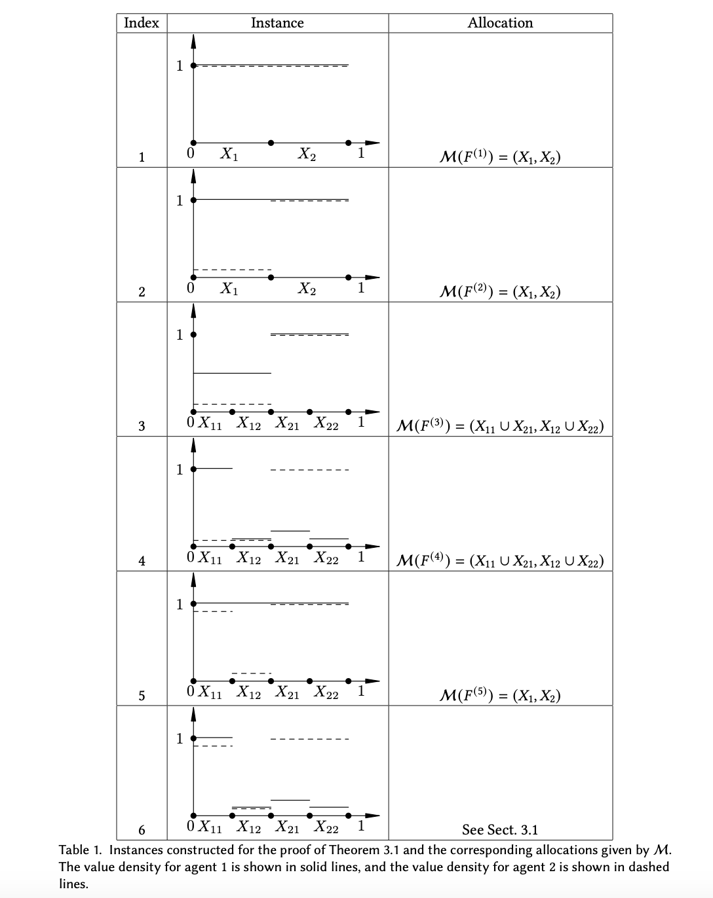
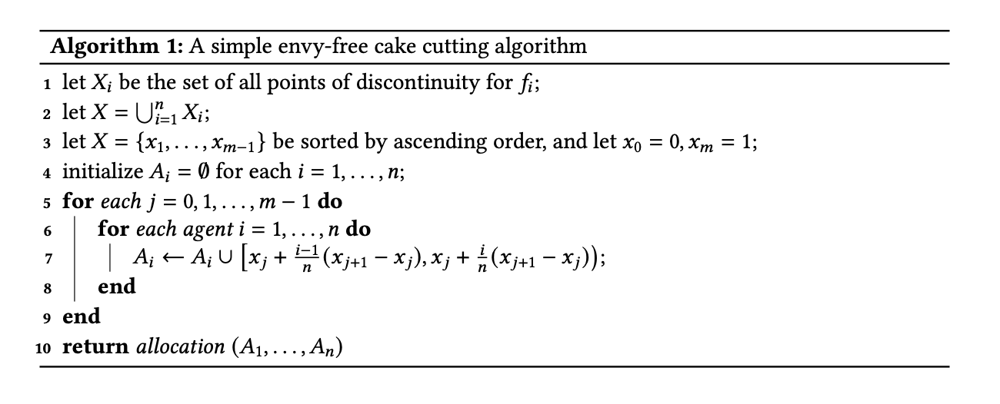
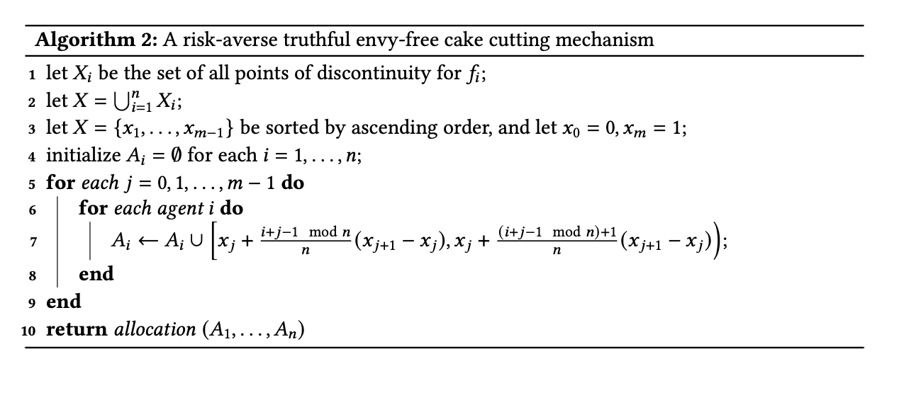
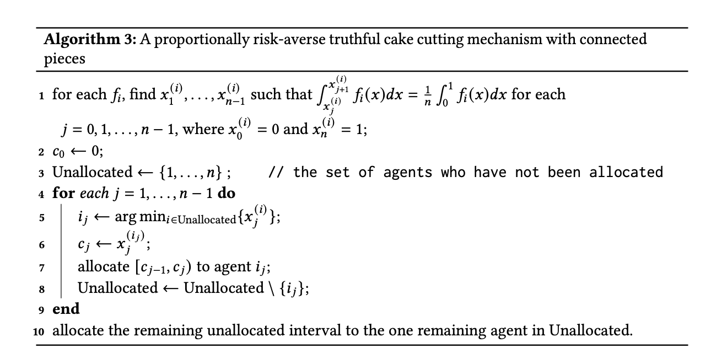

# 论文阅读 2023.11

> 本文首发于个人博客 \
> 发表日期：2023.11.24\
> 最后编辑于：{docsify-last-updated}

## On Existence of Truthful Fair Cake Cutting Mechanisms

> Tao, B. (2022, July 12). On Existence of Truthful Fair Cake Cutting Mechanisms. Proceedings of the 23rd ACM Conference on Economics and Computation. https://doi.org/10.1145/3490486.3538321

在传统的切蛋糕（cake-cutting，换言之某个异质可分的物体）问题中，往往以比例性或无嫉妒来衡量分配方法的公平与否。然而，参与人可能会谎报自己的估值函数来获得更多的分配。本文考虑从博弈论角度入手，如何设计一个机制来解决这个问题。

### 问题建模

考虑一个异质可分的物体（蛋糕），其被建模为区间 $[0, 1]$，要被分配给 $n$ 个智能体。每个智能体 $i$ 有一个值密度函数 $f_i:\ [0, 1] \rightarrow \mathbb{R}_{\geq0} $ 来描述他对蛋糕的偏好。如果 $[0, 1]$ 可以划分为有限多个区间，则价值密度函数 $f_i$ 是分段常数，并且 $f_i$ 在每个区间上都是常数。文章考虑代理的价值密度函数是分段常数。如果 $f_i(x)>0\forall x\in[0, 1]$，则智能体 $i$ 是饥饿（hungry）的。给定一个子集 $X\subseteq[0, 1]$，$i$ 在 $X$ 上的效用为 $v_i(X)=\int_{X}f_i(x)dx$。

分配 $(A_1,\cdots,A_n)$ 是 $[0,1]$ 互不相交子集的集合，其中 $A_i$ 是分配给智能体 $i$ 的子集。下面有对分配几个定义：

- **完整**：如果 $\bigcup^n_{i=1}A_i=[0,1]$，则分配是完整的。
- **成比例**：如果每个代理收到整个蛋糕的平均份额，则分配是成比例的。即 $\forall i:\quad v_i(A_i)\geq\frac{1}{n}v_i([0,1])$。
- **$\alpha$-成比例**：$\forall i:\quad v_i(A_i)\geq\frac{\alpha}{n}v_i([0,1])$。
- **无嫉妒**：如果每个代理人根据他自己的估值获得的部分的价值略高于任何其他代理人收到的任何部分的价值。即 $\forall i,j\quad v_i(A_i)\geq v_i(A_j)$。

无嫉妒分配总是成比例的。如果只有两个参与人，如果分配是完整的，那么分配是成比例的当且仅当它是无嫉妒的。

机制是函数 $\mathcal{M}$，它将 $n$ 个值密度函数 $F=(f_1,\cdots, f_n)$ 映射到分配 $(A_1,\cdots,A_n)$。给定 $\mathcal{M}(F)=(A_1,\cdots,A_n)$，记 $M_i(F)=A_i$ 。如果分配始终给出成比例的分配或无嫉妒分配，则机制是完整的。文章仅考虑确定性机制。

如果每个智能体的主导策略是报告他的真实价值函数密度，则机制 $\mathcal{M}$ 是真实的，即 $v_i(\mathcal{M}_i(f_1,\cdots,f_n))\geq v_i(\mathcal{M}_i(f_1,\cdots,f_{i-1},f'_i,f_{i+1},\cdots,f_n)),\forall i\in[n],\forall (f_1,\cdots,f_n),\forall f'_i$。

### 机制的存在性

文章首先证明，即使以下所有条件成立，也不存在真实的比例机制：

- 有两名代理人
- 每个智能体的价值密度函数是分段常数
- 每个智能体都处于饥饿状态：每个 $f_i$ 都满足 $f_i(x)>0\quad\forall x\in[0,1]$
- 机制不需要是完整的：机制可能会丢弃蛋糕的一部分。

更具体的，文章利用反证法证明了该结论。假设两个智能体存在一个真实的比例机制 $\mathcal{M}$，那么构造多个切蛋糕实例，分析 $\mathcal{M}$ 在这些实例上的输出，并证明无法保证所有这些实例的真实性和比例性。

文章构造了六个实例，对于前五个实例，文章表明 $\mathcal{M}$ 的输出是唯一的。基于前五个实例的输出，文章表明任何 $\mathcal{M}$ 对构造的第六个实例的分配输出将违反比例性或真实性。

1. $\forall x\in[0,1]$。显然这里 $|\mathcal{M}_1(F^{(1)})|=|\mathcal{M}_2(F^{(1)})|=\frac{1}{2}$。记$X_1=\mathcal{M}_1(F^{(1)}),X_2=\mathcal{M}_2(F^{(1)})$。形象的，可以考虑 $X_1=[0,0.5],X_2=(0.5,1]$
   - $F^{(1)}=(f^{(1)}_1,f^{(1)}_2)$
   - $f^{(1)}_1(x)=1$
   - $f^{(1)}_2(x)=1$
2. $\forall x\in[0,1]$。
   - $F^{(2)}=(f^{(2)}_1,f^{(2)}_2)$
   - $f^{(2)}_1(x)=1$
   - $f^{(2)}_2(x)=\begin{cases}\epsilon&x\in X_1\\1&x\in X_2\end{cases}$
3. $\forall x\in[0,1]$。记 $X_{11}=\mathcal{M}_1(F^{(3)})\bigcap X_1,X_{12}=\mathcal{M}_2(F^{(3)})\bigcap X_1,X_{21}=\mathcal{M}_1(F^{(3)})\bigcap X_2,X_{22}=\mathcal{M}_2(F^{(3)})\bigcap X_2$。形象地，$X_{11}=[0,0.25],X_{12}=(0.25,0.5],X_{21}=(0.5,0.75],X_{22}=(0.75,1]$。
   - $F^{(3)}=(f^{(3)}_1,f^{(3)}_2)$
   - $f^{(3)}_1(x)=\begin{cases}0.5&x\in X_1\\1&x\in X_2\end{cases}$
   - $f^{(3)}_2(x)=\begin{cases}\epsilon&x\in X_1\\1&x\in X_2\end{cases}$
4. $\forall x\in[0,1]$。
   - $F^{(4)}=(f^{(4)}_1,f^{(4)}_2)$
   - $f^{(4)}_1(x)=\begin{cases}1&x\in X_{11}\\\epsilon&x\in X_{12}\\2\epsilon&x\in X_{21}\\\epsilon&x\in X_{22}\end{cases}$
   - $f^{(4)}_2(x)=\begin{cases}\epsilon&x\in X_1\\1&x\in X_2\end{cases}$
5. $\forall x\in[0,1]$。
   - $F^{(5)}=(f^{(5)}_1,f^{(5)}_2)$
   - $f^{(5)}_1(x)=1$
   - $f^{(5)}_2(x)=\begin{cases}1-\epsilon&x\in X_{11}\\\epsilon&x\in X_{12}\\1&x\in X_2\end{cases}$
6. $\forall x\in[0,1]$。
   - $F^{(6)}=(f^{(6)}_1,f^{(6)}_2)$
   - $f^{(6)}_1(x)=\begin{cases}1&x\in X_{11}\\\epsilon&x\in X_{12}\\2\epsilon&x\in X_{21}\\\epsilon&x\in X_{22}\end{cases}$
   - $f^{(6)}_2(x)=\begin{cases}1-\epsilon&x\in X_{11}\\\epsilon&x\in X_{12}\\1&x\in X_2\end{cases}$

文章证明 在最后一个实例的情况下，不能找到一个能输出保证真实性与成比例的分配的机制。因此，考虑对真实性或比例性的进行要求上的放宽。文章首先证明，如果不放松真实性，那么近似比例机制（0.974031-近似）是不存在的。

### 较弱的真实性保证：规避风险的真实性

文章证明，如果机制 $\mathcal{M}$ 满足，所以参与人如实报告其价值密度函数的策略形成纳什均衡，则 $\mathcal{M}$ 是真实的。

文章首先定义了规避风险的真实性：

如果对于具有价值密度函数 $f_i$ 的每个代理人 $i$ 以及对于任何 $f'_i$，以下任一条件成立，那么机制 $\mathcal{M}$ 是风险规避真实的：

- 对任何 $f_1,\cdots,f_{i-1},f_{i+1},\cdots,f_n$，有 $v_i(\mathcal{M}_i(f_1,\cdots,f_{i-1},f_i,f_{i+1},\cdots,f_n))\geq v_i(\mathcal{M}_i(f_1,\cdots,f_{i-1},f'_i,f_{i+1},\cdots,f_n))$
- 存在某个 $f_1,\cdots,f_{i-1},f_{i+1},\cdots,f_n$，使得 $v_i(\mathcal{M}_i(f_1,\cdots,f_{i-1},f'_i,f_{i+1},\cdots,f_n))<v_i(\mathcal{M}_i(f_1,\cdots,f_{i-1},f_i,f_{i+1},\cdots,f_n))$

如果 $\mathcal{M}$ 是成比例的，并且对于具有价值密度函数 $f_i$ 的每个代理人 $i$ 以及对于任何 $f'_i$，以下任一条件成立，那么机制 $\mathcal{M}$ 是比例风险规避真实的：

- 对任何 $f_1,\cdots,f_{i-1},f_{i+1},\cdots,f_n$，有 $v_i(\mathcal{M}_i(f_1,\cdots,f_{i-1},f_i,f_{i+1},\cdots,f_n))\geq v_i(\mathcal{M}_i(f_1,\cdots,f_{i-1},f'_i,f_{i+1},\cdots,f_n))$
- 存在某个 $f_1,\cdots,f_{i-1},f_{i+1},\cdots,f_n$，使得 $v_i(\mathcal{M}_i(f_1,\cdots,f_{i-1},f'_i,f_{i+1},\cdots,f_n))<\frac{1}{n}v_i([0,1])$

### 风险规避真实的无嫉妒机制

首先考虑下面的算法：

该算法可以为具有分段常数值密度函数的参与人输出无嫉妒分配。该算法首先从所有参与人收集所有不连续点，从而将蛋糕划分为多个区间，其中每个参与人的价值密度函数在每个区间上都是均匀的。然后，该算法将每个区间统一分配给所有参与人。该算法的输出分配 $(A_1,\cdots,A_n)$ 满足 $v_i(A_j)=\frac{1}{n}v_i([0,1])$（这个分配的属性称为完美），这显然是无嫉妒。 然而，为了使算法具有确定性，我们需要指定参与人从左到右的顺序，以了解每个间隔的分配方式。当然，此算法不是风险规避真实的。

原因是，参与人可以“删除”连续点来合并两个区间 $[x_j,x_{j+1})$ 和 $[x_{j+1},x_{j+2})$。 如果他的价值在 $[x_j,x_{j+1})$（或 $[x_{j+1},x_{j+2})$）上更高，并且他知道该机制将在最左边分配一块 $[x_{j},x_{j+2})$。因此，每个区间上确定性的从左到右的顺序会损害真实性。

基于此，文章提出了下面的机制，其能够输出一个比例风险规避真实的、无嫉妒的分配。该机制与上面的机制相同，只是每个区间 $[x_j,x_{j+1})$ 上从左到右的顺序取决于索引 $j$。直观上，如果一个智能体尝试合并两个区间，他不知道他在 $[x_j,x_{j+1})$ 的 $\frac{1}{n}$ 的部分在哪里，因为他不知道其他智能体的值密度函数。这使得他最终可能会收到价值较低的部分。

### 具有关联块的比例风险规避真实的机制

机制 2 可能导致许多参与人收到零碎的区间，而在某些情况下参与人可能更享受到一块整区间。

考虑两个经典算法，其能给出具有连续区间的分配：

1. 动刀算法（Moving-knife）：令 $a_i=\frac{1}{n}v_i([0,1])$ 为代理 $i$ 的比例值。动刀算法为每个代理 $i$ 标记一个点 $x_i$，使得 $[0,x_i)$ 对代理 $i$ 恰好是值 $a_i$。然后，算法找到 $x_1,\cdots,x_n$ 中的最小值 $x_{i^*}$，并将 $[0,x_{i^*})$ 分配给代理人 $i^*$。接下来，对于蛋糕的剩余部分 $[x_{i^*}, 1]$，算法为 $n-1$ 个剩余代理的每个标记一个点 $x'_i$，使得 $[x_{i^*}, x'_i)$ 对于代理 $i$ 来说正好值 $a_i$。然后算法找到 $n-1$ 个 $x'_i$ 中最小值 $x_{i^t}$，并将 $[x_{i^*},x_{i^t})$ 分配给代理 $i^t$。不断重复直到第 $n-1$ 个智能体被分配了一个间隔，然后最后一个智能体获得了蛋糕的剩余部分。很容易验证每个前 $n-1$ 个智能体收到的间隔恰好等于他的比例值，而最后一个智能体可能收到超过他比例值。
2. Even-Paz 算法：是一个基于 divide-and-conquer的 算法。对每个参与人 $i$，算法找到某个点 $x_i$ 使得 $v_i([0,x_i])=\lfloor\frac{n}{2}\rfloor v_i([0,1])$。随后其找点 $x_1,\cdots,x_n$ 的中值 $x^*$。令 $L$ 是全部参与人 $i$ 使得 $x_i<x^*$ 的集合，$R$ 是全部参与人 $i$ 使得 $x_i\geq x^*$ 的集合。由于 $L$ 中每个参与人 $i$ 都相信 $v_i([0,x^*])\geq\lfloor\frac{n}{2}\rfloor v_i([0,1])$，且 $L$ 中有 $\lfloor\frac{n}{2}\rfloor$ 个参与人，因而 $[0,x^*]$ 存在某个分配，使得 $L$ 中每个参与人 $i$ 都收到至少 $\frac{1}{n}v_i([0,1])$。递归地解决这两部分即可。

当然，两个算法也都不是比例风险回避真实的。

因此，文章最后提出了下面的机制。特别是，如果需要全部分配，那么对于饥饿的参与人来说，它是比例风险规避真实的。

为了使得机制对非饥饿的参与人也是比例风险回避真实的，可以通过不全部分配来实现：只需要将第7行的分配改为将 $[x^{(i_j)}_{j-1},c_j)$ 分配给代理人 $i_j$。

## 参考资料

1. Tao, B. (2022, July 12). On Existence of Truthful Fair Cake Cutting Mechanisms. Proceedings of the 23rd ACM Conference on Economics and Computation. https://doi.org/10.1145/3490486.3538321
