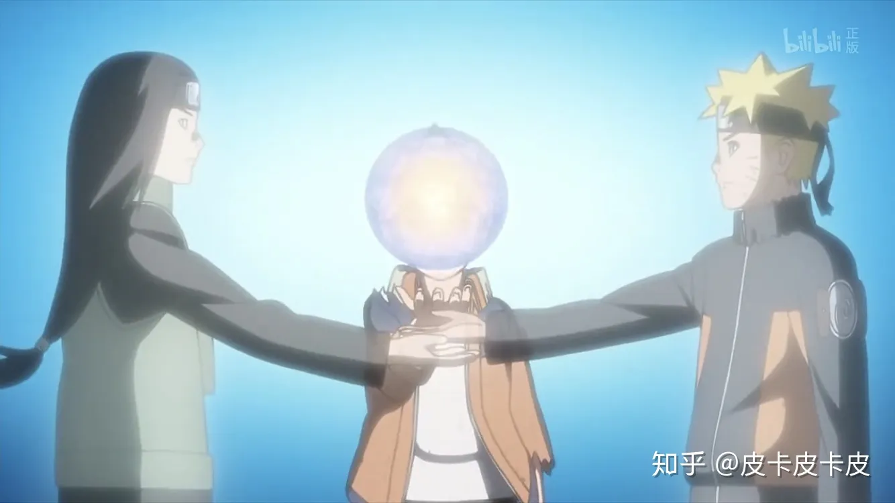

# 国人画师黄成希负责的《博人传：火影忍者新时代》第 65 话，在制作水平上带来了多大的提升？

> 本文首发于[知乎](https://www.zhihu.com/question/285984587/answer/447142428)\
> 发表日期：2018.07.21\
> 最后编辑于：{docsify-last-updated}

## 回答

水平不足，错误估计了剧场版的作画难度。重新回去看过后发现，松本宪生作画的那一段的确难度很大，这应当是体现在对空间位置分布的关系上。

---

在回答这个问题前特地又回去看了一下博人传剧场版的这一部分，越发佩服黄导了。

很明显的能感觉到，博人传65话的作画更加出色，整体分镜也是同样的出色。

在博人传剧场版中，更多采用大远景或中近景的方式，而且几乎没有出现鸣人佐助同时与大筒木打斗的画面，又或者是进行了较为生硬的切接，而这样就导致了部分地方镜头衔接有些生硬。

而博人传65集就完全不同了。全部的分镜都是为最大化展现人物动作力度和战斗场面来设计的，我甚至觉得他根本没有考虑作画难度。很容易看出的是其多用远景来展现，并不多用较生硬的切接，而更多运用镜头的移动来完整的展现战斗，甚至还出现了一段远景的三人作战部分，我想这部分作画难度挺高的。

<section class="multiImagesContainerSection">

</section>

当时在无法运用镜头移动来展现时，则通过采用视线顺接或动作顺接的方式来剪辑，非常自然。而在剧场版采用平行剪辑展现鸣人佐助各自动作的部分，在博人传中则采用分割画面来各自展现的方法，而分割用的变化的粗线也能暗暗调动起观众的情绪。

另一方面，也能通过夸张的作画和较极端的透视来展现动作力度，因此才能将战斗画的让观众看的很爽。

<section class="multiImagesContainerSection">

</section>

此外，虽是采用按图形相似原则来转换现实与回忆部分，但画面的整体结构几乎完全相同，也有了不错的效果。之后的几个推轨也做得都很棒。

而我个人认为全集最重要的部分，也就是鸣人和博人一起搓丸子的部分，动画版和剧场版的分镜和画面也完全不同。剧场版采用在将丸子搓大的这整个动作之间，插入类似插画一般的画面来展现鸣人的回忆。

<section class="multiImagesContainerSection">

</section>

而博人传则是运用叠化，将火影中重要人物置于博人两侧不断变化，能很好的展现鸣人的成长和鸣人与同伴之间深厚的羁绊，也能体现出丸子蕴含的情感之深，我个人更喜欢动画版的处理。

<section class="multiImagesContainerSection">

</section>

能感觉到博人传剧情上有几个小改动。

例如这一处，剧场版中是佐助被严重烧伤而而昏迷，博人生气的击打大筒木和他的凤凰的。

而博人传中则是两人一起击打大筒木的土人，我想这可能是为了让人物实力更加平衡处理的吧。此外，最后那段大筒木托梦似的部分则是常规操作。

最后说点私货吧。火影我是四年前开始补起来的，想必对其感情并没有一集集追过来的朋友深，这种超长时间连载的民工漫几乎无一例外的烂尾了，出了的续作刚开始也是难看的要命，不过看了这一集，反倒感触很深。将一切用青春来解释似乎没什么问题，但从我的角度，果然还是更认为这是动画/漫画独特的力量吧。

<section class="multiImagesContainerSection">

</section>
