# 如何评价 2018 年 1 月新番恶魔人 Crybaby？

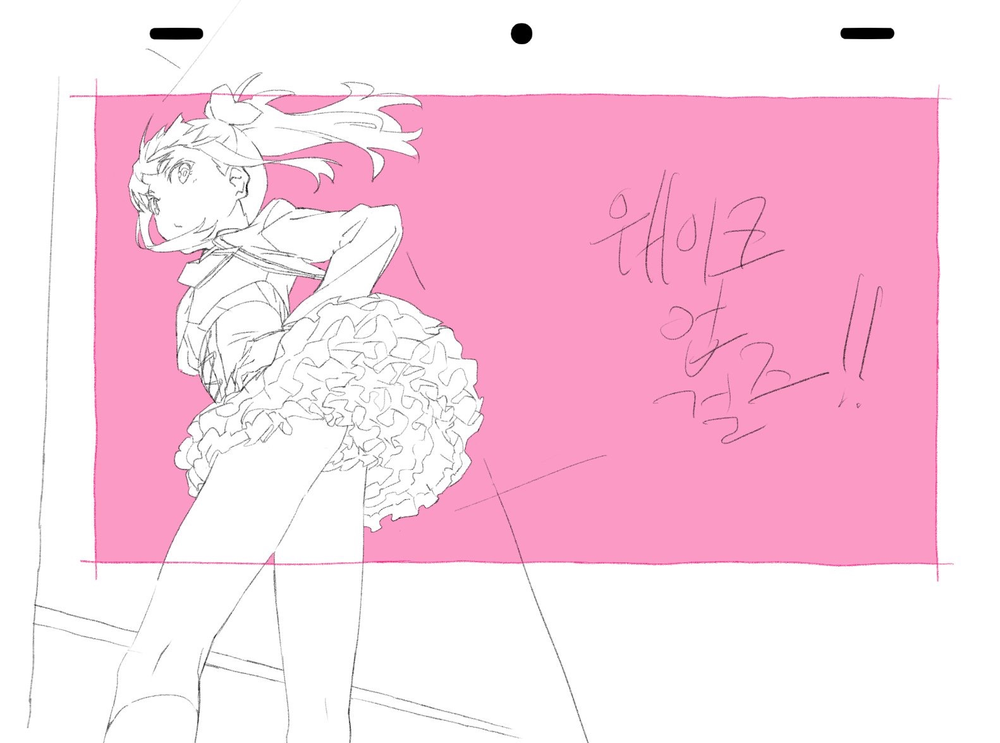

> 本文首发于[知乎](https://www.zhihu.com/question/265155353/answer/290683008)\
> 发表日期：2018.01.14\
> 最后编辑于：{docsify-last-updated}

*简单的总结一下就是：**精彩，酣畅淋漓**。*

*以下是具体分析：*

---

## 剧情

### 动画改编与原创情节

总的来说，「恶魔人 Crybaby」基本上全部还原了漫画原作的剧情，成为了第一个完整地改编了五卷「恶魔人」漫画的动画作品。自「恶魔人」漫画完结以来，针对于剧情的分析已经很多了，故而这里仅仅针对于动画与漫画不同的部分进行探讨。

#### 田径与美树

新作动画最大的改动无疑是田径这一背景的添加，也因此使一条全新的剧情线得以形成，即以美树为主角的暗线。同时，本作又借助两个角色进一步丰富了美树的形象，即参加田径又变成恶魔人的美子与原创的天才跑步小哥（不好意思，名字记不住）。虽然有着相似的遭遇，但在变为恶魔人以后，美子和天才小哥却走上了完全相反的路：美子追随明与恶魔对抗保护人类，而天才小哥则投降恶魔。美子这么做，直接原因就是美树在得知明是恶魔人后不顾社会呼声去相信他，支持他。以这两个角色，进一步丰富了美树的形象。可以说，不管怎么看，本作里的美树形象显然比漫画中更为饱满，也因此，在最后的美树之死情节变得十分成功。

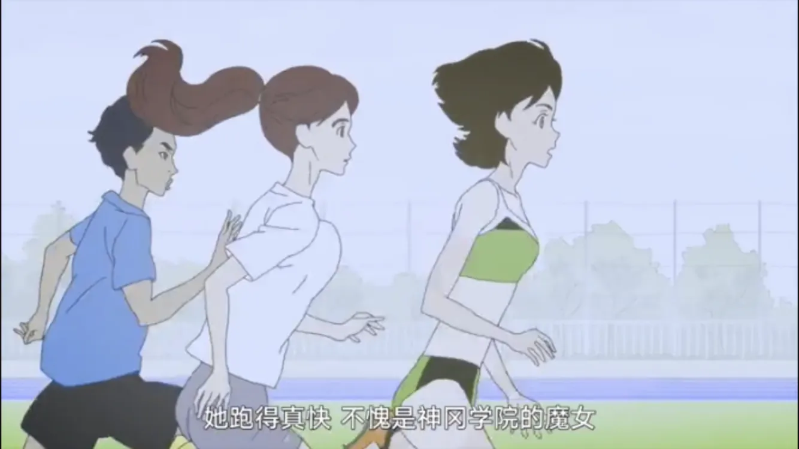

#### Freestyle 小哥与时代大背景

原作中昭和年间的不良少年在本作中被改为了平成的 freestyle 不良少年，与此同时，可以很明显的看出动画的更有具现代感，而这无异增加了观众对其的认同感，更好的宣扬了动画主题。freestyle 少年虽然出产时间不长，但无疑塑造的很好：前两集抢美树的包与典型的说唱风格打扮，以及带感的 rap，很好的塑造了他们表面的不良，而后来救美树与最后保护美树的剧情则展现了他们心中的人性。对比借除去恶魔之名肆意迫害人类的那些人，究竟谁才是真正的“不良”呢？

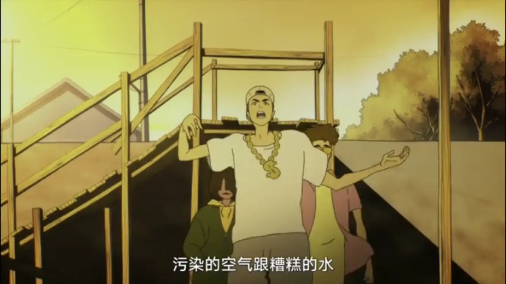

#### 人面龟与鞋子

原作中人面龟的剧情是一个小女孩，而在动画中改为了不动明的父母。相对而言，原作中小女孩略显突兀，而动画改为不动明父母，不仅避免了这一问题，还解决了原作中没有的不动明的父母。同时，配以不动明父母寄鞋子的情节以及最后对不动明的鞋子的特写，进一步升华了不动明与父母之间的感情，借不动明不得不亲手杀死父母这一情节，埋下了不动明憎恨恶魔想消灭恶魔的想法的种子。

#### 妖鸟死丽濡与不动明

动画中死丽濡形象全毁，究其原因，还是处于汤浅政明的恶趣味（参考「海马」）。同时槐梦为了在死丽濡临死之前实现她击败不动明的愿望而牺牲自己与死丽濡合体的情节，使得不动明开始产生“恶魔有爱吗”的疑问，早早的便暗示了动画的一个主题，在看到最后世界毁灭神明降临前飞鸟与不动明的情节时，进一步突出了这一主题，也由此引起观众的思索。

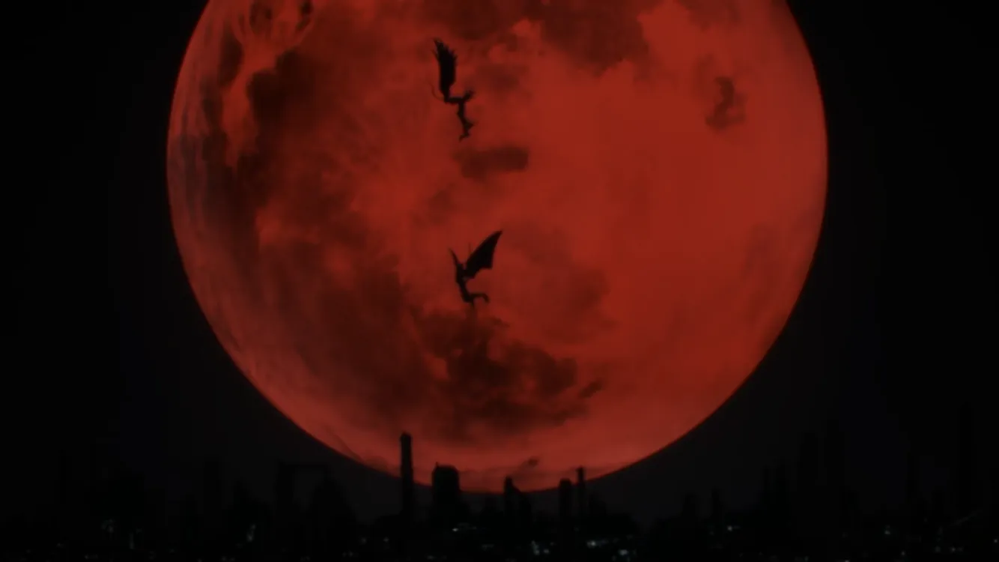

#### 牧村夫妇之死与太郎恶魔化

原作中牧村夫妇因保护不动明而死，而在动画中则是因太郎恶魔化而死。一方面，增加了原作中所没有的普通家庭对待恶魔化家人的情节，另一方面，安排不动明亲眼看见牧村一家被人类所杀，再一次冲击他的内心，也同时震撼着观众，并抛出了那个老话题：“人类为什么要互相残杀呢？”

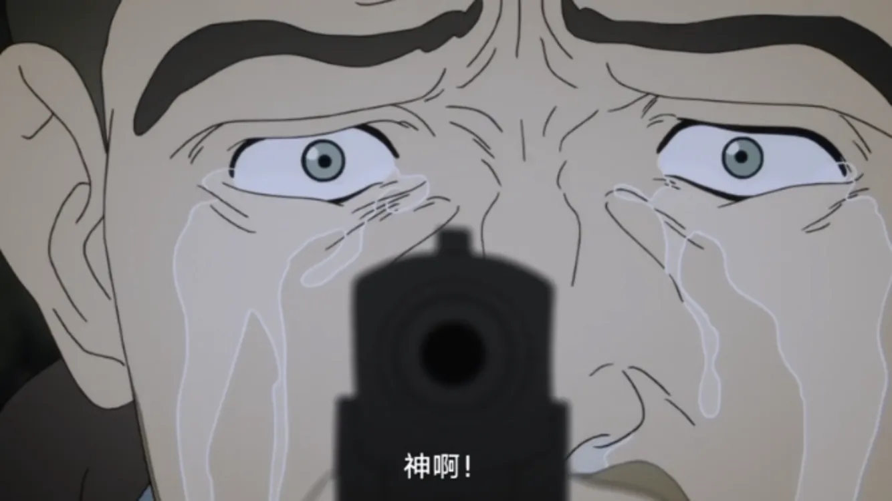

#### 美子与美树

动画中给了美子一段自我独白：美子对美树的追赶。美子曾一度错以为自己怨恨美树，也因此得以成为恶魔人，而最终她在与美树的交谈中完成了一次转变，与美树变成了互相帮助互相竞争的对手，也因此她的形象一下子变得饱满了，也因此最终她为保护美树牺牲与她死前质问人类为何要互相残杀的情节才变得如此震撼。

可惜美子对美树的追赶在前期铺垫过长导致她在前期显得多余，而最后美子与美树的展开有过少显得前期铺垫有些鸡肋了。

#### 结局

原作中结局时飞鸟对不动明的坦白在动画中简化为了飞鸟自我认知后的回忆也因此原作中的这一最终主题在动画中显得不那么重要。在动画中增加了人类与恶魔，飞鸟与不动的最终大战的篇幅，又在结尾处增加了飞鸟对不动的独白。可见，动画更露骨的展现了原作中较为隐晦的飞鸟对不动的爱，也因此将动画的最终主题转化为了“恶魔是否有爱”的思考。这里的处理可能是让动画更易理解，但思想深度也因此不及原作了。

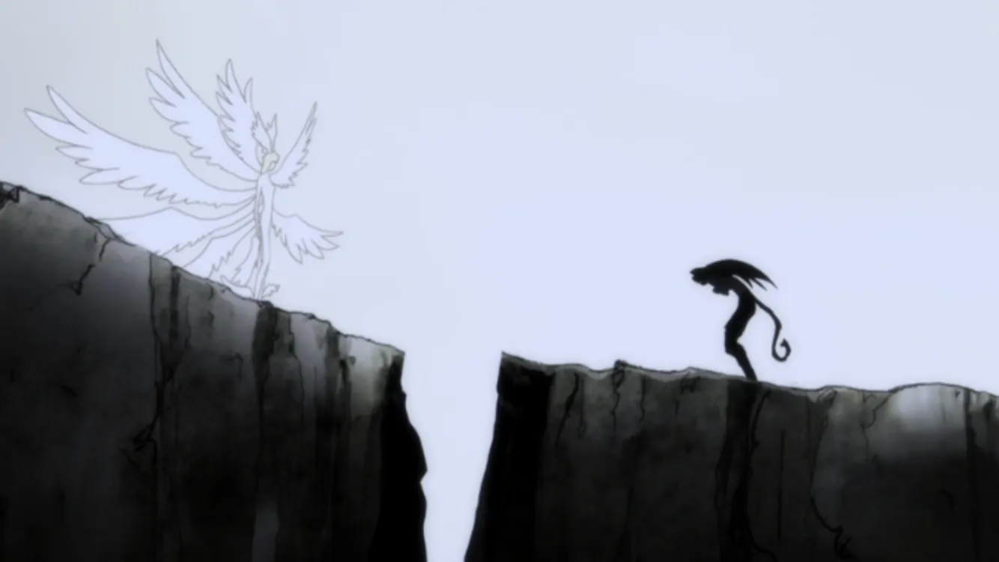

### 节奏

漫画全五卷，因而许多背景均由细节处展现，动画共十集，改编漫画应该不会过于仓促，但最终呈现出来的节奏却显得有些过快。

在第一集中，动画铺设背景，交代世界观。在飞鸟告诉不动明恶魔的存在之前，唯一对恶魔的铺垫是田径中速度突然提升的运动员的新闻，以社团成员口中的交谈给出，随后便直接出现了飞鸟口胡恶魔存在以及其发展的情节。由于前面铺垫过少，这里的突然交代便显得有些突兀。第二集刻画不动明身体力量与性欲的变化确实是必要的，但占用一集未免有些过长，而随后又安排了记者拍到不动明变身的情节，处理此事又用了一集。虽然其中有死丽濡和飞鸟对不动明感情的铺垫，但考虑到动画篇幅，前面部分所占比重有些大了。

随后的第四第五集，一集人面龟一集死丽濡的速度未免有些过快，所导致的后果便是人面龟最后不动明与父母关系的展开有些欠缺，以及死丽濡引发的思考的略显突兀。第六至九集开始恶魔的存在被公布后的剧情，以及最后突如其来的转折倒都与原作蛮符合。

总的来说，动画后期越来越快的剧情也在一定程度上增强了观众的观影体验。

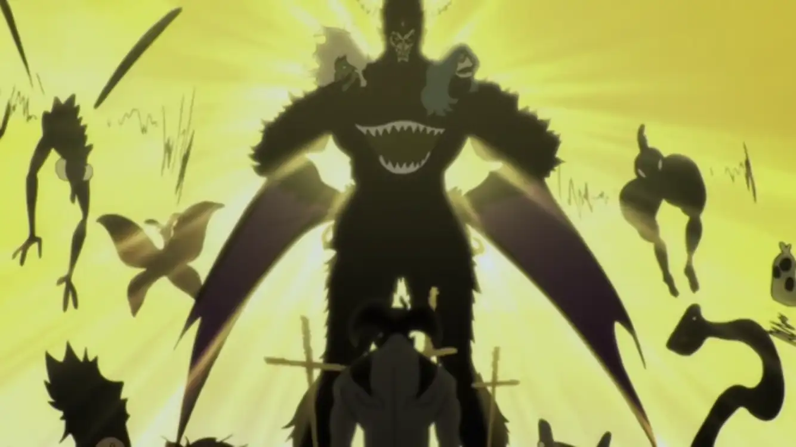

### 人物的塑造

塑造人物，最为重要的一点就是要塑造多维角色，以及让角色做他可能会做的事，在这一点上动画对一些角色的塑造是成功的。

不动明从头哭到尾，一贯的对美树的保护，对恶魔与人的思考，坚守身为恶魔人唯一的原则。

这些角色都塑造的十分成功。其他的诸如无条件爱不动明的父母以及和谐的牧村一家这些角色，在其他作品中也经常出现类似的人物，但往往塑造的不够饱满，而在本作中通过单独对其增加剧情使他们的形象更为饱满了。

### 彩蛋

## 画面

汤浅政明一向以他独特的画风著称。其最大的特点就是扭曲的的线条，夸张的色彩以及几乎没有的阴影，这也造成了他美漫一般的画风。他作画以想象力为最主要的因素，一切都要为想象力让路。而恶魔人，作为上世纪 70 年代的伟大作品，超前于社会的地方不仅仅是意识形态，更基础的是它超前的大尺度的黄暴血腥场面，而也正是这才能直击人的内心。我曾担心汤浅政明的画风会削弱这一震撼力，而事实证明我多虑了。在描述角色间关系，人物内心冲突时，汤浅政明运用了他一贯的画风，以想象力为最主要的部分，并运用夸张和扭曲的线条与颜色，构成极简的意象，以此来加强人物内心冲突的冲击力，而在展现人物外冲突与社会冲突时，汤浅政明丝毫不考虑尺度，甚至比原作使用更多的更黄暴的画面，又多将其夸大化，以此冲击着观众的灵魂深处。可以说，他完美的结合了他独特的画风与恶魔人超前的图像，在动画中展现了表现力更强的画面。

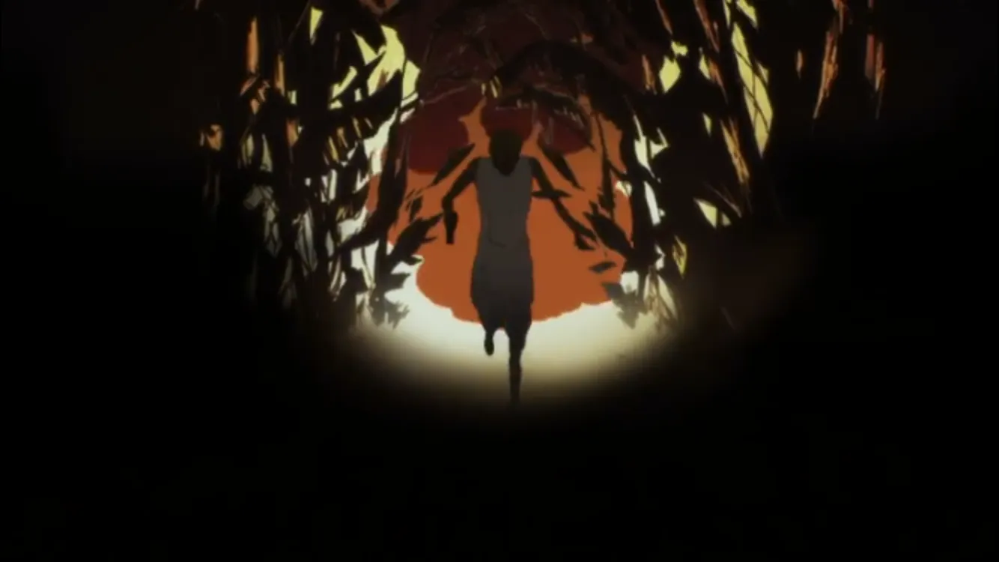

## 音乐

动画音乐中最具特色也最为惊艳的就是说唱小哥带来的 freestyle。基本上说唱小哥带来的说唱都是十分映衬主题的。它不仅仅十分带感，还推动了剧情的发展。例如第七集开头的说唱，当时恶魔的存在刚刚向世界揭露，也因此世界陷入恐慌。在说唱小哥的 freestyle 唱到“害怕的人们拿起武器杀人，不害怕的人手无寸铁，反遭其害”时，正配上恶魔搜查队欺负百姓的图像，不仅交代了当时的背景，更是突显出恶魔搜查队的毫无人性以及真正无辜的百姓的可怜。

<section class="multi-images-container-section">

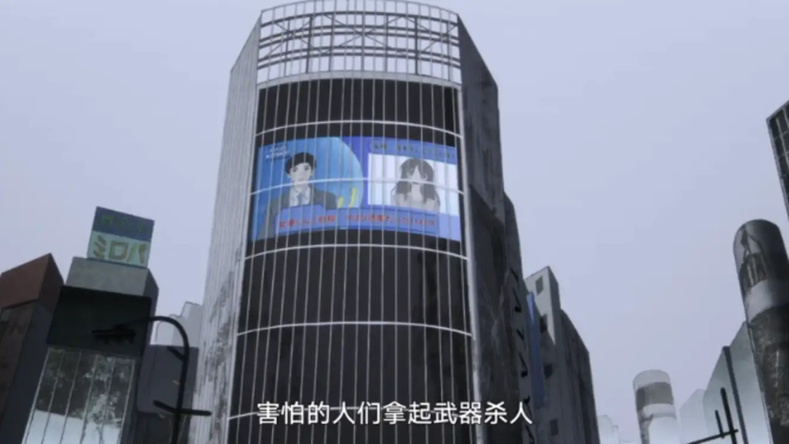
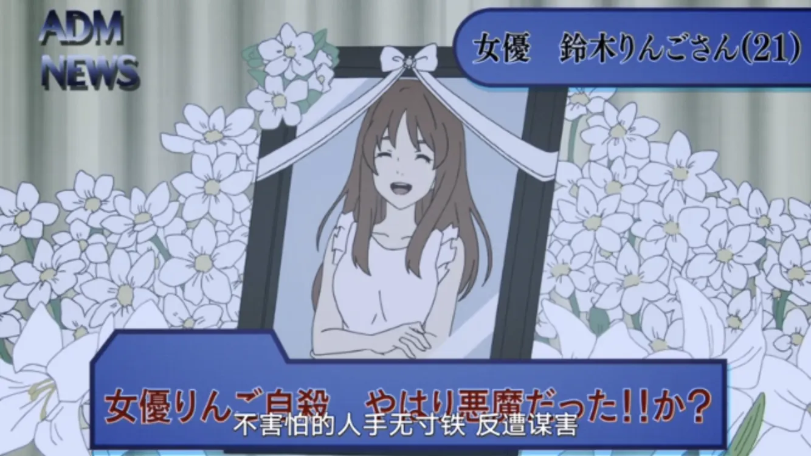
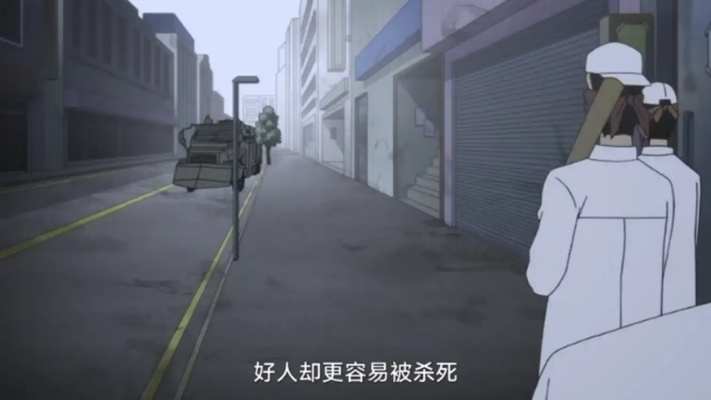

</section>

bgm 最大的特色就是与剧情完全相反的感情基调。例如第六集中天才小哥变成恶魔后在体育场吃人时，镜头在某一个角色身上时配上了轻松欢快的 bgm，而背景却是杀人的恶魔。轻松的音乐配上如此血腥的画面，倒也多了一份讽刺。

## 意识形态

漫画中最为重要的情节应当是结局时飞鸟对不动明说的一番话，说恶魔对人的所作所为正和神明对恶魔的所作所为一模一样，在一瞬间就升华了主题，将故事的思想提到了一个全新的高度，由一个反抗敌人的故事升华到了人性的阴暗面。在表现人性阴暗面上同样重要的一个情节还有恶魔搜查队对普通人类的所作所为，矛头直指那些借口他事去欺凌百姓之人。在动画中，这两个部分都有，同时动画又不忘借天才小哥与美子对比，以讽刺天才小哥这种趋炎附势奉承强者毫无主见的角色。当然，这一点并没有先前所说的主题重要。

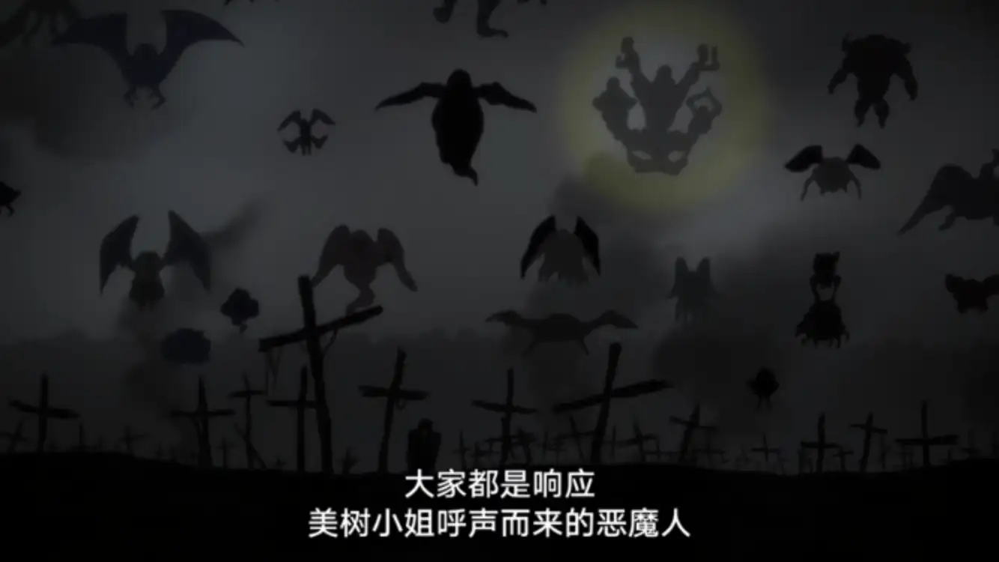

动画似乎还想探讨一个问题，以动画原话来说就是“恶魔有爱吗”，我想这大概就像x战警系列中的变种人一样，以他们象征现实生活中患病而必须远离人群的人，在大多数人眼中，他们并不是人，而他们却是。另外一点便是何谓人，何谓人性，人为什么要互相残杀这类在当今看来已是陈词滥调的哲学问题。艺术并不能给出这类问题的答案，仅能引起人们的思考，而这部动画凭借其出色的剧情，又不惜使用大量R18画面，就是为了直白的揭示出人最原始最阴暗的一面（动画中体现出的有愤怒，食欲，性欲，想到七宗罪了吗？），以此狠狠地给观众内心来一拳，打醒观众以引起他们对这类问题的思考，而这部动画完美的做到了这一点。

此外，动画开头的撒旦降与地球，地球形成，与动画结局的地球重新形成，虽然是两个不同的时代，不同的世界，却如此的相似，似乎预示着一种轮回。

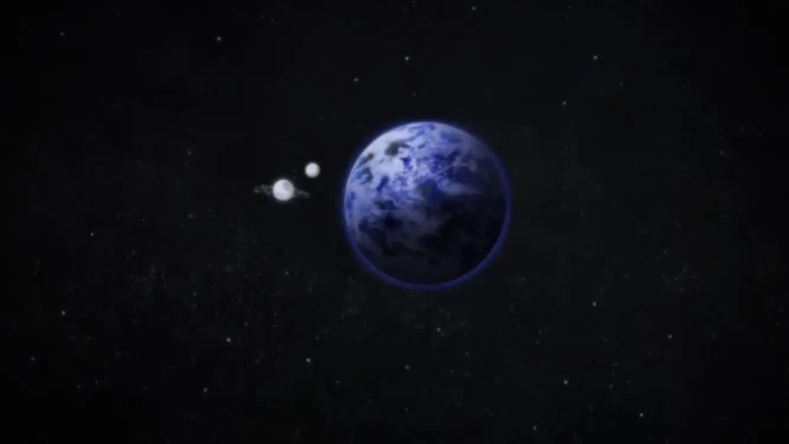

注意到「恶魔人」与「新世纪福音战士」的一些相似之处：中世纪基督教会神学背景，大量基督教元素，或多或少的科幻元素，世界毁灭人类灭亡的结局，揭示人性阴暗面的主题⋯⋯这倒不失为一个好的讨论话题。

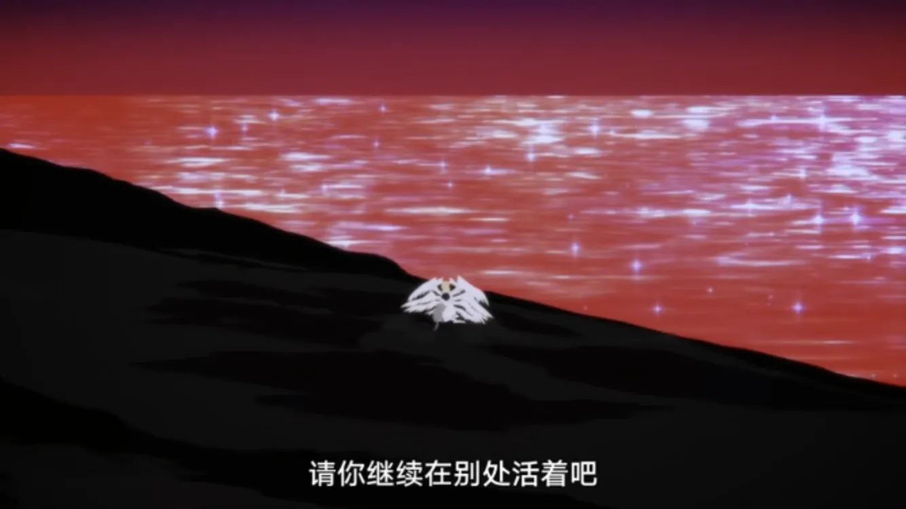

## 影响

「恶魔人crybaby」截止至 2018.1.7 豆瓣评分 8.9，IMDb 评分 8.1，bangumi 评分 8.0，可见本作的出色。由于其尺度原因，可能国内外仅会在一定程度的小圈子里被捧为佳作，由此看来 Netflix 可能还会出续作。考虑到结局为新世界，接下来可能会改编较受欢迎的「女恶魔人」。

## 一些其他

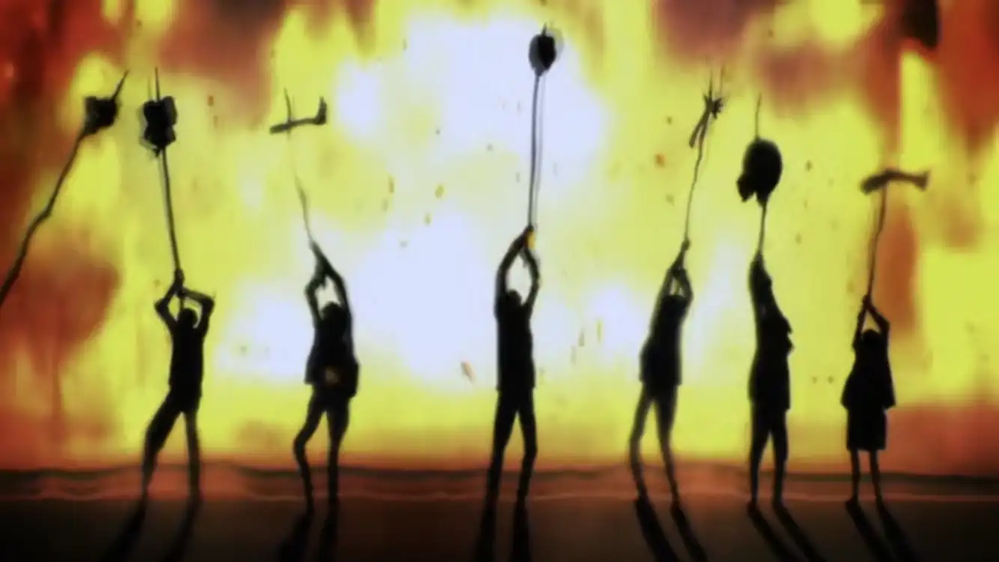

美树死的好惨啊，动画里停留在对美树肢解的镜头时间还特别长。

---

**何为神作？大概这就是吧**
