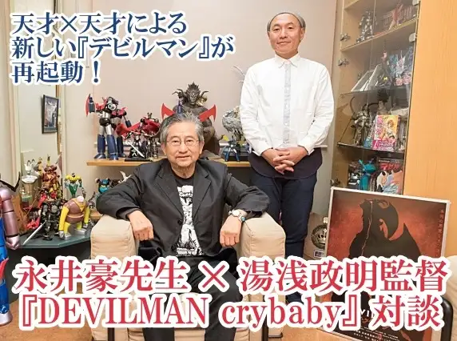
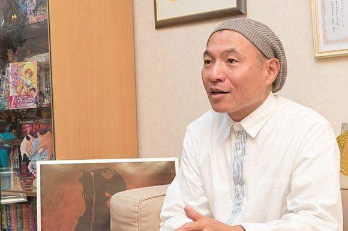
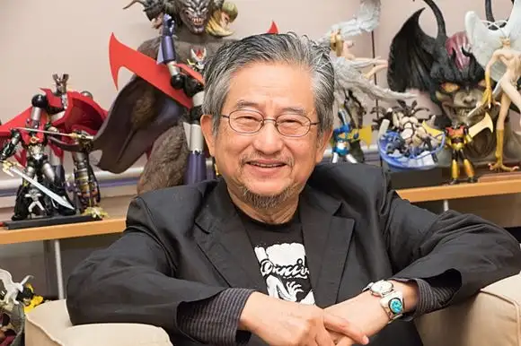

# 永井豪 & 汤浅政明谈「恶魔人 Crybaby」

> 本文首发于[知乎](https://zhuanlan.zhihu.com/p/32706628)\
> 发表日期：2018.01.23\
> 最后编辑于：{docsify-last-updated}

被誉为动漫史上不朽名作的《恶魔人》，已经在今年 1 月播出了新作动画《恶魔人 crybaby》。而这部作品是由汤浅政明担任导演，因此引发了很多的话题。近日，有日本媒体专访了原作者永井豪，以及汤浅政明导演，来听这两位大佬是怎么说吧！（有节选。）

## 采访正文

**Q：**关于这次的新作动画，我第一印象就是跟原作的画风有比较大差异呢。

**汤浅：**从我们的目标来说，就是希望稍微大一点年龄的人也可以观看作品，因此采用了如今的画风。

**永井：**虽然说在角色的细节以及设定方面有了很多变动，不过还是一直将《恶魔人》的精髓给把握住了。通过进行现代风格的调整，即便是现在的年轻一代人，应该也会觉得这是“发生在我们这个时代”的故事。这一点让我觉得很开心呢。

**汤浅：**例如说，原本的街头不良少年变成了现在比较嘻哈风的感觉。这不光是要让角色显得更有如今的风格，也是因为我觉得如果要让原作当中的角色更好地去做自己想要的事情，那么还是需要这种嘻哈风格才行的。不能仅仅是不良，而是他们也有自己的节奏和信息。而且我也让这些嘻哈角色以歌词的方式来说一些台词呢。

**Q：**在主题曲里面也邀请到了电气 GROOVE 负责演唱，可以说到处都能够感受到俱乐部音乐跟嘻哈的效果呢。

**汤浅：**我的一个目的就是要以明跟了的旋律开始故事，因此想要给人一种比较轻快的感觉。然后负责音乐的牛尾先生在我没提出要求的情况下，就把东西给做好了哦（笑）。于是我就觉得这样的音乐是可以使用的，并且通过音乐，也扩大了演出的范畴。这次跟 TV 版不同，由于是网络播出形式，因此根据集数的不同，也可以对长度进行一些调整，于是乎在片尾曲开始之前的时间里，我们可以比较自由地创作，这一点很幸福。

**Q：**将召唤恶魔的集会，跟 DJ 文化融合起来，这让人印象深刻。

**汤浅：**其实 45 年前的原作当中，集会就已经跟当时的先锋派艺术结合在一起了。而如今这么做，也是为了让大家更好去理解“召唤恶魔”的行为呢。

**Q：**另外这次新作还有一个特征，就是美树她们成为了田径运动员呢。这是包含了怎样的意图呢？

**汤浅：**首先这么一来，可以用画面清晰地体现出恶魔跟人类之间力量的差异。不动明跟其他人原本并不是什么表现突出的选手，但是恶魔化之后就可以跑出极端的速度来。无论人类再怎么努力，都没办法跟恶魔相比。这就是二者的力量差异呢。说起来，如果只是比较跑步的话，人类就连猫狗都不如啊（笑）。

另外还有一个共通的主题就是“为什么想要奔跑”。这也是美树她们这些人类的立场。飞鸟了在最后也意识到了，仅仅是合理的、“力量的世界”也无法割裂开某些重要的东西。为了体现这一点，我们选择了田径呢。尤其是其中的接力赛，象征着在结尾的时候，无论谁死了，都会将这种意志给传递下去呢。

**Q：**恶魔化之后，明的奔跑方式等，即便是在动画表现手法当中也显得特别有冲击力，那么您是否特别在意了这一点呢？

**汤浅：**我刻意强调出来的是恶魔的野性。即便是不动明的姿态，也能够感受到性的渴望、想要吞噬某种事物的渴望等。在欲望方面进行了大胆描写。而在作为恶魔人打倒敌人的时候，我强调的也不是拳击或者脚踢，而是“撕裂”的动作，从而表现出残暴的感觉。

**Q：**说起来，关于这部作品，永井老师是否提出过什么要求呢？

**永井：**没有，我跟他们说：你们无论弄成什么风格都无所谓（笑）。

**汤浅：**这句话表明了对我们的信赖，而我也不光看了《恶魔人》，还将永井先生其他作品的原作都看了一遍，并且会在创作时想象“如果是现在永井先生创作的话，那么会不会打算这么做”。

**Q：**在大胆进行变化的同时，导演您是否又考虑“这里是绝对不能改变”的呢？

**汤浅：**关于美树酱的一些剧情，以及结尾的剧情自不用说，真因跟死丽濡的战斗虽然更换了场所跟环境，但所做的事情并没有变化呢。为了让这样的场面看起来更棒，我们也对周围的情况进行了一些调整。

**Q：**这次的动画一直做到了最终战争的地方，因此也引发了很多话题。

**永井：**听到这个消息时，我觉得恐怕会很有难度吧。之前也有人因此遭遇到了挫折（笑）。

**Q：**在漫画连载的时候，您是在怎样的情况下刻画这段高潮戏的呢？

**永井：**哎呀，纯粹就是“气势”了。

**所有人：**（笑）

**永井：**我也是在一种不知所措的情况下进行绘制，结果就变成了那样。

**Q：**冲击性的结局也包含着一种跃动的感觉呢。那么现在重新将其制作成动画，又有什么难度呢？

**汤浅：**要直接从正面展现出作品世界发生的事情，这是挺有难度的。因此，我就营造出了一种天地异变的效果，仿佛是火山喷发了，到处都是灰尘，让人摸不清情况的环境。虽然能看到的只有这些，但其实也发生了其他的事情。这与其说是让大家看，不如说是进行想象呢。

**永井：**从我个人来说，能够看到《恶魔人》总算被以动画的形式做到最后，还是很开心的呢。我已经看完了动画，感觉真的做得很棒，非常感激。

**Q：**那么在最后，请两位对接下来要看动画的粉丝们，说几句话吧。

**永井：**刚开始我也说了，这次是一部能够让年轻人都乐在其中的作品，所以说也希望可以有更多的人去关注呢。另外虽然已经有人阅读过原作，但如果其他人也以这次动画为契机，接触到了《恶魔人》的世界，那么我也会很高兴的。

**汤浅：**从我的角度来说，制作这个作品会觉得紧张，也是一份难度很高的工作（笑）。而关于色彩、音乐以及声音等等，都是通过全体制作人员和声优们的努力，带来一种非常棒的结果。而不管怎么说，毕竟是改编自永井豪老师的《恶魔人》原作，因此肯定会有很多人看的。那么大家会有怎样的反响呢？我将继续期待。

**Q：**感谢两位接受我们的采访。

---

本文转载自贴吧。（已授权，有改动。）
