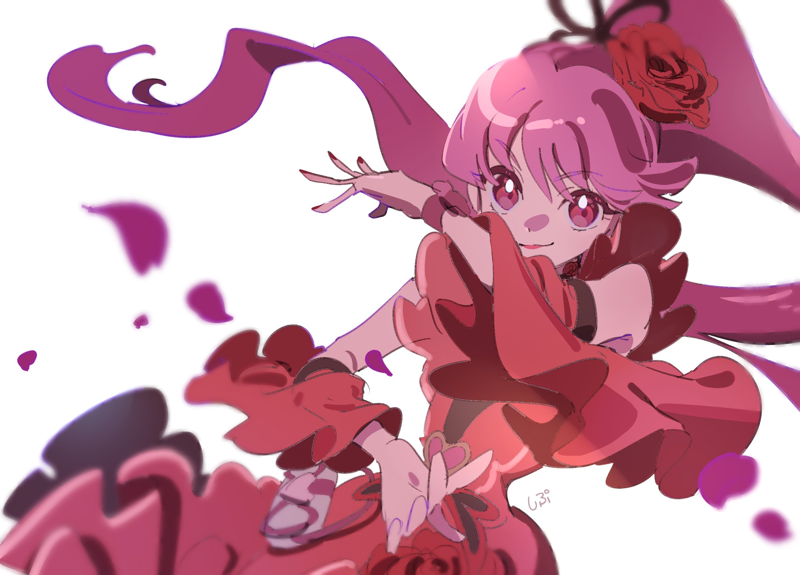
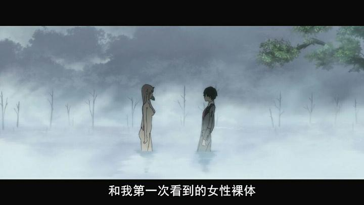
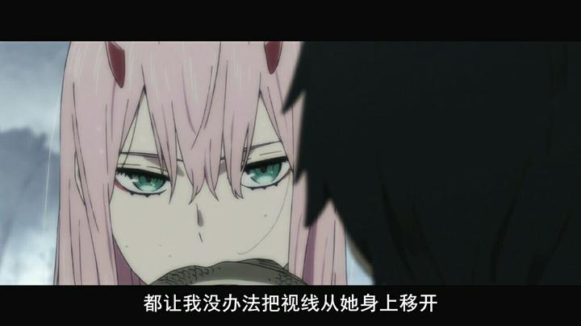
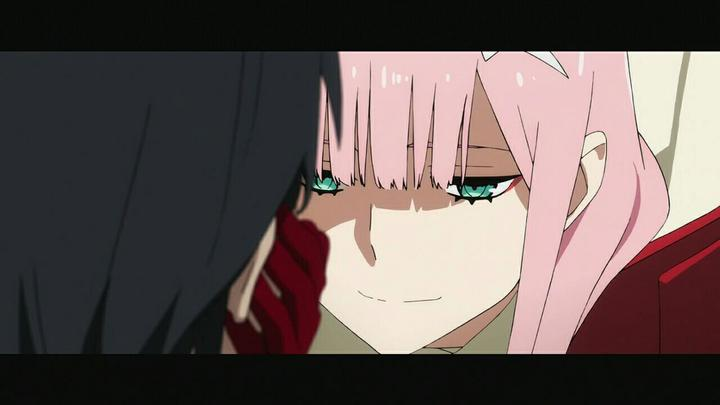

# 如何理解 TV 动画《Darling in the franxx》中画面比例的切换手法？

> 本文首发于[知乎](https://www.zhihu.com/question/266952828/answer/317969940)\
> 发表日期：2018.02.12\
> 最后编辑于：{docsify-last-updated}

## 题目描述

> 在第一话和第四话中均出现了画面比例切换，即 16:9→21:9。\
> \
> \
> \
> 目前来看，切换比例是为了缩小视野使观众集中在二人戏上，应该是电影常用的表现手法。\
> 以上为个人看法和猜测，有误解的地方请指出。\
> 这种手法的好处在哪，是否又在哪些动画同样使用过呢？

## 回答

在电影中，题主提到的画面比例被称为画面纵横比，题主所说的 16:9 和 21:9 通常被简称为 1.78:1 和 2.35:1。

对于引导观众注意力到 02 和广的二人戏上，纵横比切换在这方面的作用其实不大。引导观众注意力的方法通常是通过画面构图来展现，注意镜头中 02 与广都处于镜头正中，这种将被拍摄物置于画面正中的方法是最常用的引导观众注意力的方法。

那么画面纵横比的切换有什么作用呢？在笔者看来，主要的作用是意境的塑造和情感的烘托。经常看电影的人大概能发现，欧洲独立制片的艺术电影通常使用 65 毫米底片，拍摄出的画面便是 2.35:1 的纵横比；而多数电影（尤其是爆米花大片）仍然使用的是 1.78:1 的纵横比。很容易感受到，2.35:1 的画面比 1.78:1 的画面更具“电影感”，满满的就是一种文艺气息。观众不自觉的情感代入，会让这一段采用 2.35:1 画面的片段看上去更具一种所谓的“文艺感”，而这更能衬出该段落的情感抒发。配以优美的音乐，华丽的台词的同时，便更能让观众感受到 02 与广之间的情感流露。

那么为什么这个 2.35:1 的纵横比能给人一种“文艺”的感觉呢？笔者觉得大概有这么几个理由：

- 其一，人眼的在看大自然里的视角比例是 2.4:1，所以人看 2.35:1 的视频很容易产生真实感，16：9 确实有更大显示面积，但是看不出真实感。另一方面，电影院放映室银幕也通常是 2.35:1 的纵横比，因而观众更易从这样的纵横比中感受到“电影感”。
- 其二，2.35:1 的纵横比画面会给屏幕留出上下的黑色边框，能或多或少的引起观众的思索。在一些情况下，这些黑边甚至还可能隐藏重要信息。这样不自觉的思索会伴随着整体情感基调，从而让观众感受到动画中人物的心境，增加代入感。
