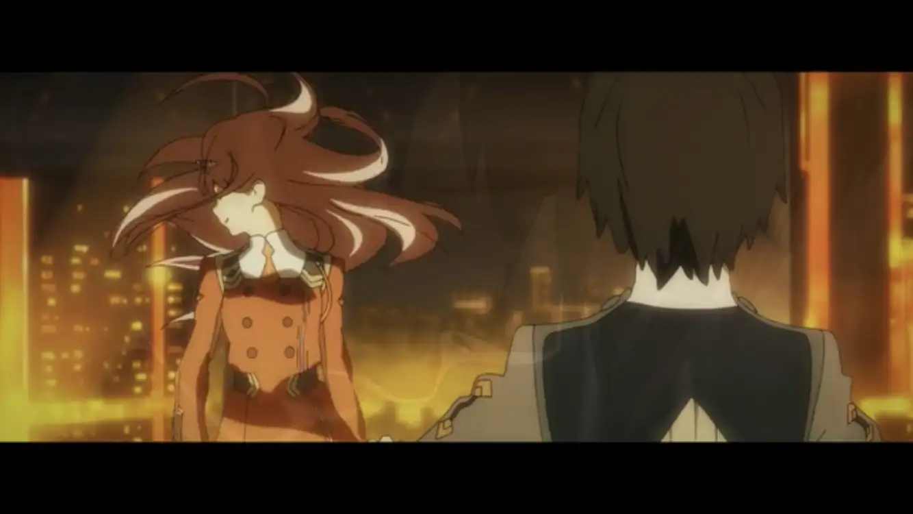
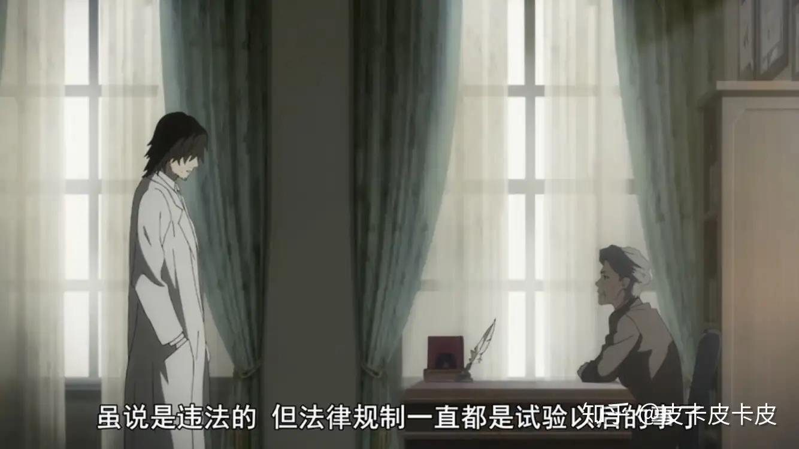

# 如何评价动画 《DARLING in the FRANXX》第X集？

> 本文首发于个人博客\
> 发表日期：2024.04.21\
> 最后编辑于：{docsify-last-updated}

## 如何评价动画 《DARLING in the FRANXX》第十四集？

> 本文首发于[知乎](https://www.zhihu.com/question/272379302/answer/367095277)\
> 发表日期：2018.04.15

照例说说这集制作方面的亮点吧

---

开篇便是2：35：1的纵横比画面，同时画面逐渐闭合。画面以纵向移镜的方式，拍摄02站立在槲居树前的画面。画面中02居于画面正中央，头及画面约三分之一处，面前则是巨大的树。整体构图与颜色的选择都与第六集中广濒死的那一幕镜头一样，旨在将广与02进一步联系起来，推动剧情发展。

随后转入的是franxx的场景，纯白的画面亮度却较低，帮助营造了这集比较压抑的氛围。

随后莓将02拉出驾驶舱后，运用的是一个02的主观镜头。同样使用2.35：1的纵横比。同时，画面亮度仍然偏暗，画面正中央是倒下的广，与第六集中的广倒下的镜头构图十分相似。同时，将莓的说话声与其他声音响度调低，来将观众的注意力放在02的话语之上，来展现出02的内心世界。

随后是对02脸部特写的反打镜头。

仍然是2.35：1的纵横比。三个franxx围在鹤望兰边，而鹤望兰倒在正中。这样的调度也使得氛围更加压抑。

转入对破碎的镜子的特写，并以此结束第一幕。

---

第二幕转入室内。同样降低莓话语的响度，来引导观众加深对02的心理的理解。

莓的这一镜头才用了镜头遮蔽。黑色的边框压缩着莓的画面，体现出了02对莓的忽视。

这里使用了夸张的5.2：1的纵横比，拍摄的是近景，却将02的嘴部放在画面上，大概是为了体现出02压抑的内心。

---

在这一集中，对人物（尤其是02）嘴部、眼睛、手的特写明显多了，这也是展现出人物情感张力的一个方法。

例如这一处，对02咬紧牙的嘴进行特写，将观众的注意力限定在了02咬紧的牙上，很容易让观众感受到02的心理。

---

这一集中，所有回忆部分均使用了2.35：1的纵横比以作区分。此外，有趣的一点是，在前半部分中，所有回忆部分颜色都偏蓝，似乎模拟了日光夜景的拍摄效果，同时画面切换的也越来越快。

<section class="multiImagesContainerSection">

</section>

这样处理的效果，颜色上蓝色很能给人一种压抑感，同时切换速度逐渐增加的多个画面，得以使观众感跟随广对对他所经历的事进行一个回忆，在记起前去剧情的同时，给观众失落的感觉。

而在最后，光进行回忆时，画面转回正常配色，切换的速度也变慢了，甚至还采用了叠化的剪辑方式，很容易让观众感受到广正逐渐回心转意，在回忆达到高潮出时，切回现在的镜头，广猛的一个转身要去追02。从怒斥02“怪物”到追回02以及之后的流泪，这样大幅度的情感变化基本通过这样一个回忆来完成。

相似的，莓的回忆部分同样是这样的处理方式，奠定了莓表白的气氛。甚至可以说，这集很多处情感的自然转变，都是借由记忆的不同表现手法得以实现的。

---

<section class="multiImagesContainerSection">

</section>

这一集构图上任务基本处于画面正中，多处画面都采用正面或背面打光的方式，大量增添了画面中的阴影，来制造压抑、失落的整体情感氛围。

---

剧情上回收大量情感线：

- 广和充的矛盾终于解开了
- 五郎再度被虐（前期五郎与莓的情感集大概就是为了这一幕做准备）
- 莓对广的情感达到最高潮
- 广与02的情感在达到高潮的同时戛然而止，为后续剧情铺垫

在一集中就将前十三集所涉及的几乎所有没能展开完全的情感全部展开并达到高潮，这是很难做到的。而在ditf本身角色与事件间的关联性就很强，也因此这一集中就能很自然的体现人物情感。

---

片末将02离开的镜头与广和莓的镜头交替的剪在一起（平行对照的剪辑方法），以此深化观众心中广和02的联系，来作之后剧情上的铺垫。最后采用的这个仰角镜头，也将这几集以来的压抑氛围一扫而空。02在第一集离开，而又在14集离去，也难免让人唏嘘。

---

目前看下来国家队有几处缺点：

1. 前期剧情过多。国家队前半段结束，主要铺设好了故事的背景，并塑造好了人物形象，展现了他们之间的关系与情感。这一部分占用了25集动画中的14集。对于一个拥有宏达世界观且还有大量对故事背景的伏笔未展开的动画来说，对人物的形象和关系部分明显过多了。而之后的后半部分应当就要在剧情发展上有更多的进展了，前期埋下的伏笔也快要解开了。
2. 前后部分关联略少。由于上述原因，国家队在故事背景的世界观方面还未能展开，这时候本应继续留下足够多的伏笔，而到14集为止，国家队所留下的仅有叫龙、深渊、大人等类似于设定的几处伏笔，这显然有些少了。前后关联不够大，导致的就是剧情上的割裂感。所以前14集作为一部青春片，已经能给观众完结的感觉了。

## 如何评论《DARLING in the FRANXX》第十五集？

> 本文首发于[知乎](https://www.zhihu.com/question/274158101/answer/372852569)\
> 发表日期：2018.04.22

<section class="multiImagesContainerSection">

</section>

这两集国家队的问题挺明显了，一语以概之，就是：演出不错，脚本不行。

例如这集，演出方面的一大亮点是在画面上再度使用画中字幅的手法，单兵不仅仅如此，而是在人物进行对话，情节在进行发展的同时出现的，以达到传达02和广的内心的作用，这种手法确实挺让人眼前一亮的。

而之后还将这种手法与闪回的记忆画面快速剪辑到一起，更强化了人物的情感，这其实挺不错的。

而且一集下来其实观感还可以的，对一般观众来说也可以算得上比较燃，塑造气氛的方法我曾在别的回答中提到过了，简单来说就是多给信息，加快节奏，多用战斗场景和快节奏音乐的大量使用。

不过这个剧情设置很有问题。一方面，上一集刚分开的广和02在这一集中又重逢了，还立刻变为了全新鹤望兰，剧情上有些过快了。另一方面，人物间的情感冲突本身已经铺垫了许多集，这一集就直接钦定广和02，让莓自己认输，这种方法不太讨巧。同时，过度的加强对广和02间情感的塑造作用，难免更让现在的ditf偏向于机甲版人渣的本愿。而以这个角度来看，故事就显得有些老套了。另外，人物的台词设置也十分令人尴尬。

说回来最后的那部分伏笔留的还不错，颇有些电影彩蛋的意味，只可惜这集去掉了ED画面而以剧情上的发展画面代替，使得本来可能有些亮点的地方也不那么好了。

话说这集是不是物化男性啊（笑

## 如何评价动画《DARLING in the FRANXX》第十七集？

> 本文首发于[知乎](https://www.zhihu.com/question/276036278/answer/390151942)\
> 发表日期：2018.05.13

这一话镜头上还是挺出色的，举两个例子：

<section class="multiImagesContainerSection">

</section>

首先是上两图的情节部分，均使用了仰角镜头。注意镜头中对角色站位的调度：亲卫队的人位于镜头左侧，13小队则在右侧，以这一幕主要角色心在中央。有趣的是，很容易看出亲卫队的人由于远近原因比例远大于13小队（甚至一个人大过整个小队），基本撑到了屏幕上下边缘，而小队则都在画面三分之一处。这样的镜头和调度直观的展现出了亲卫队成员对13小队的压迫以及他的强势，也增强了压抑感。

我想说的第二个例子中镜头的使用大概最能代表这一集整体的运镜风格，是充和心在花园的那一段。

很容易感受到，这一部分镜头切换的较快，同时拍摄主要有以下几种：大特写（对眼睛和嘴）、特写、近景拍摄（拍摄对象多以脖子及以下部位为主），在这些镜头中进行切换。另一方面，有遵循着180度线原则，并在此基础上将摄影的方位改变为了：中轴线上，充背后、对充和心分别的斜侧面镜头。类似的摄影剪辑方法在爱情类电影中出现较多，能较好的传达出人物之间逐渐加深的感情以及双方的主被动关系，但在动画中较少使用。

而整个一集也很喜欢在多角度的近景、特写、大特写等镜头中进行切换，并未曾越过中轴线，这与先前的整体拍摄风格不大一样。

---

剧情上是不错的。一方面继续进行日常的展开，逐步加强人物间的情感与冲突，同时随着亲卫队与13小队冲突达到顶峰进一步推动剧情发展，同时铺设下足够的伏笔。

另一方面，又同时插入叫龙公主与假人类大人的镜头来推动世界观方面的剧情走向，似乎让这集变成了一个双线叙述的故事，但实则这一条线的镜头并不多。这样的形式有些少见，但倒也更体现出了制作者们的意思：目前先青春少男少女间的爱恋和冲突，随后再转入整体社会和人的冲突，来进一步展现世界观。

这样的安排其实还蛮不错的：主次分明，又为后续剧情打好了基础，每一条线路的叙述都安排的恰到好处。

---

<section class="multiImagesContainerSection">

</section>

## 如何评价动画 《DARLING in the FRANXX》第十九集？

> 本文首发于[知乎](https://www.zhihu.com/question/277564528/answer/402166548)\
> 发表日期：2018.05.27

剧情上，正如我在前两周指出的那样，这一集同样采用平行式的双线叙述，而且两者比重差不多，将ditf从青春恋爱拉回了主线剧情。一边是博士视角的历史科普，以博士和他的妻子（？）为主角，补全了整个ditf世界观的设定，另一方面则承接上一集，进一步展开小队与大人间的冲突，最终让小队开始“追寻自由”。

大问题没有，但我个人感觉这个双线式的叙述做的不够好。以博士为主视点快速回顾现代史来交代世界观，和以小队为主角追寻自由的主线剧情，两者关联不大，难免有强硬拼凑赶时间让动画更完整之嫌。

从演出和分镜效果来看，果然运镜风格又一次大幅度变化，即不像开始时一味追求违背通常的现实主义/古典主义拍摄方法而行，也不是前几集那种古典主义式的拍摄手法。从这一集来看，运镜是十分风格化的。这集中表现在博士视角讲述历史的部分，除去常见的将多用静态画面和重要事件剪到一起外，这一次运镜的独特风格更多表现在画面本身，这些画面很好的传达出了象征意味。

最能让观众主观感受到的是镜头遮蔽这一手法的频繁运用。

---

例如开篇处：

这个镜头主要分为两部分，撑满了画面上下的ape大人脸部特写（右侧）与缩小一圈的博士脸部特写（左侧，浮于大人的画面之上）。一大一小的画面很好的传达出了博士几乎无法反抗大人的指令。

---

在例如这个镜头，仅给出了两位说话者的画面部分，人物仿佛被压在画面之中（所谓的画面很“紧”），很好的展现了博士的心理（注意台词）。

随后的这个镜头，同上图一样，但却将两人的画面相背放置在一起，而人物原本是这样的调度。

通过画面将两个相对且有距离的人物一下子放在一起，又使用了“紧”的画面，也能很好的传达人物的心里情感。

类似的镜头还有：

---

在例如上面这个例子，本该是近景，却通过缩小的画面仅给出了官员的脸部，画面同样十分“紧”，也很好的让观众感受到了形式的紧张。

类似的镜头还有以下这个。

---

<section class="multiImagesContainerSection">

</section>

在例如上述的两个画面，很容易感受到其明暗调度：大人居于光下，而博士则一个人位于大人的影子之中，让观众直观的感受到博士受大人控制程度之高。

---

<section class="multiImagesContainerSection">

</section>

这种比例的遮蔽镜头在后半段出现较多。相较于前一种，画面明显“松”了不少。这里是适应这部分较缓和的气氛。

下一处例子中，则是这种遮蔽形状与变形宽银幕比例的画面连续的放映，画面本身是静止的，仅作为为博士叙述历史的配图而已。

从这里开始，静止画面运用的更多了，很容易看出博士在这里开始个人情感越来越少，而一味在追求科学研究，也因此妻子的死去也并未让博士过度悲伤。

<section class="multiImagesContainerSection">

</section>

这一段以及之后的回忆部分的情感氛围本身也是没有什么波折的。

相似的构图还有下面这个。

<section class="multiImagesContainerSection">

</section>

---

这部分博士一味追求科学研究，也因此最为多见的构图是下面这种，典型的电影框中框式构图。

博士被研究处的线条所紧紧夹住，正暗示了博士沉迷于科学研究之中。

---

最后想说的是这个镜头的地方。镜头本身没什么特别，但却采用了改变摄影机角度的摇镜方法，画面由水平逐渐变为倾斜，画面本身也让人感觉渐渐从平衡变为不平衡，可以说给了观众一个危险即将出现的心理预期。紧随其后变是叫龙的屠杀，因而这个镜头可以说是十分到位了。

世界观交代完了，小队也开始追求自由了，随后几集打戏应明显变多，运镜风格也应该会变得和开始几集一样了。

---

补几个EVA梗，挺有意思。

<section class="multiImagesContainerSection">

</section>

## 如何评价 DARLING in the FRANXX 第二十四集（大结局）？

> 本文首发于[知乎](https://www.zhihu.com/question/284316606/answer/436757637)\
> 发表日期：2018.07.08

这集⋯⋯先不说中间某几个部分炫技似的用了镜头的缩放（看起来这一用法毫无目的性），整个故事彻底崩了⋯⋯

锦织哥哥可能真的是只想做个恋爱动画与公司动画回忆集，继先前的「Eva」、「偶像大师」、「天元突破」、「飞跃巅峰2」之后，这一集中我似乎还能看到「飞跃巅峰！」结局类似的画面：

我甚至还能在这集看到「斩服少女」的满舰饰幼年

话又说回来，本来还有点优点的演出分镜手法到了现在已经彻底沦为了毫无目的的炫技，角色原先设定的彻底崩塌以及故事剧情上的全面崩盘（不仅仅是莫名其妙的展开，更是故事各部分的比重完全不对。一个简单的例子就是最终大战就这么莫名其妙的在几分钟内结束了），这些都表明这国家队只不过是一部惊世骇俗的烂作而已。

可能说的有些过了，但对于开播前满怀着期待的一个宅社和扳机粉丝来说，这动画到了现在确实有够让人失望的。
