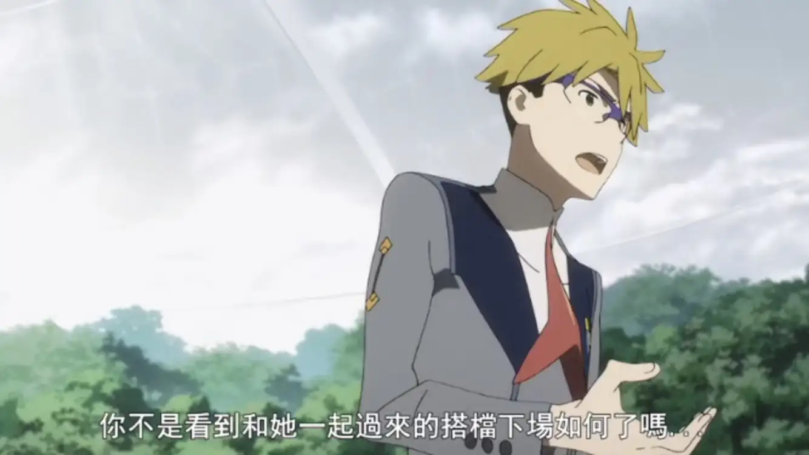

# 「Darling in the FranXX」比「紫罗兰永恒花园」观感好的诸多理由

> 本文首发于[知乎](https://zhuanlan.zhihu.com/p/33381639)，原题为《为什么我说 ditf 比京紫观感更好》，有删改\
> 发表日期：2018.07.08\
> 最后编辑于：{docsify-last-updated}

## 文首按

只追求异质的演出/分镜头是彻头彻尾的错误，因演出本质是服务于全片。从而本文的中心论文是建构于有所偏颇的观点上的。因而本文只看对演出本身的分析就够了。

另外一提，最后结果无论是 ditf 还是京紫都空有噱头了，无论是作画又或是演出。

---

## 引语

自夸“国家队”的「darling in the franxx」（下称 ditf）与号称“人类圣经”的「紫罗兰永恒花园」（下称京紫）都已经播出三集了。仅仅这三集就已经可以看出两部动画制作水平之高，但若要分一个高下的话，我想 ditf 显然是比京紫更出色的。

我为什么说 ditf 更好？最大的原因就在于，ditf 很明显的观感更好，而这个观感，不仅仅表现在动画的画面与音乐上，更表现在动画作为故事载体的叙事结构安排上。

## 画面与分镜

单单评论画面质量与人物作画来看，京阿尼的京紫显然是比 ditf 更加精美的。京阿尼对作画的重视程度与投入之高一直都被观众所肯定，而这种细腻的画面也成为了京阿尼的标志性特点之一。许多观众被京紫吸引一大部分原因正是因为京阿尼一直保持的业界领先的作画。

但在动画中，分镜也同样重要。ditf 的负责分镜的是锦织敦史和今石洋之这样的业界顶级人物，其分镜有多出色可想而知。在剧情还处于前期，意识形态未显露的前三集，这种出色的能力就已经展现出来了。最大的两点主要有以下三处。

## 画面纵横比

我在一个答案中介绍了画面纵横比的概念。可以注意到，作为一个以倒叙作为主要叙述方式的动画，每当男主/女主开始表达自己内心的想法（抒情）时，画面纵横比就会由 1.78：1 变化到 2.35：1（类似于从好莱坞类电影纵横比切换到欧洲独立制片文艺电影纵横比），以从画面上营造出一个抒情的气氛，同时引导观众去理解角色。

## 越轴剪辑

我在一个答案中也大致提到了这一概念，这里再具体说明一下：

从 1900 年到 1910 年左右，电影工作者学会了利用剪辑的这个方式加之与场面调度、摄影等其他方面的配合，使得一个故事能够循序清楚的连续的被表达出来。这一整个使得故事连续性表达的剪辑系统称之为连续性剪辑。这整个连续性系统的基本目的，是控制空间、时间和动作的一致性，从而达成镜头与镜头的流畅。其最重要原则之一 180 线原则，是指在拍摄过程中，摄影机保持在一条可辨识的线（动作轴/中轴线/180 线）一侧进行拍摄。这确保了镜头中相关位置和动作趋势的一致性，防止误导观众，混淆视听。

而第三话开头广与五郎对话这一情节最后两个镜头，摄影机显然越轴进行了拍摄，这使五郎与广看上去像是背对对方一样，进一步加强了广那句“想和 002 再次一同驾驶”，突出了广与五郎间隐藏着的冲突。

## 镜头遮蔽

第三话在广同意 002 与充一同驾驶后的两个镜头，使用了两个特别的镜头遮蔽

<section class="multiImagesContainerSection">

</section>

通常镜头遮蔽是为了突出重点，将观众的注意力引导到导演想强调的地方而存在的，这两个遮蔽的镜头显然也有这一作用，但不仅仅如此。002 的眼睛大特写仅露出了一个位于画面中左侧的矩形，而广的背影近景镜头则遮蔽了镜头左侧。在这里显然也破坏了画面中图形的平衡性，但也对立的突出了广和 002 两人心中不同的心理。

仅仅三集分镜就已经展现了这样的分镜，而京紫在分镜方面却表现平平，这是京紫不如 ditf 的第一个方面。

## 音乐

音乐与剧情的配合也是影响观感的一个重要部分。在这方面，ditf 与京紫在抒情片段的配乐几乎一样出色，但正因京紫以描述情感为主，难以发挥配乐的优势，而 ditf 作为一部机战片，在战斗的部分战斗基本能与音乐节奏相同步，加强了带给观众的热血感，因而配乐方面 ditf 同样比京紫优秀一些。（私以为 op 部分京紫也是由于op主要为剧情的情感线铺垫才难以与音乐相同步）

## 剧情安排

京紫最不如 ditf 的就是剧情的设置。诚然，无论是京紫原著轻小说剧情安排不够好，还是感情向单元剧的形式，都使京紫每一集如何安排剧情控制节奏成为一个难题，但稍加把控，也不至于让动画节奏显得有些崩坏。京紫的第一集剧情安排还算出色，使用双线叙事，在薇尔莉特与其他人物的关系的发展过程中双线同时达到高潮落幕。可惜之后高开低走，不尽人意。第二集为了结束对薇尔莉特过去的情节的展开（想法其实很好）显得过快，而第三集不仅对妹妹线的展现尴尬，对于薇尔莉特的成长叙述也过快。特别是两个地方：第一是薇尔莉特第二集中意识到并主动停止行礼动作而在第三集中却又在敬礼，第二是薇尔莉特过快的得到公正老师的认可。一边表现着她还没成长完全一边又表现出她成长的飞快，令观众尴尬。

而 ditf 对于剧情的处理相当完美。动画中的 1～3 集可以简单与电影剧本中的一幕相类比，而在剧本情节设置中，至少有一个激励事件（将角色的生活的平衡彻底破坏），一个较大的危机和一个最终高潮，最好在每一幕结尾都设置一个小高潮来阶段性的满足观众。在 ditf 中，激励事件就是广与 002 的相遇，而最终高潮是大家一直在推测的结局。值得注意的是，ditf 在前三集每一集都设置了一个小危机和小高潮：第一集打叫龙，第二集模拟战，第三集救队友。这就使得每一集都能给观众一定的反馈，让观众得到一定程度上的心里满足。

同时，ditf 每一集又都或多或少的的设置了一些伏笔/悬念，来引起观众好奇心，以让他们继续追这部番。尽管剧情上显得有些套路，但像这样每一集都讲一个可以作为单独故事而存在的事件，并把这些事件嵌套在整个故事中，其实是十分少见的。单单凭此就可以说，剧本创作的相当完美。而 ditf 的伏笔也埋得十分精彩。不妨来回顾一下：

有些猜测了吧？

甚至于 ditf 似乎想探讨的主题“性”，也在动画中有充分的展现（不多说了）。我猜测，最后意识形态还会有更进的升华。而京紫仅仅停留于“无爱”到“感受到爱”的薇尔莉特的成长与平民间温情这样有些大众化的主题（当然，表现得好也能成为一部佳作）。可见 ditf 有多优秀。

## 总结

若仅仅以一般标准来看待，ditf 与京紫都是十分出色的作品。但在 1 月番开播之前，我（在京阿尼的疯狂宣传和很多人的各种奶之下）对“人类圣经”京紫的期待是京阿尼最好的作品，（在看到无比强大的 cast 与得知 Trigger 和 A-1 Picture 联手制作后）对“国家队”的期待是略逊色于「EVA」的作品，可以说，期待值都跟高。但播出后，京紫反响略失意，ditf 却反而令人眼前一亮的完全不同的两种结果，正说明了一点：ditf 比京紫更擅长讨好观众。在 ditf 把老套路玩出新意的时候，或许京阿尼应该想一想，在保持精美的作画的同时，该如何克服自己在动画制作上的一些弱势，做出更出色的动画。
