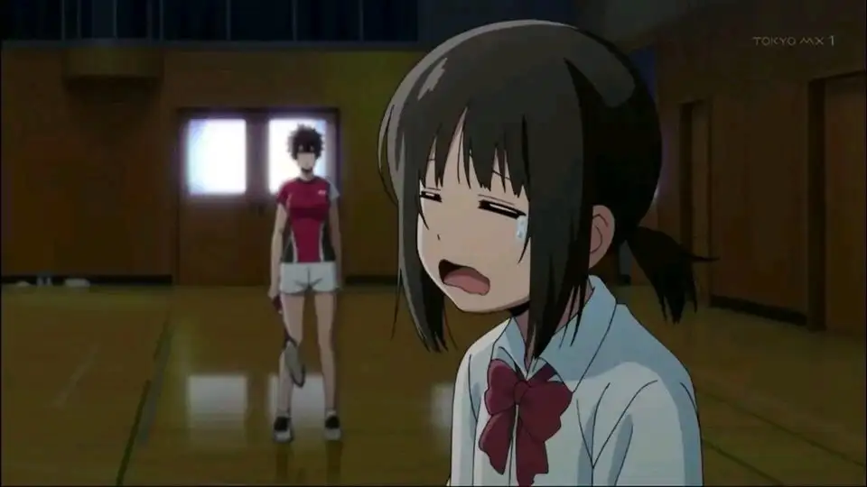
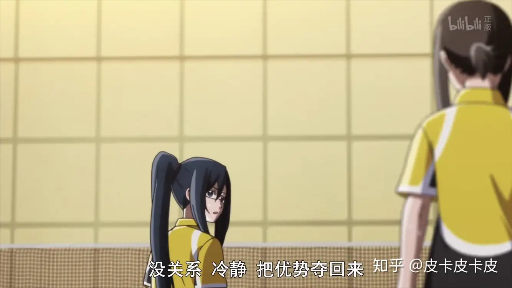
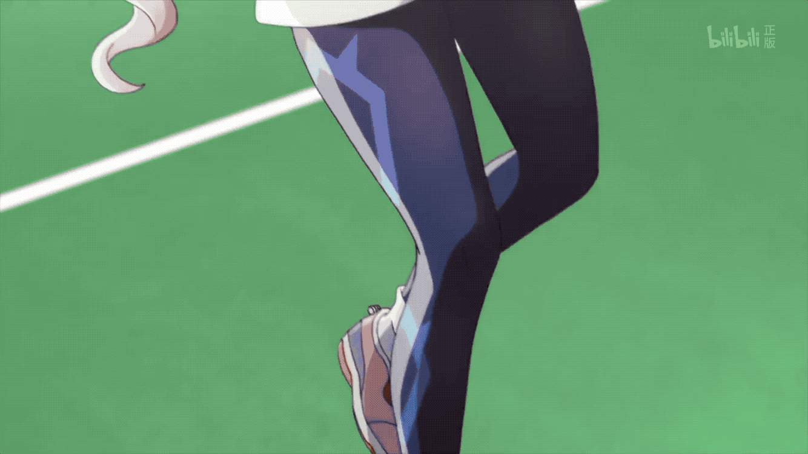
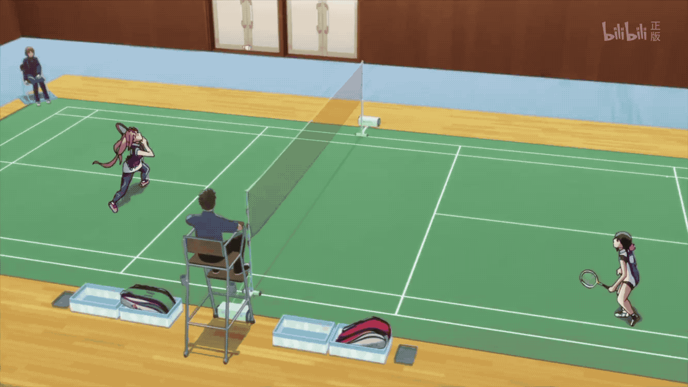

# 「轻羽飞扬」竞赛片段分镜的秘密

> 本文首发于[知乎](https://zhuanlan.zhihu.com/p/42275604)\
> 发表日期：2018.08.17\
> 最后编辑于：{docsify-last-updated}

## 引言

本来备受关注的漫改动画「轻羽飞扬」，由于其大幅度更改的剧情，得到了褒贬不一的评论。在动画党与原作党争论着小羽毛球的剧情本身时，我们不妨看一看小羽毛球是如何通过演出上的手段，将比赛部分做得如此畅快的。

## 正文

非要说小羽毛球的分镜看着如此爽的秘诀，其实也并不神秘，就是从观众与参赛者两个不同角度去展现、诠释整个比赛。事实上，但凡是以经济类体育运动为主题的动画，每当拍摄到比赛部分时，都会从这一角度着手来思考镜头的安排，但小羽毛球就厉害在它将两个视角分别做到了极致，又完美的结合在一起。

在通过观众角度展现比赛时，小羽毛球主要用了两种手法。

在强调角色心理时，小羽毛球通常纵向拍摄比赛，将整场比赛叙述上倾向的人物置于后景，而其对手则在前景出现，以球网自然地分割前后景。运用略仰角的远景镜头，虽然舍弃了对赛场上人物纵向运动的展现，却暗暗让对手显得更加强大，由此增加整场比赛的紧张感。

看上去更爽的则是运用俯角远景镜头横向拍摄的整个赛场，将两个参赛者置于画面两侧，通过平衡的构图来展现出两位参赛者的实力相当，又通过轻幅度的镜头晃动与推轨镜头是场面更具紧张感，另一方面，通过作画上运用变形与空气作画的手法，使整个比赛动作更具打击感，从而让比赛显得更紧张刺激。

在以参赛者角度展现比赛时，则通过运用中近景与特写拍摄，将镜头在叙述主体人物与其对手之间不断切换，配合着人物的画外音，以及极小幅度的拉镜头与镜头晃动，使观众感受到人物的紧张心理。以羽毛球为主要跟拍对象，也在一定程度上增强了观众的代入感。此外，在跟拍羽毛球时，又很适时的进行了升格处理，通过插入慢镜头片段，并随后硬切到另一侧参赛者接球的镜头，很好地增强气氛的紧张感与人物动作的力度。

另一方面，又多运用倾斜的构图，使整个画面不平衡，也因而显得更具动感，拉起观众对片中人物动作变化的预期。配合着参赛者上下起伏的动作，不断的变换着镜头拍摄的角度，也加强了人物的心理。此外，有时小羽毛球还会从不同角度拍摄人物的同一动作，这颇有些三回PAN的意味。

我们还能够注意到，在动画中，经常会出现前景或后景模糊，以及与此相伴随的类似“调焦”的片段。这样的做法在动画中显然是不必要的，而在小羽毛球中却多次出现，一方面能正确的引导观众注意力，另一方面也能加强比赛的真实性。

但仅仅是很好的做到上面两个角度的演出，并不能达到动画中的效果。

很容易注意到，在以观众角度拍摄时，为了是观看动画的观众更容易掌握比赛的整体局势与双方的动作，小羽毛球往往会使用长镜头，借由作画方面的努力来让观众看的更爽（虽然有的集数并不理想），而以参赛者为角度时，则更具频繁的去进行切接和划接，在镜头的不断变化中，也能加快整个片段的节奏。

在处理长短不一的镜头时，通过插入对比分的特写，对一旁的观众的镜头，在将全场信息更完整的展现给电视机前的观众的同时，又很好地将风格差别较大的镜头相结合。

最后在感受一下小羽毛球比赛部分的分镜。

全文至此结束，感谢阅读。
