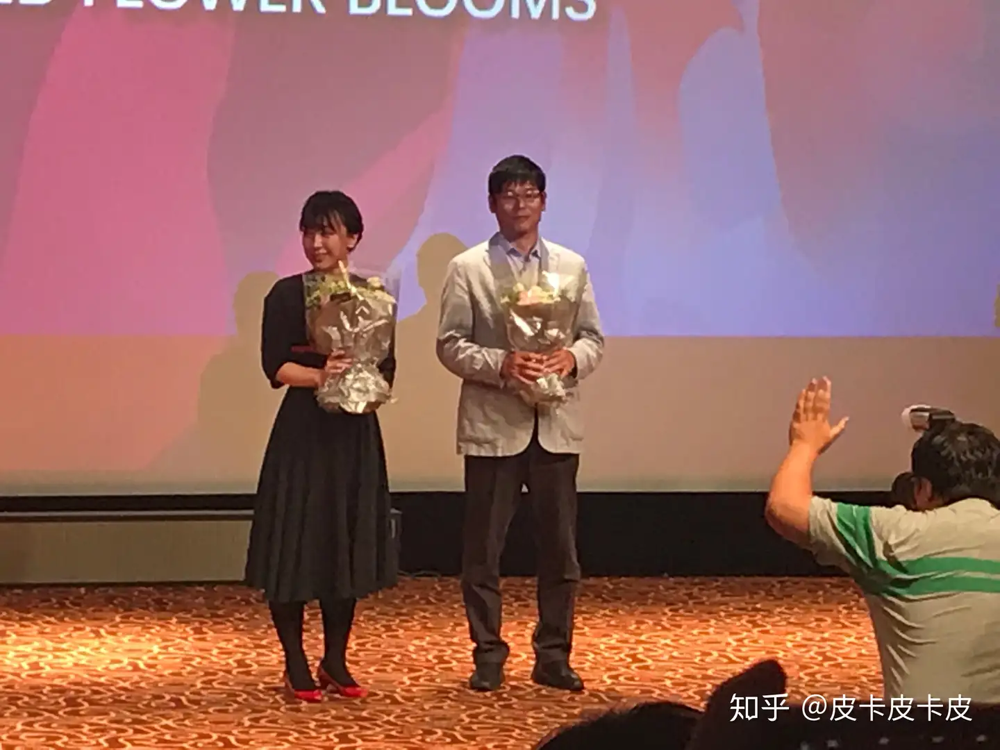

# 如何评价电影《于离别之朝束起约定之花》？

> 本文首发于[知乎](https://www.zhihu.com/question/263402149/answer/424616979)\
> 发表日期：2018.06.23\
> 最后编辑于：{docsify-last-updated}

## 题目描述

> 曾担任《心欲呼喊》《未闻花名》等动画电影的编剧的冈田麿里于7月5日宣布将自己担任导演与剧本，并将于2018年推出一部动画电影《于离别之朝束起约定之花》。

## 回答

今天借着上影节的机会看完了朝花夕誓，考虑到本片还未在国内上映，尽量不剧透的简单说说吧，等上映后再详谈。

本片由冈妈负责担任监督与脚本。整体来看故事和剧本都还是很感人的，只是可能由于影片时长问题（115min），在影片中大致有三四处是没有足够的铺垫就直接开始了事件，因而这些事件的插入略显突兀（或者说有些狗血）仔细考虑了一下，由于本片本身题材的原因（关于长生一族），对于在一定时间内叙述时间跨度很大的故事的把控是有困难的，而冈妈曾经的作品基本上时间跨度都不大，可能是不太熟悉这种类型的故事吧。在观看的时候全场也都是很默契的笑了笑，但除去这几处，整个故事对于情感的体现与对主题的展示与升华都做的相当的出色。

考虑到剧本本身侧重点在于“邂逅后产生的‘情’”上，情感成为了动画的主角。从音乐，到画面，本片每一部分都在为情感服务，而整个动画也基本上一直在反复进行情感的铺垫、展开、高潮这几个部分，这使得观众很容易被本片的情感氛围所感染。在与片中角色共情之后，整个动画就显得十分感人了。

分镜这方面并不突出，但总体下来能让观众看的很舒服，这也是很大的成功了。画面上另一大优点是对背景的绘制还是比较细致的。整体的色彩和亮度并不多用对比，在一段场景内画面中各处两者基本是相似的，并无强烈的对比，在让观众看的舒服的同时，这样的色彩与光的运用也在很大程度上能左右传达出来的情感。

这一特点从PV中的很多画面都能体现出来。

在放映结束后如愿见到了冈妈，真是开心点不得了。冈妈真是太好看了！！冈妈真的是美少女呢！（可惜她一直都低着头。）

