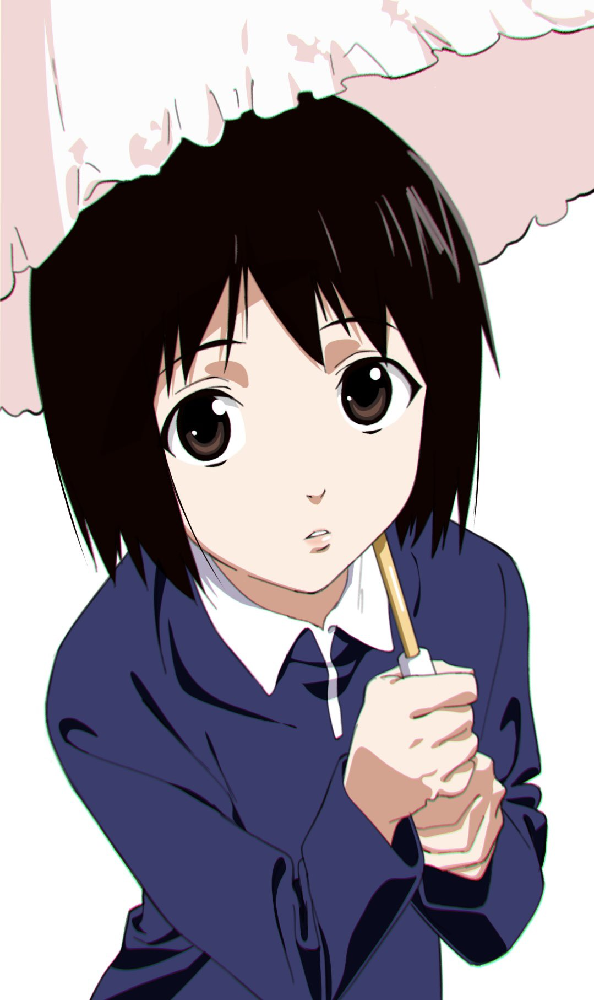
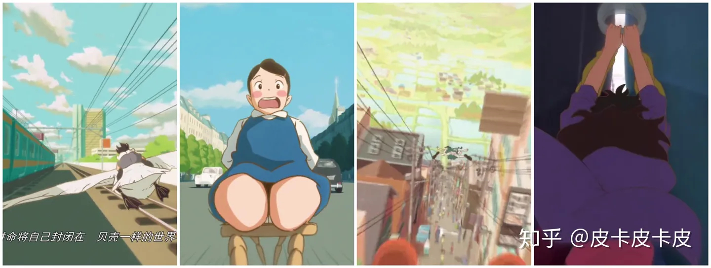
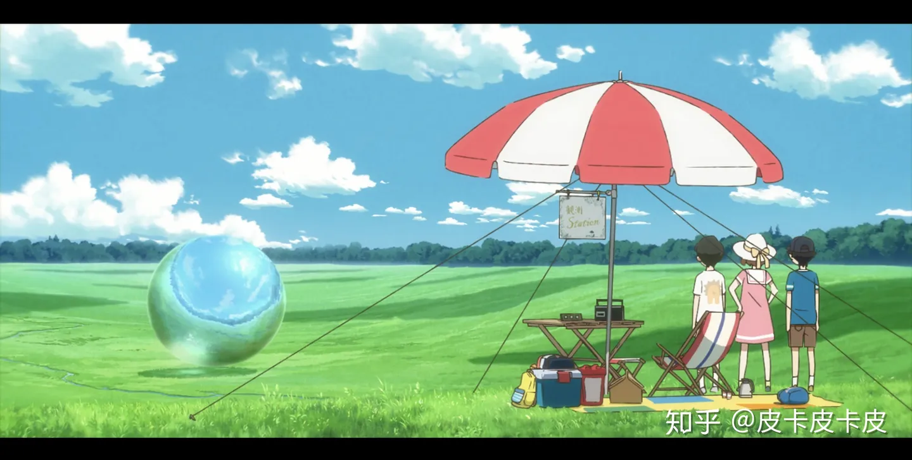
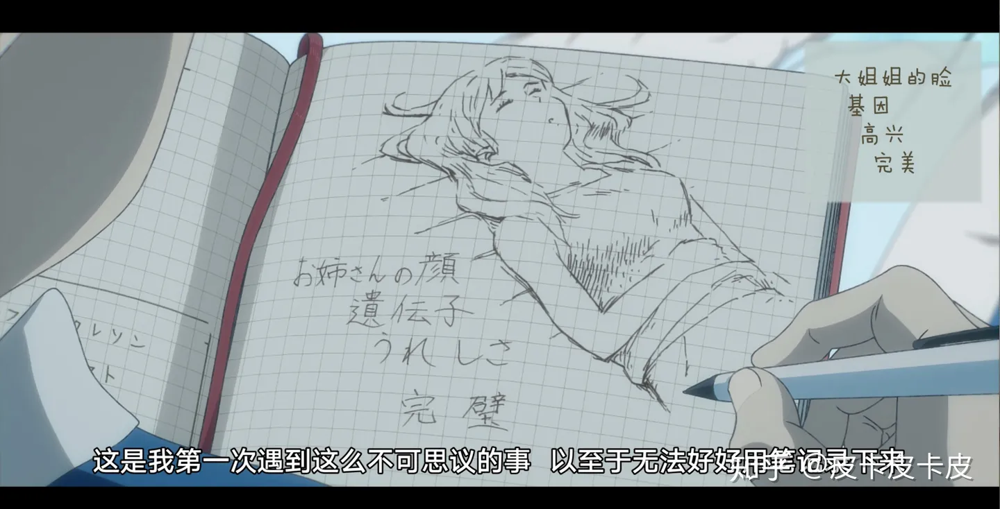
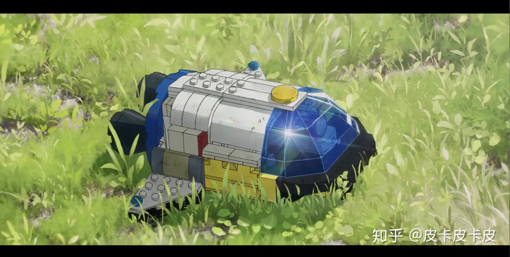

# 如何评价日本动画电影《企鹅高速公路》？

> 本文首发于[知乎](https://www.zhihu.com/question/310761051/answer/589980971)\
> 发表日期：2019.02.05\
> 最后编辑于：{docsify-last-updated}

简单的说两句吧。

## 夹缝间的飞驰

石田监督似乎非常喜欢让人物在夹缝中飞奔。在《阳光中的青时雨》中是少年骑鹅在道路中央与两栋楼之间飞行，在《波蕾特的椅子》中是椅子带着波雷特飞驰于街道之中，在《文字的告白》中是少女在街道中飞奔，而在《拉链超人组 2》中则是洋二与庆伊借拉链在轮船之中滑过。

左起：《阳光下的青时雨》、《波蕾特的椅子》、《文子的告白》、《拉链超人组 2》
本作亦不例外，在青山与大姐姐最后前往“海洋”的过程中，企鹅们拥起青山与大姐姐，在支离破碎的街道之中穿越，并最终到打“海洋”。且不提将焦点置于飞驰者身上带来的视觉上的畅快感，当主角穿出夹缝，豁然开朗之时，可以让观众的情感体验由先前的紧张转入下一个平静，从而引出下一幕的发展，可谓是相当畅快的。

## “鹅戏”

进阶上一条，在青山与大姐姐进入“海洋”之后，本作给我们展现了一幕极具帅气的水下马戏。作画出色的水下的运动与马戏两者，本身就是极能给观众带来视觉冲击的，而本作则将两者结合起来，水下泡沫的产生与消失、企鹅们在水中快速的游动以及他们身后留下的水痕的轨迹，都让观众获得了极高的视觉体验。

## 由生活中的小事件开始，逐渐延伸到生活的全方面

这句话可能比较难以理解，不过可以拿伊藤润二的作品来做个参考。伊藤润二的恐怖漫画，多从生活中的小事件入手，一步步的变质、破碎、瓦解，并最终合二为一，整个生活也由平静崩坏。这样的做法带给了读者无限的恐怖感。

相似的，本作也运用了差不多的手法。青山的身边，由出现大量的企鹅这一奇怪的事件开始，再到与内田、浜本一起做关于“海洋”的研究课题，再到台风将来临，贾巴沃克的出现，最后到整个小镇的支离破碎，“世界的尽头”在不断被提及，以及以另一种形式展现迹象的过程中，逐渐被观众们所了解，这正是这一种手法的体现。相较于一开始就给观众们展现“世界的尽头”（或至少以暗示的镜头出现），说明企鹅的出现原因而言，这样让观众跟随青山一同探究、发现的做法反倒更有童趣一些。

## 童趣

说到童趣，本作也跟石田监督之前监督的短片一样，也挺有童趣的。大姐姐、企鹅、“海洋”、以及对这些一切进行的研究，都是少年们十分热爱的的事情，也极具童趣。当然，主角的研究精神过了头，失去了少年的纯真可爱，但这一性格的缺失却在内田身上得到了补足。最后的“世界的尽头”也极有意味，很有石田监督风格地展现了罗曼蒂克的幻想世界。

真是浪漫。

年仅 30 岁就执导了首部动画长篇作品的石田祐康监督，带给观众们的《企鹅高速公路》能达到如此地步，应当获得观众们高度的赞扬。也期望他未来还能给我们带来更多“浪漫而富有童趣”的作品吧。

