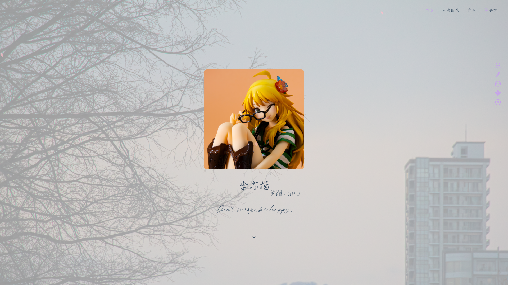

# すべてのサイト

    <a class="tocPageDisplayA" href="https://pikapikapikaori.github.io/pikapikapi-blog/">
        

            

                

                    
                

            

            

                ピカピカピ
            

            

                このサイト、メインサイト
            

        

    </a><a class="tocPageDisplayA" href="https://pikapikapikaori.github.io/pikapikapi-blog-hexo/">
        

            

                

                    
                

            

            

                ピカピカピ
            

            

                サブサイト、Hexo、壱
            

        

    </a>

