# 日本旅行写真　令和 6 年 2 月

> この文章は、私の個人ブログで最初に公開されました\
> 公開日：2024.03.01\
> 最終編集日：{docsify-last-updated}

令和 6 年 2 月 17 日から、2 月 24 日まで。

## 北海道：札幌 & 小樽

<section class="multi-images-container-section">

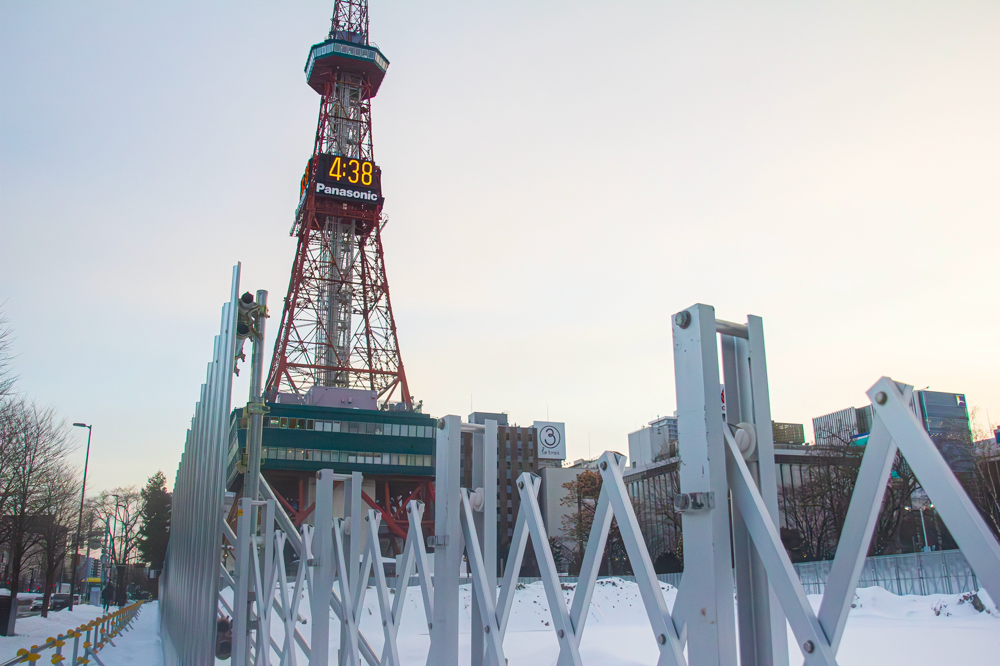

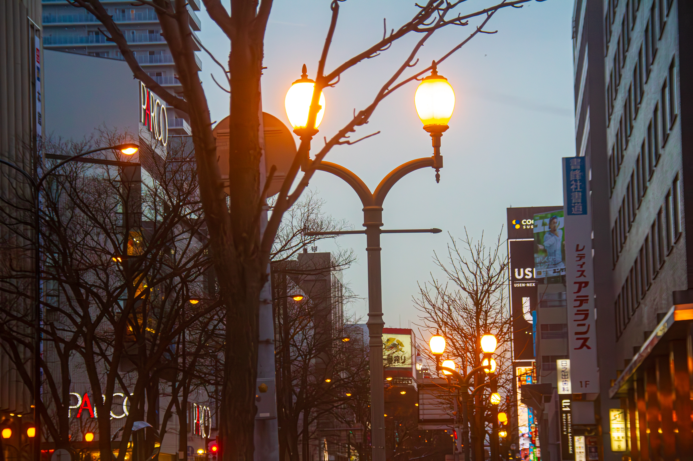

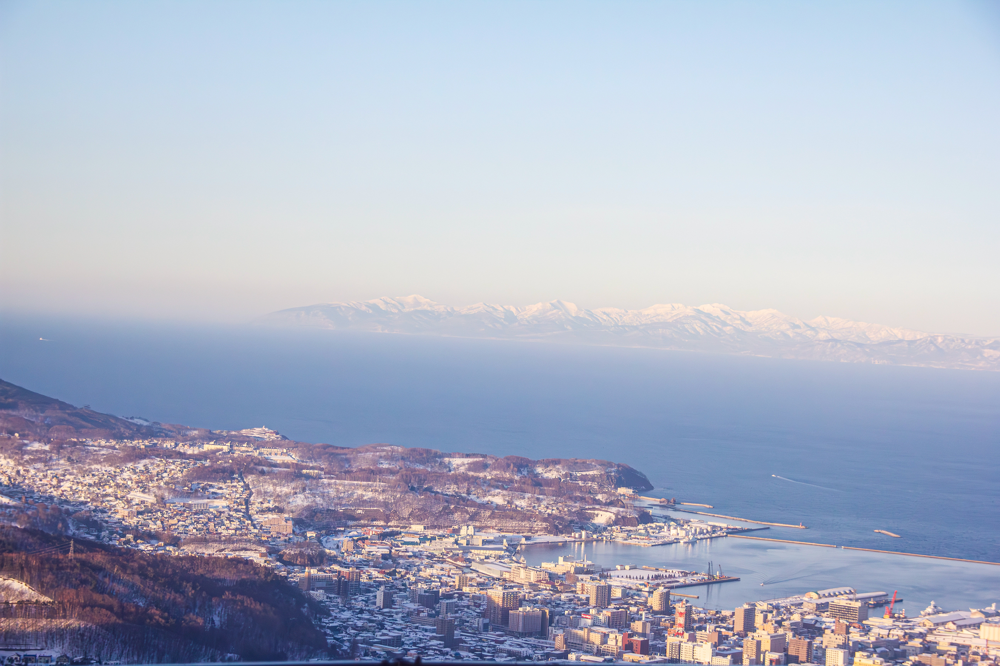

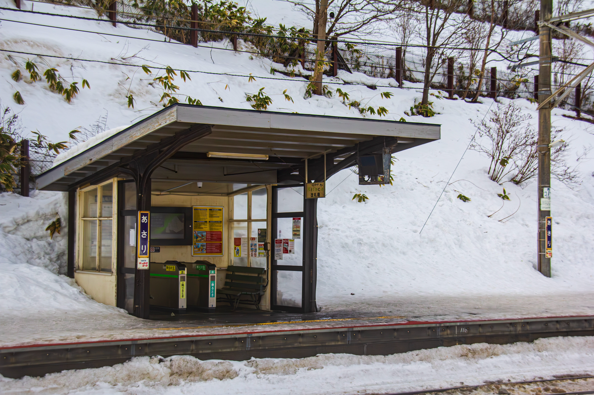

</section>

## 越後湯沢

<section class="multi-images-container-section">

</section>

## 横浜 & 東京：ロボット

<section class="multi-images-container-section">

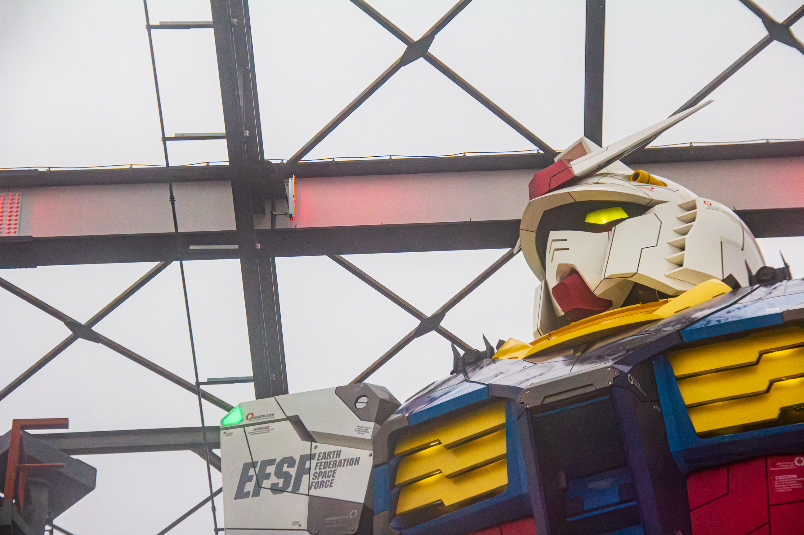
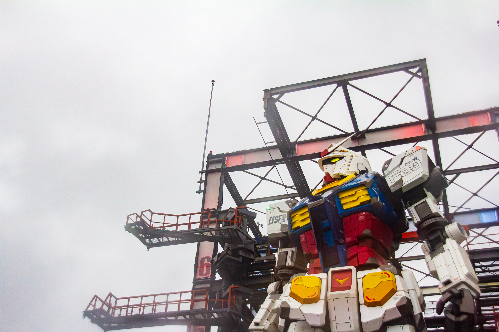
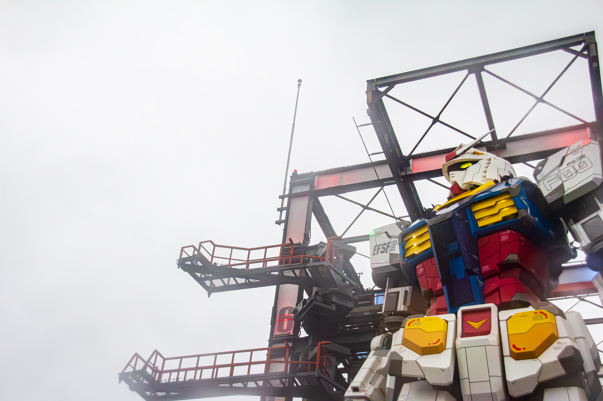
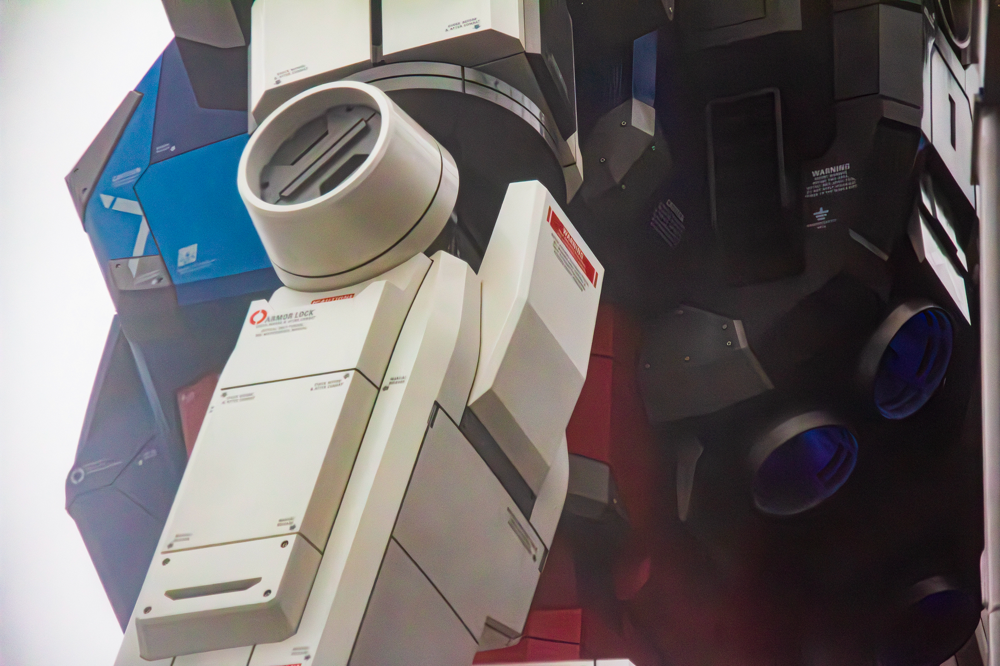

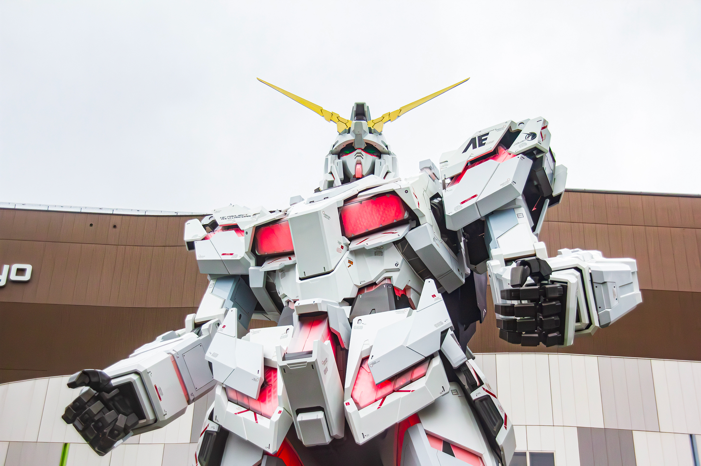

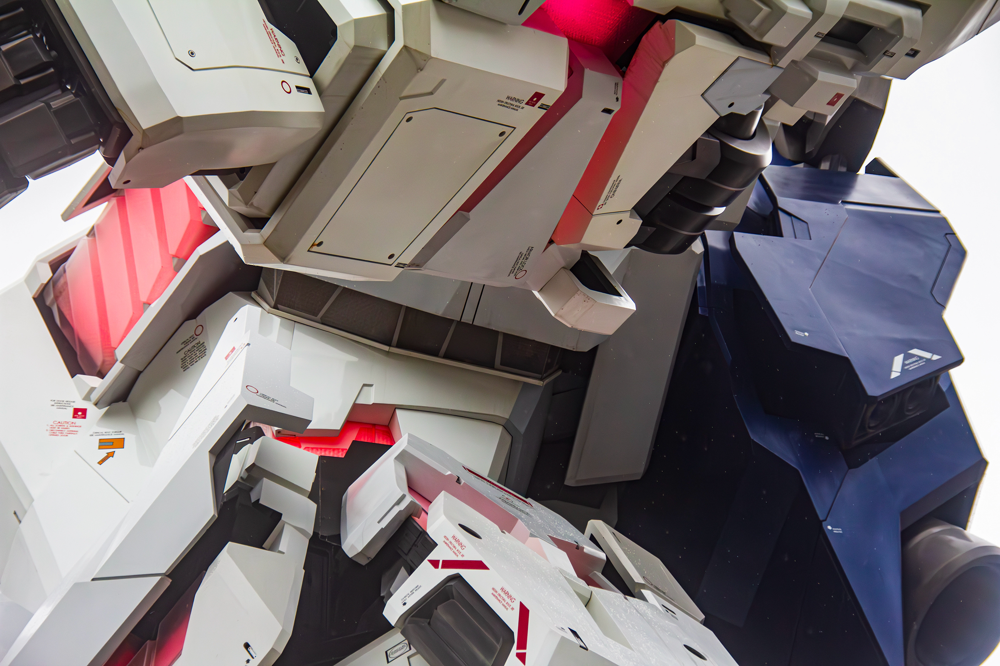
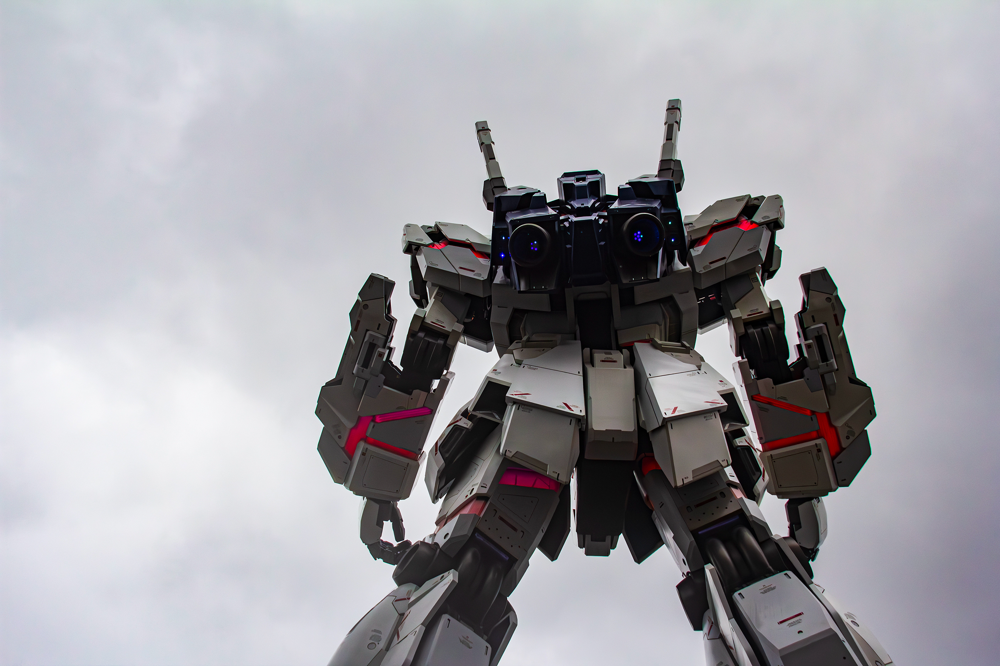

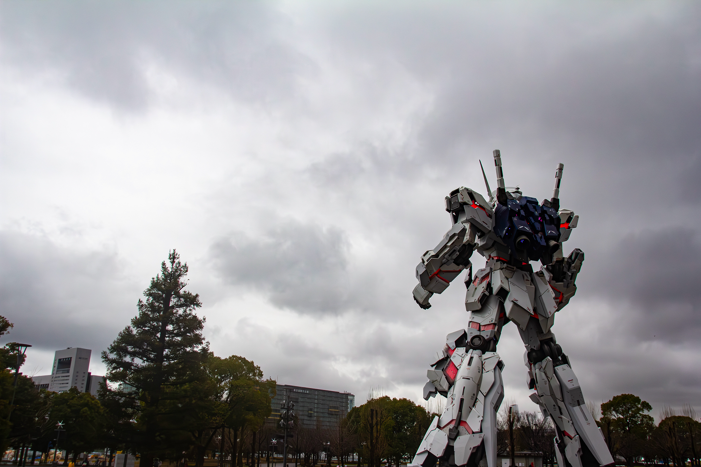

</section>

## 京都

<section class="multi-images-container-section">

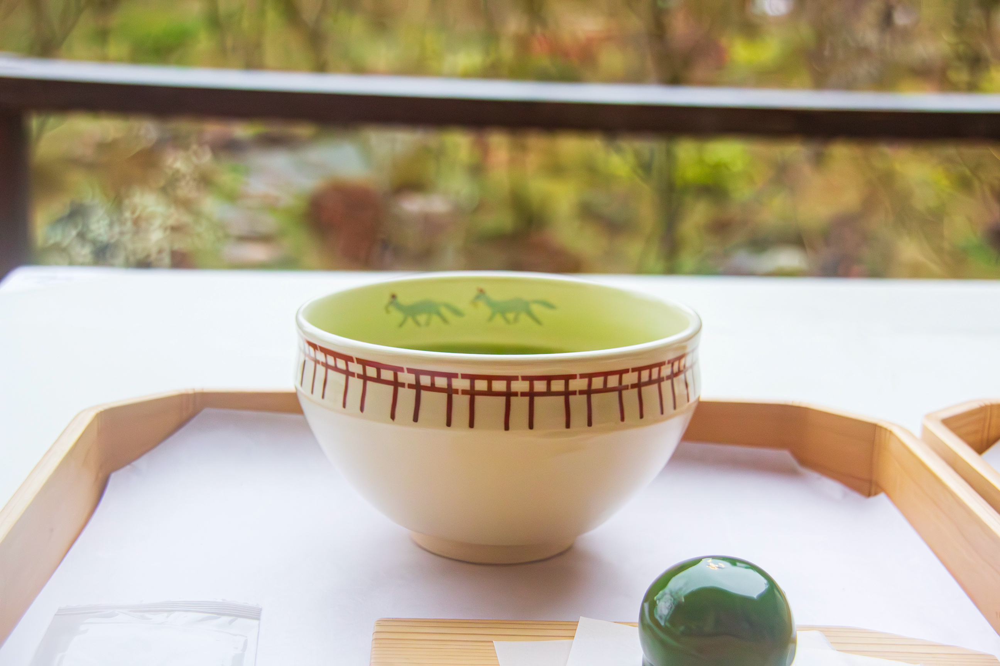

</section>
