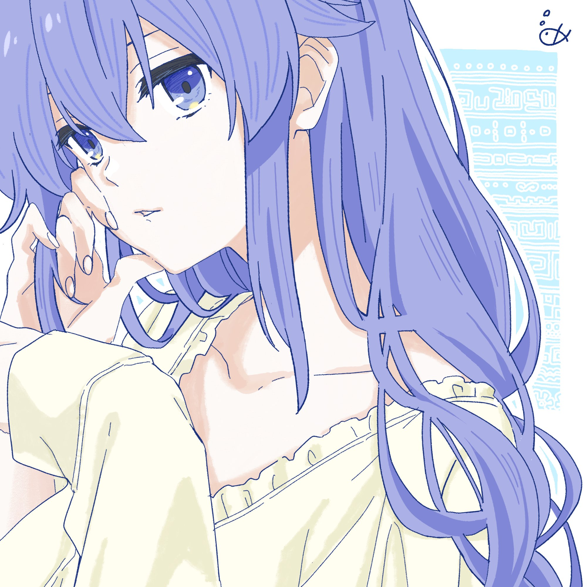
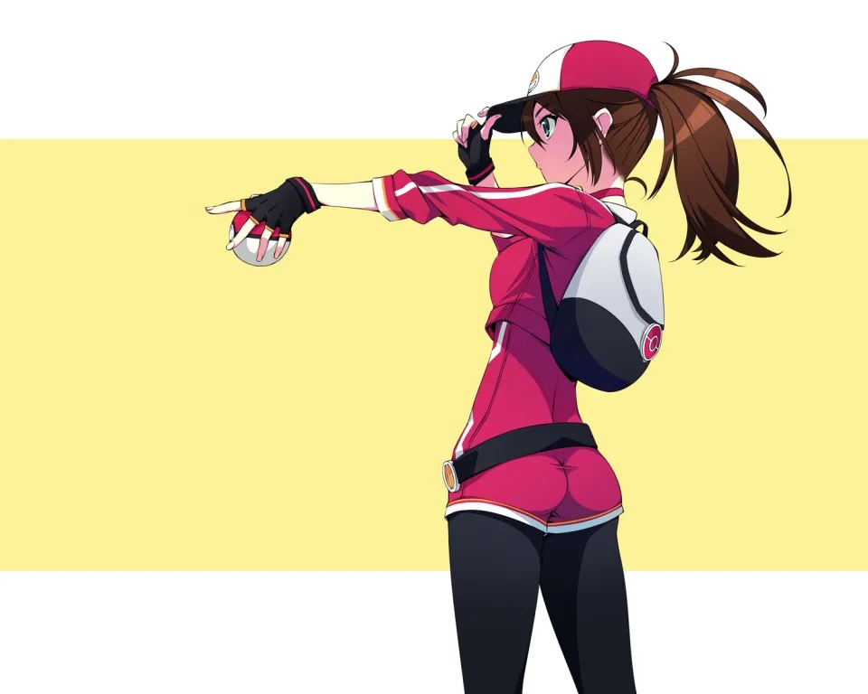
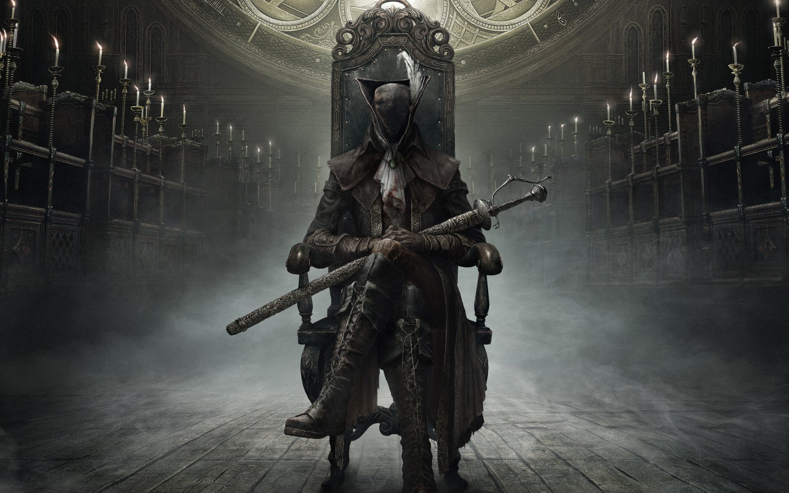
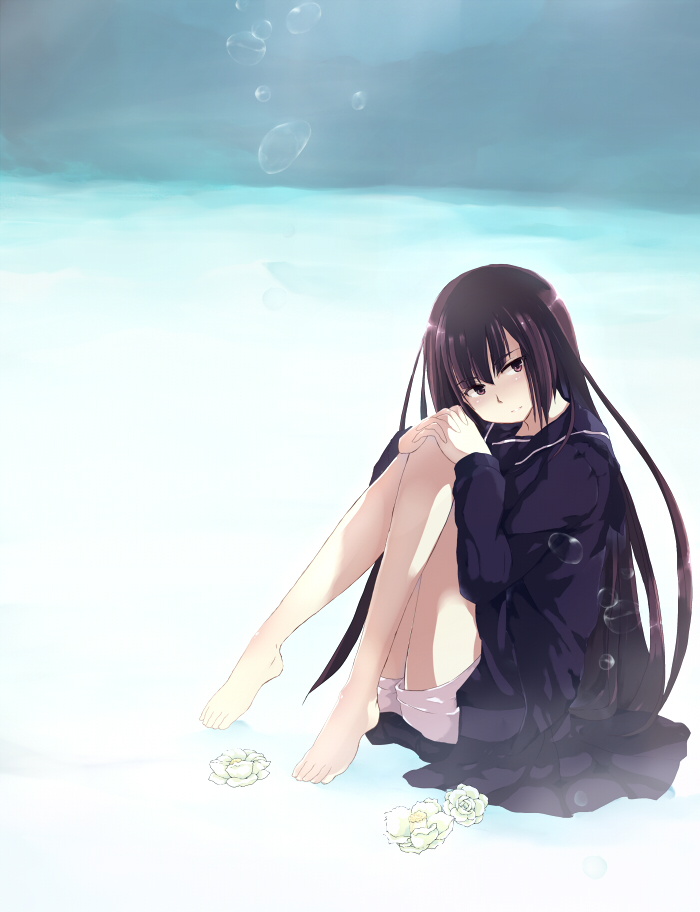
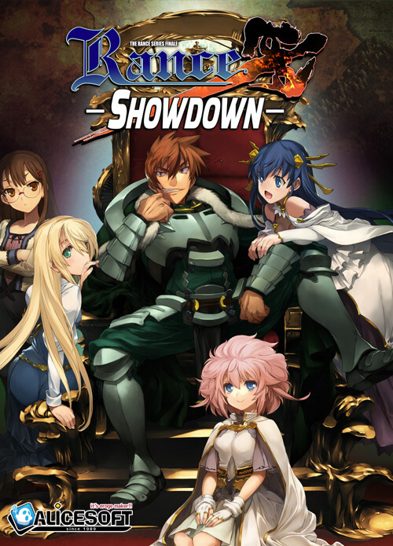
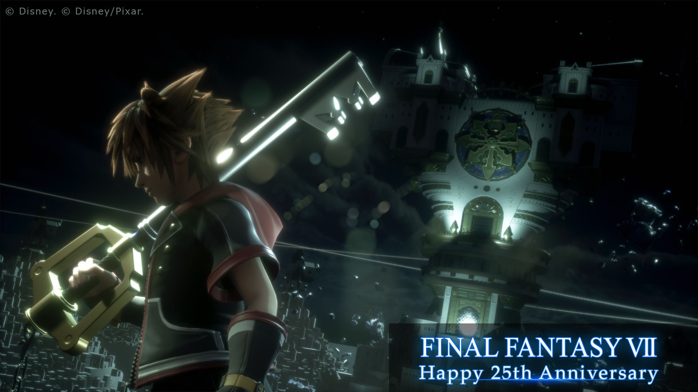

# 大量私货的10年代十佳游戏

> 本文首发于个人博客\
> 发表日期：2023.08.10\
> 最后编辑于：{docsify-last-updated}

虽然已经是10年代结束后的第四个年头了，不过个人还是想从这个时间节点回顾一下这十年的游戏。当然，笔者的口味比较类似于日系玩家，因而欧美系游戏一方面玩得少，另一方面也都不是很喜欢。

同样的按照时间顺序简单辣评：

## 「ポケットモンスター ブラック & ホワイト & ブラック 2 & ホワイト 2」

> 中文名：宝可梦 黑白 & 黑2白2 \
> 发售时间：2010.9.18 & 2012.06.23

ds与2d像素宝可梦最终作，也无疑是至今八代最佳的一代。没落的传说与宝可梦的解放，同根相生而显然对立的神兽，开篇等离子队关于宝可梦的一席发言贯穿一周目始终，即便是如今看来也是极其超前而跳脱宝可梦系列的。对双屏的运用也相当出色。此外两个版本的差异也是相当之多，足见GF的诚意。

另一方面，资料片黑2白2在整个系列中也独树一帜，或许被看作是正统续作也不为过。延续正传的剧情，两年后超绝可爱的鸣依踏上旅途。剧情上延续前作的出彩但却并未有进一步的探讨，但对资料片来说已足够。玩法地图大改，处处都能见到两年前主角的影子。然而最令人涕泪的无疑是二周目踏入前作主角家中的那一瞬。

## 「NEWラブプラス+」

> 中文名：New 爱相随 + \
> 发售时间：2014.03.27

爱相随系列的最后一作，无敌的LVG类游戏。首作刚发售时引起了空前热潮，攻略成功后的模式令人十分惊艳且足以让人沉迷其中。

## 「Bloodborne」

> 中文名：血源诅咒 \
> 发售时间：2015.03.25

PS独占魂类游戏，宫崎英高对背景与氛围，以及其与游戏本身的一切的把控达到了相当的高度。魂类高难度带来的正向反馈更需多提。

## 「ゼノブレイドX」

> 中文名：异度之刃X \
> 发售时间：2015.04.29

异度之刃系列的第二作，不过并不是正传而是类似于旁支的作品。缺点很多：主线内容太少，故事没讲完挖坑一堆；难度曲线很不合理，刷刷刷元素实在太多，不联网体验会少掉许多，战斗系统有趣但也有缺陷，日本贝多芬ky的不行，但单就一个优点就足以让我给本作打满分：自由驾驶机器人探索无缝超大地图。兼顾了肉身和机甲做出了仅此一作的巨大机器人体验，放眼jrpg恐怕也只此一家。当做出机器人以及让机器人翱翔天空的那刻，一切都值得了。

## 「SeaBed」

> 中文名：海床 \
> 发售时间：2016.01.25

全年龄小成本同人AVG，但凭借出色的文笔与叙事令人印象深刻。学会说再见需要多久？追寻过去时光的切片一如在黑暗的海床漫步，时间的流逝之间真实也呼之而出。直到最后歇斯底里的情绪也仅能隐于平淡的文字之后，为人所见的只有零散记忆化成的气泡。

## 「ゼルダの伝説 ブレス オブ ザ ワイルド」

> 中文名：塞尔达传说 旷野之息 \
> 发售时间：2017.03.03

WiiU平台的收尾与NS平台的首发，可以说拯救了任天堂败局的游戏。游戏本身的素质无须多言。而同样是10年代重制发售的「时之笛」与「姆吉拉的假面」也几乎能作为本榜单的守门员了。

从游玩本作的续作「王国之泪」的角度来看，正好之前看到篇采访说是野炊模式可能会延续到后续的塞尔达上，想了想其实是很合系列逻辑的。

塞尔达系列可以说是三大高峰的作品：众神的三角力量、时之笛、旷野之息。2D、3D和开放世界类型的三大顶峰，可以说在其之后的主要类似类型的作品都延续了这三作的玩法，而一脉相承的不变点则是极高的自由度。从三角力量内的两幅大地图上自由选择顺序进行攻略，到时之笛作为几个大神殿接续点的村子外大地图，再说到野炊作为开放世界而言无缝大地图，这一高度自由性的体现是相当明显的，也只有天剑相对更线性一些。王国之泪之于野炊，可能比较类似于假面和黄昏公主之于时之笛：在玩法上高度继承的基础上完成对前者基础玩法的进一步打磨，同时进一步添加更多的玩法。假面更多体现在独特的时间系统，而黄昏公主则是同时将剧情塑造和神殿解密都做出了进一步的优化；类似的王国之泪讲攀登和降落这两点着重进行了优化，并加入了最具代表性的开放世界重交互下的相对的自由建造。而这些改进对玩法带来的改变则无疑是巨大的。假面的时间系统带来的难度上的极大提升使得其成为系列难度之最，三天时间的限制某种意义上也如时之笛中时之神殿带来的七年时光间的流转，而这一点在黄昏公主中体现为光暗世界人狼形态的转变。类似的，王国之泪的几个新技能，尤其是究极手通天术倒转乾坤这三者，互相结合之下确实是出现了发售前难以想象的多种玩法。我个人而言还是挺满意的。

当然，这种所谓的升级改进plus版本在不同玩家间的接受程度也确实是不同的。就像有些玩家在玩过时之笛后就不再能为假面黄昏公主等给出超高评价，玩过野炊的玩家再去玩王国之泪也难以体会到最初接触到野炊时的惊艳感。不过说来从野吹三千万到如今王国之泪三天一千万，速度直追隔壁朱紫的三天一千万记录，真是难以想象。

## 「ゼノブレイド2」

> 中文名：异度之刃2 \
> 发售时间：2017.12.01

异度之刃系列的第三作，非常简单且传统的jrpg展开：王道热血的Boy meets girl。然而这种展开却能借着优秀的人物塑造与演出调动起玩家的情感，从遇到ホムラ后她第一次被劫，到两人真情慢慢流露，ホムラ显露出ヒカリ的真身再到最后合为一体，几乎每一个情节点玩家都能与游戏中人物产生共鸣。系统而言挂球与四连击系统也有这充分的乐趣与深度，系列一脉相承的大地图也无可挑剔。唯一的缺点可能就是地图引导实在太逆天。

## 「ランス10」

> 中文名：兰斯10 \
> 发售时间：2018.02.23

我个人排前十时十分纠结的一部，系列14部作品构建的恢弘史诗的收尾之作。实际上10年代的几部兰斯：R01、R03、R8、R9都已经有着相当的素质了。

整个系列而言在游戏性上大胆而丰富，创造了相当多有趣的系统：R01的筹码对战与R01、R03的翻牌迷宫，R5的随机战斗与行动系统，R6超前而大胆的第一视角3D，R7传承自鬼兰的地域压制SLG & RPG以及其与剧情路线结合的紧密与丰富程度，R8的任务导向系统，R9的战旗，以及R10的打牌。同时系列中剧情本身就已经足够恢弘了：R03第一次升级游戏的叙事从小地图的嬉笑怒骂转向大地图多方势力冲突的大破大立，R02、R4、R5、R7、R8一步步构建着宏大讽刺且新颖的世界观，R03、R6、R9、R10则专注于人物的塑造。十几部作品下来上百位角色都能在R10里有着被玩家记住的各自的弧光。各种意义上来看，都可以说本作也是毫无缺点的游戏了。

## 「KINGDOM HEARTS III」

> 中文名：王国之心3 \
> 发售时间：2019.01.25

系列本身是仅次于DQ与FF的第三大jrpg系列，无论在欧美还是日本都有着相当的受众。本作作为ソラ最初的三部曲的完结之作，可以说是系列前两部正作与其他十部左右的旁支作的集大成者：bbs和0.2的风格系统变成了键刃变形，ddd的突进爬墙，2代的联携，358/2的危机变身，记忆之链的卡牌指令的影子也在其中。相当丰富有趣，但是难度是否有点降低了。另一方面，收尾也算收的相当不错，几个三人组的回归，光头的释然，ナミネ的复活...键刃墓场那里估计也是直接调的手游玩家。夕阳下大家的身影，索拉的轮廓却逐渐模糊消失...而dlc中夜空的回归也化解了无数FF玩家的遗憾。

## 「大乱闘スマッシュブラザーズ SPECIAL」

> 中文名：任天堂明星大乱斗 特别篇 \
> 发售时间：2019.12.07

在FTG中相当特别的作品，作为NS平台上的首作，樱井对岩田的承诺之作同时也可能是最后一作。相当低的入门门槛与相当有深度的击飞系统使得各种层次的玩家都可以找到自己的乐趣，而游戏系列本身作为游戏博物馆而言也更不用再加称赞。两个DLC季票添加了更多或惊喜或期待已久或相当意外的角色，都各自有着相当有趣的专属系统，而最后加入的ソラ本身大概也寄予着樱井本人的情感。
