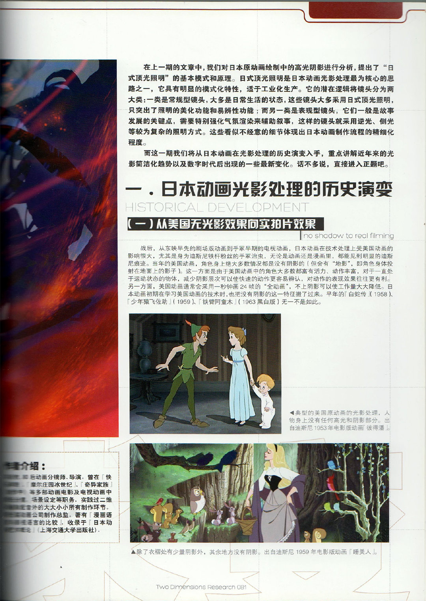
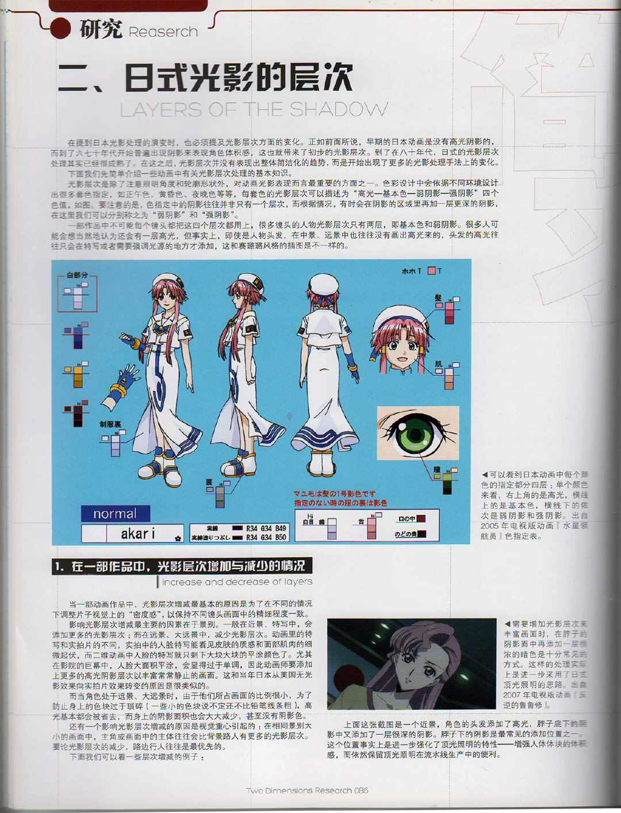
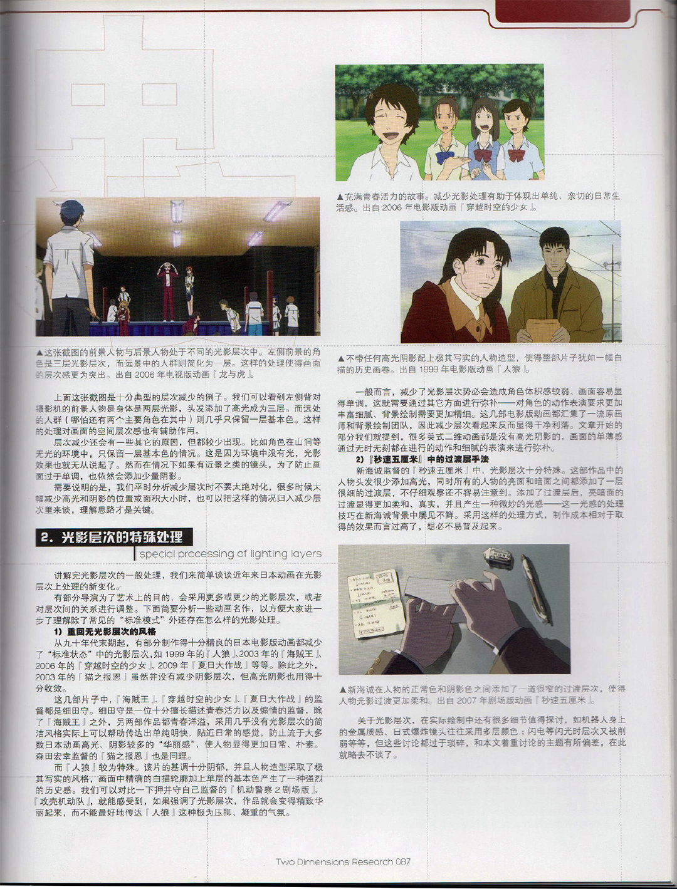

# 动画摄影文献

> 本文首发于个人博客\
> 发表日期：2025.05.05\
> 最后编辑于：{docsify-last-updated}

两篇资料的备份。

## 假定性照明——日本原动画中的高光阴影模式

## 论日本元动画中的高光阴影演变趋势

## 参考

1. 羊廷牧, 假定性照明——日本原动画中的高光阴影模式. 二次元研究 Vol2, 2011-9
2. 羊廷牧, 论日本元动画中的高光阴影演变趋势. 二次元研究, 2012-1
