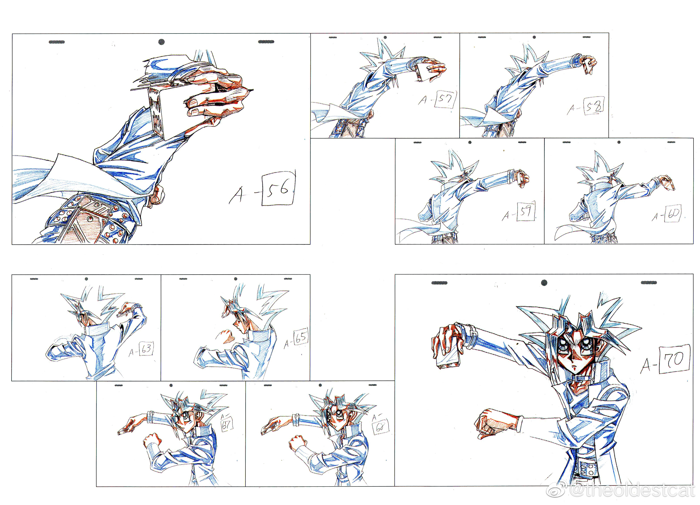

# 动画资料 壹

> 本文首发于个人博客\
> 发表日期：2025.05.08\
> 最后编辑于：{docsify-last-updated}

## 「遊☆戯☆王 THE DARK SIDE OF DIMENSION」 高橋和希 部分原画

## 「トップをねらえ!」 部分设定

钢巴斯塔设定，庵野秀明。

图源微博，见水印。

另：[庵野秀明与冈本喜八对谈](https://type-r.hatenablog.com/entry/20151029)，[冰川龙介 blog](http://hikawa.cocolog-nifty.com/data/2008/11/blu-ray-disc-bo.html)。后者关于制作上的相关部分引用如下：

> パート１：フィルム制作\
> 第１話～第４話　原版16mm（35mm拡大ポジからスキャン）4:3\
> 第５話　原版35mm（ポジスキャン）4:3\
> 第６話　原版35mm（ポジスキャン）さらに拡大して天地カットの16:9\
> 　　　　　　　　　（本来はビスタ1.85:1とスコープ2:35:1の間、亜シネスコサイズ）\
> パート２：デジタルハイビジョン制作　16:9\
> ひとつのタイトルを冠した作品で（しかも観ていただくと分かりますが、物語的には全部つながっている）、これだけいろんな画質のものが収録されたパッケージはちょっと珍しいのではないでしょうか。いろんな事情が重なってますが、パート１は当時、４話で打ち切りの可能性もあったんで、予算が低めなんですね。物語的にもそこで終わっても良い構成になってます。好評につき５、６話制作決定したとき、予算もアップしたと。ところが第６話だけモノクロの上にワイドスクリーン映画として制作されたので、また画角も画質も変わってしまったという、なんか「出世魚」みたいな作品なんですよ（笑）。\
> それに加えてパート２はデジタルですから。もうどんどん変わっていく。それは前からそうなんですが、Blu-ray化でやたらと違いがはっきり分かるようになったんです。\
> ただ、それはそれでまた一種の味になってるんですね。16mmのちょっと粒子っぽく淡さを含めた発色の感じが、いきなり５話のパートに来ると、「こんな鮮明なトップは初めて観るよ！」とコーフンです。前にそこだけ数十回は観ただろう合体ソングのパートも、改めて高画質で感激です。\
> ということで、予期せぬ余録があったという商品でした。バラ売りも出てるんで一応紹介しますが、これはあくまで「合体劇場版」でして、２作通して観て意味のある作品だと思うんですよね。ということで、ぜひBOXで。

前者庵野关于最终话最后一幕黑白画面的考量引用如下：

> 庵野：僕の世代は、モノクロからカラーの時代なんです。カラーのありがたみを今の人にもわかってもらおうと（笑）。あれは35（ミリフィルム）のモノクロなんです。\
> 岡本：僕はモノクロが好きで、半分近いんじゃないかしら、白黒が。\
> 庵野：最近は、テレビのCMとかでもモノクロが増えてますね。ポスターにしても、何か流行ってますね。\
> 岡本：それから、部分着色とかね。\
> 庵野：パートカラーとかですね。綺麗なフルカラーにみんな目が慣れちゃってるので、逆に珍しいんでしょうね、今は。\
> 岡本：ただ、今は現像費が高いから。昔は白黒用の現像液というのがちゃんと常時あったんだけど、今は、白黒の注文が入ってくると、新しく現像液を作るから。\
> 庵野：カラーだと即日で現像できるんですけどね。『トップをねらえ！』の時もモノクロは「中1日くれ」と言われて、ちょっと難儀しましたが、スケジュール的に。ラッシュが中1日じゃないと上がってこなかったんですよ。\
> 岡本：でも、あれは退色しないからね。時間が経つと、プリントは特に…\
> 庵野：赤くなっちゃいますからね。\
> 岡本：全体がピンクになって、ピンク映画を撮ったんじゃなかったのに（笑）。でも、ネガでも多少は退色していくから。『肉弾』から4〜5年後からは、カラーの方がはるかにコストが安かった。

《animage》1987 年 7 月号庵野访谈如下：

抽空再翻译吧。

## 「王立宇宙軍 オネアミスの翼」 部分原画

火箭发射部分，庵野秀明。

图源微博，见水印。源自“庵野秀明展”。

## 「それでも町は廻っている」 OP 原画

梅津泰臣分镜、作监，河口俊夫原画。

