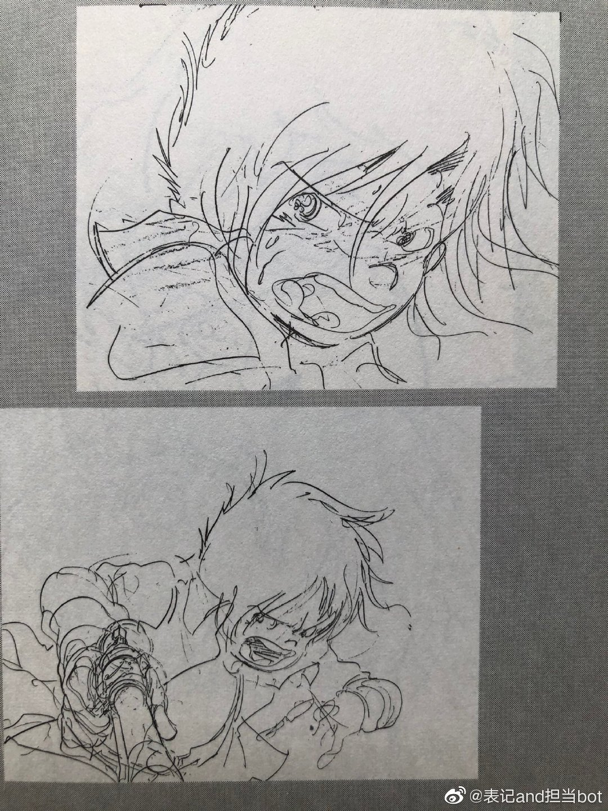
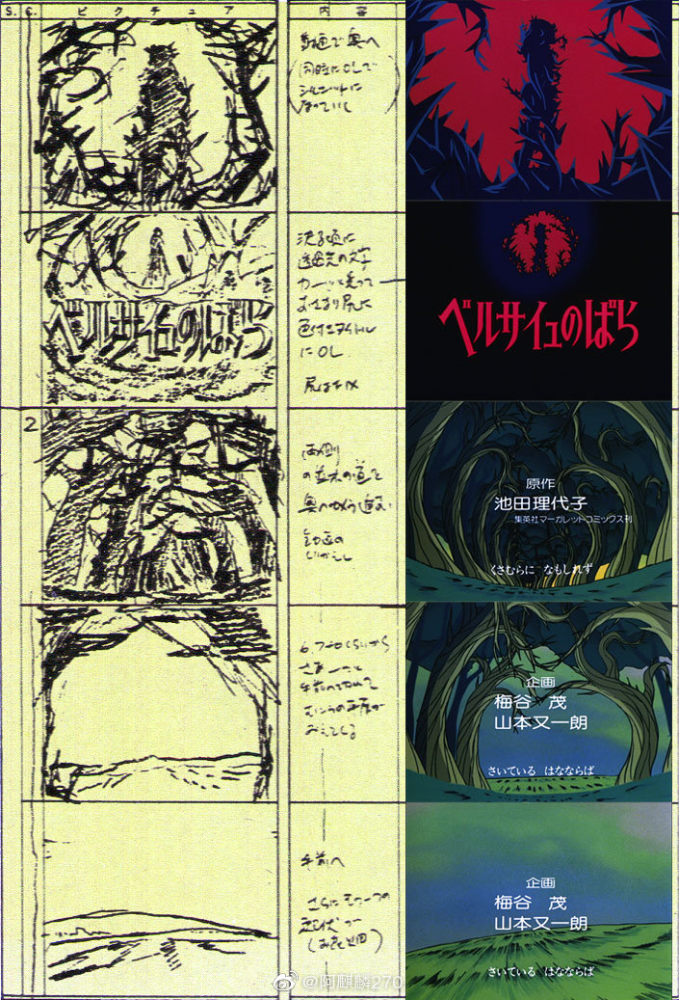
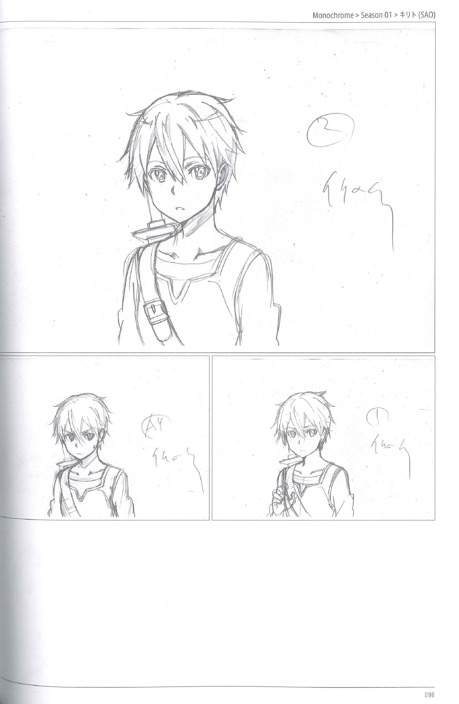

# 动画资料 贰

> 本文首发于个人博客\
> 发表日期：2025.05.10\
> 最后编辑于：{docsify-last-updated}

## 「超时空要塞 可曾记得爱」 ED

明美 PINUP 海报，以及原本的结尾分镜（非「FLASH BACK 2012」版）。

图源微博，见水印。

<section class="multi-images-container-section">

</section>

## 「攻殻機動隊」 主视图

<section class="multi-images-container-section">

</section>

## 「银河铁道 999」

金田伊功部分原画。

<section class="multi-images-container-section">

</section>

## 「思い出のマーニー」 初期设计

米林宏昌。

<section class="multi-images-container-section">

</section>

## 「凡尔赛玫瑰」 OP 分镜

<section class="multi-images-container-section">

</section>

## 「偶像大师」 原画

24 话原画，高雄统子。

<section class="multi-images-container-section">

</section>

11 话 ED 原画，植村淳。

<section class="multi-images-container-section">

</section>

## 「GOLDEN BOY」 人设

<section class="multi-images-container-section">

</section>

## 「千与千寻」 原画 & LO

山下明彦、高坂希太郎。

<section class="multi-images-container-section">

</section>

大平晋也。

<section class="multi-images-container-section">

</section>

## 「银河美少年」 #25 C-360

村木靖。

## 「刀剑神域」 足立慎吾

《Monochrome 〈Season 01 キリト(SAO)〉 》 Part.1

<section class="multi-images-container-section">

</section>
