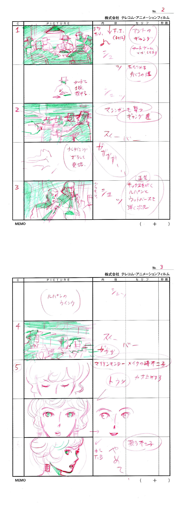
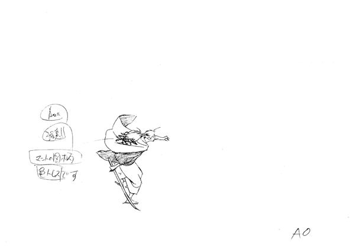

# 动画资料 叁

> 本文首发于个人博客\
> 发表日期：2025.05.11\
> 最后编辑于：{docsify-last-updated}

## 原画示例

岩根雅明。

## 「SSSS GRIDMAN」 #11

齐藤健吾。

## 「LUPIN THE THIRD」 分镜

<section class="multi-images-container-section">

</section>

## 「一拳超人」 #12 原画

青山浩行。

## 「Seraph」 原画

吉成钢 #5 C-81。

