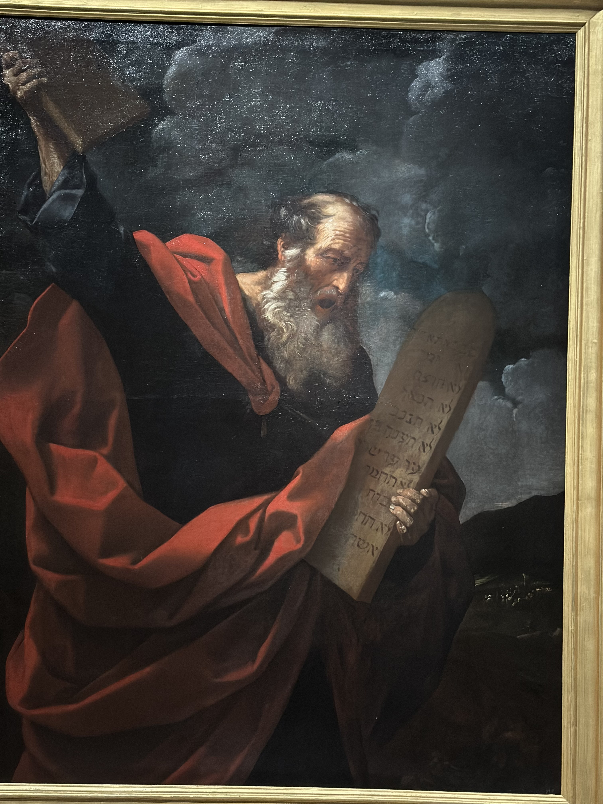

# 近期艺术展 甲辰年四月十三日

> 本文首发于个人博客\
> 发表日期：2024.04.13\
> 最后编辑于：{docsify-last-updated}

## 毕加索

> 毕加索艺术中心\
> 毕加索·马戏狂想

相对来说比较著名的画少一些，不过我本身也欣赏不来立体主义。

<section class="multi-images-container-section">

</section>

## 文艺复兴的威尼斯画派

> 遇见博物馆\
> 遇见提香与文艺复兴

威尼斯画派对色彩的运用其实并不很吸引我，尽管不得不承认到了后来的早期印象派的作品都很美。这个展出的意外之喜是看到了几幅伦勃朗与鲁本斯的画作，尽管数量不多。

<section class="multi-images-container-section">

</section>

## 巴洛克美术

> 浦东美术馆\
> 卡拉瓦乔与巴洛克奇迹

冲着卡拉瓦乔和他最出名的影响即暗色调画法去看的，最符合预期的一次。不过没有维米尔的作品有点遗憾。

<section class="multi-images-container-section">

</section>

## 威尼斯画派

> 东一美术馆\
> 提香·花神——乌菲齐美术馆威尼斯画派珍藏展

不知道为什么近期上海威尼斯画派的展出特别多。这次主要看提香。不愧是近两百的票价无论是作品数量还是质量都远远超过上面几个展览。

<section class="multi-images-container-section">

</section>
