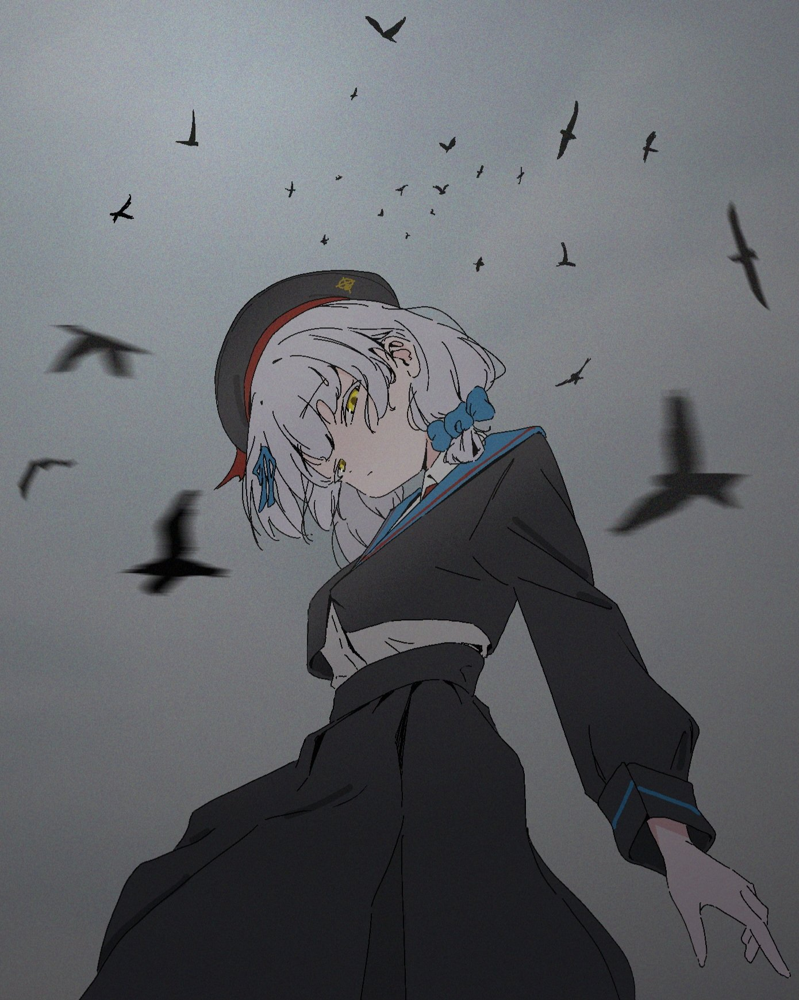

# 近期艺术展 甲辰年四月二十五日

> 本文首发于个人博客\
> 发表日期：2024.04.25\
> 最后编辑于：{docsify-last-updated}

## 勃鲁盖尔

> 遇见博物馆\
> 遇见勃鲁盖尔 16、17 世纪欧洲画坛大师真迹展

<section class="multi-images-container-section">

</section>

## 启蒙时期

> 东一美术馆\
> 最后的故事——乌菲齐馆藏 18 世纪欧洲大师绘画

<section class="multi-images-container-section">

</section>
