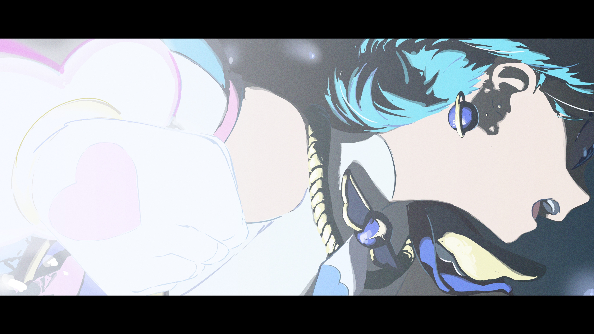
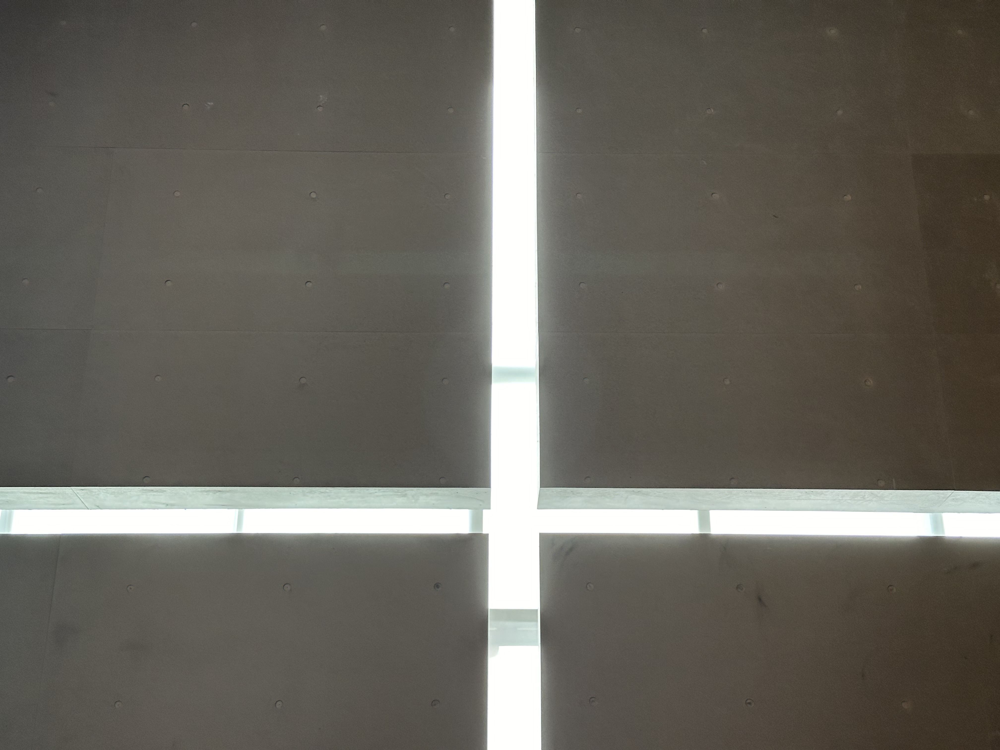
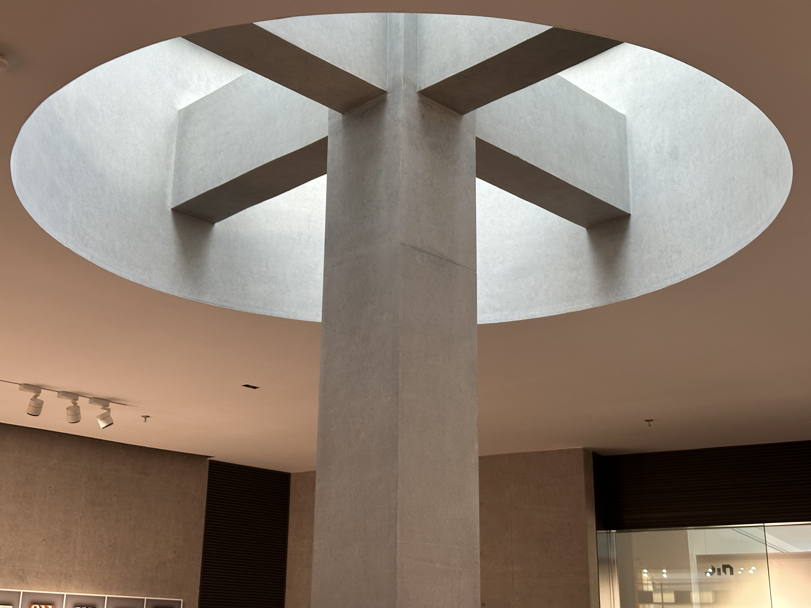
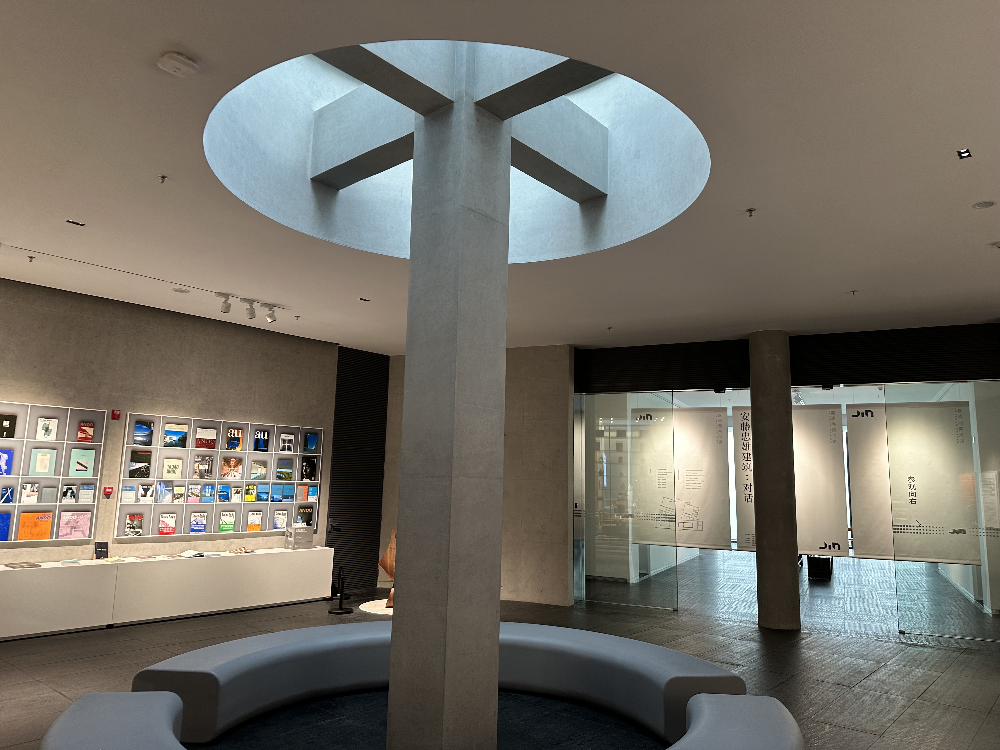
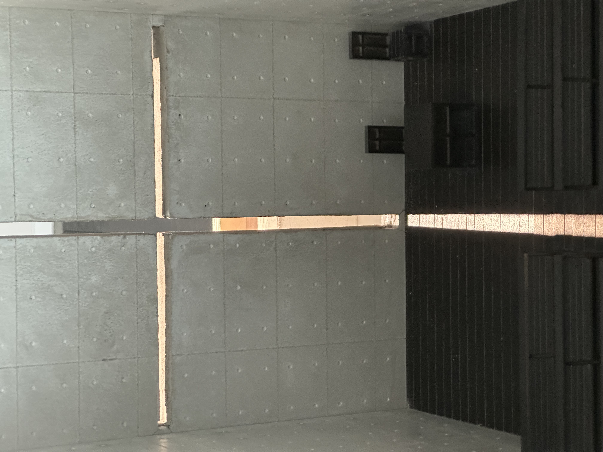
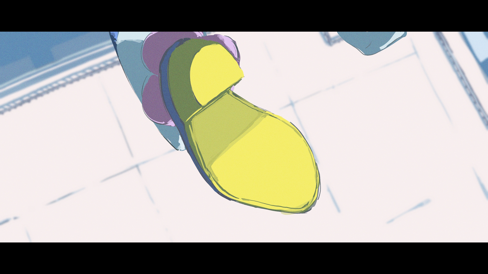
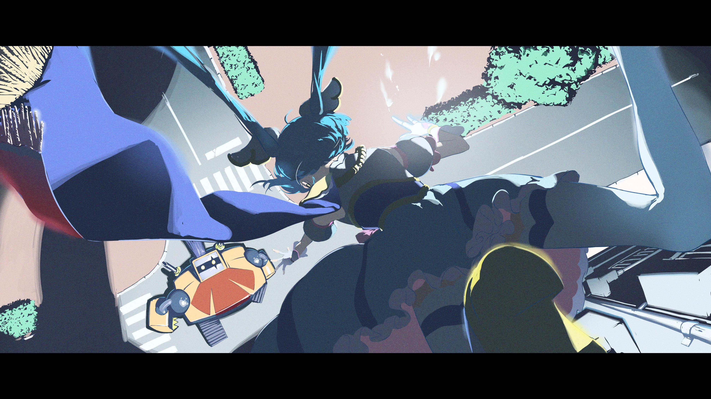
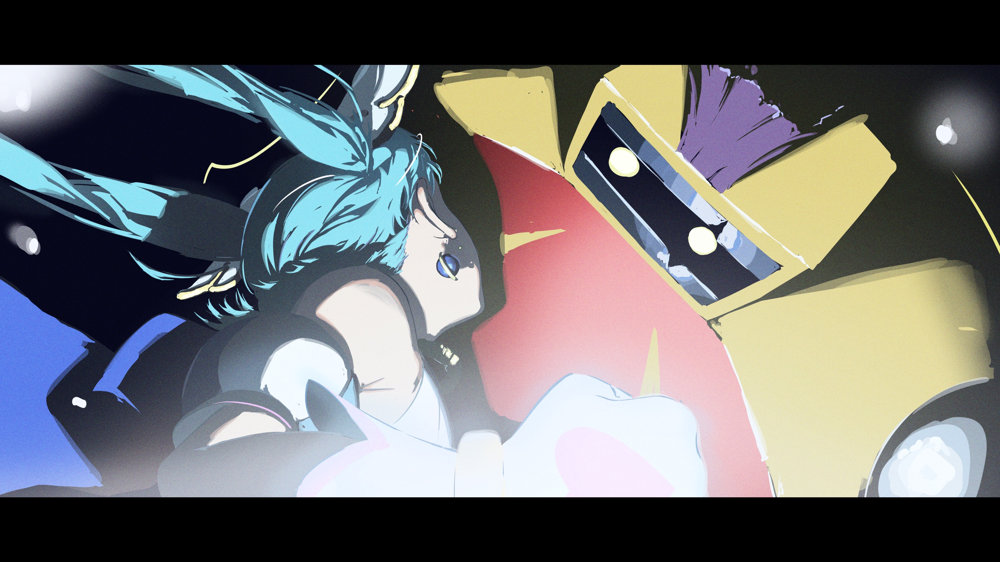

# 近期艺术展 甲辰年七月十八日

> 本文首发于个人博客\
> 发表日期：2024.07.18\
> 最后编辑于：{docsify-last-updated}

## 中法女性短片展

> 外滩源壹号\
> 创造中的她 中法女性电影项目 欧洲国家珍藏展\
> <ruby class='minority-language-font-ruby'>Réponse De Femmes</ruby>

没有图。说是短片展倒确实是短片展，聚焦于女性本身的这种女性主义在如今已经被解构的不成样子了。从福柯到拉康到波伏娃，多年来的女性主义重复着父权压迫与女性受迫的二元对立范式而即使是这样的对立范式也早已经被拉康那句“根本不存在性关系”推向了消解的必然道路。

当然说回本展，取材多为 19 世纪 20 至 40 年代，少数取 70 或 80 年代的作品片段，注定着短片的主题都还聚焦于先天的女性性别本身。选片上都比较讲究，然而时长控制确实比较微妙了。本身观展时间其实应该被控制一下的，然而不说选取了数个四五十分钟长的片段，甚至在最后还要专门进行完整放映「人·鬼·情」其实比较冗长了。展厅设置上确实有注重多样性和观影舒适性，但是整体排布和轮播的影片就形式设置上感觉还是可以有更多的考量，毕竟影片作为有独特时间尺度的视觉艺术并不同于装置、绘画、建筑、摄影等视觉艺术。

## 安藤忠雄展

> 嘉源海美术馆\
> 安藤忠雄建筑：对话

郊区风景确实好，展出则有点不如预期了。大量的手稿、模型和设计图等都确实很有参考价值，本人参与设计的美术馆本身加之展厅排布也都挺值得好好品味倒是确实。不过一方面展出内容还是有些显少，另一方面半部还原的光之教堂光线上确实完全不同。我想建筑果然还是应当去实地考察吧。就美术馆本身而言其实倒和一贯的风格不太一致，不是那种后现代解构到最末的剥离人本元素的无机与自然感，反而是现代性和自然的融合。

遗憾的是过去才发现相机没电只能拿手机拍了，不过也没错过太多姑且将就看吧。

<section class="multi-images-container-section">

</section>

## 附：题图组图

<section class="multi-images-container-section">

</section>
