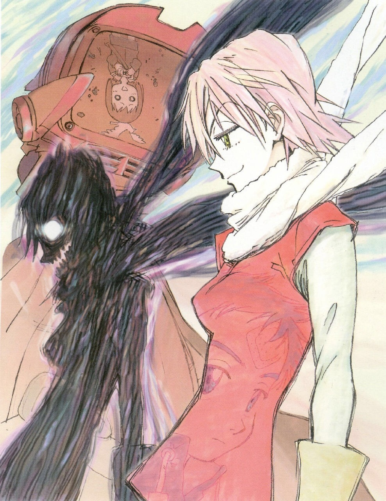
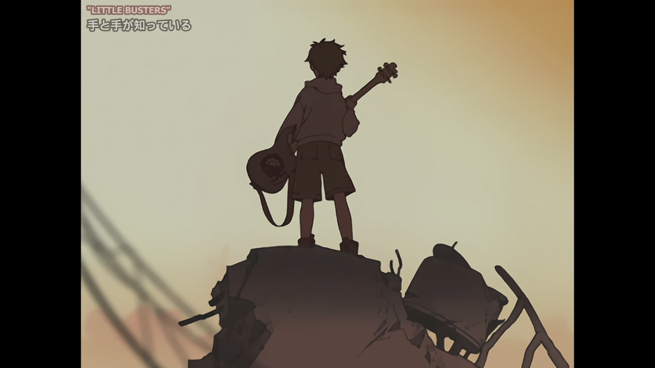
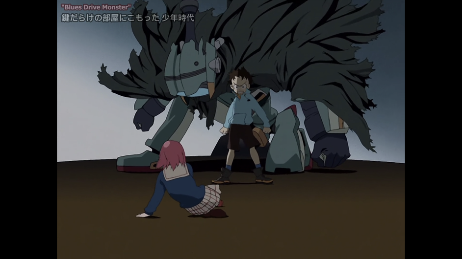
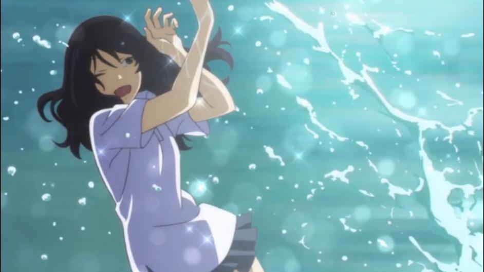
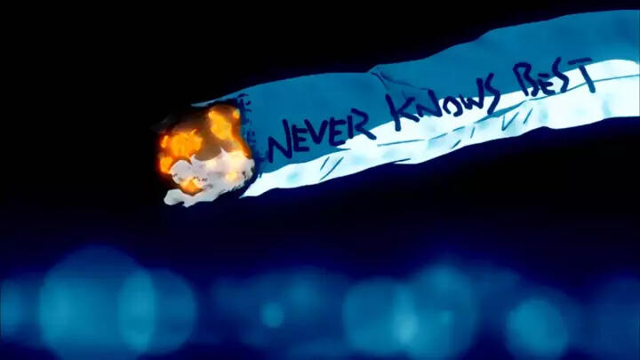
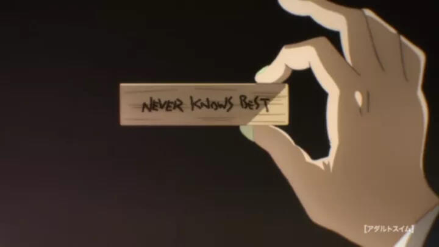

<!--
 * @Author: pikapikapikaori pikapikapi_kaori@icloud.com
 * @Date: 2023-04-17 18:47:26
 * @LastEditors: pikapikapikaori pikapikapi_kaori@icloud.com
 * @LastEditTime: 2023-04-25 16:21:25
 * @FilePath: /pikapikapi-blog/docs/writings/FLCL-20180922.md
 * @Description: 这是默认设置,请设置`customMade`, 打开koroFileHeader查看配置 进行设置: https://github.com/OBKoro1/koro1FileHeader/wiki/%E9%85%8D%E7%BD%AE
-->
# 「FLCL」：以青春之名向平庸的反抗

> 本文首发于[知乎](https://zhuanlan.zhihu.com/p/45132455)\
> 发表日期：2018.9.22

21世纪初，鹤卷和哉监督的作品「FLCL」映在了电视的屏幕上（指在电视上放碟观看OVA），其看似毫无逻辑的故事却让看过它的观众直呼过瘾。时隔18年后的今天，参与了「FLCL」动画制作的Production.I.G公司推出了其续作「FLCL Alternative」与「FLCL Progressive」，一时间让动画爱好者们激动不已。

然而，鲜有观众能在观看过后说出其讲的是个什么故事。不过，观众们并不会因好奇其所述的故事而沉迷与研究剧情之中，反而是一边大喊畅快，一边播放着the pillows乐队为其所作的插曲与主题歌。究竟是什么让「FLCL」具有如此魅力？

## 不拘一格的剧情

形如熨斗的Medical Mechanica在不断磨平小镇中每个人的棱角，而在身为小学生的直太的头脑中，却进行着天马行空的想象，而这又通过晴子使其成为现实。

「FLCL」不是一部能够轻易看懂的作品，尽管如此，无数观众在观看时仍是畅快的，这归功于它不常规的叙述故事的方法。通过使用非线性叙事的叙述方法，又不遵循传统剧本设计方法而大幅提高高潮部分在每一幕所占的比重，尽管让观众看得云里雾里，却借由紧凑的剧情与天马行空的想象将动画的情感提到了最高。而到了高潮部分，又通过具象化的战斗场景，使观众积聚的情感在一瞬间被宣泄出来。

尽管动画的故事本身看上去似乎十分荒谬，但「FLCL」却有着一个独特的内核：以青春之名向平庸发起的战争。青春是每一个观众都曾拥有的，而动画所展现的青春与“成熟”的冲突，正可以引起观众的共情。在动画中，通过实体化和隐喻的手段，将直太心中富有个性的孩童一面与追求着成为“成熟”的大人一面的斗争具象化。当直太举起贝斯向怪物挥去，高声呐喊的那一瞬间，正是他的青春向“成熟”所发起的斗争，而这也正能让观众回忆起自己的青春与成长。

## 极具力度感的作画与分镜

受制于时代原因，「FLCL」的分镜和作画都是比较具有时代特点的：对长镜头的偏爱，摇镜、推拉镜头、晃动的镜头的大量使用，画面的常规构图……这些都是那个年代较为流行的分镜手法。而「FLCL」的特别之处，在于其将摇镜、推拉镜头快速进行，又使用较为夸张的透视，让观众很好的感受到了人物动作的力度感；演算系的作画则很好的展现了人物动作的力度与运动趋势，而今石洋之更为风格化的金田系作画也使得「FLCL」更具风格。

最让观众震撼的大概是第一话和第六话那两段类似“视频漫画”的部分。这是一个极为大胆的手段，基本可以说是“前无古人，后无来者”。通过将黑白色的漫画置于动画之中，并快速的进行格子的转换，使整段动画充斥着大量的信息，而人物快速的对话与小幅度的动作则进一步增加了动画的信息量，让观众看得极其畅快。

## ROCK & ROLL

the pillows成就了「FLCL」，「FLCL」也成就了the pillows。谁能想到the pillows能凭借着其粉丝的一部OVA动画而从此更为出名，谁有能想到the pillows的摇滚乐如此适合「FLCL」，能让观众感到如此酣畅淋漓？为什么他们的歌与「FLCL」如此般配？

the pillows的摇滚乐其实是比较传统的。但就《little busters》一曲的乐谱上来看，其有着摇滚乐的几乎一切典型特征：基于riff的编曲与进行方向不明确的和弦体现出了极强的节奏感，大量切分音与低音的运用和失真的电吉他、电贝司的器乐声使得音乐更显激情。但也仅此而已。硬要说有什么特别的话，可能只是它对于器乐的强化以及对声乐的弱化特点并不十分突出。

那么为什么the pillows的歌与「FLCL」如此般配？更多的，应该是其乐思与「FLCL」的相近。摇滚精神是什么？说到底，是反抗。the pillows借由歌词与编曲，很好的传递出了“青春与平庸的反抗”这样的主题，其与「FLCL」是如此的相匹配，也因而让《little busters》在动画爱好者心中变得如此经典。

在「FLCL」的出色光芒下，续作「FLCL Alternative」与「FLCL Progressive」就显得逊色不少。不过，这两部续作并不像大多失望的「FLCL」粉丝所说的那样一无是处。如今自然很难再有人能够随性的达到当年那一群深知宅心的老害们所处的高度，但我们也必须承认，「FLCL Alternative」与「FLCL Progressive」中所做出的尝试，是值得肯定甚至有趣的。

## Alternative

「FLCL」 「FLCL Alternative」继承了「FLCL」的主题与内核，却没有一味地进行复制，而是将新的元素融合到了里面，创造出了全新的「FLCL」。正如上村泰监督所说的那样，「FLCL Alternative」融入了不少“少女情怀”，因而大体可以将其租略的概括为“空气系与「FLCL」的结合”。

广义“空气系”动画的元素在「FLCL Alternative」里的体现是十分明显的：对爱情的懵懂，对梦想的追逐，对友情的维护……这些都在「FLCL Alternative」中有所展现，而在这样的故事主题之下，却又将「FLCL」的故事元素（如怪物以及与怪物的斗争等）加入其中，使得本该有些无趣的“空气系”具有着强烈的情感，这使得「FLCL Alternative」变得分外有趣，同时也不失激情。

「FLCL Alternative」虽然如「FLCL」那样有着略显荒诞的情节，但总体上来说，通过使用大量广义“空气系”动画所常用的叙事手法，如线性叙事、对常规的少女日常故事展现、极具这类动画特色的台词话语等等，使得「FLCL Alternative」变得更易理解些。另一方面，「FLCL Alternative」在「FLCL」的基础上将“抗争”这一主题进一步具象化，也通过更加宏达的战争，使“青春与平庸的抗争”显得更加突出，这使得「FLCL Alternative」也能让观众不至于失望。

「FLCL Alternative」虽然如「FLCL」那样有着略显荒诞的情节，但总体上来说，通过使用大量广义“空气系”动画所常用的叙事手法，如线性叙事、对常规的少女日常故事展现、极具这类动画特色的台词话语等等，使得「FLCL Alternative」变得更易理解些。另一方面，「FLCL Alternative」在「FLCL」的基础上将“抗争”这一主题进一步具象化，也通过更加宏达的战争，使“青春与平庸的抗争”显得更加突出，这使得「FLCL Alternative」也能让观众不至于失望。

分镜与作画手法上，「FLCL Alternative」也很能显出“新「FLCL」”特点。由赛璐璐转为如今的数码作画，「FLCL Alternative」的色彩变得更具饱和度，对光线与阴影的处理也更加完美，同时人物动作也更加的流畅。另一方面，「FLCL Alternative」的分镜也很有特点。它有着日常类动画常用的镜头语言：以生硬的切接为主，将对物件的特写，对单一人物的中近景画面，以及对多个人物的中远景相互拼接。但同时，它又使用了极具当今动作场面分镜特点的镜头：将战斗双方的中远景，对战斗一方的近景乃至特写，对旁观者的镜头相结合，同时又辅以轻微的镜头晃动等手段，以此来展现出双方的动作与位置变化与趋势。虽然这样的作画与分镜方法使得「FLCL」所强调的力度感不再那么明显，却也不失为一种有趣的做法。

## Progressive

相较于「FLCL Alternative」，「FLCL Progressive」反倒更具“美式动画”风格，其体现在画面中大量使用的过饱和色彩与弱化的阴影处理，也因此画面更显简洁。 

IG对于这一部所用的描述词是“大暴走”。在「FLCL Progressive」中很容易感受到这一特点，因而风格上反而更接近于「FLCL」了。本作通过将两组角色置于主角位置，将抗争这一主题进一步深化，并加入了针对于“青春与平庸抗争”这一主题的两个晴子的相互抗争。动画上的尝试是很容易注意到的：同样毫无逻辑的情节展开，同样无边际的畅想，甚至还同样加入了使用类似于“动态漫画”的手法的片段。事实上，这些手段的效果是很明显的。应当承认，配合着the pillows的摇滚乐，「FLCL Progressive」中不少片段实际上也在很大程度上点燃了观众的情绪。

可惜的是，对于情绪把控的不到位，使得「FLCL Progressive」虽有了「FLCL」的形，却没有继承其神，也就是说，因为其完全不能让观众看得爽，反而是其无逻辑的情节发展成为了致命的缺点。这样一味地模仿宅社曾经的做法显然是很难把动画做好的。

## Fooly Cooly

「FLCL」的魅力到底在哪？是前文所述的剧情、分镜、音乐吗？是其天马行空的想象力、不拘一格的叙述方式、富于激情的情感氛围吗？是，但更重要的，是其“青春”这一主题。「FLCL」很好的为我们复现了青春的一切，满足了我们对青春的一切期待。在这样的基础之上，加之一切出色的表现手段，才成就了「FLCL」。

想要彻底分析清楚「FLCL」是不可能的，也是没有必要的。观众的任务仅仅在于享受这部动画，并让其点燃自己的情绪。我们不需要弄清楚「FLCL」的一切，正如动画中的那一句话所言：

## Never Knows Best

文章至此结束，感谢各位的阅读。
