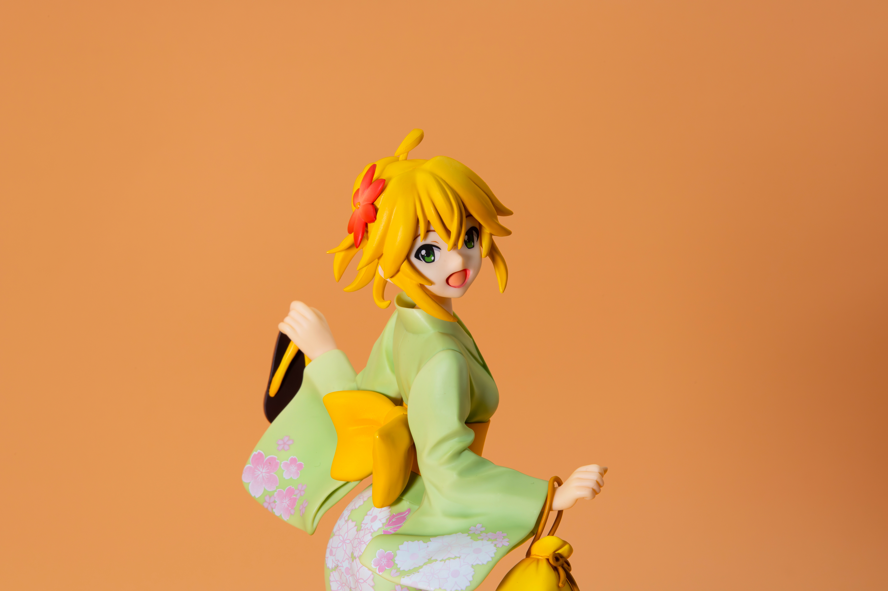
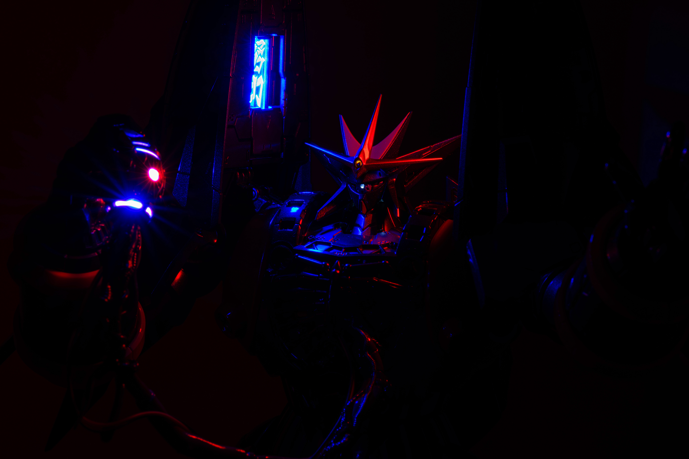
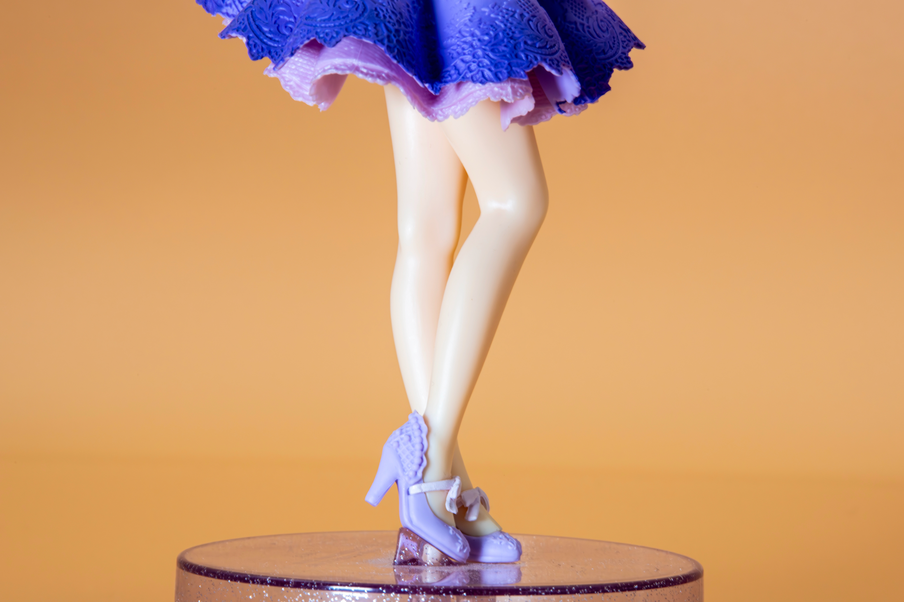

# 随记：玩具重摄 甲辰年四月十八日

> 本文首发于个人博客\
> 发表日期：2024.04.18\
> 最后编辑于：{docsify-last-updated}

甲辰年四月十八日，申城。

前些日子去日本旅行时顺便买了新相机。因为本身比较守旧所以在现在的微单时代最终还是选择了尼康 d850，配了镜头 70-200/2.8g、24-70/2.8e、闪光灯 sb-5000。为了拍手办买了个摄影棚，以及斯丹德的摄影灯一盏。

<section class="multi-images-container-section">

</section>
