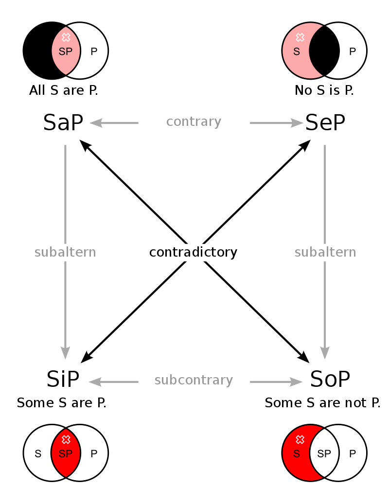

# 二维语义学 阅读笔记

> 本文首发于个人博客\
> 发表日期：2024.07.19\
> 最后编辑于：{docsify-last-updated}

开始之前先复习一下逻辑系统和分析哲学的几个基础概念。

## 词项逻辑

亚里士多德（<ruby class='minority-language-font-ruby'>Αριστοτέλης</ruby>）的词项逻辑（Term logic）最重要的结论就是传统三段论。词项逻辑首先把构成命题的基础单元即项划分为主项、谓项、量项和联项。同时出于他自身的共相/唯名论的形而上学基础将项又划分为了单称与全称。命题则根据性质与数量对应地分为肯定的/否定的于全称的/特称的，由此构建出了他的对立四边形。

### 三段论

为了对三段论进行形式化，结论中的谓项被称为大项 $P$，主项被称为小项 $S$；公共项被称为 $M$；包含大项的前提为大前提，包含小项的前提为小前提。形式化地考虑亚里士多德最有名的那个三段论：

1. 人皆有死。
2. 苏格拉底是人。
3. 苏格拉底有死。

其可以转写为：

1. $A\space M-P$
2. $S-M$
3. $S-P$

进一步地，亚里士多德根据前提的性质和数量，以及项的位置区分了三段论的语气（mood）与格（figure），由此发展出了对命题进行变化的换位与简约公式。芝诺创建的斯多葛派学者则发现了包含排中律在内的五个推理形式。

## 自然演绎逻辑

对于系统 $\mathfrak{L}$ 的一个版本的自然演绎逻辑中，只有如下九个基本规则：

1. 假定规则 A
2. 肯定前件规则 MPP
3. 双重否定规则 DN
4. 条件证明规则 CP
5. $\land-$ 介入规则 $\land$I
6. $\land-$ 除去规则 $\land$E
7. $\lor-$ 介入规则 $\lor$I
8. $\lor-$ 除去规则 $\lor$E
9. 反证法规则 RAA

## 希尔伯特演绎系统

1. $\phi\rightarrow(\psi\rightarrow \phi)$
2. $(\phi\rightarrow(\psi\rightarrow\xi))\rightarrow((\phi\rightarrow \psi)\rightarrow(\phi\rightarrow\xi))$
3. $(\neg \phi\rightarrow\neg \psi)\rightarrow((\neg \phi\rightarrow \psi)\rightarrow \phi)$
4. $\forall x(\phi)\rightarrow\phi[x\backslash t]$，这里 $t$ 是自由变元
5. $\forall x(\phi\rightarrow\psi)\rightarrow(\forall x\space\phi\rightarrow\forall x\space\psi)$
6. $\phi\rightarrow\forall x\space\phi$，这里 $x$ 不是自由变元
7. $\forall x,x=x$
8. $(x=y)\rightarrow(\phi[z\backslash x]\rightarrow\phi[z\backslash y])$

## 命题逻辑与一阶谓词逻辑

考虑逻辑联结词 $\neg,\land,\lor,\rightarrow,\leftrightarrow$；同时考虑量化符号 $\forall,\exist$。以及用于表达项/对象关系的断言符号与函数符号 $A^n_j(x_1,\dots,x_n),f^n_j(x_1,\dots,x_n)$。我们知道：

1. $\phi\land\psi:=\neg(\phi\rightarrow(\neg\psi))$
2. $\phi\lor\psi:=(\neg\phi)\rightarrow\psi$
3. $\phi\leftrightarrow\psi:=(\phi\rightarrow\psi)\land(\phi\leftarrow\psi)$
4. $\exist x\space \phi:=\neg\forall x \neg \phi$

考虑公式 $\forall x(A^1_1(x)\rightarrow A^1_2(y))$，$A^1_1(x)$ 的 $x$ 是约束变量，$A^1_2(y)$ 的 $y$ 是自由变量。

这里要注意区分自然演绎（Natural Deduction）、命题逻辑（Propositional Logic）与一阶谓词逻辑（First-order Logic）。由自然演绎方法构造的命题逻辑系统被简称为 PN 推演，或者说是语言系统 $\mathfrak{L}$ 上的形式逻辑系统 $N_\mathfrak{L}$。一阶谓词逻辑 $K_\mathfrak{L}$ 是命题逻辑的扩展，引入了量化符号、断言符号与函数符号。

### 推理规则 MP

1. $P\rightarrow Q$
2. $P$
3. $Q$

### 公理系统

1. $P\rightarrow(Q\rightarrow P)$
2. $(P\rightarrow(Q\rightarrow R))\rightarrow((P\rightarrow Q)\rightarrow(P\rightarrow R))$
3. $(\neg P\rightarrow\neg Q)\rightarrow((\neg P\rightarrow Q)\rightarrow P)$
4. 对于项 $T$，$t$ 为其中出现的变量。如果公式 $P$ 中自由的 $x$ 都不在 $\forall t$ 中，有 $\forall x\space P\rightarrow P(T)$
5. 对于约束变量 $x$，$(\forall x (P\rightarrow Q))\rightarrow(P\rightarrow(\forall x\space Q))$
6. $(\forall x(P\rightarrow Q))\rightarrow((\forall x\space P)\rightarrow(\forall x\space Q))$
7. $P\rightarrow\forall x\space P$

## 模态逻辑

莱布尼兹（Leibniz）为了调和单子论与必然性/偶然性问题，论证我们的世界是上帝所可能创造出的世界中最善的那个，或者说，在全部可能的世界中，我们这个实际（actual）的世界是全部可能（possible）的世界中善的总量与恶的总量之差最大的那个。克里普克（Kripke）为了区分谓词逻辑中的爆炸原理问题的情态词，即 $\bot\rightarrow\phi$ 而引入。

模态逻辑在谓词逻辑基础上引入了两个全新的量化符号 $\Box,\Diamond$，前者表示在全部可能的世界中都是真的，相对的后者表示在某些可能的世界中是真的。我们知道定义：

1. $\Box\phi:=\neg\Diamond\neg\phi$
2. $\Diamond\phi:=\neg\Box\neg\phi$

这种形式的对偶算子在时序逻辑中也有较多出现（例如 LTL 中的 $F,G$ 和 $U,R$）。

目前有如下公理：

- $(N)$：$(\models\phi)\rightarrow(\models\Box\phi)$
- $(K)$：$\Box(\phi\rightarrow\psi)\rightarrow(\Box\phi\rightarrow\Box\psi)$
- $(T)$：$\Box\phi\rightarrow\phi$
- $(4)$：$\Box\phi\rightarrow\Box\Box\phi$
- $(B)$：$\phi\rightarrow\Box\Diamond\phi$
- $(D)$：$\Box\phi\rightarrow\Diamond\phi$
- $(5)$ 或 $(E)$：$\Diamond\phi\rightarrow\Box\Diamond\phi$

事实上这里公理 $(5)$ 与公理 $(4)+(B)$ 等价。常见公理系统如下定义：

- $K_\mathfrak{L}:=(K)+(N)$
- $T_\mathfrak{L}:=K_\mathfrak{L}+(T)$
- $S4_\mathfrak{L}:=T_\mathfrak{L}+(4)$
- $S5_\mathfrak{L}:=S4_\mathfrak{L}+(5)$
- $D_\mathfrak{L}:=K_\mathfrak{L}+(D)$

## 罗素（Russell）的摹状词理论

摹状词理论是说，某个摹状词 $M$ 可以被专名/指称名词所转写，即其可以被描述为这样的形式：$\exist x, x$ 含有 $M$ 的性质。举例而言，对于词汇“飞马”的问题，其实际是一个摹状词，可以被转写成如下形式：如果存在一个 $x$，那么 $x$ 是一匹马，且 $x$ 会飞。由此便彻底解决了“飞马”的存在性问题。

## 传统语义学的金三角

现在终于可以回到正题了。先看传统语义学的金三角，定点上是意义（meaning）、理性（reason）、模态（modal）。其中意义，如克里普克认为的那样，属于语义学范畴；理性属于认识论范畴；模态则属于形而上学范畴。

### 意义

先看意义。意义对应某个符号的内涵（intension）与外延（extension）。我们知道皮尔士的指号学中将指号分为了符号、对象和解释项，其中对象偏向于客体一方而解释项偏向于主体一方；索绪尔的符号学则将符号视为能指与所指的二分，并引入意指过程完成能指与所指联系的建立过程。内涵与外延在这里的所指大抵对应于皮尔士的解释项和对象。举论文中的例子：考虑符号长庚星（Hesperus）与启明星（Phosphorus）。注意这里特意用的词语是符号而非摹状词或专名/指称名词。在我们的现实世界中，长庚星的内涵就是晚上在天空中出现的那颗星星，启明星的内涵则是早上在天空中出现的那颗星星。而两个词的外延都指金星（Venus），或者说是太阳系中绕太阳旋转的行星中轨道由内而外的第二颗行星。

这里要特别小心不要混淆符号、专名和摹状词。构词上来看，《说文解字》有：“启，开也”，“庚，位西方”；一如 Hesperus 一词转写自拉丁语 <ruby class='minority-language-font-ruby'>Hésperos</ruby>，而这一拉丁语翻译自希腊语 <ruby class='minority-language-font-ruby'>Ἕσπερος</ruby>，意为带来夜晚者，同时 Phosphorus/Eosphorus 转写自 <ruby class='minority-language-font-ruby'>Phōsphoros/Heōsphoros</ruby>，对应的希腊语为 <ruby class='minority-language-font-ruby'>Φωσφόρος/Ἑωσφόρος</ruby>，分别意为带来光之人与带来黎明者。正是由于这种词源太过容易注意使得我们很容易直接将符号与摹状词或专名之一联系起来。

就某种角度来看，意义本身的内涵与外延正对应了分析命题与综合命题。我们知道分析命题是那些谓词包含在主词概念中的命题。举例而言，一个词“独身者”，他必然包含了“具有单身性质的人”这样一种摹状的描述，或者即使退一万步来讲，他至少包含了“独身者”即它本身。从而“独身者是具有单身性质的人”，或者至少“独身者是独身者”这样的命题就是分析命题。相对应的，“某个特定的人是独身者”这样的命题就只能是综合命题了。

传统语义学认为符号的内涵与外延的统一是通过对象满足内涵与外延的真值决定的。或者说，正是金星那个星星满足是“白天出现在天空的那颗星星”，使得内涵为真，从而“长庚”的外延被限定为了金星。

### 理性

接着考虑理性。理性对应于先验（a priori）性与后验（a posteriori）性。先验这个词最初源于亚里士多德的分析方法，后来被康德（Kant）由《纯粹理性批判》普及，即是先于经验的。康德把感性分为经验直观（empirical intuition）和先验直观（intuition a priori），直观大抵可以用胡赛尔（Husserl）意向性理论中的“意向对象直接呈现给意向性活动”来解释。康德说时空观就是先验直观，因为其是随心灵一同先天获得的，而无需经过任何经验的加工与处理，由此物自体界便永远不可知了。

### 模态

最后看模态。模态对应于必然性（necessity）与偶然性（possibility）的对立，这大概至少可以追溯到亚里士多德。亚里士多德的著名理论“不动的推动者”，后来被约翰·司各脱（Johannes Scotus Erigena）改写为了自然的四部份即：

1. 未受造而具有创造力的上帝
2. 未受造而无创造力的虚无
3. 被创造而具有创造力的原初原因
4. 被创造而无创造力的物质宇宙

由此唯有上帝才是必然的，而包含我们的世界在内的一切都是偶然的。正是从这层意义上安瑟勒姆（Anselm）和托马斯·阿奎纳（St. Thomas Aquinas）完成了上帝的五路证明中的一种，并由此给笛卡尔（Descartes）根据“我思故我在”建立“思”与“物”的联系奠定了基础。

## 金三角的三边

首先考察弗雷格（Fregean）定理。弗雷格将意义与理性联系在一起，定理可以如此表述：

**弗雷格定理**：两个命题 $A$ 和 $B$ 有相同的内容（sense）当且仅当 $A\equiv B$ 在认知层面上的区别是微不足道的（cognitively insignificant）。

考察上述的例子“启明”与“长庚”。弗雷格的意思是“启明”和“长庚”在认识意义上已经有了区别，因为前者暗示了早上出现在天空中的星星，而后者暗示了夜晚中出现在天空的星星。我们知道两者相等是后验的，即后于经验的。相对的，“长庚”与“长庚”这两个命题则是根据同一律而得到的，是先验的。由此分析命题是先验的，综合命题是后验的。我们也知道逻辑实证主义说凡是有意义的命题要么是后验的，要么是可被经验证实的综合的，因此形而上学都是没有意义的，正是这一定理的发展。

查尔莫斯（Chalmers）这里将内容（sense）与内涵（intension）等价，又将认知意义上无区别（cognitively insignificant）与先验（a priori）等价，从而将原定理如下转写：

**弗雷格定理**：两个命题 $A$ 和 $B$ 有相同的内涵（intension）当且仅当 $A\equiv B$ 是先验的（a priori）。

这样的等价大抵不会有太多质疑空间。

**卡尔纳普定理**：两个命题 $A$ 和 $B$ 有相同的内涵（intension）当且仅当 $A\equiv B$ 是必然的（necessary）。

也就是说，根据卡尔纳普的说法，假设同一律在全部可能的世界中都是必然为真的，那么“长庚是长庚”这个命题就在全部可能的世界中都必然为真，从而这个命题就是个必然命题。然而我们很容易想象有一个可能的世界中早上和晚上在天空中亮着的星星不是一颗星星，那么在这个可能的世界中“长庚是启明”这个命题就不是真的了，从而这个命题是偶然而，从而其具有不同的内涵。

最后看康德定理。

**康德定理**：一个命题 $S$ 是必然的（necessary）当且仅当其是先验的（a priori）。

这个我们看过《纯粹理性批判》或者研究过康德的都知道，他先区分了分析的和综合的，先验的和后验的。然而又将直观分为感性直观和知性直观，前者是人类所有而后者是人类所没有的。最后他将感性直观分为经验直观与先验直观。康德指出分析的、先验的命题是必然的，而后验的命题都必定是偶然的。为了调和长久以来争论不休的数学和逻辑的存在性问题，康德提出了先天综合命题，特指如“$1+1=2$”这一类无法处理的问题。当然这类问题的处理我认为罗素处理的比较好。罗素指出所谓 $1+1=2$ 一类的命题并非是综合命题，而实际上都是满足同一律的分析命题。其实学过公里系统就比较好理解了，在某个集合中，我们是首先规定了后继函数，然后将 $1$ 的后继记为 $2:=succ(1)$。

## 克里普克的批判

回到正题。通过康德、弗雷格和卡尔纳普，传统语义学的金三角便被建立起来了。然而克里普克指出，凡是专名/指称名词都是严格的指示词。也就是说，克里普克指出，凡是“长庚”这个专名都指“金星”。在这一基础下，他区分了意义、理性和模态的范畴，并指出存在先验偶然命题与后验必然命题。考虑“长庚是金星”这个命题，它是一个后验必然命题，因为哪怕存在某个可能的世界，由于专名的严格指示词的性质，“长庚”永远都指称金星，从而使得这个后验命题具有了必然性。也就是说如此一来内涵便不能决定外延了，传统语义学的这一坚固观点便被彻底批判。

形式化地，考虑：

*引理 1*：$\forall x\Box(x=x)$

1. $\forall x(x=x)$ 这是必然有的公理或可以根据等式断言定义而推出的定理。
2. $\Box(\forall x(x=x))$ $(N)$
3. $\neg\forall x\Box(x=x)$ 假设。
4. $\exist x\neg\Box(x=x)$ 3，定义。
5. $\neg\Box(a=a)$ 4，定义。
6. $\Diamond\neg (a=a)$ 5，定义。
7. $W:\neg (a=a)$ 6，定义。
8. $W:\forall x(x=x)$ 1，定义。
9. $W:a=a$ 替换，这是必然有的公理或可以根据等式断言定义而推出的定理。
10. $\forall x\Box(x=x)$ 7、9 矛盾，3。

从而有：

1. $(x=y)\rightarrow(\phi[z\backslash x]\rightarrow\phi[z\backslash y])$ 这是必然有的公理或可以根据等式断言定义而推出的定理。
2. $(x=y)\rightarrow(\Box(x=x)\rightarrow\Box(x=y))$ 1，令 $\phi(z)=\Box(x=z)$
3. $\forall x\Box(x=x)$ 引理 1。
4. $\forall a\Box(a=a)$ 3。
5. $\Box(x=x)$ 替换，这是必然有的公理或可以根据等式断言定义而推出的定理。
6. $(x=y)$ 假设。
7. $\Box(x=x)\rightarrow\Box(x=y)$ 2、6 MP。
8. $\Box(x=y)$ 5、7 MP。
9. $(x=y)\rightarrow\Box(x=y)$ 6、8 演绎定理。
10. $\forall x\forall y((x=y)\rightarrow\Box(x=y))$ 全称量词引入，必然有的公理。

克里普克接着考虑两个符号“水”和“$H_2O$”，令 $x=$“水”，$y=$“$H_2O$”，则有 $($“水”$=$“$H_2O$”$)\rightarrow\Box($“水”$=$“$H_2O$”$)$。

## 查尔莫斯的二维语义学

为了解决这个问题，查尔莫斯提出了二维语义学。他指出所谓的可能性，这里的可能性本身就分为了认识论上的可能性与形而上学的可能性两个维度。前一个维度暗示原先的世界本可能是怎样的（a way the actual world might turn out to be），或者说撇开我们已经固定下来的对这个现实世界（actual world）的知识，一个人认为世界可能是怎样为现实的（considers a possibility as actual）。后一个维度被称为形而上学的可能性维度，这里暗示世界可能是但却不是怎样存在的（a way the world might have been but is not），或者说一个人认为这个世界是怎么反事实地存在的（considers a possibility as counterfactual）。由此克里普克的批判便被置于了第二个维度，第一个维度的语义学并未受到冲击。

查尔莫斯由此提出了核心定理并修正了弗雷格定理：

- **核心定理**：对任何命题 $S$，其是先验的当且仅当其在第一维度有必然的内涵（has a necessary 1-intension）。
- **新弗雷格定理**：两个命题 $A$ 和 $B$ 有相同的第一维度的内涵（the same 1-intension）当且仅当 $A\equiv B$ 是先验的（a priori）。

### 上下文内涵（contextual intension）与知识内涵（epistemic intension）

为了解决似乎永远不存在先验的且有必然的认识论内涵的命题这一问题，查尔莫斯从两个角度考察符号与命题的内涵。对于上下文内涵，处于上下文中的符号（token）本身已经存在了类型（expression type）上的差异。对于某个上下文，或者按他的说法在某个以说话者为话语出发点的世界（centered worlds）中，某个符号已经存在了类型上的差异：正字法（orthography）上看，“长庚”这个能指，凡是能指相同的符号，都具有相同的正字法类型；语言（linguistic）角度看，“水（water）”这个能指，如果这个能指出现在两个不同的上下文语境中，那么它们仍然具有相同的语言类型。语义上看，如果两个“水”这个能指，有相同的语义，或者至少某方面有部份相同的语义或内容，那么它们就具有相同的语义类型。

由此，考虑三个不同的可能的世界。第一个为现实世界，“水”作为所指称的那个无色无味生命之源的液体，其化学式为“$H_2O$”；第二个可能的世界，“水”仍然指那个无色无味生命之源的液体，但其化学式变成了“$XYZ$”；第三个可能的世界，“水”指金属，那个无色无味生命之源的液体的化学式仍然是“$H_2O$”。这样一来表达式“水是 $H_2O$”的真值由于其在现实世界为真，从而该表达式的正字法上下文内涵在现实世界为真，而在后两个可能的世界为假。这个意味是因为在现实世界里“水”与“$H_2O$”这两个能指被构建了正字法意义上的映射关系（通过内涵与外延但随后等价关系不再依赖于意义本身），而后两者并未构建这种映射关系，因而正字法意义上的上下文内涵总为假。

还是同样的例子，考虑语言上的上下文内涵。在第一个世界“水”与“$H_2O$”这两种表达方式被建立映射关系，而后两者中这种映射关系是否建立是未知的。从而语言意义上的上下文内涵在后两个世界中是未知的，因为这两种表达的映射关系可能被建立也可能未被建立。

或者也可以这么理解。一个能指符号 $A$ 对应于一个所指，所指被分为内涵 $i$ 与外延 $e$。内涵也就是说这个能指能够被用罗素的摹状词理论进行转写，外延也就是说这个能指其实是被变为了一个限定指示词，一个专名。对于某两个能指，正字法类型表明其映射关系建立在能指上；语言类型表明其映射关系建立在外延上；语义类型表明其映射关系建立在内涵上。就这种意义上，根本无法找到某个符号使得其在第一维度具有必然的内涵（哪怕是正字法上下文内涵），也因而核心定理永远无法满足。

借助于知识内涵（epistemic intension），查尔莫斯提出了情景（scenario）的概念，借此解决可解读性（scrutability）的问题。对于全部可能的世界中，有一些是可能的世界在某些程度上与我们的世界（中心的世界）相同，而另一些可能的世界则与我们的现实世界（中心的世界）完全不同，被称为反事实的世界。对于后者，我们很容易从反事实的、形而上学意义上的可能性出发，首先将特定能指与外延联系起来。对于前者，就能够从认识论意义上的可能性出发，将特定能指与内涵联系起来。某个符号序列组成的命题的知识内涵是情景到真值的映射，使得：

对于某个中心的世界 $W$，我们说该世界的某个说话者处于情景 $W$ 中。我们说在情景 $W$ 命题 $S$ 的知识内涵（epistemic intension）是真的当且仅当有某个对情景 $W$ 的标准化描述 $D$ 使得在情形 $D$ 中 $S$ 是认识论意义上必然的（epistemically necessitates）。

据此查尔莫斯做了更多定义：

- 丰富性原则（Plenitude Principle）：对全部的命题 $S$，其是知识可能的（epistemically possible），如果有某个情形 $W$ 使得在情形 $W$ 下命题为真。
- 形而上原则（Metaphysical Plenitude）：对全部的命题 $S$，其是知识可能的（epistemically possible），如果有某个形而上意义上可能的世界使得命题为真。
- 知识原则（Epistemic Plenitude）：对全部的命题 $S$，其是知识可能的（epistemically possible），如果有某个知识完全的句子 $L$，其蕴含 $S$。

从而可以定义可解读性（scrutability）：对于被一个说话者使用的绝大多数符号 $T$，进而对涉及 $T$ 的任何真理 $S$ 来说，都存在一个真理 $D$，$D$ 独立于 $T$，并且知道 $D$ 是事实使这个说话者处在一个能够（不需要来自经验的进一步信息，仅凭理想化的理性反思）知道 $S$ 也是事实的位置上。

或者也可以说，查尔莫斯的二维语义学实际上已经具有了日常语言学派和人工语言学派双方的特点了。克里普克将专名全都视为严格指示词，从而能将其作为词项直接应用到他的模态逻辑中。二维语义学的第二维度对应了这种能指与所指的构建，而二维语义学的第一维度与情景概念正是为了给被还原成严格指示词的专名符号重新赋予摹状词属性，就好像维特根斯坦后来所说的人们生活在其中的那种语言游戏。而为了确保可解读性查尔莫斯提出的这种绝对理性的对情形/决定语言游戏的生活形式的规范描述，成为了架在日常语言上的人工语言桥梁，这意味着似乎好像仍然必须要有一种需要认为构建的规范的语言，来完成对不同情形下符号的转写释义任务。

或者说，假设“$H_2O$”为专名，我们同克里普克一样考察“水”这个符号。二维语义学的两个维度分别对应了以下事实：

1. “水”这个符号实际上是一个摹状词，其等价于这样的集合：$\{x|\exist x,f(x)\}$，其中函数 $f(x)$ 代表 $x$ 满足“水”这个符号/摹状词指定的性质的集合。此时，“水”$\neq$“$H_2O$”。或者应该说，“水”$\supset$“$H_2O$”。这对应于二维语义学的第一个维度。
2. “水”这个符号实际上是一个专名，从而“水”$=$“$H_2O$”。这对应于二维语义学的第二个维度。

## 从维特根斯坦到海德格尔

现在重新考虑这个问题。蒯因批判克里普克对专名的使用，认为其对专名的使用正是预设了本质存在于对象内的前提，从而专名正对应了指称对象的本质本身，如果本质存在的话。从这层意义上看，查尔莫斯的回应实际上是通过扩展传统语义学来完成对克里普克摹状词/专名、认识论/本体论的二元对立的回应。倘若按照后期维特根斯坦暗示的那样，本质并不存在的话，二维语义学确实又将塌缩回传统语义学了。

另一方面仔细考察查尔莫斯的情景概念。情景与中心世界、可能世界种种概念的设置不已经先验预设了这样一种判断，即仿佛我们总能穷尽地通过逻辑验证完成对特定情景/中心世界下命题真值的判断了吗？然而事实上这确实是一种有些太过极端的逻辑实证主义风格的预设了。又或者是，像早期维特根斯坦与罗素那样，事先预设了事实与事态的二分对立，这里事态不正是可能世界的命题吗？

应该承认，上下文内涵中对正字法内涵的考察的确触及到了更深层的东西，将语言已经解构到了能指符号本身的地步，从而可以意识到这样一个问题，即可能在某些可能的世界中，逻辑判断符并不捕获其在我们生活的现实世界中所捕获的意义。

从这个角度来看，我们确实应该重新回到后期维特根斯坦与蒯因所提出的“翻译的不准确性”之中去了。查尔莫斯所谓情景，其实只是维特根斯坦所谓的、我们尚未发现（或者不可能发现但可能存在，从某种意味上也同样是尚未发现）的生活形式罢了，在这种生活形式中生活的人们仍然会进行对应的语言游戏，而不生活在其中的我们很容易可以想象存在一个可解释的、进行翻译的方式。就这一层面上看，维特根斯坦的世界图式，又或是塞拉斯所说的那个被语言做出承诺的、由进行语言游戏的居民所建造的世界故事其实也不过又是（递归的）另一种更加抽象的生活形式。只不过是可能的世界在当下的时机已经变成了不可能的世界，这种总有种唯实论色彩的共相式的世界图式才似乎永远处于黑格尔绝对精神式的运动之中。

回到解释问题。查尔莫斯认为对于某个情景 $W$ 和某个命题 $S$ 我们能够找到一种对情景的标准描述使得这个命题在那个描述下是必然的，或者说，对于其他情景也是可解读的。撇开那股人工语言学派的色彩，我们很容易发现这正是像蒯因所说的那个理论的边界问题一样，当这样的规范描述出现问题时，只需要对规范描述本身进行调整即可。

我不由得想到海德格尔所说的操劳的人们。锤子作为锤子是什么呢？海德格尔区分手边工具与应手工具。当直棍与石块的组合被用于敲击以建造房屋时，其就成为了锤子。而当其未被使用时，其就只是手边的工具，或者也可能不是工具而已。对手边与应收的区分事实上正是对生活形式从另一个角度上的审视。

最后考虑德里达的“延异”。按照他的说法，万事万物都在“延异”之中，颇有些赫拉克利特的味道。但这种“延异”虽然标榜着对传统结构的消解，但延异本身是否又成为了新的结构呢？或者说一个问题是，延异本身是否在延异呢？如果延异之后仍然是延异，那么他的延异体现在哪里呢？不过延异本身倒却是也契合语言本身。无论是查尔莫斯所说的扩展了的上下文内涵、知识内涵，还是在变化着的生活形式中被主体进行的语言游戏，都暗示着语言本身的“延异”。

追寻怎么发生的、偶然为什么是如此的偶然实际上还是会落入某种本质主义的窠臼，仿佛总有些东西是永恒在那的，在发生的过程中总有些可以被追溯到“不动的推动者”的东西。仍然潜藏在现在哲学深处的这个最善的善，只有在重新回归到维特根斯坦所提出的生活形式之中、海德格尔所谓的被存在抛入其中操劳的人们的世界之中才终于短暂的消失。

## 参考文献

1. Chalmers, D. J. (2006). The Foundations of Two-Dimensional Semantics. In Oxford University Press eBooks (pp. 55–140). https://doi.org/10.1093/oso/9780199271955.003.0004
2. Gensler, H. J. (2012). Introduction to Logic. Routledge. http://books.google.ie/books?id=HnRekA0qkPsC&printsec=frontcover&dq=Introduction+to+Logic&hl=&cd=1&source=gbs_api
