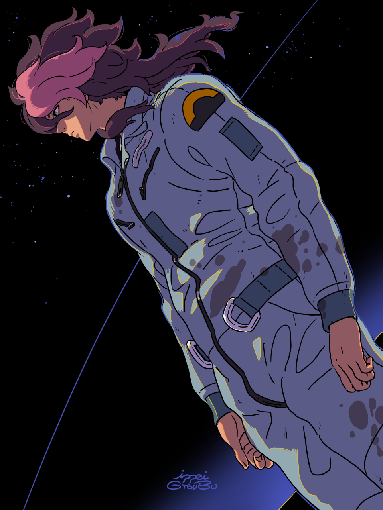
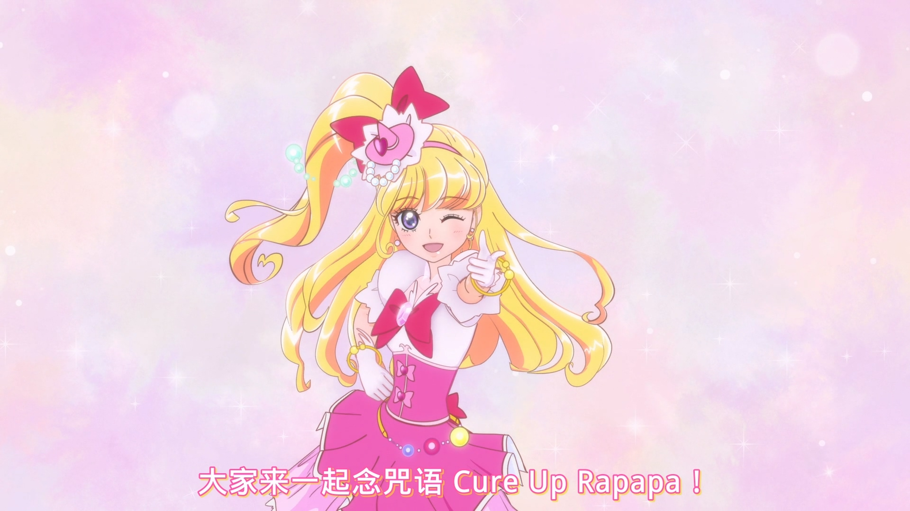
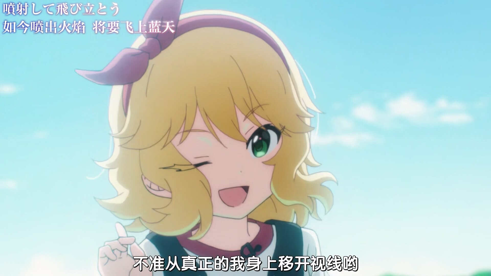
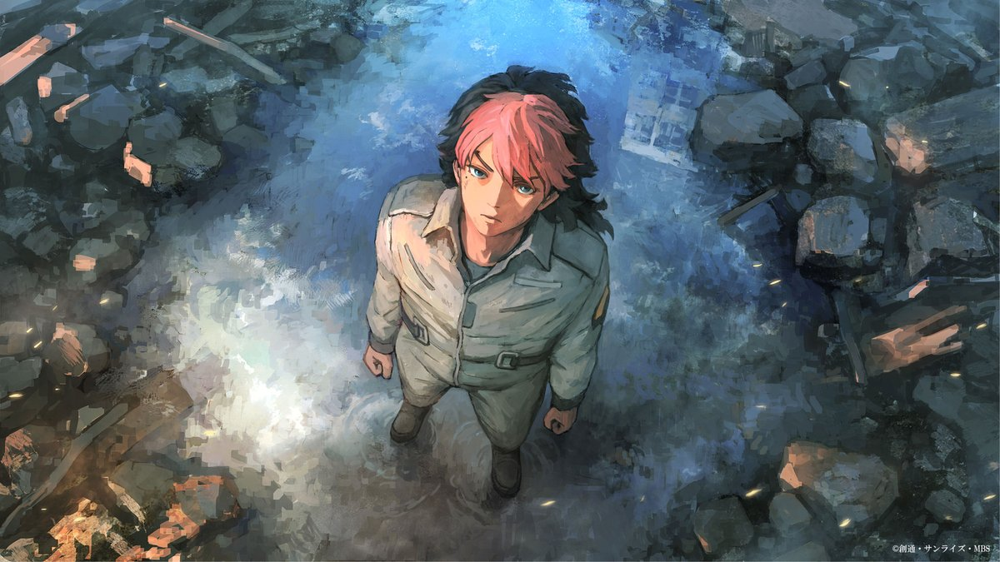

# 季度印象最深刻单集 2023.4

> 本文首发于个人博客\
> 发表日期：

## 「ひろがるスカイ!プリキュア」 ep.13

> 播出时间：2023.4.30

天空q ep13，值得在系列历史中留下一笔的一话。应该是系列第一次变身不打怪，且全程敌人未出现的一话（愈q ep26总集篇；热q ep33小剧场虽然也不注重打怪，但还是让变身打怪来方便卖玩具了）。肉身打架的q娃不仅仅只是20年前宣扬的女性独立战斗的代表，而更重要的是帮助他人的心情。本话用帮助离别者的明线暗点主角间未知的分离算是点找的挺好的一个地方，另一方面新篇章的推进也不再是遗忘的拿到新玩具来推动展开。不过笔力实在是一般。

另外一提本集片尾报幕是最喜欢的キュアミラクル。

ep48的分离连接到了ep49的再会，而ep49的重逢又指向了ep50的未来，单这两集半多就将前中期的甜水百合拉高了不少，实在是难以忘记的神回。不知道明年的二期会延续出怎样的故事。

## 「アイドルマスター シンデレラガールズ U149」 ep.4

> 播出时间：2023.4.26

U149，很容易发现其与765本家动画的相似之处。ep4为桃华回，从一开始桃华与爱丽丝的明暗双线便已经确立，无论是隔桌形成的显著对比又或是小物服饰上的巨大差异都在强着这样的一种对立。情节推进场景转移的过程中，这种对立不断地被蹦极这一阻碍消解着：当桃华第一次站到蹦极高处的边缘，当p体验过蹦极后来安慰桃华，等等。而当桃华背身向后落去的同时，前述的这种对立被彻底消解了。也由此，爱丽丝才能与她坐在同一张长椅上，笑谈渴饮“普通的”矿泉水。「羽が折れているのに飛んでいくもの、なに？」标题的谜底也在桃华纵身一跃的同时呼之欲出。

桃华蹦极那段的作画也非常厉害，看过就能最直观地感受到，整集前段略显压抑的情绪也在那一段得到了最大的释放。

## 「機動戦士ガンダム 水星の魔女 Season2」 ep.17

> 播出时间：2023.5.7

敢达水星魔女，グエル也即挑染这个角色确实是刻画的挺好的。从s1ep1开始一直到如今的s2ep17，尽管只是寥寥几笔，却有着充足的成长性。s1ep12的父子戏、s2ep15给出的地球上实战规格机战都利用比较传统的机战战争戏来给这个角色刺激，这一点在水星魔女这个聚焦于校园不死人敢达决斗的青春校园片里实在是难能可贵，换句话说实在是难得的敢达味（ep15标题「父と子」，对应的Z敢达ep5标题「父と子）。而这一真实性也直接延续到了s2ep17的敢达决斗，几个舱内的镜头算是给了不错的交代。

> 图源（按序）：twi[@AkimatutiX](https://twitter.com/AkimatutiX)，s2ep15エンディングイラスト

## 「天国大魔境」 ep.10

> 播出时间：2023.6.3

五十嵐海回，非常异质、个人风格非常明显的一回。作画与节奏上的异质化最能直观地感受到，故而不再赘述。多处漫符化的演绎在暗藏的压抑氛围下显得突兀与珍贵，反而加强了前段的违和感。说来五十嵐近几年的风格倒是都挺高度突出的：「Cyberpunk: Edgerunners」 ep.6，「SSSS.DYNAZENON」 ep.10，等等。不过整体来看本集风格的整体性一般，很难说算得上很好。
