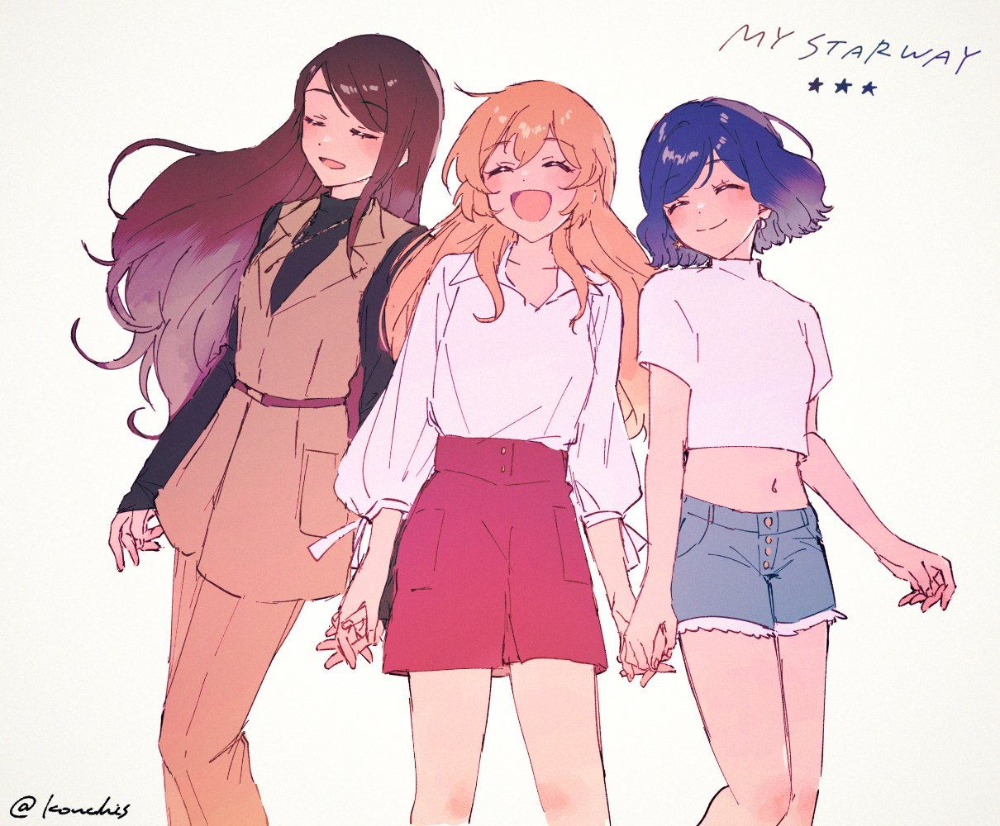

# 季度印象最深刻单集 2024.04

> 本文首发于个人博客\
> 发表日期：\
> 最后编辑于：{docsify-last-updated}

## 「ガールズバンドクライ」 #1 「東京ワッショイ」

> 播出时间：2024.04.05

最大的特点自然是其与其他3D动画片在渲染上的巨大区别。比起传统日本3D二次元动画片想要接近手绘的效果而进行的抽卡和对线条阴影的特殊渲染，本作不仅给出了极高张数，在人物的服装头发等的材质上都与传统思路完全不同，比起对线条抽象的追求而更倾向与对光线的细致还原。大概是因为12集的篇幅花田在本集给出了极高信息密度的处理（和隔壁终末列车差不多），对一些穿插的漫符/包袱情节的加入来调节节奏的处理也非常到位，看下来还是蛮畅快的。

## 「夜のクラゲは泳げない」 #1 「夜のクラゲ」

> 播出时间：2024.04.06

同季度两部女同乐队片的另一部，近些年类似题材都相当之多。本话说印象深刻也深刻，说不深刻也不深刻。高信息密度的做法一如女孩乐队哭，同样的情节缓急的设置与前后的对应也做的十分到位。花里胡哨的各种演出全都用上了，模拟实拍的各种镜头摇晃失焦虚化，动画难见的各种花样的遮挡转场匹配转场等等。与之匹配的作画力也在全力描绘者女孩们的可爱。不过处理全都特殊的结果就是每一处的特殊都变成了平庸，比起华丽的炫技与行文表达更契合的做法才是最恰当的。

## 「ブルーアーカイブ The Animation」 #2 「私は認めない！」

> 播出时间：2024.04.14

正片有多难看ed做的就有多好看。第二集放在这里并不是第二集有多好看反而是好看的ed首次出现在第二集。如上所述全力表现生活感的ed在这里的各种演出是非常到位且恰当的。摇晃倾斜失焦的镜头、对肢体的特写、模拟长曝光的特殊处理、跳切与对移动端照片视频的模拟都展现着不经意间对女孩们生活片段的捕捉。每一个观众都能从中感受到女孩子们的青春美好。

<iframe style="aspect-ratio: 16/9;" src="https://www.youtube.com/embed/d0rctEnBwsQ?si=uUxezqX4CwP4pGej" title="YouTube video player" frameborder="0" allow="accelerometer; autoplay; clipboard-write; encrypted-media; gyroscope; picture-in-picture; web-share" referrerpolicy="strict-origin-when-cross-origin" allowfullscreen></iframe>

## 「無職転生Ⅱ ～異世界行ったら本気だす～ 第2クール」 #14 「披露宴」

> 播出时间：2024.04.14

本质上是二期分割放送，前两集的质量也确实一如二期上半一样糟糕。制作上错误的思路还是未能改变：资源完全向动作倾倒而忽视了演技乃至于柄的稳定性，同时似乎上来说之后的迷宫篇会获得之前保留的大部分资源。

本集记在这里也是因为初次出现的op和ed，尤其是前者。很容易发现设计上的思路已经由之前注重鲁迪与他人建立的联系转向了时间的流逝与家庭本身，这倒也与之后的情节即新婚篇尤其是其后的迷宫篇日记篇相契合。波动的线条就仿佛不断流淌的时间河流，转场所借助的遮挡物与匹配物则连接起了本不可能相连的时间片段。最大的惊喜果然还是在对新生儿手脚的特写上，这是鲁迪与保罗，同时也是鲁迪与自己子嗣的联系。相比于之前“认真活下去”的表现是踏出那一步去与他人建立起联系，从这里开始鲁迪的“本気”转向了对他人的尤其是对家庭的重视，不再以转生游戏般的态度而是以真正的与他人建立起了联系的鲁迪的身份去活下去。而这我想也是无职转生最最打动人的，也是迷宫篇与日记人神篇如此好看的最大原因。

<iframe style="aspect-ratio: 16/9;" src="https://www.youtube.com/embed/kQ5Zfgpirwc?si=XWYesboOacXu-jOk" title="YouTube video player" frameborder="0" allow="accelerometer; autoplay; clipboard-write; encrypted-media; gyroscope; picture-in-picture; web-share" referrerpolicy="strict-origin-when-cross-origin" allowfullscreen></iframe>

<iframe style="aspect-ratio: 16/9;" src="https://www.youtube.com/embed/1C_cjVx66PE?si=OK7JUgvWaG_eVDpp" title="YouTube video player" frameborder="0" allow="accelerometer; autoplay; clipboard-write; encrypted-media; gyroscope; picture-in-picture; web-share" referrerpolicy="strict-origin-when-cross-origin" allowfullscreen></iframe>

## 「無職転生Ⅱ ～異世界行ったら本気だす～ 第2クール」 #17 「兄貴の気持ち」

> 播出时间：2024.05.05

进入迷宫篇前的最后一集同时也是对诺伦与鲁迪的重要塑造回，演出上终于体现出了一些心思。鲁迪推门进入直到与诺伦和解的几段镜头设计确实是还蛮花里胡哨的，几个画面的剪切很能直接展现这一点，不过设计的有些太直白突兀了，并不很能令人满意。

## 「ダンジョン飯」 #19 「山姥/夢魔」

> 播出时间：2024.05.09

应该说从#17开始迷宫饭的观感在不断提升，大概也有其中点出迷宫饭最内核的部份的原因。比起打赤龙救妹妹前相对更单纯地聚焦于饭这一点，后半部分开始更多地转向角色本身。继#17直指内核之后，#18重回单元剧，利用变形怪完成了对角色兼具趣味性与丰富度的塑造，本话的后半段则将焦点聚于在前段侧重饭部份时未能塑造多少的マルシル，捎带一丁点宿命论的同时又不过多强调自父亲的具体源头，反倒是与先前复活妹妹的情节杂糅到一起，以迷宫饭一贯的风格完成了队内成员的某种救赎，同时还不忘继续丰富对ライオス的塑造又对往后的大战埋下伏笔，而即使不考虑这一点也能浅显直白地将其视作是マルシル心境的变化，演出太优秀。
