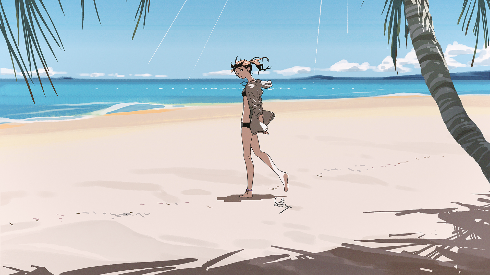
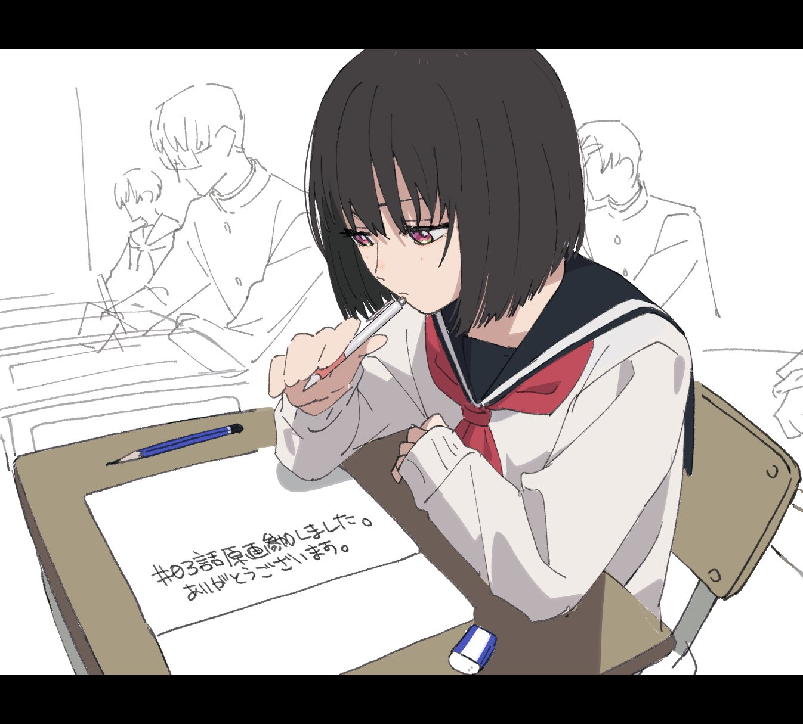
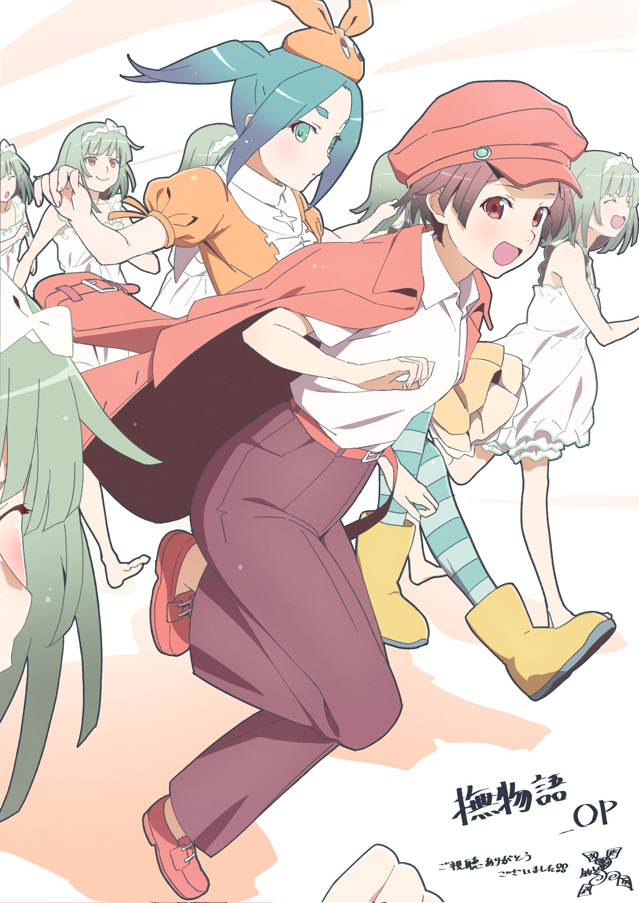

# 季度印象最深刻单集 2024.07

> 本文首发于个人博客\
> 发表日期：\
> 最后编辑于：{docsify-last-updated}

## 「杖と剣のウィストリア」 #1 「一振りの剣つるぎのように」

> 播出时间：2024.07.07

并不是说文本写的多么的好而是纯粹的以超高质量的作画演出夺得最大亮点，美术和摄影的处理也都恰到好处。张力、力度感和速度感都能在高张数下直观地感受到，而哪怕是其他的对话场面都有仔细地处理人物演技。高张数和吉原式的拖影给观看体验带来的提升无疑是巨大的。

## 「小市民シリーズ」 #2 「おいしいココアの作り方」

> 播出时间：2024.07.13

应该说是很有米澤味的日常推理故事吧，但最难能可贵的反而是这份日常。并不是像 #1 那样进行过多的省略以快速推进主线，本集悠闲地只对几杯热可可做推理分析这个情节比重的设置本身应该可以说是与「冰菓」一脉相承的。另一方面，推理本身呈现的过程却从某种意义是与「冰菓」彻底走向两个极端的，大量主观镜头的使用和台本量的减少使得推理过程融入了人物和动作之中，生动性与趣味性兼具的同时有力避免了大量文本可能导致的枯燥。尽管如此相承自上一集的本集放到动画整体之中去看节奏变化就有些太微妙了。

## 「〈物語〉シリーズ オフ&モンスターシーズン」 #3 「撫物語 第零話 なでこドロー 其ノ貮」

> 播出时间：2024.07.20

物语系列最新作或者说是对本篇系列彻底的补完，极具新房特色的演出本身从 #1 开始就已然回归，同时保持了系列一贯的突出效果。而放到本集才说更在于本集 OP 部分的出色，人物运动的风格与本篇完全不同，落于了写实的、具有自然感的生活片段。作画上的突出更是不必多说了。

## 「負けヒロインが多すぎる！」 #2 「約束された敗北を君に」

> 播出时间：2024.07.20

出色的 OP，出色的 ED，以及最重要的，作为恋爱喜剧的纯粹的趣味性吧。不在 #1 写是因为本集首次出现 OP。OP 的高饱和色块带来的强烈冲击，以及人物场景与职员表的交互，单独来看都不少见，但两者都在进一步加强交互与冲击的同时的互相结合带来的是更加欢快的、契合恋爱喜剧名头的氛围。

<iframe style="aspect-ratio: 16/9;" src="https://www.youtube.com/embed/7GJOBkIgWHc?si=Ek7cARVPWZE772_R" title="YouTube video player" frameborder="0" allow="accelerometer; autoplay; clipboard-write; encrypted-media; gyroscope; picture-in-picture; web-share" referrerpolicy="strict-origin-when-cross-origin" allowfullscreen></iframe>

ED 也同样有设计感。实拍与动画、少量空镜头与大量主观镜头，结合在模拟定格的抽格镜头与模拟赛璐璐的边缘 RGB 分离的颜色设计之中，极细甚至细到没有了的任务的线条与角色自身的颜色一同跃动着，呼喊着少年少女们的青春。

<iframe style="aspect-ratio: 16/9;" src="https://www.youtube.com/embed/2czbGCYz6gk?si=a8eyye4xt68A_qM6" title="YouTube video player" frameborder="0" allow="accelerometer; autoplay; clipboard-write; encrypted-media; gyroscope; picture-in-picture; web-share" referrerpolicy="strict-origin-when-cross-origin" allowfullscreen></iframe>

只能说恋爱喜剧很多，有着不错制作的恋爱喜剧动画片也不少，但在此之上还能有不低的趣味性的、回归趣味本身的就难得一见了吧。
