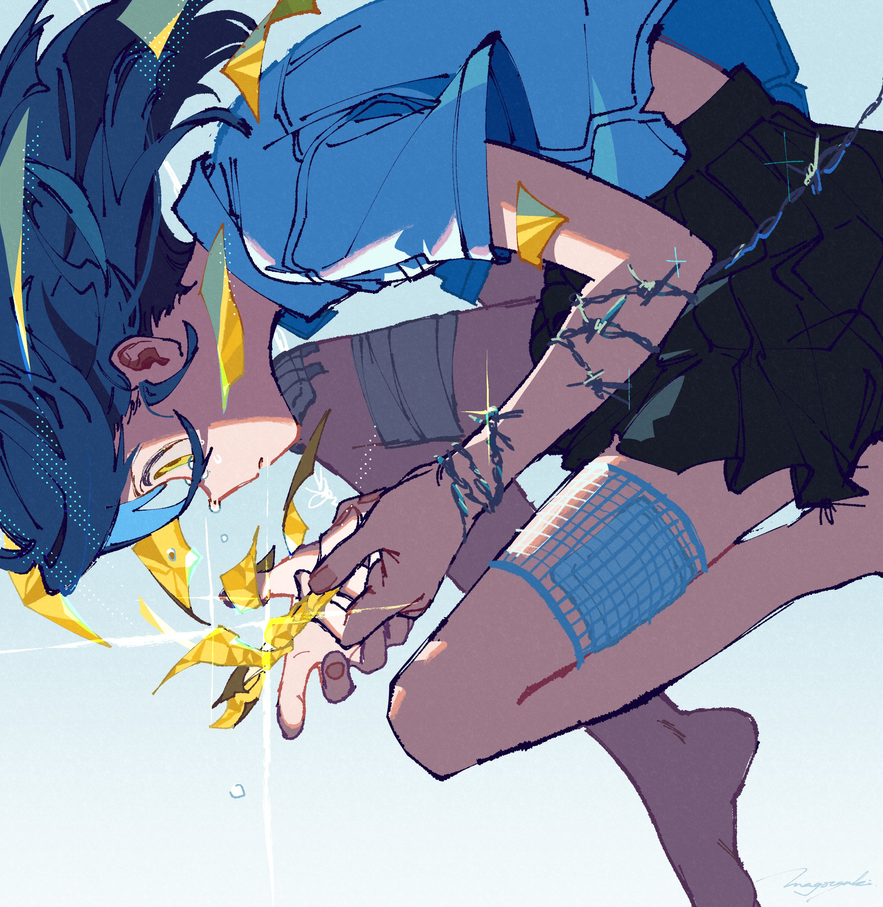

# 季度印象最深刻单集 2024.10

> 本文首发于个人博客\
> 发表日期：\
> 最后编辑于：{docsify-last-updated}

## 印象深刻 OP / ED 选

感觉最近几篇都要专门讲讲 OP / ED 的太频繁了，干脆从本篇开始专门列一栏吧。想了想现在动画片着重这方面也确实是适应短视频时代潮流，用一分半的短动画吸引观众。

### 「魔王様、リトライ！Ｒ」 ED

<iframe style="aspect-ratio: 16/9;" src="https://www.youtube.com/embed/sSDOFDgZEdk?si=oXvWg9-ZlLVDs9Xl" title="YouTube video player" frameborder="0" allow="accelerometer; autoplay; clipboard-write; encrypted-media; gyroscope; picture-in-picture; web-share" referrerpolicy="strict-origin-when-cross-origin" allowfullscreen></iframe>

### 「チ。 ―地球の運動について―」 ED

<iframe style="aspect-ratio: 16/9;" src="https://www.youtube.com/embed/F541MRFhXX8?si=QDBzIji_wW-whGPM" title="YouTube video player" frameborder="0" allow="accelerometer; autoplay; clipboard-write; encrypted-media; gyroscope; picture-in-picture; web-share" referrerpolicy="strict-origin-when-cross-origin" allowfullscreen></iframe>

### 「チ。 ―地球の運動について―」 OP

<iframe style="aspect-ratio: 16/9;" src="https://www.youtube.com/embed/eZAocot63s8?si=LAweTUQje-Pv8dSh" title="YouTube video player" frameborder="0" allow="accelerometer; autoplay; clipboard-write; encrypted-media; gyroscope; picture-in-picture; web-share" referrerpolicy="strict-origin-when-cross-origin" allowfullscreen></iframe>

### 「アオのハコ」 ED

<iframe style="aspect-ratio: 16/9;" src="https://www.youtube.com/embed/2k8zlyquTOs?si=MAyWM1XNCsSn3h6P" title="YouTube video player" frameborder="0" allow="accelerometer; autoplay; clipboard-write; encrypted-media; gyroscope; picture-in-picture; web-share" referrerpolicy="strict-origin-when-cross-origin" allowfullscreen></iframe>

### 「らんま1/2」 ED

<iframe style="aspect-ratio: 16/9;" src="https://www.youtube.com/embed/Sy-CYyfmO6g?si=l9G2sSS9KEbNXmGu" title="YouTube video player" frameborder="0" allow="accelerometer; autoplay; clipboard-write; encrypted-media; gyroscope; picture-in-picture; web-share" referrerpolicy="strict-origin-when-cross-origin" allowfullscreen></iframe>

## 「ダンダダン」 #5 「タマはどこじゃんよ」

> 播出时间：2024.10.31

季度最受瞩目也的确大约是本季目前为止最高质量的作品，科学猴汤浅徒弟山代風我的出色把控带来的是全方位的高质量制作与文本的趣味性的并驾齐驱，不过比起以非日常大场面引入作品背景并结束序章的前四话相比本话作为过渡回更显本作的高超水准，尤其是 A part 两人午休时在校园内互相寻找对方的部分。嘈杂的背景音画复用以及突出的前景人物主体对熟悉 ACGN 的观众来说可能会带有一种 Galgame 一般的异质感，不断错过的二人也可能让熟悉特摄片的朋友想起敏鬼在 555，在暴太郎中的趣味展开。而早已铺垫延续了许久的平缓却又跳动的定旋律，也在主角两人情绪的急转直下中不断变奏，同一动机不断重复，和声也转而只出现于乐句的结束，强化的节奏最终在两人相撞时化为清脆的响声结束了剧伴的同时又将文本转入到冲突将爆发的阶段，更不用提全过程中足够突出的对称的构图以及适当的跳切对整幕趣味性的贡献了。

## 「オーイ！とんぼ 第2期」 #24 「とんぼ、ホールアウト」

> 播出时间：2024.12.14

尽管制作上的贫穷已经到了难以掩盖的地步，但文本上的扎实却是从一期就已展现。除去足够高质量的高尔夫相关知识外，对包含乃至配角在内的众角色的成长性的刻画更是令人感叹，而这一出彩之处在本话最为突出。制胜球前以高尔夫球飞往不同方向，连带着完全不同的エマ、ひのき、円三人走向不同的方向，以此完成了一个十足明显的象征，而ひのき的迷茫也在她走上最短、最佳的球路时被反衬而出。然而最为精巧的设计恰恰在这之后，停下脚步准备击球的三人同时都望向とん所先至一步的果岭，那是他们共同的终点，也是如此不同的三人所共有的、对高尔夫的热爱本身。
