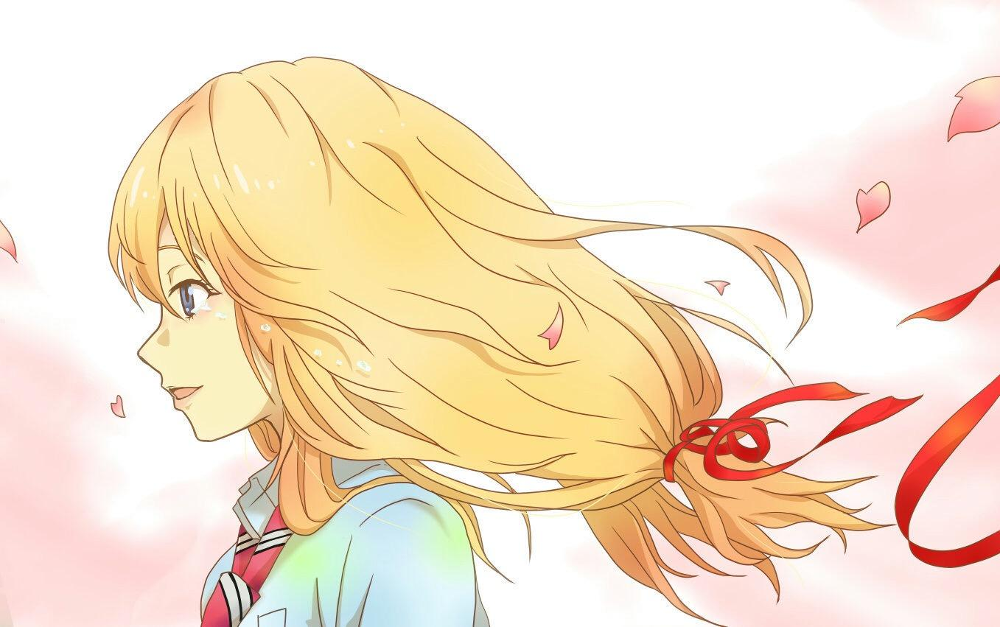
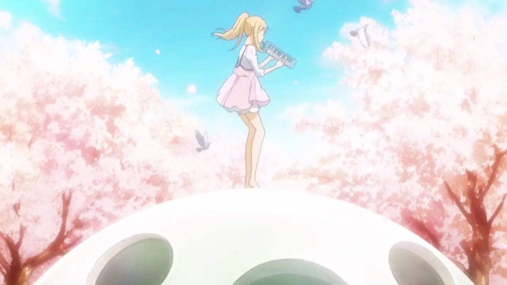
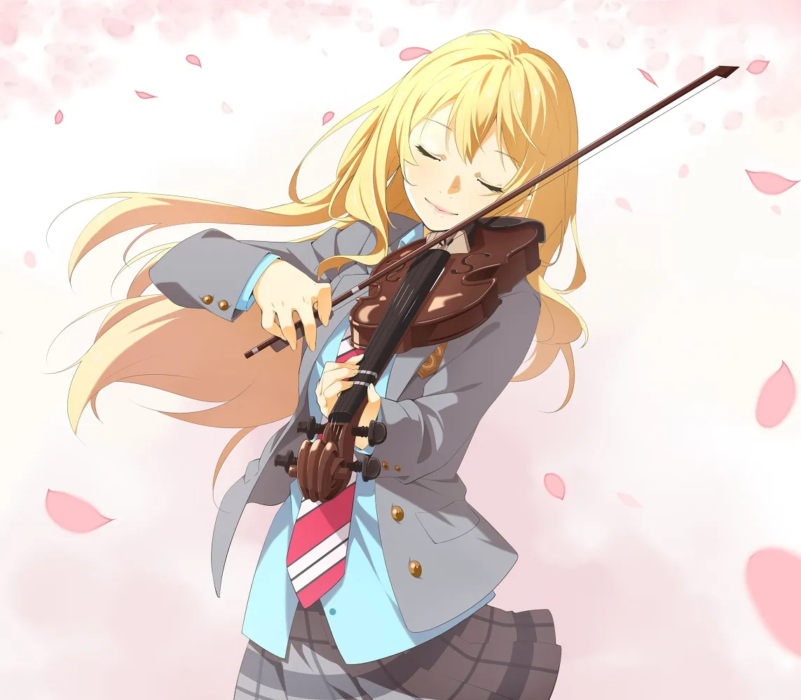
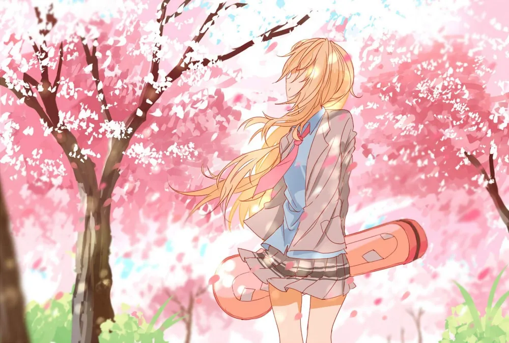
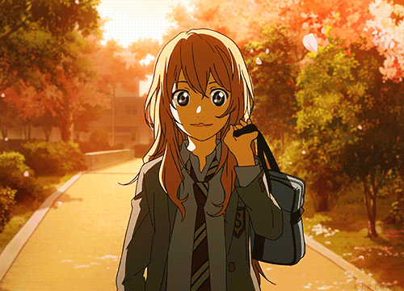

# 四月赏曲——浅谈「四月是你的谎言」音乐选择

> 本文首发于[知乎](https://zhuanlan.zhihu.com/p/35181770)\
> 发表日期：2018.4.1

## 零.

春天 马上就要来了

让我与你相遇的春天 就要来了

再也没有你的春天……就要来了。

## 壹.

伴随着小薰出场的，是口风琴版的《鸽子与少年》。《鸽子与少年》由久石让作曲，最初出现在宫崎骏执导的电影「天空之城」之中，是片中男主角巴斯每天早上用小号吹出的乐曲。乐曲采用六八拍，整体节奏十分欢快。

在「天空之城」开始处，每个早晨，少年巴斯都会站在房檐上，高高举起他的小号，并尽情地吹奏这首乐曲。每当此时，白鸽就会盘旋在空中，太阳也升了起来。

在「四月是你的谎言」第一话中，伴随着《鸽子与少年》，小薰在正片中第一次出场了。相似的，小薰站在一个半圆形台子上，同样有着白鸽盘旋在上空。风吹过，樱花飘落。伴随着背景中的樱花与整体泛白的画面，原本欢快的音乐也增加了一层浪漫的色彩。

## 贰.

小薰在比赛赛场演奏的乐曲是《A大调第九小提琴奏鸣曲（op.47）》（第一乐章），又名《克莱采奏鸣曲》。

克莱采是极具浪漫主义色彩的乐曲，甚至被誉为浪漫时期小提琴曲的巅峰之作，作曲家贝多芬曾用意大利语写到，他几乎是以协奏曲的方式来作曲的，而这一特点在第一乐章中就被体现出了。在第一乐章中，乐曲的整体风格是恢弘大气的，同时也是平静的，但小薰所演奏的克莱采，却与贝多芬作曲的版本完全不同。过于夸张的强弱对比，肆意改动作品中的原有记号，甚至是对节奏的大幅度改变，让本应具有浪漫主义色彩的一首乐曲变得有了些流行的感觉。小薰曾说过要按自己的喜好来进行演奏，而这一想法在她所演奏的克莱采中完全被展现了出来。

## 叁.

第三话中，小薰和公生唯一一次合奏的乐曲，是圣·桑的《序章与轮旋随想曲（op.28）
》。顾名思义，全曲由“序章”与“回旋曲”两部分组成。序章部分持续性的使用低音，并同时导出了慢速度的基本旋律。由于乐曲本身受到西班牙舞曲的影像，在序章部分小提琴演奏出了哈巴涅拉舞曲型的主旋律。回旋曲部分，则以切分音为基础不断重复中轻快的主旋律。有趣的是，在这样不断的重复中，却体现出了西班牙舞曲中的那种热情与奔放。这种热情与奔放伴随着小薰和公生的第一次合作，逐步把演奏推向高潮，同时也让小薰和公生的感情在演奏中更近了一步。

这首乐曲还被改编为了小薰的角色歌。很容易感受到，改编后的乐曲明显不在有那中热情奔放的感觉，正相反，配合着歌词，这首乐曲反而变得比较哀伤。从这样一个角度看，改编后的乐曲实在是非常贴合小薰的经历的。小薰在与公生相遇后改学小提琴，而后则变为小薰拯救公生，让他重拾钢琴。另一方面，背带到小薰面前的公生，也让小薰在最后的日子里能够实现一些愿望，变得幸福一些。可最终小薰还是故去了。改变后的乐曲，正如同动画的剧情一样，有这一种“凄美”的感觉。

## 肆.

《C大调作品第K.265/300e》，又名《小星星变奏曲》，由莫扎特创作，后被改编为童谣。全曲由12个变奏构成，旋律单纯质朴，主题浪漫而梦幻。据传莫扎特是在1778年旅居巴黎时为一位女弟子创作的这首变奏曲。具体的创作背景已无从考证，但这种说法也不失为一段佳话。在四谎中，小薰常在公生面前唱起这首曲子。欢快的节奏和有些浪漫的创作背景都为四谎中的这些片段增添了浪漫的气息。

## 伍.

曾有人说“小星星在你的头顶闪烁着呢”，可惜，好久都没有见到这个人了。在这样又一个四月之中，回响在耳边的只有这样几句简单的歌词：

> Twinkle, twinkle, little star\
> How I wonder what you are\
> Up above the world so high\
> Like a diamond in the sky

文章至此结束，感谢各位的阅读。
