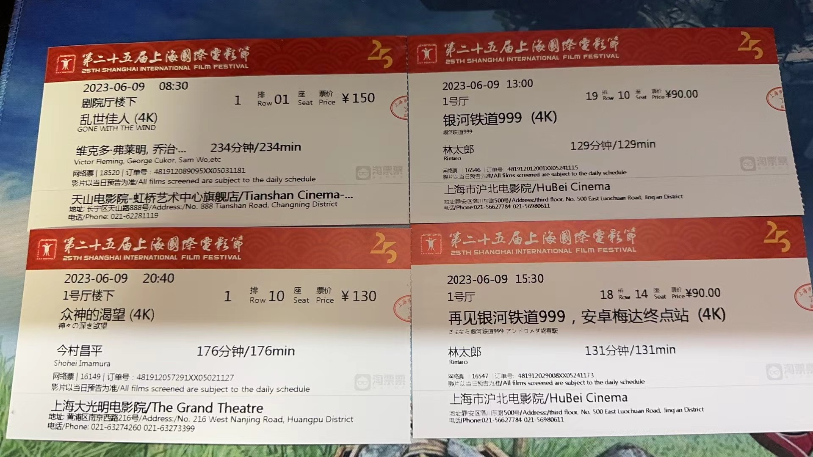
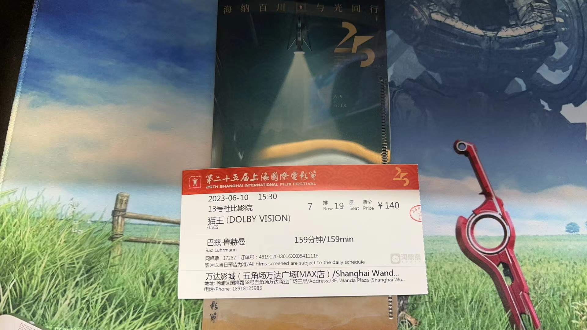
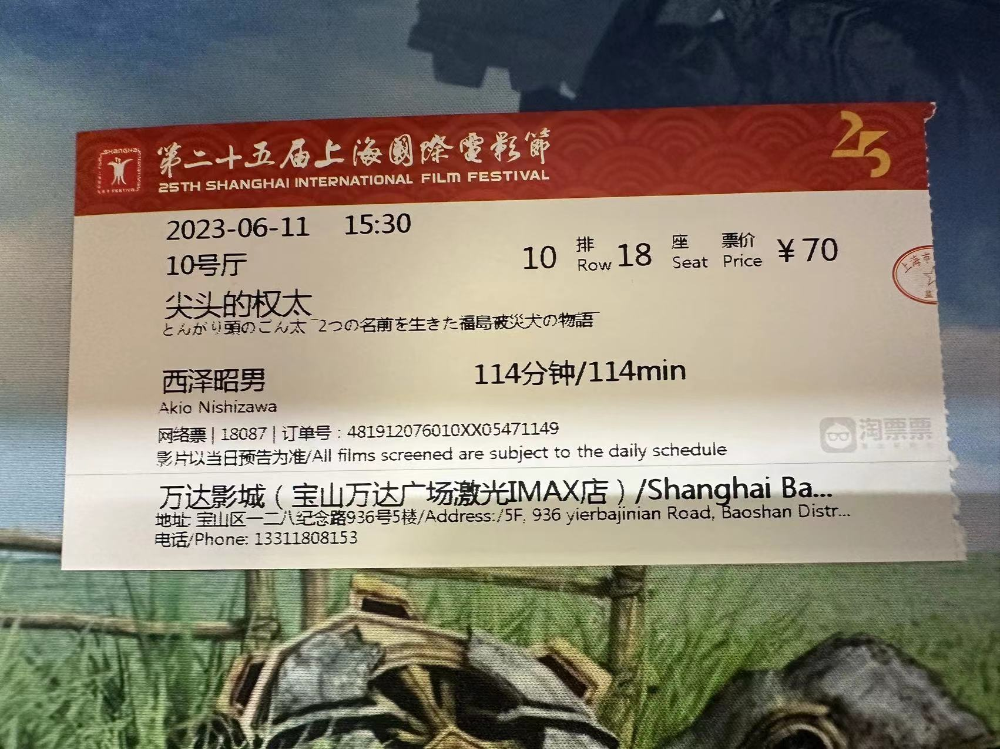
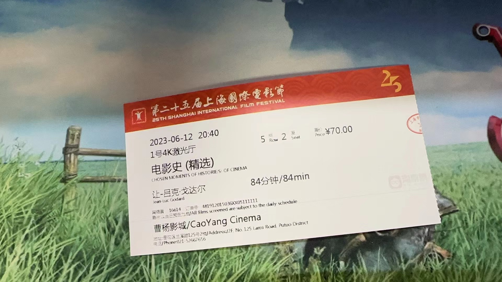

# 记第25届上海电影节

> 本文首发于个人博客 \
> 发表日期：

本届siff是因疫情停办一届siff后的首届siff，也是笔者本人参加的第五届siff，在此以观影后记为主简单记录一下。

## 片单发布与抢票

说来这一届时间安排和通知感觉排的比以往紧了不少。相较于往届通常在片单发布完成与正式抢票之间往往会间隔一周以上的时间，本次则是在5月31日晚完成片单的发布以后，仅仅在不足两天后的6月2日中午12点就开始了正式的抢票。另外一提抢票时间也从往届的周六早八点改到了周五的中午十二点。想来可能是由于24届siff时刚开票时出现的服务器网络问题导致。

本届siff完整的排片表可以参照[上海电影节官网](https://www.siff.com)，我也从官网下载了一份作为备份，可以从<a href='writings/_media/Siff25-20230604/siff-25-20230604.xlsx'>这里下载</a>。

个人来说其实对这届的片单不算满意。以教父、侯孝贤、戈达尔乃至EVA为代表的一系列电影实质上属于是siff常客了，年年都能看到。此外，感觉选片也有点太偏重大众口味了些。当然这可能也不算是一个缺点，毕竟大多数人被分流去抢了这些大热门，笔者想看的电影的抢票难度反而是降低了不少。

虽说如此，今年笔者也还是抢了挺多场，基本保证从首天6月9日至最后一天6月18日每天都排了至少一场。抢票的时候尽量避开了周末的场次，因而抢票难度下降了不少。

其实在此之外也还有几场电影笔者也挺想看的，不过因为片单公布时间与开票时间的间隔较短些，最终也没来得及做好规划。

说回本次笔者的最终排片。首日9号的排片也不是很好，前几场时间间隔太紧了，赶路时间比较勉强的同时也带来了没有午饭时间这一问题。另外最大的问题还是最终的排片太过分散了，这也直接导致了很难在此之上再增加其他要看的场次。其实在此之外也确实有几场笔者挺想看的电影，不过因为片单公布时间与开票时间的间隔较短些，最终也没来得及做好规划。现有场次中最感到有压力的果然还是「菲律宾暴力史」吧，全长413分钟简直恐怖。事实上笔者也没在电影院（甚至可以把“在电影院”去掉）看过如此长的电影。其他倒都还好些。

## 壹 首日 六月九日

首日排了四场电影，总计670分钟。虽然看似只排了四场电影，不过由于「乱世佳人」和「诸神的渴望」两部时间都比较长（都需要幕间休息），导致了最终四场电影的总时长在11小时以上。说实话尽管中间有一些时间的休息还是难免地感受到了疲劳。不过再一想毕竟是从早8:30的第一场一直看到了晚上11:30，这么疲劳倒也挺合理的。此外在「乱世佳人」结束后尽管以最快速度赶往下一场，也仅仅只勉强在13:00刚开播的时候完成了「银河铁道999 剧场版」的入场，说实话实在是太赶了，之后应该尽量避免这种赶场情况。

### 「乱世佳人」

首日看的第一场，影史经典「乱世佳人」。巧的是本场正好我的座位是一排一座。实话说本次在影院看最先也是最多注意到的其实是片中替代旁白成份出现的解释性文字。每当时空间大场景转换后，简单交代南北战争进展的解释性文字随着大全景或是空镜头浮现。虽然小说只看了中译没看原文，不过感觉上这些文字是直接照搬了原文。倒装反复对文的大量运用实在是太优美了，无论是音韵上的，还是形式的上的，激起了我阅读一遍原文的冲动。

说回影片本身，于1939年在小说发生地亚特兰大首映的片长整整234分钟的电影，全片都大胆地采取了人工上色。单这几点就足以让其在影史上留下一笔。原作小说作为玛格丽特一生唯一的作品，其伟大已无须多言。而对电影而言，尽管有这整整234分钟的时长却仍难以像原作那样徐徐道来，恐怕也只能说是受限于年代与篇幅了。无论是多次采用的背光调度、还是色彩与演技对情感的双重暗示，都体现出了本片在那个剪辑手法还未快速进步年代下的精妙。最有幸的大概是得意在大荧幕下看到4K修复的费雯·丽本人，这位演出了美国“红楼梦”中的丽人的英国人。随着她说出原文的最后一句台词“After all, tomorrow is another day.”，电影也如原作那样完成了最圆满的收尾。

另外一提，天山电影院的体验确实是最好的。无论是氛围，还是观众的整体素质。

### 「银河铁道999」 剧场版两部

大概是可以一起说说的两部，不过其实也没什么值得太多说的。浅显些的早已被片头片尾的几句旁白所揭露，往深里看也无非是在所谓的少年中寻找着多位扮演母亲的角色，一如隔壁的高达UC系列一般。

不过话又说回来，沪北电影院的体验明显的差。放映厅外就有卖各种食物的，致使在观影时全是吃食物的声音。

### 「诸神的渴望」

本片倒是第一次观看。说实话在经历了三部电影后已经快累的不行了。电影本身是异常的厉害。全片可说是神话在现实中的再演，人们传颂、利用神话的同时，也在确实地书写神话本身。而在这书写的过程中，今村则将现代与传统的碰撞也融入其中，夹揉着其他的诸多元素。技工、龟太郎与其他村民多次转变的对比大概是最具有讽刺效果的。作为今村的的代表作之一，作为被称为论文式电影的作品，本片很大程度地展现了今村和恩师小津的最根本区别。不过从另一层面上来说，本片实在可看性太低，看一遍看不懂，更多的感想需要留待下次观看后再评说。

再说说影院体验。本场在大光明电影院，观影体验也是不错的。说实话大光明和天山剧院厅感觉确实是上海体验最好的几个影院之一了。巨大的容量、影院对观影观众的观影礼仪提醒、字幕副屏，等等，组合起来能够带来最良好的体验。不过本场「诸神的渴望」的片源竟然是带内嵌英文字幕的，中文字幕也由英文字幕二次翻译而来，而非直译日文，也因而有一些因语言习惯导致的错译，这大概是本场最大的缺点。

## 贰 六月十日

今天只排了一场「猫王」，主要是为了在杜比厅爽爽才买的。看过之后还觉余味不足，因而晚上又买了场同样杜比厅的「变形金刚」随便看看。不过这倒也让我意识到，以后引进时做了3D转制处理的电影可以购买杜比厅的，这样可以享受原本的2D体验。

### 「猫王」

纯菜。倒是不至于到烂片的程度，只能说平平无奇吧。从头至尾都能体会到巴兹那一管的俗到不行土得没边的低级审美，镜头就一直在那转啊切啊，音响就一直在那轰鸣。整体而言也太过流水账了，完全没展露出猫王对音乐界乃至当时美国环境的真正意义，更不用说片中无法避开却只一笔略去的马丁路德金与肯尼迪遇刺两件大事。这么一个缺乏高潮的流水账故事大概也只能借助花哨的剪切和不间断的音乐来引起观众的高潮。

不过不得不说的就是这么一部电影倒确实适合在大荧幕尤其是杜比影厅观看。轰鸣的音乐和花哨的画面在这样的影厅中最大化地发挥了作用。然而本场影片放映未结束时甚至是字幕表还未开始滚动时影院就已早早地亮起了灯，导致了我在电影节中所见过的最高的离场率，实在不能称得上是好的体验。

## 叁 六月十一日

只排了一场「尖头的权太」，还是本届金爵奖动画单元参赛作品。本身期待并不高，只是没想到实在太难看。

### 「尖头的权太」

太烂，毫无特点。

影院体验一般，可能也有片子的问题，感觉椅子太硬角度太直，空调太热。

## 肆 六月十二日

### 「电影史」精选

每次看戈达尔都像在看论文，而这次在影院看「电影史」更感受到了读论文的痛苦。“电影史分为戈达尔前与戈达尔后。”戈达尔用电影、书籍与CD三种形式发布的这部「电影史」，从物理媒介上就最首先抛出了这一系列短片的一个最大议题。作为原片的「电影史」八个短片中，戈达尔分主题地对电影作了太多探讨。作家电影、电影与历史、电影作为历史的记录者与电影本身、电影作为语言、电影与认知。当戈达尔直白地抛出那些晦涩难懂的词藻时，观众才恍然大悟：观众自身正在观看的这部电影有了反身的属性，而反身延伸下去后，观众自身也成了被电影语言记录的历史。当他一如在当年「蔑视」首位将镜头朝向与背向观众那样再次将摄影机面向观众与摄像机本身，戈达尔的论点得到了最有力的证明。

可惜的是，Siff的这所谓精选集将原本主题明显的几个短片全部杂糅到一起，反而令观众更加不知所措。同时，字幕也一如本片常见的字幕源一般略去大量的对白。想来在Siff上初看本片的观众会更不知所措吧。
