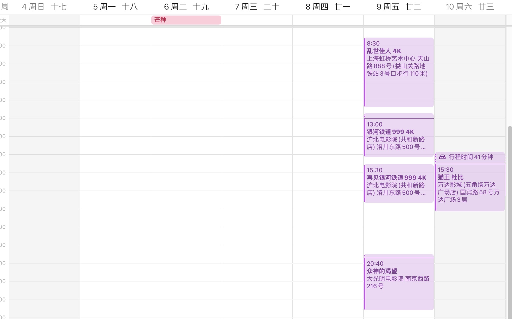
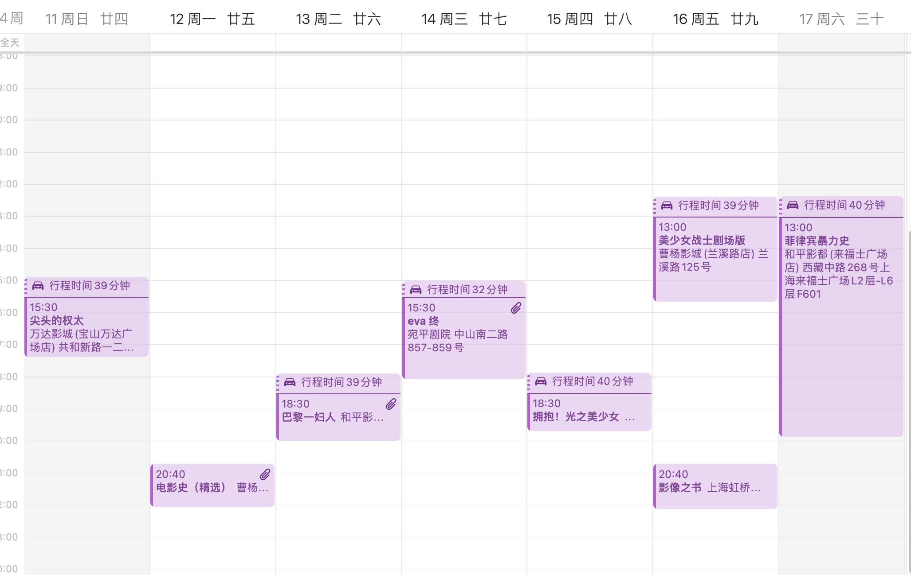

# 记第25届上海电影节

> 本文首发于个人博客 \
> 发表日期：

本届siff是因疫情停办一届siff后的首届siff，也是笔者本人参加的第五届siff，在此以观影后记为主简单记录一下。

## 片单发布与抢票

说来这一届时间安排和通知感觉排的比以往紧了不少。相较于往届通常在片单发布完成与正式抢票之间往往会间隔一周以上的时间，本次则是在5月31日晚完成片单的发布以后，仅仅在不足两天后的6月2日中午12点就开始了正式的抢票。另外一提抢票时间也从往届的周六早八点改到了周五的中午十二点。想来可能是由于24届siff时刚开票时出现的服务器网络问题导致。

本届siff完整的排片表可以参照[上海电影节官网](https://www.siff.com)，我也从官网下载了一份作为备份，可以从<a href='writings/_media/Siff25-20230604/siff-25-20230604.xlsx'>这里下载</a>。

个人来说其实对这届的片单不算满意。以教父、侯孝贤、戈达尔乃至EVA为代表的一系列电影实质上属于是siff常客了，年年都能看到。此外，感觉选片也有点太偏重大众口味了些。当然这可能也不算是一个缺点，毕竟大多数人被分流去抢了这些大热门，笔者想看的电影的抢票难度反而是降低了不少。

虽说如此，今年笔者也还是抢了挺多场，基本保证从首天6月9日至最后一天6月18日每天都排了至少一场。抢票的时候尽量避开了周末的场次，因而抢票难度下降了不少。

其实在此之外也还有几场电影笔者也挺想看的，不过因为片单公布时间与开票时间的间隔较短些，最终也没来得及做好规划。

说回本次笔者的最终排片。首日9号的排片也不是很好，前几场时间间隔太紧了，赶路时间比较勉强的同时也带来了没有午饭时间这一问题。另外最大的问题还是最终的排片太过分散了，这也直接导致了很难在此之上再增加其他要看的场次。其实在此之外也确实有几场笔者挺想看的电影，不过因为片单公布时间与开票时间的间隔较短些，最终也没来得及做好规划。现有场次中最感到有压力的果然还是「菲律宾暴力史」吧，全长413分钟简直恐怖。事实上笔者也没在电影院（甚至可以把“在电影院”去掉）看过如此长的电影。其他倒都还好些。
