# EM·魔术师·异色眼卡组分享

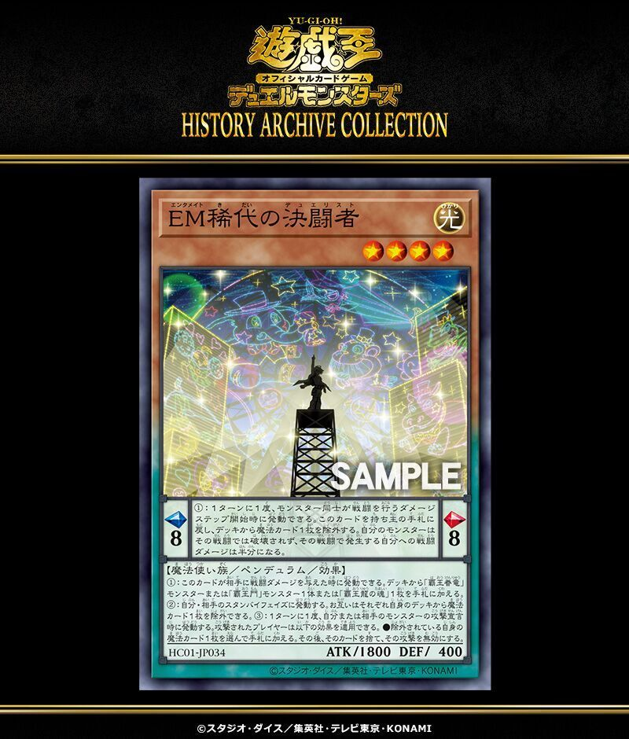

> 本文首发于个人博客\
> 发表日期：2023.06.15\
> 最后编辑于：{docsify-last-updated}

## 卡组介绍

直接上图：

本卡组最先是在 19 年 7 月初步构造完成，后续几年间逐渐进行调整。额外卡组位原先包含水机（「水晶机巧继承玻纤」），但由于 22 年 7 月表其变为禁止卡，故暂时以「轨迹之魔术师」替代。

## 常用combo

展开的目标套路是通过两个摆子拉「EM 灵摆魔术师」，根据情况选择炸一张或两张的P区来检索「EM 同调士」或者「EM 骷髅小丑」。在手牌佳的情况可以考虑利用「EM 骷髅小丑」来达到迅速赚卡的目的，而不需要赚卡的情况则可以利用「EM 同调士」来完成同调终端的要求。场上只要有两只灵摆怪兽就能链接召唤出「刚炼装勇士・银金公主」。这张卡是魔术师卡组的核心之一。利用一效可以讲「刻读之魔法师」或「宙读之魔法师」表侧加入额外，而再次利用二效炸P区拉刻读或者宙读就可以进行快速特招，还能利用刻读或者宙读的效果继续检索赚卡或是特招。

「神圣魔皇后塞勒涅」的加入也可以加速终端的完成。由于场上P区两张摆子已经算魔法卡，故而只需要双方场上与墓地再有一张魔法卡就能满足其三效的 cost ，可以快速进行多一次的特招。link-3 则让通过这张方式直接出一些要求不高的 link-4 终端变得方便快捷（如「召命之神弓-阿波罗萨 -」）。

另一方面，初期上手时，基本不会太过卡手。「EM 骷髅小丑」可以通招检索魔术师，刻读和宙读可以置于P区发动P效果来直接拉「时读之魔术师」与「星读之魔术师」上场。「决斗者降临」也可以稳定检索「灵摆」字段。而「星霜之灵摆读阵」则可以保证每回合稳定入手魔术师字段的怪兽。此外，「贱龙之魔术师」的P效一可以从额外回收表侧存在的魔术师或异色眼怪兽，「白翼之魔术师」、「调弦之魔术师」也可以进行额外的特招。

抗性方面，「时空之灵摆读阵」与「灵摆切换」两张永续陷阱组成了极强的机构。先来看这两张卡最关键的两个效果：

> 「时空之灵摆读阵」二效：\
> 以自己的怪兽区域·灵摆区域 1 张「魔术师」灵摆怪兽卡和对方场上 1 张卡为对象才能发动。那些卡破坏。没能因这个效果把 2 张卡破坏的场合，可以选场上1张卡送去墓地。\
> 「灵摆切换」：\
> 可以选择自己的灵摆区域 1 张卡；那张卡特殊召唤。可以选择自己的怪兽区域 1 只灵摆怪兽；那只怪兽在自己的灵摆区域放置。“灵摆切换”的效果 1 回合只能有1次使用其中任意 1 个。

由此可以直接做出这样的效果：

当场上或P区有至少一只灵摆怪兽 A 时，先利用「时空之灵摆读阵」的二效选中 A，再利用「灵摆切换」的效果选中 A。由于连锁发动的时点是「灵摆切换」先起效，随后再处理「时空之灵摆读阵」的二效。当处理到「时空之灵摆读阵」的二效时，由于「灵摆切换」的效果已被处理因而A无法被破坏，从而可以发动「时空之灵摆读阵」二效的送墓效果。尽管这个效果是取对象的，但其作为送墓而非破坏的效果已经足够强大了。

另一方面，「紫毒之魔术师」的P效一、「霞之谷的巨神鸟」也给了卡组一定的抗性。「天空之虹彩」在场的情况也能够使得场上的魔术师EM和异色眼怪兽处于无法被取对象的情况。处于个人习惯，笔者在这个卡组内加入了一些手坑。尽管这些泛用手坑和「EM·魔术师·异色眼」的相性没那么高，不过也可以考虑对方卡组情况而针对性的带几张。注意，由于「EM·魔术师·异色眼」的系统本身赚卡能力就已足够强大，因而一般情况下无需再加入「增殖的G」。

额外方面，「霸王眷龙凶饿毒」、「装弹枪管狞猛龙」、「访问码语者」、「装弹枪管龙」等等都算是比较泛用的终端，有着很高的强度，由于做出来的条件不算严苛且对字段属性种族等都没太高要求，因而在本卡组内也建议投入。「霸王眷龙幻透翼」、「饥凶毒致死龙」、「星刻之魔术师」、「轨迹之魔术师」则是本家怪兽，也有着较强力的效果，笔者个人而言比较喜欢。

## 调整思路

先看一下可以考虑投入的卡片吧：

<section class="multi-images-container-section">

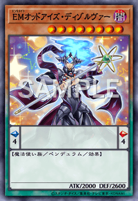
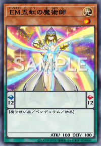
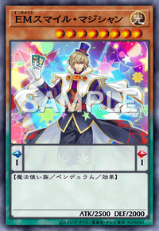
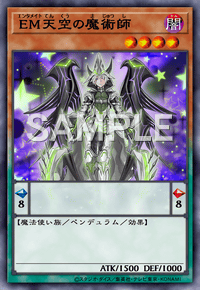
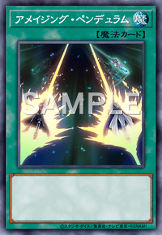
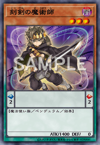
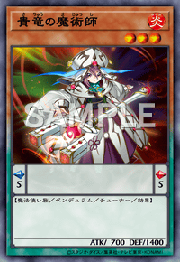
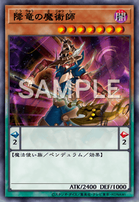
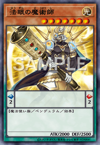
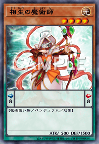
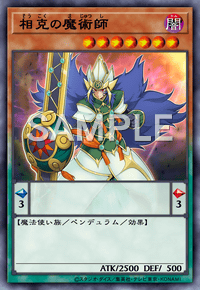
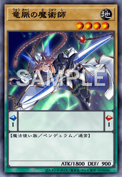
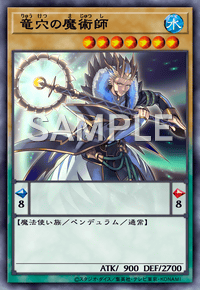
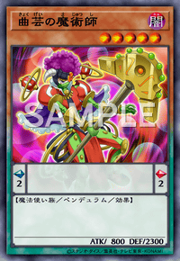
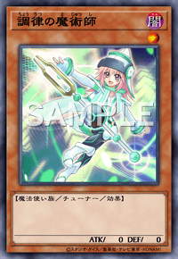
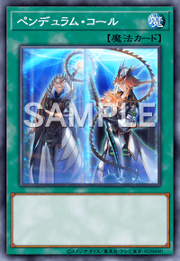
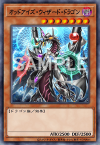
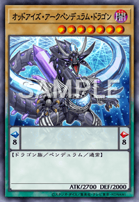
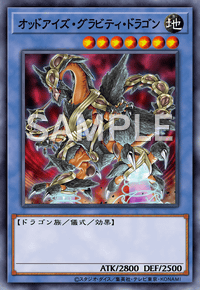
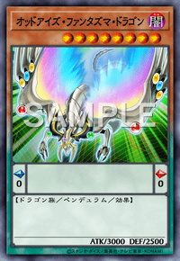
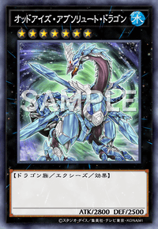
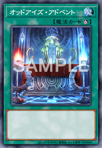
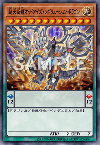
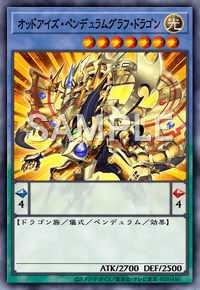
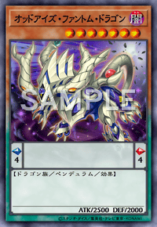
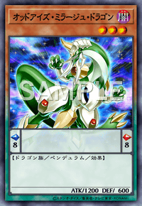
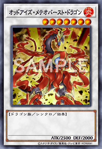
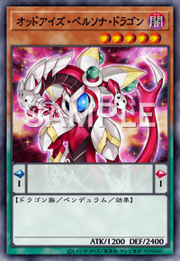
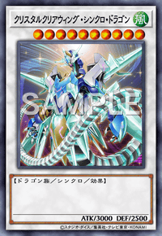
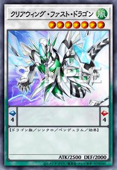
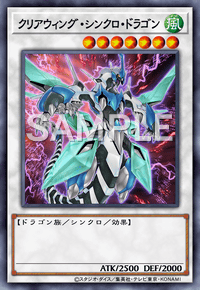
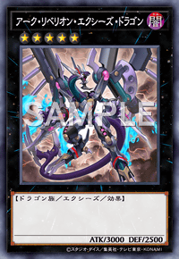
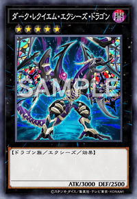
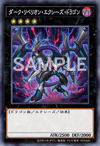
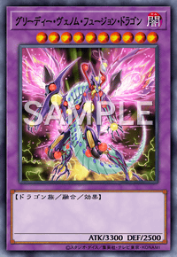
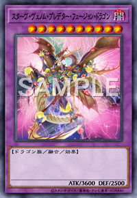
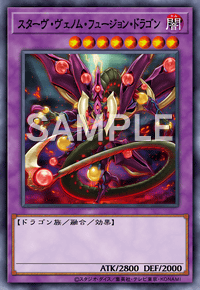
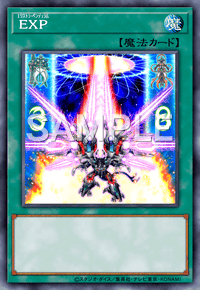
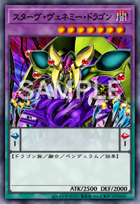

</section>

由于 EM 字段的强力卡基本都被禁了，因而可以根据需要从魔术师和异色眼字段寻找一些卡片投入。

另一方面，由于即将发售的 1202 中霸王也成为了新字段，因而可以考虑投入霸王字段的卡片：

<section class="multi-images-container-section">

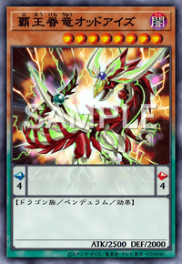
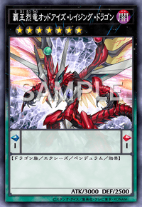
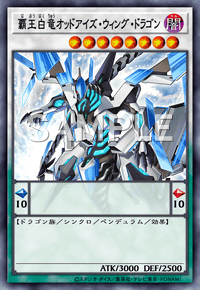
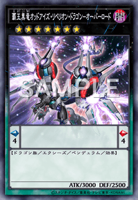
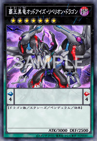
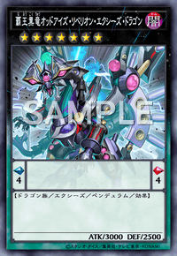
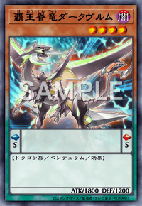
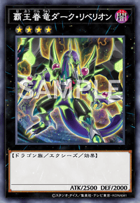
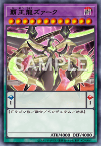
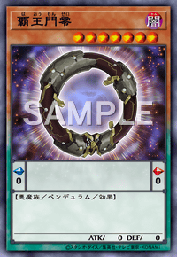

</section>

1202 新卡参考：

<section class="multi-images-container-section">

</section>

另一方面根据每季度的禁限卡表也可以考虑对卡片数量做出调整，如 23 年 1 月表起「虹彩之魔术师」不再为限制卡，可以考虑投入两张。泛用终端以及手坑也可以根据个人的喜好以及其与本卡组的相性进行一定程度的调整。

### 2023 年 7 月表后的新调整思路

由于 23 年 7 月表起「EM 琴键猴」由禁止卡调整为限制卡，故而可以向卡组中再多投入一张琴键猴。这一调整对整个卡组的提升相当有效。

## 参考资料

1. 本文所用卡图大多来源于[游戏王中国官方卡查网站](https://db.yugioh-card-cn.com/index.html)。
2. 本文卡组的卡图与文字版图片由游戏王官方 APP“Neuron”导出。
