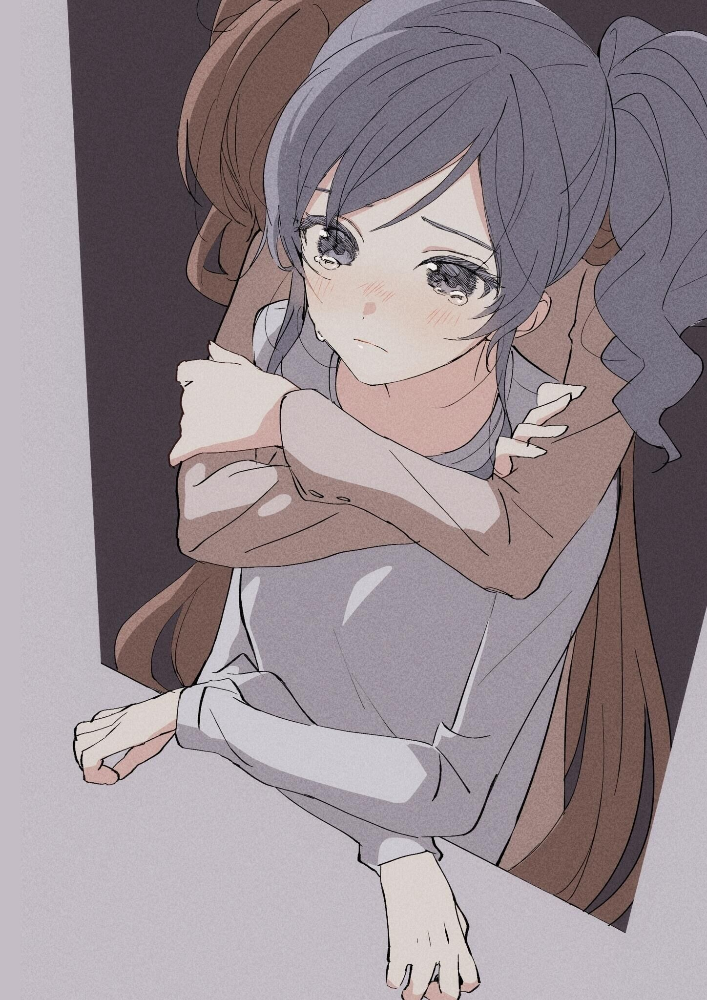

# 2024 年度 TV 动画单集十选

> 本文首发于个人博客\
> 发表日期：2025.01.08\
> 最后编辑于：{docsify-last-updated}

冬春夏秋季度动画见：

- [2024 冬季动画（2024.01）](/writings/SeasonBest-202401-20240301)
- [2024 春季动画（2024.04）](/writings/SeasonBest-202404-20240415)
- [2024 夏季动画（2024.07）](/writings/SeasonBest-202407-20240721)
- [2024 秋季动画（2024.10）](/writings/SeasonBest-202410-20241007)

仍然先重述下选集规则：

- 2024 年内初次放送的 TV/WEB 动画内单集、2024 年内作为 BD/DVD 特典发售的 OVA/OAD
- 每作仅限一集（同一季度年内两季度分割放送视为一作、同系列不同季度视为不同作）
- 仅代表个人口味

## 「忘却バッテリー」 #6 「やる!!」

> 脚本：横手美智子\
> 絵コンテ：飯田剛士\
> 演出：飯田剛士、藤井邦雄\
> 総作画监督：島袋奈津希\
> 播出时间：2024.05.14

哪怕放在全年也是极出色的单回，在完成对投捕的背景叙事与完成团队组合的结构性需求之后本话第一次转向对重要配角的单元剧形式描写。从先前对投捕兄弟的背景叙事就不难预期到藤堂葵与千早瞬平都有着值得一提的过去，而本话从一开始接续前五话的轻松氛围借着 A part 自然过渡到了压抑的 B part。以“天才”一词连接起了从葵到投捕兄弟再到葵的几次焦点转向的同时，也完成了情绪的几度急转向。而无论是低饱和高灰度的画面还是对公园带有裂痕的物件的空镜头的反复利用，又或者是对某些元素的图形匹配转场与略显夸张扭曲的演技的应用，都很自然地突出了压抑感，全无刻意的做作。借着日式作品特别是安达充最惯用的积雨云实现了末尾向高明度高饱和画面的过渡后，对人物手部的最后一次特写终于宣告了抓取这一动作得到了意向的客体，文本上暗示回忆的直述被嵌入到延续着的内心独白，本话以一种近于借代的比喻完成了最华丽的情绪转向，并紧接着就嘎然而止结束整话。本作从头至尾都持续保持着高水准，尤其也同样表现在 #11 一话中。

## 「義妹生活」 #9 「義妹と日記」

> 脚本：広田光毅\
> 絵コンテ：上野壮大\
> 演出：上野壮大/小林美月\
> 総作画監督：仁井学\
> 播出时间：2024.08.29

尽管资源上无可忽视的贫瘠，本作从最初开始就已经凭动画中相当异质的演出手段展露了水准。室内场景内大量使用极冷静的中远景的客观镜头、空镜头、垮场景的窥视镜头等等，效果音与剧伴的使用上也相当克制，而本话尤其如此。几处优雅的互文、讲究的伏笔以及点题就已经显出了功力。历经三分之二篇幅下来的压抑的、烦闷的室内情景与压抑但越发难以抑制的情感本该在本集得到一个宣泄的出口，但对出口或者说结果的悬置恰好更符合了本作的真正主题。身份与关系性自然的转变只能通过称呼上的转变暗示，同时这份暗示也成为对情感宣泄出口的阻隔。这种处理可能在 #5 就已经有所预演了。

## 「小市民シリーズ」 #2 「おいしいココアの作り方」

> 脚本：大野敏哉\
> 絵コンテ：武内宣之\
> 演出：武内宣之\
> 演出補佐：高野やよい\
> 総作画監督：具志堅眞由（Production I.G 新潟）\
> 播出时间：2024.07.13

应该说是很有米澤味的日常推理故事吧，但最难能可贵的反而是这份日常。并不是像 #1 那样进行过多的省略以快速推进主线，本集悠闲地只对几杯热可可做推理分析这个情节比重的设置本身应该可以说是与「冰菓」一脉相承的。另一方面，推理本身呈现的过程却从某种意义是与「冰菓」彻底走向两个极端的，大量主观镜头的使用和台本量的减少使得推理过程融入了人物和动作之中，生动性与趣味性兼具的同时有力避免了大量文本可能导致的枯燥。尽管如此相承自上一集的本集放到动画整体之中去看节奏变化就有些太微妙了。

## 「ダンジョン飯」 #19 「山姥/夢魔」

> 脚本：佐藤裕\
> 絵コンテ：小倉陳利\
> 演出：中野広大\
> 総作画監督：竹田直樹\
> 播出时间：2024.05.09

应该说从 #17 开始迷宫饭的观感在不断提升，大概也有其中点出迷宫饭最内核的部份的原因。比起打赤龙救妹妹前相对更单纯地聚焦于饭这一点，后半部分开始更多地转向角色本身。继 #17 直指内核之后，#18 重回单元剧，利用变形怪完成了对角色兼具趣味性与丰富度的塑造，本话的后半段则将焦点聚于在前段侧重饭部份时未能塑造多少的マルシル，捎带一丁点宿命论的同时又不过多强调自父亲的具体源头，反倒是与先前复活妹妹的情节杂糅到一起，以迷宫饭一贯的风格完成了队内成员的某种救赎，同时还不忘继续丰富对ライオス的塑造又对往后的大战埋下伏笔，而即使不考虑这一点也能浅显直白地将其视作是マルシル心境的变化，演出太优秀。

## 「勇気爆発バーンブレイバーン」 #8 「また会おう、スミス」

> 脚本：小柳啓伍\
> 絵コンテ：大張正己、重原克也\
> 演出：重原克也\
> 総作画監督：本村晃一\
> 播出时间：2024.02.29

开播前误导观众以为真实系作品而第一集就一转超级系，在前七话用趣味消除残酷剧情的前提下本作转回了无情的真实系描写。想要成为英雄而不得的史密斯只能开着真实系的机器与还在轻松自如地发癫的超级系反派作战，更显史密斯最后物理爆发的悲壮。一反先前的叙事节奏，快且急的展开也仿佛要把观众压倒一般地传达出了史密斯的无力，这才更显出了他那句“勇气爆发”的份量。

## 年度最佳

同样的年度最佳环节，但其实没有太多可评。值得记忆的大概只有高桥的两部重制作：「うる星やつら 第 2 期」和「らんま 1/2」。尽管都没有相当出色的单集，但两者都很好的顺应着时代的变化而巧妙选取文本的着重点，同时演出和作画资源上都保持着相当的一致性。尤其是乱马新作对男女主关系性的着重更是极妙的着眼点，而在充斥大量的喜剧性元素的原作和旧作动画中（当然也是顺应高桥的本心）这种关系性的侧重是难以体现出的。可能可以再算上水岛的「終末トレインどこへいく？」，作为 20 年代的作品而言大概会在历史上留下一笔吧。

趣味性上来看可能要属于「負けヒロインが多すぎる！」，第三者视点对传统恋爱喜剧中败犬角色的关注确实挺有创新心，充足的资源堆积也带来了制作上的优良。「変人のサラダボウル」同样有着不错的娱乐性，很难得一见的关注着非日常角色融入日常的过程。另外「即死チートが最強すぎて、異世界のやつらがまるで相手にならないんですが。」和「嘆きの亡霊は引退したい」作为厕纸轻改也能作为还算过得去的代餐。

剧场作方面大概只有浅野一二〇原作的「デッドデッドデーモンズデデデデデストラクション」上篇有着亮眼的表现，真正的后疫情时代的作品，对平凡日常下潜伏的非日常、非日常下的日常的表现相当到位，可惜下篇还要流于平庸的恋爱环节，大概也只有那场爆炸能留在记忆中了。

个人而言心心念念的同样还有「頭文字 D」续作「MF Ghost」，不过节奏实在太慢的前提下还要插入大量女人环节实在有点坏观感了。
