# Z 高达 Wave-Shooter 形态设定考

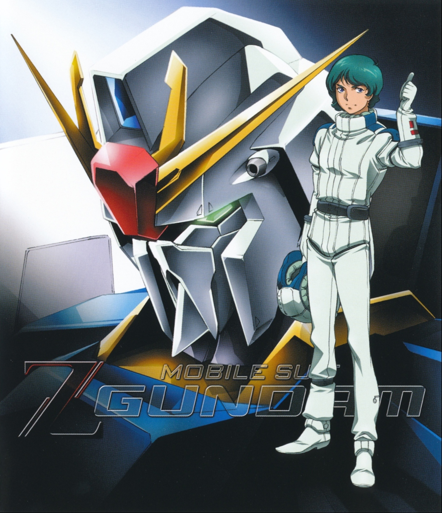

> 本文首发于个人博客\
> 发表日期：2022.04.17\
> 最后编辑于：{docsify-last-updated}

## TV 版原设

根据《MASTER ARCHIVE MOBILESUIT MSZ-006 Z GUNDAM》中设定，自「Z」至「ZZ」也即 0087 至 0088 年间进行过多次机体的检修。

<section class="multi-images-container-section">

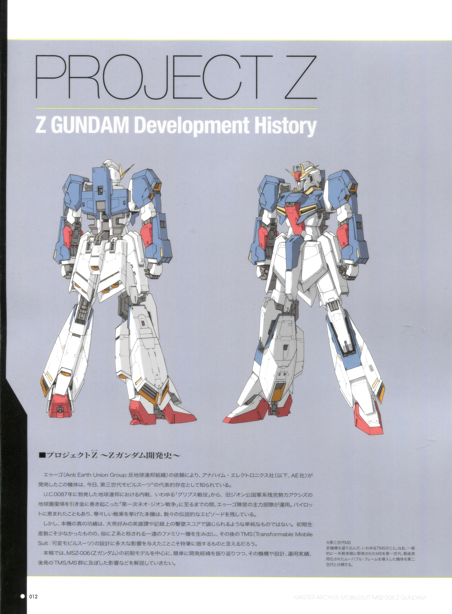
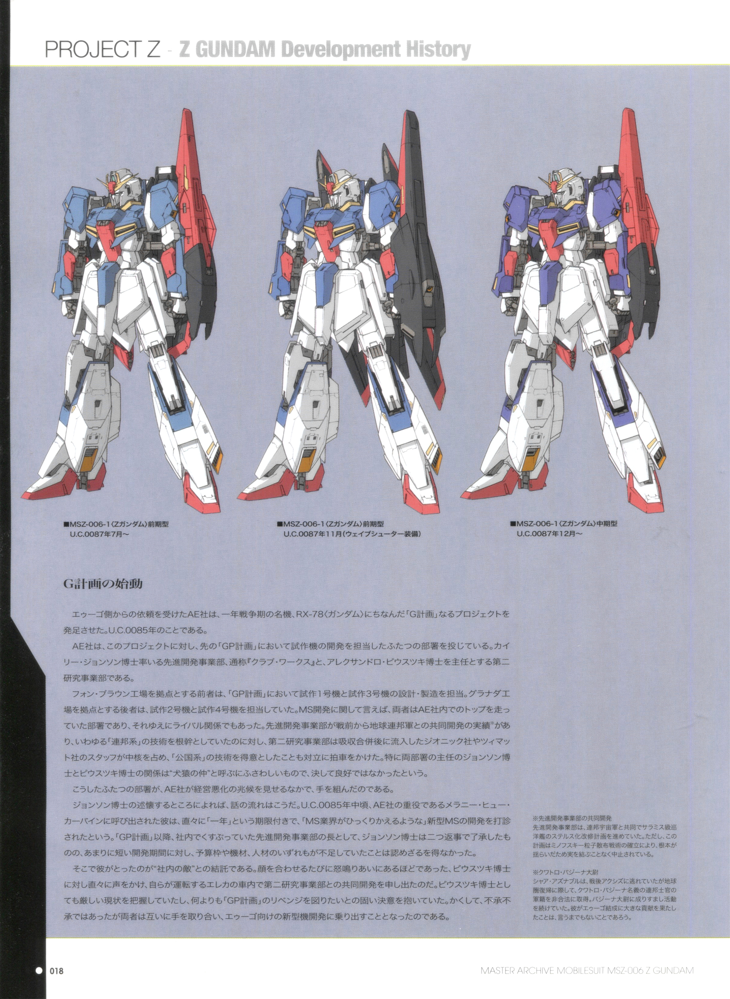
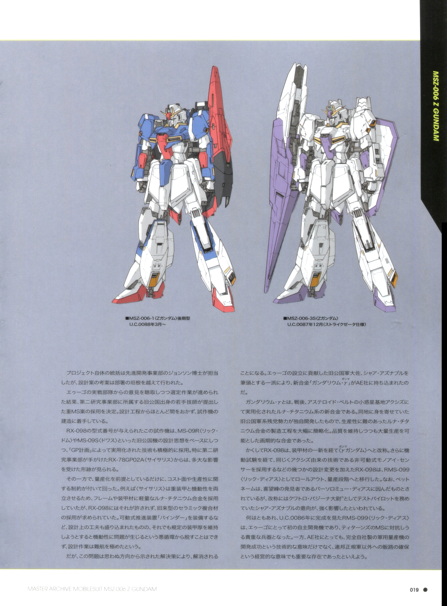

</section>

不难发现在 0087 年 11 月至 0087 年 12 月间实质上所采取的装备即是 Wave-Shooter 形态的装备。此时正值奥古与卡拉巴联手袭击乞立马扎罗基地。

## Wave-Shooter 形态

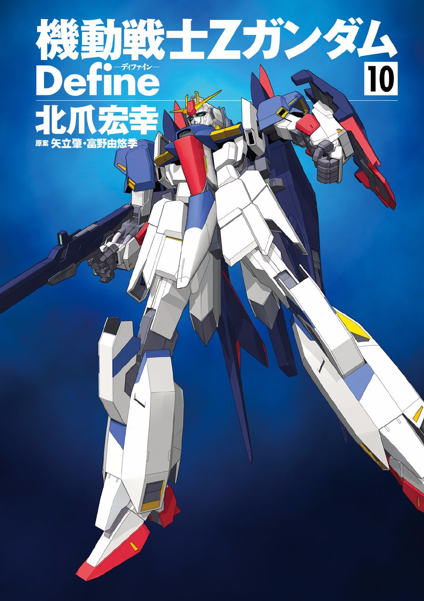

设定是 0087 年 11 月换装为了可变后退翼与对应的盾牌，也就是 FXA-01K 型装备（虽然 12 月又换回去了，值得一提的是 mr 魂 z 的后裙甲喷口比较类似于 12 月及之后的版本，但也不是完全相同），原本似乎是 90 年为了模型大河原参考 zp 设计的（不确定，未找到确切来源），后来在北川的漫画《Z Define》中泷川基于此设计了漫画版 z。

漫画版 z 事实上进行了大幅度的更改：驾驶舱与前裙甲中间变为了想当圆润的造型，而后者更是在变形后成为了 ws 形态的机头部分；胸部造型小改；盾牌分离机构使得 ws 形态下的枪被放置在机身下侧；腿部的变形方式似乎也有改变，使得腿部变形后不再像其他 z 一样比机身高出一层；可变后退翼的变化；甚至原本放置榴弹仓之处的末端增加了一处可伸缩的的机械臂（虽然我不记得漫画里用过）；另外局部配色也有修改。个人来看其实 define 版 z 的 ws 形态一体型更加好。

### 漫画设定图

<section class="multi-images-container-section">

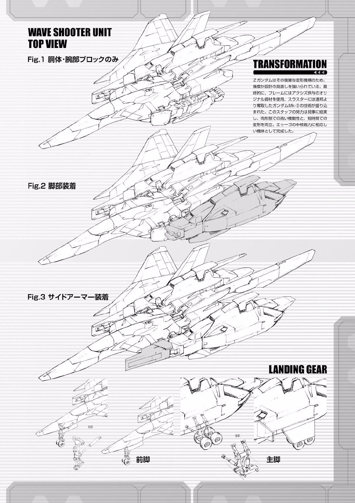
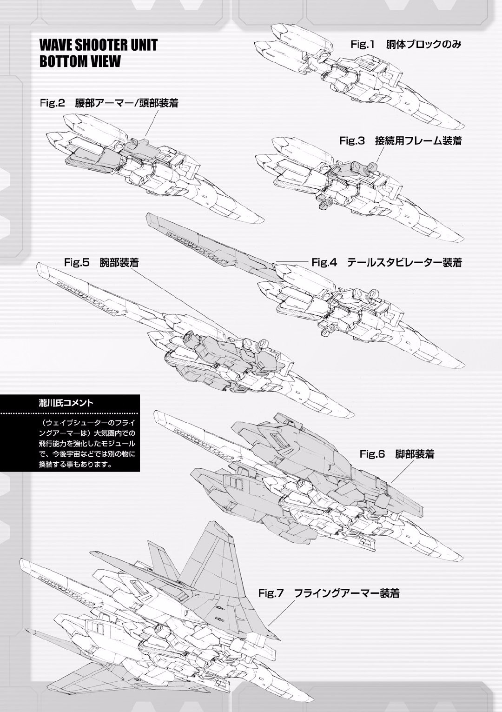
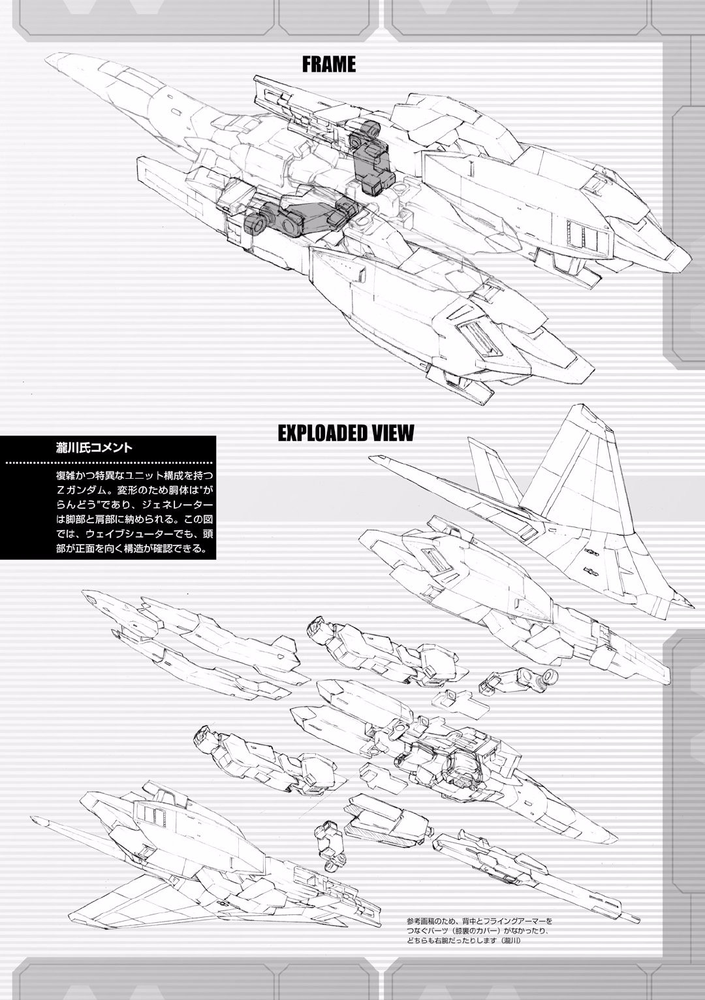
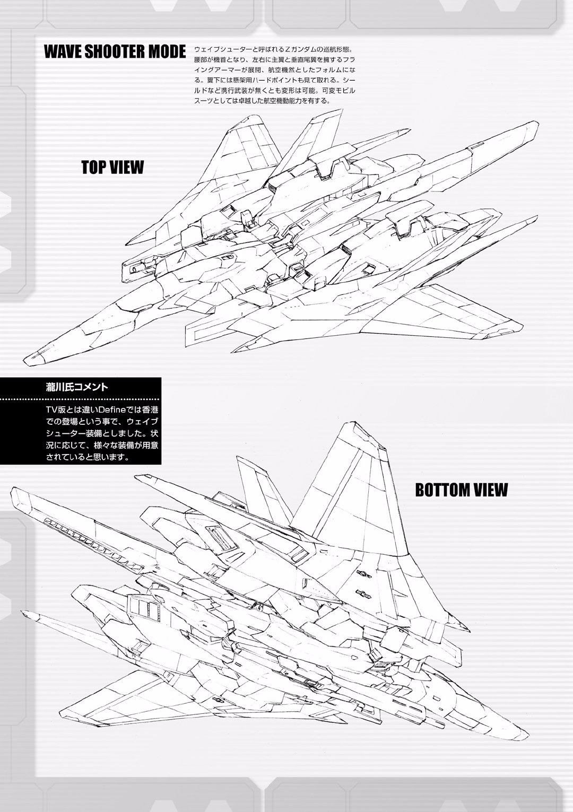
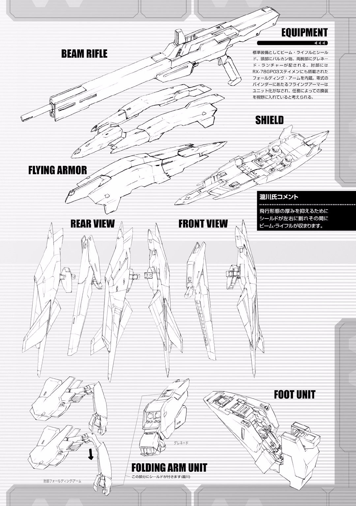
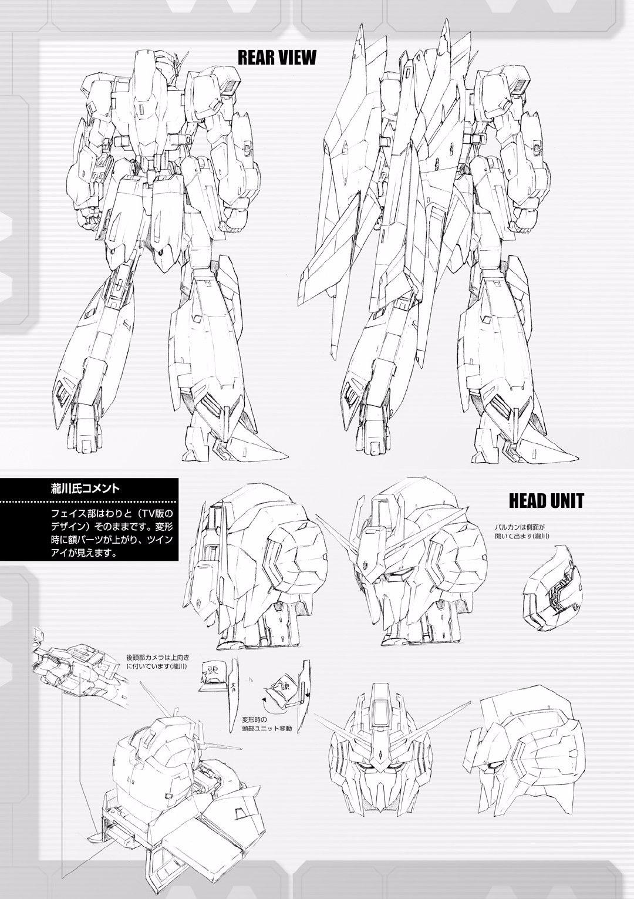
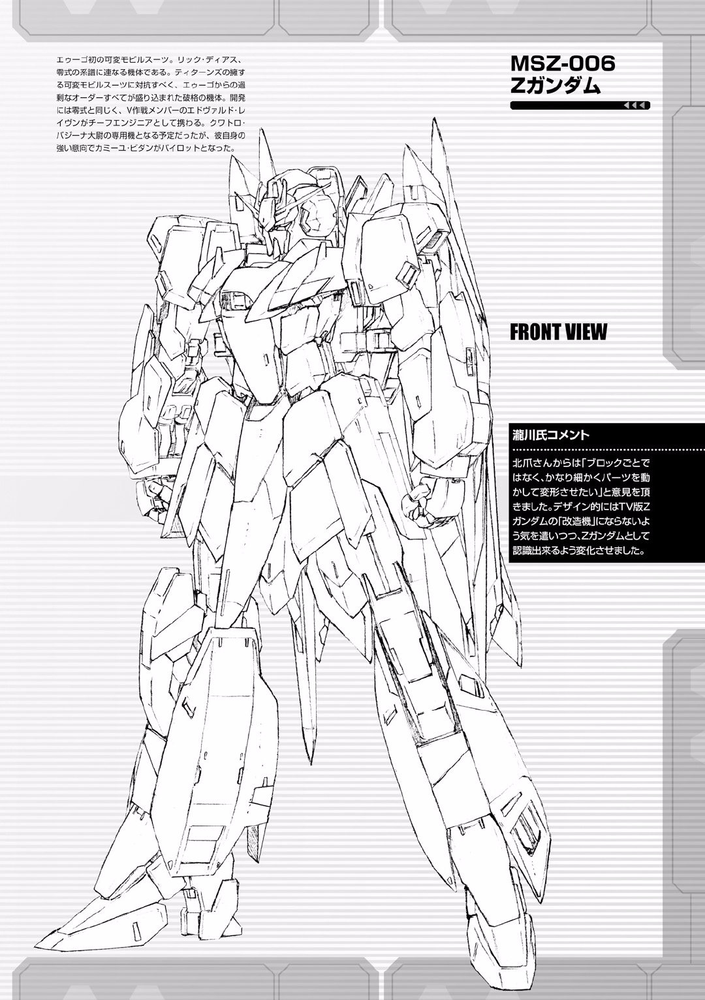

</section>

## Z 原设变形结构

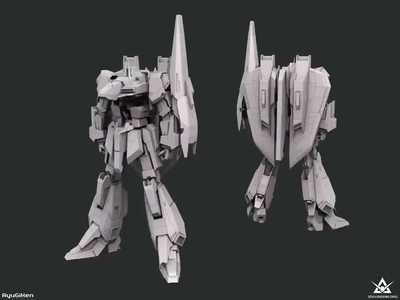
