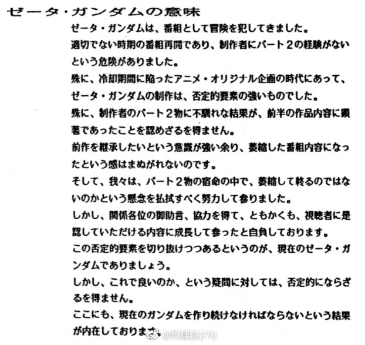
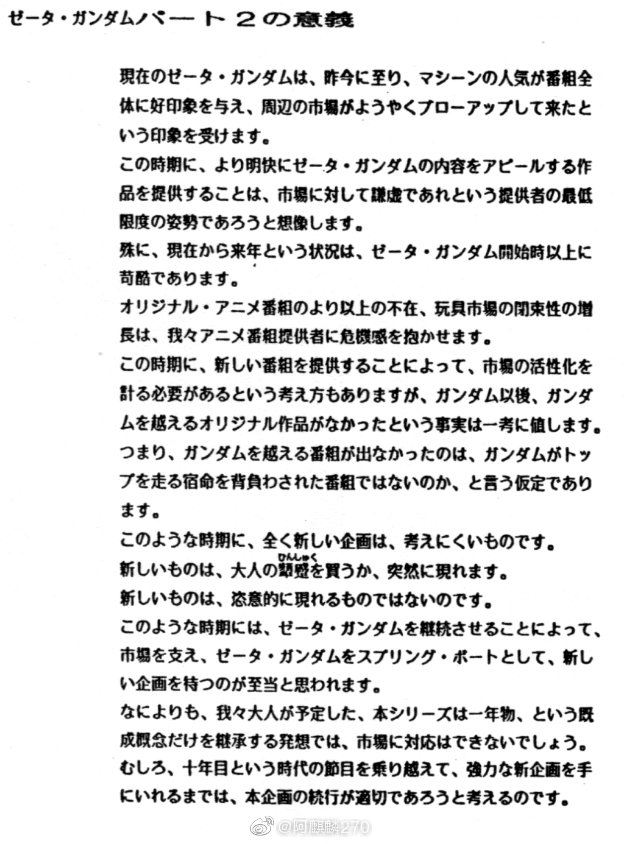
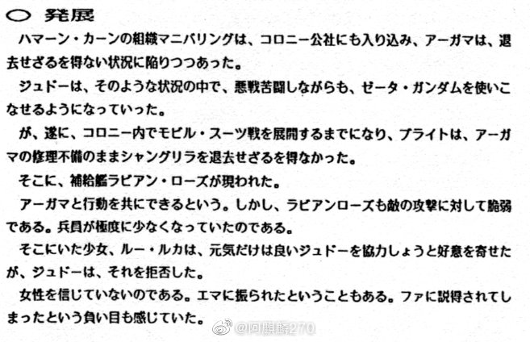
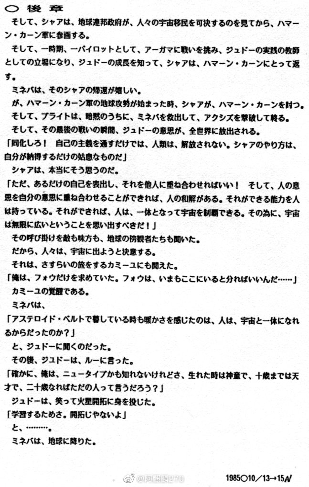
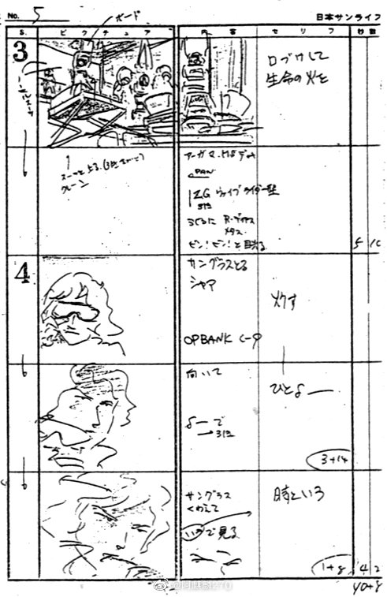
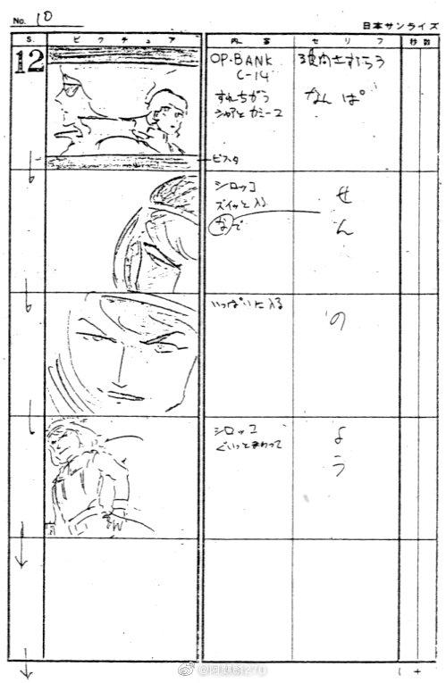
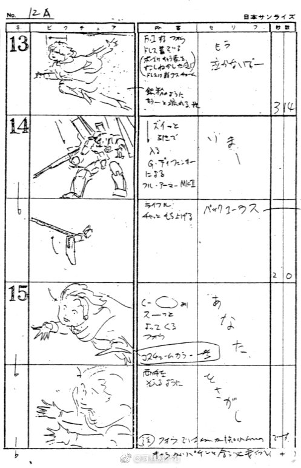
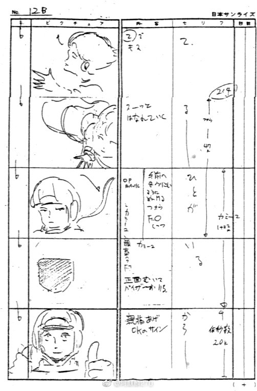
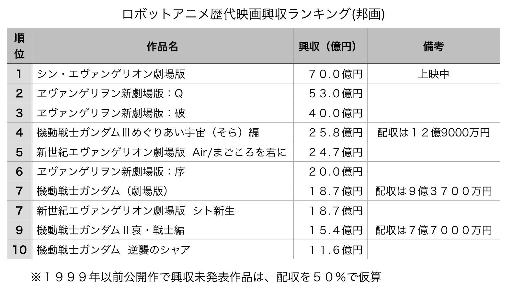

# Z 高达最终话脚本

> 本文首发于个人博客\
> 发表日期：2025.05.05\
> 最后编辑于：{docsify-last-updated}

Z 高达最终话脚本，备份。

Z 播出时 ZZ 企划书（图源微博，见水印）。

今川泰宏 Z 高达 OP 分镜（图源微博，见水印）。

另，机器人动画营收，截止 21.04。

## 参考

1. アニメディア 1986年3月号第一付録  機動戦士Ｚガンダム ギャルズ・グラフィティ ブック
